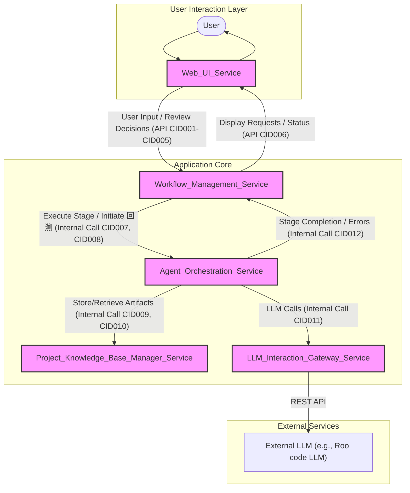

# 已完成阶段输出

4.  **0.4 项目类型与技术栈引导Agent (Project Type & Tech Stack Elicitation Agent):**

{
  "document_id": "项目元数据 v1.0",
  "version": "1.0",
  "timestamp": "2023-10-27T11:00:00Z", // 实际应为当前时间
  "associated_intent_analysis": "初步意图分析 v1.0",
  "project_name": "多Agent软件开发自动化系统 (简化版)",
  "elicitation_method": "Agent-guided Q&A via User Interaction Proxy (Iterative Refinement)",
  "project_type_and_interaction": {
    "summary": "主要为后台运行的多Agent自动化系统，配备极简Web用户界面。",
    "details": "该系统核心是一系列后台Python Agent (基于AutoGen) 执行自动化软件开发任务，通过一个极简的Web界面（基于Flask）供用户进行人工审核、任务配置、查看流程状态和知识库内容。流程设计为线性流水线，简化回退和并发复杂性。",
    "question_ref": ["Q1", "Q6.1"],
    "user_answer_code": ["Q1:b", "Q6.1:c"]
  },
  "technology_stack_preferences": {
    "primary_programming_language": {
      "language": "Python",
      "reasoning": "AI/ML库丰富，社区支持广泛，适合快速原型和Agent开发。",
      "question_ref": "Q2",
      "user_answer_code": "a"
    },
    "agent_framework": {
      "framework": "AutoGen",
      "question_ref": "Q3 (original)",
      "user_answer_text": "Agent框架使用 AutoGen。"
    },
    "web_service_framework": {
      "framework": "Flask",
      "reasoning": "用户倾向于其极简和灵活性，适合快速搭建基础Web界面和API。",
      "question_ref": "Q3.1.A",
      "user_answer_code": "i"
    },
    "project_knowledge_base_manager_pkbm": {
      "type": "File-based Knowledge Base",
      "organization": "Specific directory structure with individual files for each artifact.",
      "information_linking": "Through filename and directory structure conventions.",
      "write_management": "Strictly serialized writes to the knowledge base.",
      "reasoning": "User preference for simplicity, minimal deployment/maintenance, and insensitivity to performance/efficiency for this aspect. Database systems (relational, graph, vector) are explicitly excluded.",
      "question_ref": ["Q4.1.A", "Q4.1.B", "Q4.1.C"],
      "user_answer_code": ["Q4.1.A:b", "Q4.1.B:a", "Q4.1.C:a"]
    },
    "llm_interaction": {
      "method": "Standard REST API calls via Web Service",
      "details": "LLM interaction integrated into the Flask web service, potentially for chat-like interfaces or CI workflows.",
      "question_ref": "Q5",
      "user_answer_code": "a"
    },
    "frontend_technology": {
      "approach": "AI-assisted design and generation, user review.",
      "style_complexity": "Minimalistic, focusing on basic operations, allowing for future modular expansion.",
      "performance_sensitivity": "Low",
      "question_ref": ["Q6 (original)", "Q6.1"],
      "user_answer_text": "Web前端不熟悉，AI设计编写，用户检查界面。我对性能和效率不敏感. 极简，仅满足基本操作即可。"
    }
  },
  "key_simplifications_and_constraints": [
    "PKBM is file-based, no traditional databases.",
    "Overall process is a linear pipeline.",
    "Reduced emphasis on efficiency and complex rollback mechanisms.",
    "Vector database functionality removed.",
    "Web UI is minimalistic."
  ],
  "open_questions_for_later_stages": [
    "Specific directory structure conventions for the file-based PKBM.",
    "Detailed definition of how AI will assist in frontend design and generation.",
    "Specific interaction patterns between Flask, AutoGen, and LLM APIs for workflows."
  ]
}


8.  **1.4 需求规格文档编纂Agent (Requirements Specification Compiler Agent):**

**输出:** 完整的需求规格说明书文档 (Markdown格式):

```markdown
# Requirements Specification Document v1.0

**Document ID:** RequirementsSpecificationDocument_v1.0
**Version:** 1.0
**Timestamp:** 2023-10-28T17:00:00Z 
**Generated By:** 1.4 Requirements Specification Compiler Agent

## 1. Introduction

This document outlines the requirements for an AI-driven software development automation system. The primary goal of this system is to assist developers by automating various stages of the software development lifecycle, from initial requirement gathering through to code generation, testing, and documentation. The system is envisioned as a collection of specialized agents working in concert, managed through a web-based interface, and relying on a central file-based Project Knowledge Base (PKBM) for storing and retrieving all project artifacts. Key interactions will involve user input via a web interface, LLM-driven processing by various agents, and manual review checkpoints to ensure quality and alignment with user intent.

## 2. User Stories and Acceptance Criteria

Below is a list of user stories identified for the system, along with their detailed acceptance criteria.

---

**User Story ID:** US001
**As a:** Developer
**I want to:** input my raw natural language software requirements via a web interface text area
**So that:** the system can capture and store them accurately for initial processing.
**Notes:** Corresponds to Agent 0.1. Input validation for empty/short text needed (Q0.1.2).

**Acceptance Criteria:**
  - **AC_ID:** US001_AC1
    **Description:** Verify successful capture of valid raw requirements.
    **Gherkin:**
    ```gherkin
    Given the user is on the requirement input page via the web interface (Q0.1.1)
    When the user enters a natural language requirement text (>=10 characters) into the text area
    And submits the form
    Then the '0.1 User Initial Request Receiver Agent' records the exact text
    And passes the text to PKBM for storage as '原始用户需求 v1.0'
    And passes the text to the '0.3 初步需求意图识别Agent'.
    ```
  - **AC_ID:** US001_AC2
    **Description:** Verify error handling for empty requirement input.
    **Gherkin:**
    ```gherkin
    Given the user is on the requirement input page via the web interface (Q0.1.1)
    When the user submits an empty requirement text
    Then the system displays an error message '提示错误信息并要求重新输入' (Q0.1.2)
    And the '0.1 User Initial Request Receiver Agent' does not proceed with storing or passing the text.
    ```
  - **AC_ID:** US001_AC3
    **Description:** Verify error handling for too short requirement input.
    **Gherkin:**
    ```gherkin
    Given the user is on the requirement input page via the web interface (Q0.1.1)
    When the user submits a requirement text shorter than 10 characters
    Then the system displays an error message '提示错误信息并要求重新输入' (Q0.1.2)
    And the '0.1 User Initial Request Receiver Agent' does not proceed with storing or passing the text.
    ```

---

**User Story ID:** US002
**As a:** System
**I want to:** store any received document or structured information in a file-based Project Knowledge Base (PKBM) using predefined directory structures and naming conventions that include version (timestamp) and descriptive tags in the filename
**So that:** all agents have a consistent, versioned, and retrievable source of project artifacts.
**Notes:** Core PKBM functionality (Agent 0.2). Covers QG5, QG6, QG7, Q0.2.1. Write access is serialized (QG8).

**Acceptance Criteria:**
  - **AC_ID:** US002_AC1
    **Description:** Verify correct storage of documents in PKBM with proper naming and versioning.
    **Gherkin:**
    ```gherkin
    Given an Agent has a document or structured information to store
    And the PKBM uses a predefined directory structure (QG9)
    When the '0.2 Project Knowledge Base Manager Agent' receives the information
    Then a file is created in the appropriate predefined directory
    And the filename includes a descriptive tag, a version (timestamp as per QG5), and the source agent ID (Q0.2.1)
    And the content of the file exactly matches the information provided for storage
    And this write operation is serialized (QG8).
    ```
  - **AC_ID:** US002_AC2
    **Description:** Verify PKBM provides information retrieval based on filenames and partial content scanning.
    **Gherkin:**
    ```gherkin
    Given information is stored in PKBM with descriptive filenames (Q0.2.1)
    When an Agent requests information from PKBM using tags, keywords, or associations
    Then the PKBM (simulated by Agent scanning filenames/content - QG10) can locate and provide the relevant file(s) or their paths.
    ```
  - **AC_ID:** US002_AC3
    **Description:** Verify PKBM uses TXT as default format if not specified.
    **Gherkin:**
    ```gherkin
    Given an Agent provides information to PKBM without specifying a format
    And the information is not explicitly Markdown or JSON
    Then the PKBM stores the information as a plain TXT file (QG7).
    ```

---

**User Story ID:** US003
**As a:** Developer
**I want to:** have the system automatically analyze my raw requirements to identify core intent (e.g., 'create_feature') and key entities (e.g., 'user_login')
**So that:** I get a preliminary structured understanding of my request, which is stored in PKBM.
**Notes:** Corresponds to Agent 0.3. Handles uncertainty by asking for clarification (Q0.3.1).

**Acceptance Criteria:**
  - **AC_ID:** US003_AC1
    **Description:** Verify successful identification of core intent and key entities from raw requirements.
    **Gherkin:**
    ```gherkin
    Given the '0.3 Initial Intent Recognition Agent' receives '原始用户需求文本 v1.0'
    When the agent processes the text
    Then the agent outputs a structured preliminary analysis report (JSON format)
    And the report contains a dynamically generated 'intent' (e.g., 'create_new_feature') (Q0.3.2)
    And the report contains a list of identified 'entities' (e.g., ['user_login', 'oauth2'])
    And this report is stored in PKBM as '初步意图分析 v1.0', associated with '原始用户需求 v1.0'.
    ```
  - **AC_ID:** US003_AC2
    **Description:** Verify handling of uncertain intent/entity identification.
    **Gherkin:**
    ```gherkin
    Given the '0.3 Initial Intent Recognition Agent' receives '原始用户需求文本 v1.0'
    And the agent cannot clearly identify core intent or key entities
    Then the agent outputs an analysis report marked as 'uncertain' or with empty fields
    And the system prompts the user for clarification via the web interface until the analysis is corrected and confirmed by the user (Q0.3.1).
    ```

---

**User Story ID:** US004
**As a:** Developer
**I want to:** be prompted by the system with targeted questions to define or confirm the project type, primary programming language, and core frameworks/libraries
**So that:** the system establishes essential project metadata for subsequent planning and design, storing it in PKBM.
**Notes:** Corresponds to Agent 0.4. Handles 'not sure' answers by deferring to later agents (Q0.4.3). Project history for existing projects determined by pre-configured folder (Q0.4.1).

**Acceptance Criteria:**
  - **AC_ID:** US004_AC1
    **Description:** Verify system prompts for project metadata and stores it.
    **Gherkin:**
    ```gherkin
    Given the '0.4 Project Type & Tech Stack Elicitation Agent' receives '初步意图分析报告 v1.0'
    And the project is new (determined by pre-configured folder - Q0.4.1)
    When the agent generates targeted questions about project type, language, frameworks (Q0.4.2)
    And these questions are presented to the user via the '用户交互代理' (web interface - QG3)
    And the user provides answers as text strings (QG4)
    Then the agent compiles these Q&A and confirmed metadata into a structured document
    And this document is stored in PKBM as '项目元数据 v1.0', associated with '初步意图分析 v1.0'.
    ```
  - **AC_ID:** US004_AC2
    **Description:** Verify handling of 'not sure' answers for tech stack.
    **Gherkin:**
    ```gherkin
    Given the user is asked about technology stack details
    When the user answers '不确定' or '由系统推荐'
    Then the '0.4 Project Type & Tech Stack Elicitation Agent' marks these items in '项目元数据 v1.0' as 'to be determined by Technology Selection Advisor Agent' (Q0.4.3).
    ```
  - **AC_ID:** US004_AC3
    **Description:** Verify retrieval of project history if it's an existing project.
    **Gherkin:**
    ```gherkin
    Given the project is identified as an existing project (based on pre-configured folder Q0.4.1)
    When the '0.4 Project Type & Tech Stack Elicitation Agent' starts
    Then the agent attempts to retrieve existing '项目元数据' from PKBM before asking questions.
    ```

---

**User Story ID:** US005
**As a:** Developer
**I want to:** be asked by the system, through the web interface, specific questions to clarify details, non-functional requirements (NFRs), boundary conditions, user scenarios, expected behaviors, and error handling for each part of my initial request
**So that:** all ambiguities are resolved, and the detailed Q&A is stored in PKBM for future reference.
**Notes:** Corresponds to Agent 1.1. Covers general error handling (QG1, QG2) and user interaction (QG3, QG4).

**Acceptance Criteria:**
  - **AC_ID:** US005_AC1
    **Description:** Verify system asks clarifying questions and stores Q&A.
    **Gherkin:**
    ```gherkin
    Given the '1.1 Requirement Detail & Boundary Miner Agent' receives '原始用户需求文本' and '项目元数据 v1.0'
    And retrieves '初步意图分析报告 v1.0' from PKBM
    When the agent analyzes the requirements and generates clarifying questions (details, NFRs, boundaries, scenarios, behaviors, error handling)
    And presents these questions to the user via the web interface (QG3)
    And the user provides answers as text strings (QG4)
    Then the agent compiles the Q&A into a structured record
    And stores this record in PKBM as '需求澄清细节QA v1.0'.
    ```
  - **AC_ID:** US005_AC2
    **Description:** Verify general system error handling during agent task execution.
    **Gherkin:**
    ```gherkin
    Given an Agent is executing a task
    When the Agent encounters an internal error (e.g., PKBM access failure, LLM API call failure)
    Then the Agent attempts to automatically retry the operation 3 times (QG1)
    And if still failing, records the error in PKBM and stops the current sub-task
    And notifies the user of the error via the web interface session/log area, awaiting manual intervention (QG1, QG2).
    ```

---

**User Story ID:** US006
**As a:** Developer
**I want to:** have the system automatically transform the clarified requirements into a list of user stories following the 'As a [user type], I want [action] so that [benefit]' template
**So that:** I receive a structured set of requirements that adhere to INVEST principles, stored in PKBM.
**Notes:** Corresponds to Agent 1.2 (this agent). User type in story from LLM (Q1.2.3). Handles large stories by reporting (Q1.2.2).

**Acceptance Criteria:**
  - **AC_ID:** US006_AC1
    **Description:** Verify successful transformation of clarified requirements into INVEST user stories.
    **Gherkin:**
    ```gherkin
    Given the '1.2 User Story Generation Agent' receives clarified requirement details from '需求澄清细节QA v1.0'
    And retrieves '原始用户需求文本' and '项目元数据 v1.0' from PKBM
    And the LLM can infer '[type of user]' from requirements (Q1.2.3)
    When the agent processes these details
    Then the agent outputs a list of user stories in the format 'As a [type of user], I want [an action] so that [a benefit/value]'
    And each story aims to be Independent, Negotiable, Valuable, Estimable (e.g. <=3 dev days - Q1.2.1), Small, and Testable
    And this list is stored in PKBM as '用户故事集 v1.0'.
    ```
  - **AC_ID:** US006_AC2
    **Description:** Verify handling of overly large/complex requirements for user story generation.
    **Gherkin:**
    ```gherkin
    Given clarified requirement details are very large or complex
    When the '1.2 User Story Generation Agent' attempts to generate user stories
    And finds it difficult to create a single story adhering to INVEST (especially 'Small')
    Then the agent reports this situation to the user via the web interface (Q1.2.2)
    And if the user accepts, proceeds with the larger story.
    ```

---

**User Story ID:** US007
**As a:** Developer
**I want to:** have the system define detailed acceptance criteria (preferably in Gherkin Given-When-Then format, but other clear, verifiable conditions are acceptable) for each generated user story
**So that:** each user story has clear, measurable, and testable completion conditions, stored in PKBM and linked to stories.
**Notes:** Corresponds to Agent 1.3. Gherkin is recommended (Q1.3.1). SMART's Time-bound ignored for now (Q1.3.2). Handles unquantifiable ACs by recommending and asking (Q1.3.3).

**Acceptance Criteria:**
  - **AC_ID:** US007_AC1
    **Description:** Verify definition of detailed acceptance criteria for each user story.
    **Gherkin:**
    ```gherkin
    Given the '1.3 Acceptance Criteria Definition Agent' receives clarified details from '需求澄清细节QA v1.0'
    And retrieves '用户故事集 v1.0' from PKBM
    When the agent processes each user story
    Then for each user story, the agent defines a set of detailed acceptance criteria
    And these criteria are preferably in Gherkin (Given-When-Then) format or as a clear, verifiable list (Q1.3.1)
    And each criterion is specific, measurable, achievable, and relevant (SMART, time-bound ignored for now Q1.3.2)
    And the collection of acceptance criteria is stored in PKBM as '验收标准集 v1.0', associated with '用户故事集 v1.0'.
    ```
  - **AC_ID:** US007_AC2
    **Description:** Verify handling of user stories where aspects are hard to quantify for ACs.
    **Gherkin:**
    ```gherkin
    Given a user story has aspects that are difficult to quantify for very specific ACs
    When the '1.3 Acceptance Criteria Definition Agent' defines ACs for it
    Then the agent provides recommended ACs for those aspects
    And presents these recommendations to the user via the web interface for confirmation (Q1.3.3).
    ```

---

**User Story ID:** US008
**As a:** Developer
**I want to:** have the system compile the user stories and their corresponding acceptance criteria into a unified Requirements Specification Document (Markdown format)
**So that:** I have a comprehensive and reviewable specification document, including an auto-generated introduction, stored in PKBM.
**Notes:** Corresponds to Agent 1.4. Intro is auto-generated (Q1.4.1). Markdown format (Q1.4.2).

**Acceptance Criteria:**
  - **AC_ID:** US008_AC1
    **Description:** Verify compilation of user stories and ACs into a Requirements Specification Document.
    **Gherkin:**
    ```gherkin
    Given the '1.4 Requirements Specification Compiler Agent' has access to '用户故事集 v1.0' and '验收标准集 v1.0' from PKBM
    When the agent processes this information
    Then the agent generates a unified Requirements Specification Document in Markdown format (Q1.4.2)
    And the document includes an introduction (project goal summary, auto-generated from existing info - Q1.4.1), the list of user stories, and detailed ACs for each story
    And this document is stored in PKBM as '需求规格说明书 v1.0'.
    ```

---

**User Story ID:** US009
**As a:** Developer
**I want to:** be presented with the Requirements Specification Document along with relevant source documents (paths to original request, intent analysis) via the web interface for my review and approval or rejection (with feedback)
**So that:** I can ensure the specification's accuracy and completeness before architectural design begins.
**Notes:** Corresponds to Agent 1.5. Feedback format is free text (Q1.5.2). Rerouting logic is in agent (Q1.5.3).

**Acceptance Criteria:**
  - **AC_ID:** US009_AC1
    **Description:** Verify presentation of Requirements Specification Document for human review.
    **Gherkin:**
    ```gherkin
    Given '需求规格说明书 v1.0' is available in PKBM
    When the '1.5 Human Review Point 1 Coordinator' prepares the review package
    Then the package presented to the user (e.g., Product Manager) via the web interface includes '需求规格说明书 v1.0', and file paths to '原始用户需求 v1.0' and '初步意图分析 v1.0' (Q1.5.1)
    And includes a checklist of review points for guidance.
    ```
  - **AC_ID:** US009_AC2
    **Description:** Verify handling of 'Approved' review outcome.
    **Gherkin:**
    ```gherkin
    Given the user has reviewed the Requirements Specification Document
    When the user selects 'Approve'
    Then '需求规格说明书 v1.0' in PKBM is marked as '已审核通过'
    And the '2.1 技术选型建议Agent' or subsequent relevant agent is notified to begin work.
    ```
  - **AC_ID:** US009_AC3
    **Description:** Verify handling of 'Rejected' review outcome.
    **Gherkin:**
    ```gherkin
    Given the user has reviewed the Requirements Specification Document
    When the user selects 'Reject' and provides modification feedback (free text - Q1.5.2)
    Then the feedback is structurally recorded and stored in PKBM as '需求审核反馈 v1.x'
    And the '1.5 Human Review Point 1 Coordinator' internally determines (Q1.5.3) and re-routes the task to '1.1 Requirement Detail & Boundary Miner Agent', '1.2 User Story Generation Agent', or '1.3 Acceptance Criteria Definition Agent' with the feedback.
    ```

---

**User Story ID:** US010
**As a:** Developer
**I want to:** receive 2-3 candidate technology stack suggestions (language, framework, DB, key libraries) with pros/cons and suitability analysis if my project's tech stack is initially undefined or if new requirements suggest a review
**So that:** I can make an informed decision on the technology stack, which is then updated in PKBM's project metadata.
**Notes:** Corresponds to Agent 2.1. Warns if existing stack is unsuitable (Q2.1.1). Suggestions from LLM (Q2.1.2). Detailed analysis (Q2.1.3).

**Acceptance Criteria:**
  - **AC_ID:** US010_AC1
    **Description:** Verify generation of tech stack suggestions if undefined.
    **Gherkin:**
    ```gherkin
    Given '已审核通过的需求规格说明书 v1.0' and '项目元数据 v1.0' are available
    And '项目元数据 v1.0' indicates the tech stack is undefined or requires review (e.g., due to user input in Q0.4.3)
    When the '2.1 Technology Selection Advisor Agent' processes this
    Then the agent generates a report with 2-3 candidate tech stacks (language, framework, DB, libraries) using LLM (Q2.1.2)
    And for each candidate, provides a detailed paragraph on pros/cons, applicable scenarios, and project requirement match (Q2.1.3)
    And this report is stored in PKBM as '技术选型建议 v1.0' and presented to the user for selection.
    ```
  - **AC_ID:** US010_AC2
    **Description:** Verify handling if existing tech stack is unsuitable.
    **Gherkin:**
    ```gherkin
    Given '项目元数据 v1.0' contains a defined tech stack
    And the '2.1 Technology Selection Advisor Agent' analyzes new requirements from '需求规格说明书 v1.0'
    And determines the existing stack may be unsuitable
    Then the agent issues a warning or suggestion with reasons to the user (Q2.1.1) and may proceed to suggest alternatives as per US010_AC1.
    ```
  - **AC_ID:** US010_AC3
    **Description:** Verify skipping tech stack suggestion if already defined and suitable.
    **Gherkin:**
    ```gherkin
    Given '项目元数据 v1.0' contains a clearly defined and suitable tech stack
    When the '2.1 Technology Selection Advisor Agent' starts
    Then the agent confirms the existing stack and passes this information directly to the '2.2 高层组件划分Agent' without generating new suggestions.
    ```
  - **AC_ID:** US010_AC4
    **Description:** Verify updating PKBM with user's final tech stack decision.
    **Gherkin:**
    ```gherkin
    Given the user has been presented with '技术选型建议 v1.0' (if generated)
    When the user makes a final tech stack selection
    Then the '2.1 Technology Selection Advisor Agent' updates '项目元数据' in PKBM with this decision (creating a new version if necessary).
    ```

---

**User Story ID:** US011
**As a:** Developer
**I want to:** have the system identify and define the major high-level modules/services/components required for the project, along with their core responsibilities (as a list of main features)
**So that:** a foundational architectural structure is proposed, based on requirements and chosen tech stack, and stored in PKBM.
**Notes:** Corresponds to Agent 2.2. Granularity and detail based on LLM and design guidelines (Q2.2.1).

**Acceptance Criteria:**
  - **AC_ID:** US011_AC1
    **Description:** Verify identification and definition of high-level components.
    **Gherkin:**
    ```gherkin
    Given '已审核通过的需求规格说明书 v1.0' and confirmed '项目元数据' (with tech stack) are available
    And design guidelines (including how to define component responsibilities) are available in PKBM (Q2.2.1)
    When the '2.2 高层组件划分Agent' processes this information (using LLM)
    Then the agent outputs a list of major high-level modules/services/components
    And for each component, defines its core responsibilities as a list of main features (Q2.2.1)
    And this list is stored in PKBM as '高层组件定义 v1.0'.
    ```

---

**User Story ID:** US012
**As a:** Developer
**I want to:** have the system draft preliminary interface definitions (e.g., REST API endpoints with HTTP methods, function signatures, message queue topics/formats) between interacting high-level components
**So that:** the initial communication pathways and contracts between components are outlined, stored in PKBM.
**Notes:** Corresponds to Agent 2.3. Includes HTTP methods for REST (Q2.3.1). Considers event-driven patterns (Q2.3.2).

**Acceptance Criteria:**
  - **AC_ID:** US012_AC1
    **Description:** Verify drafting of preliminary component interface definitions.
    **Gherkin:**
    ```gherkin
    Given '高层组件定义 v1.0' is available from PKBM
    When the '2.3 组件间接口草拟Agent' analyzes component dependencies and data flow
    Then the agent outputs a draft of preliminary interface definitions for interacting components
    And for REST APIs, this includes API endpoints and HTTP methods (Q2.3.1)
    And for other interactions (e.g., function calls, message queues), it includes function signatures or message topics/formats (Q2.3.2)
    And the draft focuses on interface name, main parameters, and expected return types, without full data structures
    And this draft is stored in PKBM as '组件接口草案 v1.0'.
    ```

---

**User Story ID:** US013
**As a:** Developer
**I want to:** have the system generate a natural language description and a Mermaid diagram (showing components, connections, interface names) representing the high-level system architecture
**So that:** I can visualize and understand the proposed system architecture, and this description is stored in PKBM.
**Notes:** Corresponds to Agent 2.4. Mermaid diagram for technical audience (Q2.4.1, Q2.4.2).

**Acceptance Criteria:**
  - **AC_ID:** US013_AC1
    **Description:** Verify generation of natural language architecture description and Mermaid diagram.
    **Gherkin:**
    ```gherkin
    Given '高层组件定义 v1.0' and '组件接口草案 v1.0' are available from PKBM
    When the '2.4 架构图描述生成Agent' processes this information
    Then the agent outputs a natural language description of the high-level architecture for a technical audience (Q2.4.1)
    And the agent outputs a Mermaid diagram description text that includes components, their connections, and interface names (Q2.4.1, Q2.4.2)
    And these outputs are stored in PKBM as '架构图文本描述 v1.0'.
    ```

---

**User Story ID:** US014
**As a:** Developer
**I want to:** have the system compile the confirmed technology stack, high-level component definitions, interface drafts, and architecture diagram description into a High-Level Architecture Design Document
**So that:** I receive a consolidated document detailing the proposed architecture, stored in PKBM.
**Notes:** Corresponds to Agent 2.5. Tech stack rationale is复述 (Q2.5.1).

**Acceptance Criteria:**
  - **AC_ID:** US014_AC1
    **Description:** Verify compilation of High-Level Architecture Design Document.
    **Gherkin:**
    ```gherkin
    Given the final technology selection (from '项目元数据'), '高层组件定义 v1.0', '组件接口草案 v1.0', and '架构图文本描述 v1.0' are available from PKBM
    When the '2.5 架构设计文档编纂Agent' processes these inputs
    Then the agent generates a consolidated High-Level Architecture Design Document
    And the document includes the technology selection and its rationale (复述 if previously defined - Q2.5.1), component list with responsibilities, main inter-component interfaces, and the architecture diagram (or its text description)
    And this document is stored in PKBM as '高层架构设计文档 v1.0'.
    ```

---

**User Story ID:** US015
**As a:** Developer
**I want to:** be presented with the High-Level Architecture Design Document for my review and approval or rejection (with feedback) via the web interface
**So that:** I can validate the architectural design's soundness and suitability before detailed design and task breakdown.
**Notes:** Corresponds to Agent 2.6. Similar review process to US009 (Q2.6).

**Acceptance Criteria:**
  - **AC_ID:** US015_AC1
    **Description:** Verify presentation of Architecture Design Document for human review.
    **Gherkin:**
    ```gherkin
    Given '高层架构设计文档 v1.0' is available in PKBM
    When the '2.6 人工审核点2协调Agent' prepares the review package
    Then the package presented to the user (e.g., Tech Lead/Architect) via the web interface includes '高层架构设计文档 v1.0' and a checklist of review points (Q2.6).
    ```
  - **AC_ID:** US015_AC2
    **Description:** Verify handling of 'Approved' architecture review outcome.
    **Gherkin:**
    ```gherkin
    Given the user has reviewed the Architecture Design Document
    When the user selects 'Approve'
    Then '高层架构设计文档 v1.0' in PKBM is marked as '已审核通过'
    And the '2.7 编码任务分解Agent' is notified to begin work.
    ```
  - **AC_ID:** US015_AC3
    **Description:** Verify handling of 'Rejected' architecture review outcome.
    **Gherkin:**
    ```gherkin
    Given the user has reviewed the Architecture Design Document
    When the user selects 'Reject' and provides modification feedback (free text)
    Then the feedback is structurally recorded and stored in PKBM as '架构审核反馈 v1.x'
    And the '2.6 人工审核点2协调Agent' internally determines and re-routes the task to the appropriate earlier architecture agent (e.g., '2.1 Technology Selection Advisor Agent', '2.2 高层组件划分Agent') with the feedback (Q2.6).
    ```

---

**User Story ID:** US016
**As a:** Developer
**I want to:** have the system break down each approved user story/feature into smaller, independently developable and testable coding sub-tasks (granularity: one sub-task per class to be implemented/modified)
**So that:** large features are decomposed into manageable units of work, with each sub-task's goal and expected output (JSON format) defined and stored in PKBM.
**Notes:** Corresponds to Agent 2.7. Granularity is one class per sub-task (Q2.7.1). Output is detailed JSON (Q2.7.2).

**Acceptance Criteria:**
  - **AC_ID:** US016_AC1
    **Description:** Verify breakdown of user stories into coding sub-tasks.
    **Gherkin:**
    ```gherkin
    Given '已审核通过的需求规格说明书 v1.0' and '已审核通过的高层架构设计文档 v1.0' are available
    When the '2.7 编码任务分解Agent' processes these
    Then each user story/feature is mapped to one or more architectural components
    And large features/components are decomposed into smaller coding sub-tasks, where one sub-task typically corresponds to one class to be implemented/modified (Q2.7.1)
    And for each sub-task, its goal and expected output are defined in a detailed JSON format (Q2.7.2)
    And the list of these sub-tasks is stored in PKBM as '编码子任务列表 v1.0'.
    ```

---

**User Story ID:** US017
**As a:** Developer
**I want to:** have the system analyze logical dependencies between coding sub-tasks and generate an ordered development plan (e.g., JSON list with IDs, descriptions, dependencies, priorities)
**So that:** a clear and sequenced plan for development is established, stored in PKBM, ensuring tasks are tackled in a logical order.
**Notes:** Corresponds to Agent 2.8. Handles circular dependencies by erroring and requesting manual intervention (Q2.8.1). Output is JSON (Q2.8.2). Tasks are sequential (Q6.1.1).

**Acceptance Criteria:**
  - **AC_ID:** US017_AC1
    **Description:** Verify generation of an ordered development plan with dependencies.
    **Gherkin:**
    ```gherkin
    Given '编码子任务列表 v1.0' is available from PKBM
    When the '2.8 任务依赖与顺序规划Agent' analyzes sub-task dependencies
    Then the agent outputs a development plan (e.g., JSON list with task ID, description, dependency IDs, priority - Q2.8.2)
    And this plan defines a logical execution order (tasks are sequential, no parallelism - Q6.1.1)
    And this plan is stored in PKBM as '编码任务计划 v1.0'.
    ```
  - **AC_ID:** US017_AC2
    **Description:** Verify handling of circular dependencies.
    **Gherkin:**
    ```gherkin
    Given '编码子任务列表 v1.0' is being processed
    When the '2.8 任务依赖与顺序规划Agent' detects a circular dependency among sub-tasks
    Then the agent reports an error via the web interface
    And requests manual intervention from the user to resolve the conflict (Q2.8.1).
    ```

---

**User Story ID:** US018
**As a:** System
**I want to:** prepare a complete context package for each coding sub-task by retrieving related user stories, acceptance criteria, relevant architecture (component/interface definitions), project metadata (tech stack, coding/design guidelines from PKBM), and any existing relevant code snippets (pasted by user for modification tasks)
**So that:** subsequent detailed design agents receive all necessary information to perform their specific design tasks for the current sub-task.
**Notes:** Corresponds to Agent 3.1. Existing code provided via web paste (Q3.1.1).

**Acceptance Criteria:**
  - **AC_ID:** US018_AC1
    **Description:** Verify preparation of complete context package for a sub-task.
    **Gherkin:**
    ```gherkin
    Given a sub-task ID is selected from '编码任务计划 v1.0'
    When the '3.1 当前子任务上下文准备Agent' executes for this sub-task
    Then the agent retrieves from PKBM: the corresponding user story and ACs, relevant architecture design (component/interface defs), project metadata (tech stack, coding/design guidelines)
    And if it's a modification task, it includes existing code snippets/file structures pasted by the user via the web interface (Q3.1.1)
    And all this context is packaged and passed to subsequent detailed design agents.
    ```

---

**User Story ID:** US019
**As a:** Developer
**I want to:** have the system perform detailed API design for sub-tasks involving APIs, specifying precise URLs, HTTP methods, headers, path/query parameters, and detailed request/response body JSON schemas (including field types, necessity, examples) for various status codes
**So that:** a comprehensive API specification is created for the sub-task, stored in PKBM, guiding implementation.
**Notes:** Corresponds to Agent 3.2. JSON Schema detail (Q3.2.1). Authentication/Authorization not considered for now (Q3.2.2).

**Acceptance Criteria:**
  - **AC_ID:** US019_AC1
    **Description:** Verify detailed API design for sub-tasks involving APIs.
    **Gherkin:**
    ```gherkin
    Given a '当前子任务上下文包' for an API-related sub-task is received by '3.2 API详细设计Agent'
    When the agent performs detailed API design
    Then the output includes: precise URL paths and HTTP methods, detailed request headers, path/query parameters, request body JSON schema (all fields, types, necessity, examples - Q3.2.1), response body JSON schema for various status codes (200, 201, 400, etc. - Q3.2.1)
    And authentication/authorization mechanisms are noted as 'not considered for now' (Q3.2.2)
    And the API design document (OpenAPI fragment or Markdown) is stored in PKBM as 'API详细设计_[子任务ID]_v1.0'.
    ```

---

**User Story ID:** US020
**As a:** Developer
**I want to:** have the system perform detailed data model design for sub-tasks involving data persistence or complex structures, defining data file formats, schemas, and file/organization within the PKBM's file-based system if applicable, or class/object properties and types for in-memory structures
**So that:** a clear data structure or persistence plan is established for the sub-task, stored in PKBM.
**Notes:** Corresponds to Agent 3.3. For PKBM, this means defining how information is structured in files (Q3.3.1).

**Acceptance Criteria:**
  - **AC_ID:** US020_AC1
    **Description:** Verify detailed data model design for sub-tasks.
    **Gherkin:**
    ```gherkin
    Given a '当前子任务上下文包' for a data-related sub-task is received by '3.3 数据模型详细设计Agent'
    When the agent performs detailed data model design
    Then the output defines data file formats, schemas, and file organization if for PKBM-like file storage (Q3.3.1), or class/object properties and types for in-memory structures
    And this design (e.g., SQL DDL, class diagram text, JSON Schema) is stored in PKBM as '数据模型详细设计_[子任务ID]_v1.0'.
    ```

---

**User Story ID:** US021
**As a:** Developer
**I want to:** have the system design class and function logic for sub-tasks, defining responsibilities, public interfaces (method signatures), and core implementation logic using unambiguous pseudocode or detailed steps covering algorithms, conditions, loops, and error handling
**So that:** the internal logic of classes and functions is clearly outlined before coding, stored in PKBM.
**Notes:** Corresponds to Agent 3.4. Prefers pseudocode, logically complete (Q3.4.1).

**Acceptance Criteria:**
  - **AC_ID:** US021_AC1
    **Description:** Verify design of class and function logic using unambiguous pseudocode.
    **Gherkin:**
    ```gherkin
    Given a '当前子任务上下文包' is received by '3.4 类与函数逻辑设计Agent'
    When the agent designs class/function logic
    Then the output identifies classes/functions to be created/modified
    And for each, defines its responsibility, public interface (method signatures: name, params, return type)
    And describes its core implementation logic using unambiguous pseudocode covering algorithms, conditions, loops, and error handling (Q3.4.1)
    And this design is stored in PKBM as '类函数逻辑设计_[子任务ID]_v1.0'.
    ```

---

**User Story ID:** US022
**As a:** Developer
**I want to:** have the system plan the file and directory structure for new or modified code related to a sub-task, ensuring compliance with project best practices and coarse-grained coding/architecture guidelines from PKBM
**So that:** code organization is determined upfront, promoting consistency, and the plan is stored in PKBM.
**Notes:** Corresponds to Agent 3.5. Guidelines are coarse (Q3.5.1).

**Acceptance Criteria:**
  - **AC_ID:** US022_AC1
    **Description:** Verify planning of file and directory structure.
    **Gherkin:**
    ```gherkin
    Given a '当前子任务上下文包' and related detailed designs are received by '3.5 文件与目录结构规划Agent'
    And the agent retrieves existing file structure and coarse-grained coding/architecture guidelines from PKBM (Q3.5.1)
    When the agent plans file/directory structure
    Then the output details new file names and paths, existing files to be modified, and new directories needed
    And the planned structure aligns with project best practices and guidelines
    And this plan is stored in PKBM as '文件结构计划_[子任务ID]_v1.0'.
    ```

---

**User Story ID:** US023
**As a:** Developer
**I want to:** have the system perform a basic review of the sub-task's design for any obvious security missteps, focusing on ensuring code stability and meeting user expectations rather than comprehensive security hardening
**So that:** a minimal check is done as a reminder, even if security is not a primary project focus, with findings stored in PKBM.
**Notes:** Corresponds to Agent 3.6. Security is low priority (Q3.6.1, Q3.6.2).

**Acceptance Criteria:**
  - **AC_ID:** US023_AC1
    **Description:** Verify basic security review focusing on stability and user expectations.
    **Gherkin:**
    ```gherkin
    Given a '当前子任务上下文包' and all related detailed design documents are received by '3.6 安全考量与检查点定义Agent'
    And the project priority is code stability and user expectation over comprehensive security (Q3.6.1, Q3.6.2)
    When the agent performs a security review
    Then the agent identifies any obvious security missteps relevant to stability/expectations
    And proposes minimal checks or considerations if any
    And this report is stored in PKBM as '安全考量_[子任务ID]_v1.0'.
    ```

---

**User Story ID:** US024
**As a:** Developer
**I want to:** have the system aggregate all detailed designs (API, data, logic, file structure, security considerations) for a sub-task into a comprehensive 'Code Implementation Guide' and generate an extremely specific, context-rich prompt text for an external code generation LLM (Roo code LLM)
**So that:** a complete guide for coding is created, and a high-quality prompt is ready for the LLM, maximizing the chance of correct code generation. Both are stored in PKBM.
**Notes:** Corresponds to Agent 3.7. Prompt includes original code for modifications (from web paste or file path Q3.7.1), naming conventions (from spec + agent suggestions Q3.7.2), full file context for relevant files (Q3.7.3).

**Acceptance Criteria:**
  - **AC_ID:** US024_AC1
    **Description:** Verify aggregation of designs into 'Code Implementation Guide' and generation of LLM prompt.
    **Gherkin:**
    ```gherkin
    Given all detailed design documents for a sub-task (API, data, logic, file structure, security) are available
    And relevant coding规范 and original code snippets (for modifications, from web paste or file path - Q3.7.1) are accessible from PKBM
    When the '3.7 详细设计汇总与指令生成Agent' executes
    Then a '代码实现指导书_[子任务ID]_v1.0' is created and stored in PKBM
    And an extremely specific, context-rich prompt text for 'Roo code LLM' is generated
    And this prompt includes: file path for creation/modification, exact original code for modifications, clear functional logic/algorithms, class/function signatures (from spec + agent suggestions Q3.7.2), variable naming conventions, coding规范 to follow, security checkpoints (if any from US023), and full file context for relevant files (Q3.7.3), and expected output format.
    ```

---

**User Story ID:** US025
**As a:** Developer
**I want to:** be presented with the 'Code Implementation Guide' and the generated LLM prompt text for my review and approval or rejection (with feedback) via the web interface
**So that:** I can ensure the LLM prompt is clear, complete, and accurately reflects all design requirements before code generation.
**Notes:** Corresponds to Agent 3.8. Similar review process to US009 (Q3.8).

**Acceptance Criteria:**
  - **AC_ID:** US025_AC1
    **Description:** Verify presentation of 'Code Implementation Guide' and LLM prompt for human review.
    **Gherkin:**
    ```gherkin
    Given '代码实现指导书_[子任务ID]_v1.0' and the LLM prompt text are generated
    When the '3.8 人工审核点3协调Agent' prepares the review package
    Then the package presented to the user (Developer) via the web interface includes both documents and a checklist of review points (Q3.8).
    ```
  - **AC_ID:** US025_AC2
    **Description:** Verify handling of 'Approved' prompt review outcome.
    **Gherkin:**
    ```gherkin
    Given the user has reviewed the LLM prompt and guide
    When the user selects 'Approve'
    Then the '精确指令文本_[子任务ID]_v1.0' in PKBM is marked as '已审核待执行'
    And the prompt text is passed to '4.1 代码生成/修改执行协调Agent'.
    ```
  - **AC_ID:** US025_AC3
    **Description:** Verify handling of 'Rejected' prompt review outcome.
    **Gherkin:**
    ```gherkin
    Given the user has reviewed the LLM prompt and guide
    When the user selects 'Reject' and provides modification feedback
    Then the feedback is stored in PKBM
    And the task is re-routed to '3.7 详细设计汇总与指令生成Agent' for prompt modification (Q3.8).
    ```

---

**User Story ID:** US026
**As a:** Developer
**I want to:** use the web interface to copy the approved LLM prompt, paste it into the external 'Roo code LLM', and then paste the LLM's generated code (or error message if LLM fails) back into the web interface
**So that:** I can leverage the external LLM for code generation/modification, and its raw output is captured by the system in PKBM.
**Notes:** Corresponds to Agent 4.1. UI support for copy/paste (Q4.1.1). Human handles LLM errors and retries before informing system (Q4.1.2).

**Acceptance Criteria:**
  - **AC_ID:** US026_AC1
    **Description:** Verify coordination of code generation via external LLM.
    **Gherkin:**
    ```gherkin
    Given an '已审核待执行的精确指令文本_[子任务ID]_v1.0' is received by '4.1 代码生成/修改执行协调Agent'
    And the web interface provides a text box for the prompt and a 'Copy' button (Q4.1.1a)
    When the user copies the prompt, pastes it into 'Roo code LLM', triggers execution, and obtains the output
    And pastes the LLM's raw output (code or error info) back into another text box in the web interface (Q4.1.1b)
    Then the '4.1 代码生成/修改执行协调Agent' records this raw output in PKBM as 'CGMA原始输出_[子任务ID]_v1.0'
    And if it's code, passes it to '4.2 代码基本语法与格式校验Agent'.
    ```
  - **AC_ID:** US026_AC2
    **Description:** Verify human handling of LLM errors before system notification.
    **Gherkin:**
    ```gherkin
    Given the user is interacting with 'Roo code LLM'
    When 'Roo code LLM' returns an error or fails to generate code
    Then the user first attempts retries with the LLM (Q4.1.2)
    And if still unsuccessful, the user provides this error information (as if it were LLM output) back to the '4.1 代码生成/修改执行协调Agent' (Q4.1.2).
    ```

---

**User Story ID:** US027
**As a:** Developer
**I want to:** have the system perform basic syntax and formatting checks on the LLM-generated code using a linter (selected based on project language in metadata) and allow me to confirm any auto-suggested simple formatting fixes (which would then be formulated as a new prompt for the LLM to apply)
**So that:** the generated code is validated for basic correctness and adherence to formatting standards, with results and potentially formatted code stored in PKBM.
**Notes:** Corresponds to Agent 4.2. Linter config from metadata (Q4.2.1). Auto-fixes confirmed by user and applied via LLM (Q4.2.2). Human decides on回溯 for severe errors (Q4.2.3).

**Acceptance Criteria:**
  - **AC_ID:** US027_AC1
    **Description:** Verify basic syntax and formatting checks on LLM-generated code.
    **Gherkin:**
    ```gherkin
    Given 'CGMA原始输出_[子任务ID]_v1.0' (code) is received by '4.2 代码基本语法与格式校验Agent'
    And project metadata specifies the language, allowing selection of a default linter (Q4.2.1)
    When the agent performs syntax and formatting checks
    Then a validation report (syntax errors, format issues) is generated
    And stored in PKBM as '代码初步校验报告_[子任务ID]_v1.0'.
    ```
  - **AC_ID:** US027_AC2
    **Description:** Verify user confirmation for auto-suggested formatting fixes applied via LLM.
    **Gherkin:**
    ```gherkin
    Given the linter suggests simple formatting fixes
    When '4.2 代码基本语法与格式校验Agent' identifies these
    Then the agent presents these suggested fixes to the user for confirmation (Q4.2.2)
    And if confirmed, a new prompt is generated for 'Roo code LLM' to apply these format changes
    And the (potentially) formatted code is stored as '初步格式化代码_[子任务ID]_v1.0'.
    ```
  - **AC_ID:** US027_AC3
    **Description:** Verify handling of severe syntax errors requiring human decision for回溯.
    **Gherkin:**
    ```gherkin
    Given '代码初步校验报告_[子任务ID]_v1.0' indicates severe syntax errors preventing further steps
    When '4.2 代码基本语法与格式校验Agent' identifies this
    Then the system flags the issue and awaits a human decision (via web interface) on whether to回溯 to prompt generation (Q4.2.3).
    ```
  - **AC_ID:** US027_AC4
    **Description:** Verify passing of valid, formatted code to static analysis.
    **Gherkin:**
    ```gherkin
    Given code has passed syntax checks and is (potentially) formatted ('初步格式化代码_[子任务ID]_v1.0')
    And no severe syntax errors exist
    Then this code is passed to '4.3 静态代码分析Agent'.
    ```

---

**User Story ID:** US028
**As a:** Developer
**I want to:** have the system run static analysis tools on the (syntax-checked and formatted) code using a default ruleset (based on project language in metadata) to identify potential bugs, code smells, and simple security vulnerabilities
**So that:** deeper code quality issues are identified, and a plain text report is generated (for LLM consumption) and stored in PKBM.
**Notes:** Corresponds to Agent 4.3. Ruleset from metadata (Q4.3.1). Report is plain text for LLM (Q4.3.2).

**Acceptance Criteria:**
  - **AC_ID:** US028_AC1
    **Description:** Verify static analysis on code.
    **Gherkin:**
    ```gherkin
    Given '初步格式化代码_[子任务ID]_v1.0' is received by '4.3 静态代码分析Agent'
    And project metadata allows selection of a default static analysis ruleset for the language (Q4.3.1)
    When the agent runs static analysis tools
    Then a detailed static analysis report (plain text for LLM - Q4.3.2) is generated, listing issues, locations, severity, and suggestions
    And this report is stored in PKBM as '静态分析报告_[子任务ID]_v1.0'
    And the report and code are passed to '5.1 AI代码审查员Agent'.
    ```

---

**User Story ID:** US029
**As a:** Developer
**I want to:** have an AI Code Reviewer agent analyze the code against the 'Implementation Guide', coding规范, and static analysis report, checking for functional conformity, design adherence, readability, error handling, and basic performance/security points
**So that:** I receive an automated code review report (list of issues with location, description, suggestion, severity) highlighting potential issues beyond static analysis, stored in PKBM.
**Notes:** Corresponds to Agent 5.1. Performance check is low-strictness (Q5.1.1). Report is a list of issues (Q5.1.2).

**Acceptance Criteria:**
  - **AC_ID:** US029_AC1
    **Description:** Verify AI code review against implementation guide and standards.
    **Gherkin:**
    ```gherkin
    Given '初步格式化代码_[子任务ID]_v1.0', '静态分析报告_[子任务ID]_v1.0', '实现指导书_[子任务ID]_v1.0', and '编码规范' are received by '5.1 AI代码审查员Agent'
    When the agent performs the code review
    Then an 'AI代码审查报告_[子任务ID]_v1.0' (list of issues with location, description, suggestion, severity - Q5.1.2) is generated
    And the review checks for: functional conformity to guide, design adherence,规范 compliance, readability, error handling, basic performance (low-strictness complexity analysis - Q5.1.1), and security checkpoints from guide
    And this report is stored in PKBM and passed with code and static analysis report to '5.2 人工审核点4协调Agent'.
    ```

---

**User Story ID:** US030
**As a:** Developer
**I want to:** be presented with the code, static analysis report, and AI code review report via the web interface for my review and decision (approve for testing, or reject with feedback on what to fix)
**So that:** I can make an informed decision on code quality, leveraging AI insights, before proceeding to testing.
**Notes:** Corresponds to Agent 5.2. No direct manual code modification by user in system; if changes needed, agent is asked to update PKBM (Q5.2.1). LLM suggests next steps on rejection (Q5.2.2).

**Acceptance Criteria:**
  - **AC_ID:** US030_AC1
    **Description:** Verify presentation of code and AI review reports for human decision.
    **Gherkin:**
    ```gherkin
    Given '初步格式化代码_[子任务ID]_v1.0', '静态分析报告_[子任务ID]_v1.0', and 'AI代码审查报告_[子任务ID]_v1.0' are available
    When '5.2 人工审核点4协调Agent' prepares the review package
    Then the package is presented to the user (Developer/Tech Lead) via web interface with a checklist.
    ```
  - **AC_ID:** US030_AC2
    **Description:** Verify handling of 'Approve for testing' outcome.
    **Gherkin:**
    ```gherkin
    Given the user has reviewed the code and reports
    When the user selects 'Approve for testing'
    Then '初步格式化代码_[子任务ID]_v1.0' is marked '代码审核通过' in PKBM
    And '5.3 单元测试用例生成Agent' is notified.
    ```
  - **AC_ID:** US030_AC3
    **Description:** Verify handling of 'Reject with feedback' outcome, with LLM suggesting next steps.
    **Gherkin:**
    ```gherkin
    Given the user has reviewed the code and reports
    When the user selects 'Reject' and provides feedback
    Then the feedback is stored in PKBM
    And the agent's LLM suggests next steps (e.g., re-generate prompt, re-run CGMA, AI reviewer generates fix suggestions) and asks for user confirmation on how to proceed (Q5.2.2).
    ```
  - **AC_ID:** US030_AC4
    **Description:** Verify handling if user identifies issue requiring PKBM update (simulating manual modification).
    **Gherkin:**
    ```gherkin
    Given the user reviews and identifies a code change is needed
    Instead of direct manual modification in the system (Q5.2.1)
    When the user specifies the file and the change required
    Then the user instructs an agent (e.g., via '5.2 人工审核点4协调Agent') to update the relevant code file in PKBM, effectively creating a new version for the system to process.
    ```

---

**User Story ID:** US031
**As a:** Developer
**I want to:** have the system generate unit test case code (for the project's testing framework, based on metadata/source) covering normal paths, boundary conditions, and expected error handling for the approved code of a sub-task, based on its 'Implementation Guide' (especially ACs) and detailed designs
**So that:** test coverage is automatically generated, aiming for good practice but best-effort based on LLM, and test code is stored in PKBM.
**Notes:** Corresponds to Agent 5.3. Test framework info generated by agent (Q5.3.1). Coverage is best-effort (Q5.3.2). Mocks/stubs ignored (Q5.3.3).

**Acceptance Criteria:**
  - **AC_ID:** US031_AC1
    **Description:** Verify generation of unit test cases.
    **Gherkin:**
    ```gherkin
    Given code for a sub-task is '代码审核通过'
    And '实现指导书_[子任务ID]_v1.0' (with ACs), '类函数逻辑设计', 'API详细设计' are available
    And '5.3 单元测试用例生成Agent' can generate project testing framework info and test coding规范 based on metadata/source (Q5.3.1)
    When the agent generates unit tests
    Then test case code is generated for main functions/methods/classes/API endpoints
    And tests cover normal paths, boundary conditions, and expected error handling, aligning with '实现指导书' ACs
    And tests that would require mocks/stubs for external dependencies are ignored (Q5.3.3)
    And test coverage is best-effort based on LLM capability (Q5.3.2)
    And the unit test code is stored in PKBM as '单元测试代码_[子任务ID]_v1.0' and passed with source code to '5.4 测试执行协调Agent'.
    ```

---

**User Story ID:** US032
**As a:** Developer
**I want to:** be provided with prompts (via the web interface) to guide an LLM (Roo code plugin) to automatically integrate the generated unit test code into my local project's test suite and then run these tests, after which I will paste the raw test execution results back into the web interface
**So that:** unit tests are executed in the local environment, and their results are captured by the system in PKBM.
**Notes:** Corresponds to Agent 5.4. 'Assistance' is LLM prompt for test integration (Q5.4.1). Results pasted as text (Q5.4.1b).

**Acceptance Criteria:**
  - **AC_ID:** US032_AC1
    **Description:** Verify coordination of unit test execution in local environment.
    **Gherkin:**
    ```gherkin
    Given被测代码 and '单元测试代码_[子任务ID]_v1.0' are received by '5.4 测试执行协调Agent'
    When the agent provides prompts (via web interface) to an LLM (Roo code plugin) to integrate test code into the user's local project and run tests (Q5.4.1a)
    And the user pastes the raw test execution result text back into the web interface (Q5.4.1b)
    Then this raw report is stored in PKBM as '单元测试结果原始报告_[子任务ID]_v1.0'
    And passed to '5.5 测试结果分析与调试指引Agent'.
    ```

---

**User Story ID:** US033
**As a:** Developer
**I want to:** have the system analyze the unit test execution results, and if all tests pass, mark the sub-task as 'Test Passed'; if tests fail, generate a Markdown debugging analysis report detailing failures, potential causes (in code or tests), and suggested debugging steps or modifications
**So that:** I get automated feedback on test outcomes, with guidance for debugging if necessary, and the report is stored in PKBM.
**Notes:** Corresponds to Agent 5.5. Error localization is best-effort (Q5.5.1). Report is Markdown (Q5.5.2).

**Acceptance Criteria:**
  - **AC_ID:** US033_AC1
    **Description:** Verify analysis of successful unit test results.
    **Gherkin:**
    ```gherkin
    Given '单元测试结果原始报告_[子任务ID]_v1.0' indicates all tests passed
    When '5.5 测试结果分析与调试指引Agent' analyzes it
    Then the sub-task status in PKBM is marked as '测试通过'
    And '6.1 子任务完成与集成准备Agent' is notified.
    ```
  - **AC_ID:** US033_AC2
    **Description:** Verify analysis of failed unit test results and generation of debugging report.
    **Gherkin:**
    ```gherkin
    Given '单元测试结果原始报告_[子任务ID]_v1.0' indicates test failures
    And relevant code and '实现指导书' are available
    When '5.5 测试结果分析与调试指引Agent' analyzes it
    Then a Markdown debugging analysis report is generated (Q5.5.2)
    And the report includes: list of failed tests, error details, best-effort error localization (Q5.5.1), potential cause analysis (code/test error), and suggested debug/modification steps
    And this report is stored in PKBM as '调试分析报告_[子任务ID]_v1.0' and passed to '5.6 人工审核点5协调Agent'.
    ```

---

**User Story ID:** US034
**As a:** Developer
**I want to:** be presented with the debugging analysis report (if tests failed) via the web interface to confirm the issue and instruct the system on next steps (e.g., ask AI to generate fix for code/test, or flag design issue for回溯 via a Central Coordinator Agent)
**So that:** I can guide the iterative debugging and fixing process based on test failures.
**Notes:** Corresponds to Agent 5.6. Similar review to US009. Central Coordinator handles design回溯 (Q5.6.1).

**Acceptance Criteria:**
  - **AC_ID:** US034_AC1
    **Description:** Verify presentation of debugging report for human review and instruction.
    **Gherkin:**
    ```gherkin
    Given '调试分析报告_[子任务ID]_v1.0' (for failed tests) is available
    When '5.6 人工审核点5协调Agent' presents it to the user (Developer) via web interface with a checklist
    Then the user can review the analysis.
    ```
  - **AC_ID:** US034_AC2
    **Description:** Verify handling of user instruction for AI to fix code/test.
    **Gherkin:**
    ```gherkin
    Given the user has reviewed the debugging report
    When the user confirms the issue and instructs the AI to attempt a fix for product code or test code
    Then this instruction and confirmed analysis are passed to '5.7 代码/测试修复指令生成Agent'.
    ```
  - **AC_ID:** US034_AC3
    **Description:** Verify handling of user instruction for design 回溯 via Central Coordinator.
    **Gherkin:**
    ```gherkin
    Given the user has reviewed the debugging report
    When the user identifies a design issue requiring回溯
    Then the user instructs the system to initiate回溯
    And '5.6 人工审核点5协调Agent' records the issue in PKBM and sends a structured message (problem, error point, need for回溯, target agent name) to the 'Central Coordinator Agent' (US043 / Q5.6.1) to manage the回溯, pausing the current sub-task sequence.
    ```
  - **AC_ID:** US034_AC4
    **Description:** Verify handling if user provides manually fixed code/test.
    **Gherkin:**
    ```gherkin
    Given the user has reviewed the debugging report
    When the user manually fixes the code or test outside the system and provides the updated file(s) via the web interface
    Then '5.6 人工审核点5协调Agent' stores the new version in PKBM
    And re-triggers '5.4 测试执行协调Agent' with the updated code/test.
    ```

---

**User Story ID:** US035
**As a:** Developer
**I want to:** have the system generate a specific LLM prompt for fixing identified bugs in product code or test cases, based on my confirmed debugging analysis and instructions
**So that:** a targeted prompt is created for the LLM to attempt a fix, restarting the code generation/validation/test cycle for the fix.
**Notes:** Corresponds to Agent 5.7. Prompt detail similar to US024 (Q5.7.1).

**Acceptance Criteria:**
  - **AC_ID:** US035_AC1
    **Description:** Verify generation of specific LLM prompt for fixing code/tests.
    **Gherkin:**
    ```gherkin
    Given confirmed '调试分析报告' and user's repair instructions are received by '5.7 代码/测试修复指令生成Agent'
    And relevant original code (product or test) is available from PKBM
    When the agent generates a fix prompt for 'Roo code LLM'
    Then the prompt is extremely specific, including filename, exact code snippet to modify, clear description of logic/behavior to correct, and expected correct behavior (similar detail to US024/Q5.7.1)
    And this '修复指令_[子任务ID]_v1.x' is stored in PKBM and passed to '4.1 代码生成/修改执行协调Agent' to restart the generate-validate-test cycle for the fix.
    ```

---

**User Story ID:** US036
**As a:** System
**I want to:** mark a sub-task's final code as '待集成' (Pending Integration) in PKBM once it passes all tests and all its pre-requisite tasks (as per the '编码任务计划') are also 'Test Passed'
**So that:** completed and validated code modules are clearly identified for integration into the main project.
**Notes:** Corresponds to Agent 6.1. Considers sequential task dependencies (Q6.1.1).

**Acceptance Criteria:**
  - **AC_ID:** US036_AC1
    **Description:** Verify marking sub-task as '待集成' (Pending Integration).
    **Gherkin:**
    ```gherkin
    Given a sub-task is marked '测试通过' in PKBM
    And '编码任务计划 v1.0' is available
    When '6.1 子任务完成与集成准备Agent' is activated
    Then the agent checks if all pre-requisite tasks for this sub-task (as per '编码任务计划 v1.0') are also '测试通过' (Q6.1.1 - tasks are sequential)
    And if all dependencies are met, the sub-task's final code version in PKBM is marked as '待集成'
    And '6.2 代码集成协调Agent' is notified of new '待集成' code.
    ```

---

**User Story ID:** US037
**As a:** Developer
**I want to:** be provided with instructions and suggested Git commands (via web interface) to help me merge '待集成' code modules into the project's main development branch, including guidance for resolving any merge conflicts
**So that:** I can integrate completed features into the codebase, and a log of this integration (branches, hashes, files, conflict summary) is stored in PKBM.
**Notes:** Corresponds to Agent 6.2. 'Assistance' is instructions/commands (Q6.2.1).

**Acceptance Criteria:**
  - **AC_ID:** US037_AC1
    **Description:** Verify assistance for code integration and logging.
    **Gherkin:**
    ```gherkin
    Given '6.2 代码集成协调Agent' receives a list of '待集成' code modules/files
    When the agent provides instructions and suggested Git commands via web interface to the user for merging code into the main development branch (Q6.2.1a)
    And the user performs the merge, resolving conflicts if any, with agent's guidance
    Then an integration log ('集成日志_[批次ID]_v1.0') is created in PKBM, recording merged branches, commit hashes, file list, and conflict resolution summary (Q6.2.1b)
    And '6.3 构建与冒烟测试Agent' is notified upon completion.
    ```

---

**User Story ID:** US038
**As a:** Developer
**I want to:** be assisted (via web interface providing commands/instructions) to perform a full project build and run a predefined set of smoke tests after code integration, and then provide the build/smoke test results back to the system
**So that:** the stability of the integrated codebase is quickly verified, and results are stored in PKBM.
**Notes:** Corresponds to Agent 6.3. Build scripts/smoke test plan from PKBM, generated by other agents (Q6.3.1, Q6.3.2). Results provided via web text input (Q6.3.3).

**Acceptance Criteria:**
  - **AC_ID:** US038_AC1
    **Description:** Verify coordination of project build and smoke testing.
    **Gherkin:**
    ```gherkin
    Given code has been integrated and '6.3 构建与冒烟测试Agent' is activated
    And project build scripts/instructions and a smoke test plan are available from PKBM (generated by other agents - Q6.3.1, Q6.3.2)
    When the agent assists the user (providing commands/instructions via web interface) to perform a full project build and run smoke tests
    And the user provides build results (success/fail, logs) and smoke test results (pass/fail, issues) back via web text input (Q6.3.3)
    Then these results are stored in PKBM as '构建日志_[批次ID]_v1.0' and '冒烟测试报告_[批次ID]_v1.0'.
    ```
  - **AC_ID:** US038_AC2
    **Description:** Verify next steps based on build/smoke test outcome.
    **Gherkin:**
    ```gherkin
    Given build and smoke test results are recorded
    When '6.3 构建与冒烟测试Agent' analyzes them
    Then if build or smoke tests fail, the issue is flagged (potentially requiring回溯 to code fix or integration)
    And if both pass, '6.4 技术文档更新Agent - 代码注释' and '6.6 人工审核点6协调Agent' are notified.
    ```

---

**User Story ID:** US039
**As a:** Developer
**I want to:** have the system generate compliant, explanatory code comments for main classes, functions/methods, and complex logic blocks in the integrated code, and then be provided with a prompt (via web interface) to guide an LLM (Roo code plugin) to apply these comments to the actual code files
**So that:** the final codebase is well-documented with inline comments, improving maintainability, and the commented code is marked as final in PKBM.
**Notes:** Corresponds to Agent 6.4. Comments follow project spec (Q6.4.1). Applied via LLM prompt (Q6.4.2).

**Acceptance Criteria:**
  - **AC_ID:** US039_AC1
    **Description:** Verify generation and application of code comments.
    **Gherkin:**
    ```gherkin
    Given '构建与冒烟测试通过' signal is received by '6.4 技术文档更新Agent - 代码注释'
    And a list of involved integrated code modules is available
    And '实现指导书' and '编码规范' (commenting section) for these modules are in PKBM
    When the agent generates comments for main classes, functions/methods, complex logic blocks according to the规范 (Q6.4.1)
    And provides a prompt via web interface to guide an LLM (Roo code plugin) to apply these comments to the actual code files (Q6.4.2)
    And the user confirms application
    Then the updated code (with comments) is marked as the final version in PKBM.
    ```

---

**User Story ID:** US040
**As a:** Developer
**I want to:** have the system update or generate API documentation (Markdown format) and project README files based on the latest code, designs, and requirements, and also generate Changelog entries (Keep a Changelog format, with task IDs) for the iteration
**So that:** key technical documentation is kept current with the development, and these updated documents are stored in PKBM.
**Notes:** Corresponds to Agent 6.5. API docs are Markdown (Q6.5.1). Changelog format (Q6.5.2).

**Acceptance Criteria:**
  - **AC_ID:** US040_AC1
    **Description:** Verify update/generation of API documentation, README, and Changelog.
    **Gherkin:**
    ```gherkin
    Given '构建与冒烟测试通过' signal is received by '6.5 技术文档更新Agent - API Docs & README'
    And relevant 'API详细设计文档', '高层架构设计文档', '需求规格说明书', existing API docs (e.g. Swagger), and README are available from PKBM
    When the agent processes these based on latest code and design
    Then API documentation is updated/generated in Markdown format (Q6.5.1)
    And the project README is updated (new features, install/usage changes)
    And Changelog entries are generated (Keep a Changelog format, with task/US IDs - Q6.5.2)
    And these updated documents are stored in PKBM.
    ```

---

**User Story ID:** US041
**As a:** Developer
**I want to:** be presented with a final acceptance package (original SRS, access to final code, updated docs, smoke test report, changelog) via the web interface for my ultimate approval or rejection (with reasons)
**So that:** I can perform a final validation that the delivered functionality meets all requirements and is stable before considering the iteration complete.
**Notes:** Corresponds to Agent 6.6. Similar review to US009. No 'conditional approval'; rejection triggers further work (Q6.6.1).

**Acceptance Criteria:**
  - **AC_ID:** US041_AC1
    **Description:** Verify presentation of final acceptance package.
    **Gherkin:**
    ```gherkin
    Given build/smoke tests passed and docs are initially updated
    When '6.6 人工审核点6协调Agent' prepares the final acceptance package
    Then the package presented to the user (User/Product Owner) via web interface includes: original SRS, access to final code, updated API docs and README, smoke test report, and Changelog, along with a checklist.
    ```
  - **AC_ID:** US041_AC2
    **Description:** Verify handling of 'Approve Release' outcome.
    **Gherkin:**
    ```gherkin
    Given the user has reviewed the final acceptance package
    When the user selects 'Approve Release'
    Then the acceptance result and any feedback are recorded in PKBM as '最终验收报告_v1.0'
    And the process for this iteration/project is considered complete.
    ```
  - **AC_ID:** US041_AC3
    **Description:** Verify handling of 'Reject' outcome (no conditional approval).
    **Gherkin:**
    ```gherkin
    Given the user has reviewed the final acceptance package
    When the user selects 'Reject' and provides reasons (Q6.6.1)
    Then the rejection and feedback are recorded in PKBM as '最终验收报告_v1.0'
    And this triggers a new small iteration or problem-fixing flow based on the feedback.
    ```

---

**User Story ID:** US042
**As a:** Developer
**I want to:** have the system generate a project summary report after project completion or major milestones, detailing completed features, LLM agent performance (e.g., first-pass quality, modification extent), common issues from reviews, process bottlenecks, and distillable knowledge/patterns (as text notes for a 'Best Practices/Prompt Library' in PKBM)
**So that:** I gain insights into the project's execution and the system's performance, and valuable knowledge is captured for future process improvements or LLM fine-tuning.
**Notes:** Corresponds to Agent 6.7. Performance metrics (Q6.7.1). Knowledge as text notes (Q6.7.2). Runs at project end or major milestones (Q6.7.3).

**Acceptance Criteria:**
  - **AC_ID:** US042_AC1
    **Description:** Verify generation of project summary report and knowledge distillation.
    **Gherkin:**
    ```gherkin
    Given a project is completed or a major milestone is reached (Q6.7.3)
    And '6.7 项目总结与知识沉淀Agent' has access to all project data in PKBM
    When the agent runs
    Then a project summary report is generated, including: completed features, LLM agent performance (first-pass quality, modification extent, subjective conformance rating - Q6.7.1), common review issues, process bottlenecks/timing, and distilled knowledge/patterns
    And this report and distilled knowledge (as text notes for 'Best Practices/Prompt Library' - Q6.7.2) are stored in PKBM.
    ```

---

**User Story ID:** US043
**As a:** System
**I want to:** employ a Central Coordinator Agent to manage overall process flow, including handling requests for回溯 to earlier stages if a significant design issue is identified late in the process
**So that:** the system can gracefully handle situations requiring major re-planning or re-design by pausing current work and redirecting to an appropriate earlier agent.
**Notes:** Derived from Q5.6.1. This agent orchestrates high-level flow adjustments.

**Acceptance Criteria:**
  - **AC_ID:** US043_AC1
    **Description:** Verify Central Coordinator Agent manages process回溯.
    **Gherkin:**
    ```gherkin
    Given an agent (e.g., '5.6 人工审核点5协调Agent') identifies a need for design回溯
    And sends a structured message to the 'Central Coordinator Agent' detailing the issue and target回溯 point (Q5.6.1)
    When the 'Central Coordinator Agent' receives this message
    Then the current sub-task sequence is paused
    And the process flow is redirected to the specified earlier agent with the relevant context/issue.
    ```

---

**User Story ID:** US044
**As a:** Developer
**I want to:** be notified via the web interface when an agent encounters an unrecoverable internal error (after 3 retries) or requires manual intervention
**So that:** I am promptly informed of issues requiring my attention so I can take corrective action.
**Notes:** Derived from QG1, QG2. Errors displayed in the web UI's session/log area.

**Acceptance Criteria:**
  - **AC_ID:** US044_AC1
    **Description:** Verify user notification for unrecoverable agent errors or manual intervention needs.
    **Gherkin:**
    ```gherkin
    Given an agent encounters an unrecoverable internal error after 3 retries (QG1)
    Or an agent explicitly requires manual intervention
    When this situation occurs
    Then a notification detailing the error or required action is displayed to the user in the web interface's session/log area (QG2).
    ```

---

**User Story ID:** US045
**As a:** Developer
**I want to:** interact with the system through a web interface that provides a session-like chat/log area for agent outputs and my inputs, with clear indications when my input is awaited
**So that:** I have a consistent and understandable way to interact with all agents and monitor the process.
**Notes:** Derived from QG3, QG4, and general UI descriptions.

**Acceptance Criteria:**
  - **AC_ID:** US045_AC1
    **Description:** Verify user interaction via web interface session/log area.
    **Gherkin:**
    ```gherkin
    Given the user is interacting with the system
    When an agent outputs information or requires user input
    Then this is displayed in a session-like chat/log area on the web interface (QG3)
    And when user input is awaited, this is clearly indicated (QG3)
    And the user can provide input via a text area in this interface (QG4).
    ```

---
```

14. **2.5 架构设计文档编纂Agent (Architecture Design Compiler Agent):**

以下是我将生成的 **高层架构设计文档 v1.0 (High-Level Architecture Design Document v1.0)**：

```markdown
# High-Level Architecture Design Document v1.0

**Document ID:** HighLevelArchitectureDesignDocument_v1.0
**Version:** 1.0
**Timestamp:** 2023-10-29T08:00:00Z 
**Generated By:** 2.5 Architecture Design Compiler Agent
**Based On:**
*   ProjectMetadata_v1.0
*   HighLevelComponentDefinition_v1.0
*   ComponentInterfaceDraft_v1.0
*   ArchitectureDiagramDescription_v1.0 (Synthesized by this agent)

## 1. Introduction

This document outlines the high-level architecture for the "多Agent软件开发自动化系统 (Simplified Version)". The system aims to automate various stages of the software development lifecycle, guided by user input and reviews through a minimalistic web interface. It leverages a collection of specialized AI agents (built with AutoGen) and a file-based Project Knowledge Base Manager (PKBM) for storing and managing all project artifacts. This architecture is designed to support a linear, sequential workflow with defined human review checkpoints.

## 2. Technology Selection and Rationale

The technology stack for this project has been selected based on the requirements outlined in `ProjectMetadata_v1.0` and subsequent clarifications. The key choices and their rationale are as follows:

*   **Primary Programming Language:**
    *   **Choice:** Python
    *   **Rationale:** Rich availability of AI/ML libraries, extensive community support, and suitability for rapid prototyping and agent development. This aligns with the core nature of the system. (As per `ProjectMetadata_v1.0`)
*   **Agent Framework:**
    *   **Choice:** AutoGen
    *   **Rationale:** Selected as the framework for developing and managing the specialized AI agents that form the backbone of the automation pipeline. (As per `ProjectMetadata_v1.0`)
*   **Web Service Framework:**
    *   **Choice:** Flask
    *   **Rationale:** Chosen for its minimalism and flexibility, making it suitable for quickly developing the basic web interface and API endpoints required for user interaction and workflow coordination. (As per `ProjectMetadata_v1.0`)
*   **Project Knowledge Base Manager (PKBM):**
    *   **Type:** File-based Knowledge Base
    *   **Organization:** Specific directory structure with individual files for each artifact. Information linking via filename and directory conventions.
    *   **Rationale:** User preference for simplicity, minimal deployment/maintenance overhead, and current insensitivity to performance/efficiency for this aspect. Traditional database systems are explicitly excluded. Write access will be strictly serialized. (As per `ProjectMetadata_v1.0` and QG8)
*   **LLM Interaction:**
    *   **Method:** Standard REST API calls via a Web Service (LLM Interaction Gateway Service).
    *   **Rationale:** Provides a standard way to integrate with external LLMs (e.g., Roo code LLM) for tasks like code generation, analysis, etc. (As per `ProjectMetadata_v1.0`)
*   **Frontend Technology:**
    *   **Approach:** AI-assisted design and generation for a minimalistic UI, focusing on basic operations, with user review.
    *   **Rationale:** The user is not familiar with frontend development and prefers a simple interface sufficient for core interactions, with low sensitivity to performance. (As per `ProjectMetadata_v1.0`)

## 3. Component List and Responsibilities

The system is decomposed into the following high-level components, each with specific responsibilities as defined in `HighLevelComponentDefinition_v1.0`:

1.  **Web_UI_Service (Flask-based):**
    *   **Description:** Handles all direct user interactions via a minimalistic web interface. Acts as the primary entry and exit point for user-driven data and system feedback.
    *   **Core Responsibilities:** Rendering web pages for user input (initial requirements, Q&A, review feedback, LLM prompt/code copy-paste); displaying system-generated information, questions, documents for review, and agent outputs/logs; receiving and validating basic user submissions; forwarding user requests to the 'Workflow_Management_Service'; presenting notifications and error messages.

2.  **Workflow_Management_Service:**
    *   **Description:** Orchestrates the overall end-to-end software development automation pipeline, managing the sequence of stages and agent activations.
    *   **Core Responsibilities:** Managing the state and progression of the workflow; receiving triggers from the 'Web_UI_Service'; initiating tasks for the 'Agent_Orchestration_Service'; coordinating human review points; interpreting outputs to determine the next step; invoking 'Central_Coordinator_Agent_Logic' for process回溯.

3.  **Agent_Orchestration_Service (AutoGen-based):**
    *   **Description:** Manages the execution and interaction of individual AutoGen agents responsible for specific tasks within the software development lifecycle.
    *   **Core Responsibilities:** Hosting, instantiating, and managing AutoGen agents; receiving task execution requests; configuring agents with context and access to shared services; overseeing agent task execution; handling inter-agent communication (if applicable); collecting and relaying agent outputs; implementing 'Central_Coordinator_Agent_Logic'.

4.  **Project_Knowledge_Base_Manager_Service (PKBM_Service):**
    *   **Description:** Manages all persistent storage and retrieval of project artifacts within the file-based system.
    *   **Core Responsibilities:** Providing an API for CRUD operations on artifacts (files); enforcing directory structures and file naming conventions (including versioning and tags); managing serialized write access; supporting artifact retrieval based on filenames/paths and simulated tag/keyword search.

5.  **LLM_Interaction_Gateway_Service:**
    *   **Description:** Provides a centralized and standardized interface for all internal services/agents to communicate with external Large Language Models (LLMs).
    *   **Core Responsibilities:** Abstracting LLM interaction specifics; managing API calls (REST-based); handling request construction and response parsing; implementing retry mechanisms; managing LLM API keys (simplified direct configuration); logging LLM interactions.

## 4. Component Interaction and Major Interfaces

The components interact through a set of defined interfaces, primarily internal function calls for co-located Python services and HTTP-based API calls between the `Web_UI_Service` and the `Workflow_Management_Service`. The `ComponentInterfaceDraft_v1.0` document provides a detailed list of these interfaces. Key interaction patterns include:

*   **User to System:** The `Web_UI_Service` receives all user inputs (e.g., initial requirements, review decisions, LLM outputs) and forwards them to the `Workflow_Management_Service` via HTTP API calls (e.g., `POST /workflow/initiate`, `POST /workflow/{id}/submit_review`).
*   **System to User:** The `Workflow_Management_Service` instructs the `Web_UI_Service` to display information (e.g., questions, documents for review, LLM prompts for user action, status updates, errors). This can be achieved via the UI polling an endpoint or a push mechanism (e.g., `GET /ui/display_request` or WebSocket message).
*   **Workflow Orchestration:** The `Workflow_Management_Service` directs the `Agent_Orchestration_Service` to execute specific agents or stages via internal Python function calls (e.g., `agent_orchestrator.execute_stage()`). It also handles回溯 requests through `agent_orchestrator.initiate_回溯()`.
*   **Agent Operations:** Agents within the `Agent_Orchestration_Service` interact with:
    *   `Project_Knowledge_Base_Manager_Service`: For storing and retrieving artifacts (e.g., `pkbm_service.store_artifact()`, `pkbm_service.retrieve_artifact()`) via internal Python function calls.
    *   `LLM_Interaction_Gateway_Service`: To make calls to external LLMs (e.g., `llm_gateway.execute_llm_call()`) via internal Python function calls.
*   **Feedback Loop:** The `Agent_Orchestration_Service` reports stage completion status or errors back to the `Workflow_Management_Service` (e.g., `workflow_manager.handle_stage_completion()`).

For detailed interface definitions including specific endpoints, parameters, and expected payloads/responses, refer to `ComponentInterfaceDraft_v1.0`.

## 5. Architecture Diagram

The following textual description and Mermaid diagram represent the high-level system architecture, illustrating the main components and their primary interactions.

### 5.1. Textual Description of Architecture

The system architecture is designed around a central `Workflow_Management_Service` that orchestrates the entire process. User interaction is exclusively through the `Web_UI_Service`, which communicates user inputs and review decisions to the `Workflow_Management_Service`.

The `Workflow_Management_Service` then delegates specific tasks to the `Agent_Orchestration_Service`. This service, built on AutoGen, manages the execution of various specialized AI agents. These agents perform the core tasks of requirement analysis, design, code generation (via the `LLM_Interaction_Gateway_Service`), review, and testing.

All persistent data, including requirements, design documents, generated code, and review feedback, is managed by the `Project_Knowledge_Base_Manager_Service (PKBM_Service)`, which provides a file-based storage solution. Agents access and store information in the PKBM via this service.

The `LLM_Interaction_Gateway_Service` acts as a dedicated interface for all communications with external Large Language Models, ensuring consistent handling of API calls, retries, and credential management.

Error handling and notifications are propagated from the executing services up to the `Workflow_Management_Service`, which then informs the user via the `Web_UI_Service`. A `Central_Coordinator_Agent_Logic` (within the `Agent_Orchestration_Service`, invoked by `Workflow_Management_Service`) handles requests for major process回溯.

### 5.2. Mermaid Diagram Description



17. **2.8 任务依赖与顺序规划Agent (Task Dependency & Sequencing Agent):**

以下是我分析后生成的 **编码任务计划 v1.0**:

```json
{
  "document_id": "CodingTaskPlan_v1.0",
  "version": "1.0",
  "timestamp": "CURRENT_TIMESTAMP",
  "generated_by": "2.8 Task Dependency & Sequencing Agent",
  "based_on_subtask_list": "CodingSubtaskList_v1.0",
  "task_plan_description": "A strictly sequential development plan. Tasks are ordered by priority. Each task lists its direct prerequisite sub_task_ids.",
  "tasks": [
    {
      "sub_task_id": "ST016",
      "description": "Implement the Project_Knowledge_Base_Manager_Service (PKBM_Service) core logic for file operations.",
      "priority": 1,
      "dependencies": []
    },
    {
      "sub_task_id": "ST017",
      "description": "Implement the `store_artifact` and `retrieve_artifact` interfaces in PKBM_Service.",
      "priority": 2,
      "dependencies": ["ST016"]
    },
    {
      "sub_task_id": "ST018",
      "description": "Implement the LLM_Interaction_Gateway_Service core logic for making HTTP calls.",
      "priority": 3,
      "dependencies": []
    },
    {
      "sub_task_id": "ST019",
      "description": "Implement the `execute_llm_call` interface in LLM_Interaction_Gateway_Service.",
      "priority": 4,
      "dependencies": ["ST018"]
    },
    {
      "sub_task_id": "ST013",
      "description": "Implement the core Agent_Orchestration_Service (AutoGen) setup and agent management.",
      "priority": 5,
      "dependencies": []
    },
    {
      "sub_task_id": "ST014",
      "description": "Implement the `execute_stage` and `initiate_回溯` entry points in Agent_Orchestration_Service.",
      "priority": 6,
      "dependencies": ["ST013", "ST017", "ST019"]
    },
    {
      "sub_task_id": "ST008",
      "description": "Implement the core Workflow_Management_Service logic for state management and progression.",
      "priority": 7,
      "dependencies": []
    },
    {
      "sub_task_id": "ST011",
      "description": "Implement Workflow_Management_Service interface to Agent_Orchestration_Service for stage execution.",
      "priority": 8,
      "dependencies": ["ST008", "ST014"]
    },
    {
      "sub_task_id": "ST015",
      "description": "Implement the callback interface (CID012) from Agent_Orchestration_Service to Workflow_Management_Service.",
      "priority": 9,
      "dependencies": ["ST013", "ST008"]
    },
    {
      "sub_task_id": "ST009",
      "description": "Implement Workflow_Management_Service handlers for API calls from Web_UI_Service.",
      "priority": 10,
      "dependencies": ["ST008", "ST011"]
    },
    {
      "sub_task_id": "ST010",
      "description": "Implement Workflow_Management_Service logic to request display updates on Web_UI_Service.",
      "priority": 11,
      "dependencies": ["ST008"]
    },
    {
      "sub_task_id": "ST001",
      "description": "Implement the base Flask application setup for the Web_UI_Service.",
      "priority": 12,
      "dependencies": []
    },
    {
      "sub_task_id": "ST007",
      "description": "Implement the Web_UI_Service general display logic for status updates, logs, and error messages.",
      "priority": 13,
      "dependencies": ["ST001", "ST010"]
    },
    {
      "sub_task_id": "ST002",
      "description": "Implement the Web_UI_Service view for initial requirement input.",
      "priority": 14,
      "dependencies": ["ST001", "ST009", "ST007"]
    },
    {
      "sub_task_id": "ST003",
      "description": "Implement the Web_UI_Service view for displaying questions and receiving answers.",
      "priority": 15,
      "dependencies": ["ST001", "ST009", "ST007"]
    },
    {
      "sub_task_id": "ST004",
      "description": "Implement the Web_UI_Service view for presenting review materials and capturing review decisions.",
      "priority": 16,
      "dependencies": ["ST001", "ST009", "ST007"]
    },
    {
      "sub_task_id": "ST005",
      "description": "Implement the Web_UI_Service view for LLM prompt/code copy-paste interaction.",
      "priority": 17,
      "dependencies": ["ST001", "ST009", "ST007"]
    },
    {
      "sub_task_id": "ST006",
      "description": "Implement the Web_UI_Service view for submitting test execution results.",
      "priority": 18,
      "dependencies": ["ST001", "ST009", "ST007"]
    },
    {
      "sub_task_id": "ST020",
      "description": "Implement Agent: 0.1 User Initial Request Receiver Agent.",
      "priority": 19,
      "dependencies": ["ST013", "ST017"]
    },
    {
      "sub_task_id": "ST021",
      "description": "Implement Agent: 0.3 Initial Intent Recognition Agent.",
      "priority": 20,
      "dependencies": ["ST013", "ST017", "ST019"]
    },
    {
      "sub_task_id": "ST_A0_4",
      "description": "Implement Agent: 0.4 Project Type & Tech Stack Elicitation Agent.",
      "priority": 21,
      "dependencies": ["ST013", "ST017", "ST019"]
    },
    {
      "sub_task_id": "ST_A1_1",
      "description": "Implement Agent: 1.1 Requirement Detail & Boundary Miner Agent.",
      "priority": 22,
      "dependencies": ["ST013", "ST017", "ST019"]
    },
    {
      "sub_task_id": "ST_A1_2",
      "description": "Implement Agent: 1.2 User Story Generation Agent.",
      "priority": 23,
      "dependencies": ["ST013", "ST017", "ST019"]
    },
    {
      "sub_task_id": "ST_A1_3",
      "description": "Implement Agent: 1.3 Acceptance Criteria Definition Agent.",
      "priority": 24,
      "dependencies": ["ST013", "ST017", "ST019"]
    },
    {
      "sub_task_id": "ST_A1_4",
      "description": "Implement Agent: 1.4 Requirements Specification Compiler Agent.",
      "priority": 25,
      "dependencies": ["ST013", "ST017"]
    },
    {
      "sub_task_id": "ST_A1_5",
      "description": "Implement Agent: 1.5 Human Review Point 1 Coordinator.",
      "priority": 26,
      "dependencies": ["ST013", "ST017"]
    },
    {
      "sub_task_id": "ST_A2_1",
      "description": "Implement Agent: 2.1 Technology Selection Advisor Agent.",
      "priority": 27,
      "dependencies": ["ST013", "ST017", "ST019"]
    },
    {
      "sub_task_id": "ST_A2_2",
      "description": "Implement Agent: 2.2 High-Level Component Definition Agent.",
      "priority": 28,
      "dependencies": ["ST013", "ST017", "ST019"]
    },
    {
      "sub_task_id": "ST_A2_3",
      "description": "Implement Agent: 2.3 Component Interface Draft Agent.",
      "priority": 29,
      "dependencies": ["ST013", "ST017"]
    },
    {
      "sub_task_id": "ST_A2_4",
      "description": "Implement Agent: 2.4 Architecture Diagram Description Agent.",
      "priority": 30,
      "dependencies": ["ST013", "ST017", "ST019"]
    },
    {
      "sub_task_id": "ST_A2_5",
      "description": "Implement Agent: 2.5 Architecture Design Compiler Agent.",
      "priority": 31,
      "dependencies": ["ST013", "ST017"]
    },
    {
      "sub_task_id": "ST_A2_6",
      "description": "Implement Agent: 2.6 Human Review Point 2 Coordinator.",
      "priority": 32,
      "dependencies": ["ST013", "ST017"]
    },
    {
      "sub_task_id": "ST_A2_7",
      "description": "Implement Agent: 2.7 Coding Task Breakdown Agent.",
      "priority": 33,
      "dependencies": ["ST013", "ST017", "ST019"]
    },
    {
      "sub_task_id": "ST_A2_8",
      "description": "Implement Agent: 2.8 Task Dependency & Sequencing Agent (Self-implementation, meta-task).",
      "priority": 34,
      "dependencies": ["ST013", "ST017", "ST019"]
    },
    {
      "sub_task_id": "ST_A3_1",
      "description": "Implement Agent: 3.1 Current Subtask Context Preparer.",
      "priority": 35,
      "dependencies": ["ST013", "ST017"]
    },
    {
      "sub_task_id": "ST_A3_2",
      "description": "Implement Agent: 3.2 API Detailed Design Agent.",
      "priority": 36,
      "dependencies": ["ST013", "ST017", "ST019"]
    },
    {
      "sub_task_id": "ST_A3_3",
      "description": "Implement Agent: 3.3 Data Model Detailed Design Agent.",
      "priority": 37,
      "dependencies": ["ST013", "ST017", "ST019"]
    },
    {
      "sub_task_id": "ST_A3_4",
      "description": "Implement Agent: 3.4 Class & Function Logic Design Agent.",
      "priority": 38,
      "dependencies": ["ST013", "ST017", "ST019"]
    },
    {
      "sub_task_id": "ST_A3_5",
      "description": "Implement Agent: 3.5 File & Directory Structure Planner Agent.",
      "priority": 39,
      "dependencies": ["ST013", "ST017"]
    },
    {
      "sub_task_id": "ST_A3_6",
      "description": "Implement Agent: 3.6 Security Considerations & Checkpoint Definer Agent.",
      "priority": 40,
      "dependencies": ["ST013", "ST017", "ST019"]
    },
    {
      "sub_task_id": "ST_A3_7",
      "description": "Implement Agent: 3.7 Detailed Design Aggregation & Instruction Generator Agent.",
      "priority": 41,
      "dependencies": ["ST013", "ST017", "ST019"]
    },
    {
      "sub_task_id": "ST_A3_8",
      "description": "Implement Agent: 3.8 Human Review Point 3 Coordinator.",
      "priority": 42,
      "dependencies": ["ST013", "ST017"]
    },
    {
      "sub_task_id": "ST_A4_1",
      "description": "Implement Agent: 4.1 Code Generation/Modification Execution Coordinator.",
      "priority": 43,
      "dependencies": ["ST013", "ST017"]
    },
    {
      "sub_task_id": "ST_A4_2",
      "description": "Implement Agent: 4.2 Code Syntax & Basic Formatting Validator Agent.",
      "priority": 44,
      "dependencies": ["ST013", "ST017", "ST019"]
    },
    {
      "sub_task_id": "ST_A4_3",
      "description": "Implement Agent: 4.3 Static Code Analyzer Agent.",
      "priority": 45,
      "dependencies": ["ST013", "ST017", "ST019"]
    },
    {
      "sub_task_id": "ST_A5_1",
      "description": "Implement Agent: 5.1 AI Code Reviewer Agent.",
      "priority": 46,
      "dependencies": ["ST013", "ST017", "ST019"]
    },
    {
      "sub_task_id": "ST_A5_2",
      "description": "Implement Agent: 5.2 Human Review Point 4 Coordinator - Code & AI Review.",
      "priority": 47,
      "dependencies": ["ST013", "ST017"]
    },
    {
      "sub_task_id": "ST_A5_3",
      "description": "Implement Agent: 5.3 Unit Test Case Generator Agent.",
      "priority": 48,
      "dependencies": ["ST013", "ST017", "ST019"]
    },
    {
      "sub_task_id": "ST_A5_4",
      "description": "Implement Agent: 5.4 Test Execution Coordinator.",
      "priority": 49,
      "dependencies": ["ST013", "ST017"]
    },
    {
      "sub_task_id": "ST_A5_5",
      "description": "Implement Agent: 5.5 Test Result Analyzer & Debugging Guide Agent.",
      "priority": 50,
      "dependencies": ["ST013", "ST017", "ST019"]
    },
    {
      "sub_task_id": "ST_A5_6",
      "description": "Implement Agent: 5.6 Human Review Point 5 Coordinator - Debugging & Iteration.",
      "priority": 51,
      "dependencies": ["ST013", "ST017"]
    },
    {
      "sub_task_id": "ST_A5_7",
      "description": "Implement Agent: 5.7 Code/Test Remediation Instruction Agent.",
      "priority": 52,
      "dependencies": ["ST013", "ST017", "ST019"]
    },
    {
      "sub_task_id": "ST_A6_1",
      "description": "Implement Agent: 6.1 Subtask Completion & Integration Prep Agent.",
      "priority": 53,
      "dependencies": ["ST013", "ST017"]
    },
    {
      "sub_task_id": "ST_A6_2",
      "description": "Implement Agent: 6.2 Code Integration Coordinator.",
      "priority": 54,
      "dependencies": ["ST013", "ST017"]
    },
    {
      "sub_task_id": "ST_A6_3",
      "description": "Implement Agent: 6.3 Build & Smoke Test Agent.",
      "priority": 55,
      "dependencies": ["ST013", "ST017", "ST019"]
    },
    {
      "sub_task_id": "ST_A6_4",
      "description": "Implement Agent: 6.4 Technical Documentation Updater - Code Comments.",
      "priority": 56,
      "dependencies": ["ST013", "ST017", "ST019"]
    },
    {
      "sub_task_id": "ST_A6_5",
      "description": "Implement Agent: 6.5 Technical Documentation Updater - API Docs & README.",
      "priority": 57,
      "dependencies": ["ST013", "ST017", "ST019"]
    },
    {
      "sub_task_id": "ST_A6_6",
      "description": "Implement Agent: 6.6 Human Review Point 6 Coordinator - Final Acceptance.",
      "priority": 58,
      "dependencies": ["ST013", "ST017"]
    },
    {
      "sub_task_id": "ST_A6_7",
      "description": "Implement Agent: 6.7 Project Summary & Knowledge Distillation Agent.",
      "priority": 59,
      "dependencies": ["ST013", "ST017", "ST019"]
    },
    {
      "sub_task_id": "ST012",
      "description": "Implement Workflow_Management_Service interface to Agent_Orchestration_Service for process回溯.",
      "priority": 60,
      "dependencies": ["ST008", "ST014"]
    },
    {
      "sub_task_id": "ST_LAST",
      "description": "Implement the Central Coordinator Agent Logic (within Agent_Orchestration_Service).",
      "priority": 61,
      "dependencies": ["ST013", "ST012"]
    }
  ]
}
```

**计划说明:**
1.  **优先级 (Priority):** 数字越小，代表越早执行。我已将基础服务（PKBM, LLM网关）、核心组件框架（Agent编排服务、工作流管理服务、Web UI基础）的优先级设置得较高。
2.  **依赖 (Dependencies):** 列出了每个子任务直接依赖的前置子任务ID。一个任务只有在其所有依赖任务完成后才能开始。
3.  **Agent 实现:** 各个具体Agent (0.1 到 6.7) 的实现任务 (ST020, ST021, ST\_A0\_4 至 ST\_A6\_7) 被安排在它们所依赖的核心服务组件（如ST013 - Agent编排服务核心, ST017 - PKBM服务接口, ST019 - LLM网关接口）建立之后。它们之间的顺序大致遵循了原始需求中定义的流程顺序。
4.  **回溯逻辑 (ST012, ST_LAST):** 与回溯相关的任务被安排在较后，因为它们依赖于基本工作流和Agent编排服务的稳定。
5.  **严格顺序:** 此计划严格遵循了“任务不可以并行执行”的约束。后续的流程协调器将按此`priority`顺序逐个启动任务，并确保其`dependencies`已满足。
