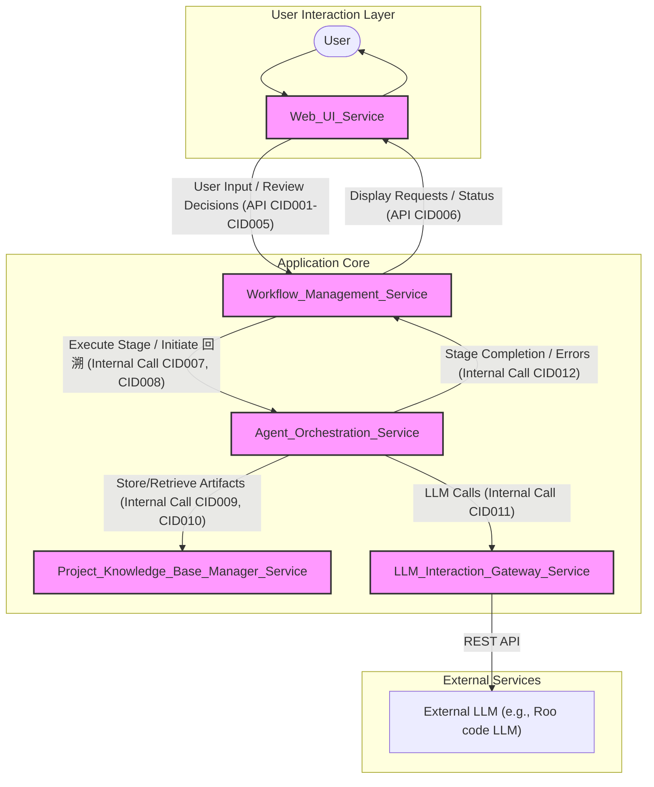

# 原始用户需求描述


1.  **0.1 用户初始需求接收Agent (User Initial Request Receiver):**
    *   **任务:**
        1.  接收用户输入的原始自然语言需求文本。
        2.  将原始文本一字不差地记录下来。
        3.  将记录的原始需求文本传递给“项目知识库构建与管理Agent (PKBM)”进行存储，标记为“原始用户需求 v1.0”。
        4.  将记录的原始需求文本传递给“初步需求意图识别Agent”。
    *   **输入:** 用户提供的自然语言需求。
    *   **输出:** 原始需求文本的精确副本。

2.  **0.2 项目知识库构建与管理Agent (Project Knowledge Base Manager - PKBM):**
    *   **职责 (持续进行):**
        *   接收来自各个Agent的结构化信息和文档。
        *   为每条信息打上标签（如：`需求规格`、`架构决策`、`代码模块X`、`测试用例Y`、`人工审核意见Z`），并记录版本和时间戳。
        *   建立信息之间的关联（如：`代码模块X`实现了`需求点A`，`测试用例Y`用于验证`代码模块X`）。
        *   提供基于标签、关键词、关联性的精确信息检索服务给其他Agent。
    *   **输入/输出:** 持续接收和提供结构化数据。

3.  **0.3 初步需求意图识别Agent (Initial Intent Recognition Agent):**
    *   **任务:**
        1.  接收“原始用户需求文本”。
        2.  识别需求的核心动词和目标（例如：“创建”、“修改”、“修复”、“添加功能”）。
        3.  识别需求中提及的关键名词或实体（例如：“用户注册”、“购物车”、“API”、“数据库表”）。
        4.  输出一份包含“核心意图”和“关键实体列表”的初步分析报告。
        5.  将此报告存入PKBM，标记为“初步意图分析 v1.0”，并关联“原始用户需求 v1.0”。
        6.  将此报告传递给“项目类型与技术栈引导Agent”。
    *   **输入:** 原始用户需求文本。
    *   **输出:** 结构化的初步意图分析报告 (例如：`{ "intent": "create_new_feature", "entities": ["user_login", "oauth2"] }`)。

4.  **0.4 项目类型与技术栈引导Agent (Project Type & Tech Stack Elicitation Agent):**
    *   **任务:**
        1.  接收“初步意图分析报告”。
        2.  从PKBM调取项目历史信息（如果是已有项目）。
        3.  根据意图和实体，生成一系列针对性的问题，以获取或确认项目类型（Web应用、库、CLI工具等）、主要编程语言、核心框架、数据库类型等。问题示例：“您希望使用哪种编程语言来实现此功能？”“此项目是否基于特定的Web框架（如Flask, Django, Spring Boot）？”
        4.  通过“用户交互代理”（人工）向用户呈现这些问题。
        5.  接收用户的回答。
        6.  将问答记录和最终确认的项目类型及技术栈信息整理成结构化文档。
        7.  将此文档存入PKBM，标记为“项目元数据 v1.0”，并关联“初步意图分析 v1.0”。
        8.  将此文档传递给“详细需求澄清Agent”。
    *   **输入:** 初步意图分析报告，用户回答。
    *   **输出:** 结构化的项目元数据文档。

**阶段一：深度需求理解与规格化**

5.  **1.1 需求细节与边界条件挖掘Agent (Requirement Detail & Boundary Miner Agent):**
    *   **任务:**
        1.  接收“原始用户需求文本”和“项目元数据”。
        2.  从PKBM调取“初步意图分析报告”。
        3.  逐条分析原始需求中的每个句子/要点。
        4.  针对每个要点，生成旨在挖掘具体细节、非功能性需求（性能、易用性等）、边界条件、用户场景、预期行为和异常处理的问题。示例：“对于用户登录，密码错误次数达到多少次后应锁定账户？”“注册成功后，用户应被重定向到哪个页面？”“数据量预计有多大？”
        5.  将生成的问题列表通过“用户交互代理”呈现给用户。
        6.  接收用户的回答。
        7.  将问答记录整理并存入PKBM，标记为“需求澄清细节QA v1.0”。
        8.  将所有澄清后的细节传递给“用户故事生成Agent”和“验收标准定义Agent”。
    *   **输入:** 原始需求，项目元数据，用户回答。
    *   **输出:** 包含详细澄清问答的记录。

6.  **1.2 用户故事生成Agent (User Story Generation Agent):**
    *   **任务:**
        1.  接收来自“需求细节与边界条件挖掘Agent”的澄清后细节。
        2.  从PKBM调取“原始用户需求文本”和“项目元数据”。
        3.  根据“As a [type of user], I want [an action] so that [a benefit/value]”的模板，将澄清后的需求点转化为一系列用户故事。
        4.  确保每个用户故事都是独立的、可协商的、有价值的、可估计的、小的、可测试的（INVEST原则）。
        5.  输出用户故事列表（例如，Markdown或JSON格式）。
        6.  将用户故事列表存入PKBM，标记为“用户故事集 v1.0”。
        7.  将用户故事列表传递给“人工审核点1协调Agent”。
    *   **输入:** 澄清后的需求细节。
    *   **输出:** 结构化的用户故事列表。

7.  **1.3 验收标准定义Agent (Acceptance Criteria Definition Agent):**
    *   **任务:**
        1.  接收来自“需求细节与边界条件挖掘Agent”的澄清后细节。
        2.  从PKBM调取“用户故事集 v1.0”（由用户故事生成Agent刚生成）。
        3.  为每个用户故事，根据Gherkin语言格式 (Given-When-Then) 或其他清晰的、可验证的条件列表，定义详细的验收标准。
        4.  确保每个验收标准都是具体的、可衡量的、可实现的、相关的、有时间限制的（SMART原则，虽然时间限制可能由后续规划决定）。
        5.  输出与用户故事对应的验收标准集合。
        6.  将验收标准集合存入PKBM，标记为“验收标准集 v1.0”，并关联“用户故事集 v1.0”。
        7.  将验收标准集合传递给“人工审核点1协调Agent”。
    *   **输入:** 澄清后的需求细节，用户故事列表。
    *   **输出:** 结构化的验收标准集合。

8.  **1.4 需求规格文档编纂Agent (Requirements Specification Compiler Agent):**
    *   **任务:**
        1.  从PKBM调取“用户故事集 v1.0”和“验收标准集 v1.0”。
        2.  将用户故事和对应的验收标准整合成一份统一的、结构清晰的需求规格说明书文档 (例如，Markdown或PDF格式)。
        3.  文档应包含引言（项目目标简述）、用户故事列表、每个用户故事的详细验收标准。
        4.  将此文档存入PKBM，标记为“需求规格说明书 v1.0”。
        5.  将此文档传递给“人工审核点1协调Agent”。
    *   **输入:** 用户故事列表，验收标准集合。
    *   **输出:** 完整的需求规格说明书文档。

9.  **1.5 人工审核点1协调Agent (Human Review Point 1 Coordinator):**
    *   **任务:**
        1.  从PKBM接收“需求规格说明书 v1.0”（包含用户故事和验收标准）。
        2.  准备审核材料包，呈现给人工审核者（用户/产品经理）。
        3.  **审核要点清单（供人工参考）：**
            *   需求是否完整准确地反映了原始意图？
            *   用户故事是否清晰、独立、可测试？
            *   验收标准是否具体、可衡量，并能充分验证用户故事？
            *   是否存在遗漏的关键场景或边界条件？
            *   是否存在逻辑矛盾或不清晰之处？
        4.  接收人工审核结果（选项：批准通过 / 驳回并附带修改意见）。
        5.  如果“批准通过”：
            *   在PKBM中将“需求规格说明书 v1.0”标记为“已审核通过”。
            *   通知“系统架构方案提议Agent”开始工作。
        6.  如果“驳回”：
            *   将修改意见结构化记录，存入PKBM，标记为“需求审核反馈 v1.x”。
            *   根据反馈内容，决定是将任务重新路由回“需求细节与边界条件挖掘Agent”、“用户故事生成Agent”或“验收标准定义Agent”进行修改，并附上反馈意见。
    *   **输入:** 需求规格说明书，人工审核者的反馈。
    *   **输出:** 审核状态，（若驳回）结构化的修改意见。

**阶段二：架构设计与任务规划**
*(假设需求已通过审核)*

10. **2.1 技术选型建议Agent (Technology Selection Advisor Agent):**
    *   **任务:**
        1.  从PKBM调取“已审核通过的需求规格说明书 v1.0”和“项目元数据 v1.0”。
        2.  如果项目元数据中已明确技术栈，则跳过此步骤，直接将现有技术栈信息传递给后续Agent。
        3.  如果技术栈未定或需调整，根据需求（特别是NFRs，如性能、并发、安全性）、项目类型，生成一个包含2-3个候选技术栈（语言、框架、关键库、数据库）的建议列表。
        4.  为每个候选技术栈提供简要的优缺点分析、适用场景以及与项目需求的匹配度说明。
        5.  输出技术选型建议报告。
        6.  将报告存入PKBM，标记为“技术选型建议 v1.0”。
        7.  通过“用户交互代理”将建议报告提交给用户（或技术负责人）进行选择。
        8.  接收用户的最终技术选型决定。
        9.  将最终选定的技术栈更新到PKBM的“项目元数据”中（或创建新版本）。
        10. 将确认的技术栈信息传递给“高层组件划分Agent”。
    *   **输入:** 需求规格，项目元数据，用户选择。
    *   **输出:** 技术选型建议报告，更新后的项目元数据。

11. **2.2 高层组件划分Agent (High-Level Component Definition Agent):**
    *   **任务:**
        1.  从PKBM调取“已审核通过的需求规格说明书 v1.0”和已确认的“项目元数据”（含技术栈）。
        2.  根据需求和技术栈，识别出系统需要的主要高层模块/服务/组件（例如：用户认证服务、订单处理模块、产品目录API、数据持久化层、前端UI）。
        3.  为每个组件初步定义其核心职责。
        4.  输出高层组件列表及其职责描述。
        5.  将此列表存入PKBM，标记为“高层组件定义 v1.0”。
        6.  将此列表传递给“组件间接口草拟Agent”。
    *   **输入:** 需求规格，项目元数据。
    *   **输出:** 高层组件列表及职责描述。

12. **2.3 组件间接口草拟Agent (Component Interface Draft Agent):**
    *   **任务:**
        1.  从PKBM调取“高层组件定义 v1.0”。
        2.  分析组件间的依赖关系和数据流。
        3.  为需要交互的组件之间草拟初步的接口定义（例如：REST API端点、函数签名、消息队列主题和消息格式）。仅关注接口名称、主要参数和预期返回类型，无需详细数据结构。
        4.  输出组件间接口草案。
        5.  将草案存入PKBM，标记为“组件接口草案 v1.0”。
        6.  将草案传递给“架构图描述生成Agent”。
    *   **输入:** 高层组件定义。
    *   **输出:** 组件间接口草案。

13. **2.4 架构图描述生成Agent (Architecture Diagram Description Agent):**
    *   **任务:**
        1.  从PKBM调取“高层组件定义 v1.0”和“组件接口草案 v1.0”。
        2.  生成一段自然语言描述，该描述能够清晰地表达系统的高层架构，包括主要组件、它们之间的关系以及关键接口。（目标是让一个LLM能够基于此描述生成一个架构图，或让人能理解架构）。
        3.  （可选，如果LLM能力支持）尝试生成PlantUML或Mermaid等文本格式的图表描述。
        4.  输出架构图的文本描述。
        5.  将描述存入PKBM，标记为“架构图文本描述 v1.0”。
        6.  将描述传递给“架构设计文档编纂Agent”。
    *   **输入:** 高层组件定义，组件接口草案。
    *   **输出:** 架构图的文本描述。

14. **2.5 架构设计文档编纂Agent (Architecture Design Compiler Agent):**
    *   **任务:**
        1.  从PKBM调取“技术选型最终决定”（来自项目元数据）、“高层组件定义 v1.0”、“组件接口草案 v1.0”、“架构图文本描述 v1.0”。
        2.  将以上信息整合成一份高层架构设计文档。
        3.  文档应包含：技术选型及其理由、组件列表及其职责、组件间主要接口、架构图（或其文本描述）。
        4.  将文档存入PKBM，标记为“高层架构设计文档 v1.0”。
        5.  将文档传递给“人工审核点2协调Agent”。
    *   **输入:** 各架构设计元素。
    *   **输出:** 高层架构设计文档。

15. **2.6 人工审核点2协调Agent (Human Review Point 2 Coordinator):**
    *   **任务:**
        1.  从PKBM接收“高层架构设计文档 v1.0”。
        2.  准备审核材料包，呈现给人工审核者（技术负责人/架构师）。
        3.  **审核要点清单（供人工参考）：**
            *   技术选型是否合理、可行、符合项目需求和长期目标？
            *   组件划分是否清晰、职责是否单一、内聚是否高？
            *   组件间接口设计是否满足功能需求，是否考虑了可扩展性和可维护性？
            *   架构是否能支持需求的非功能性要求（性能、安全、伸缩性等）？
            *   是否存在明显的设计缺陷或风险点？
        4.  接收人工审核结果（批准通过 / 驳回并附带修改意见）。
        5.  如果“批准通过”：
            *   在PKBM中将“高层架构设计文档 v1.0”标记为“已审核通过”。
            *   通知“编码任务分解Agent”开始工作。
        6.  如果“驳回”：
            *   将修改意见结构化记录，存入PKBM，标记为“架构审核反馈 v1.x”。
            *   根据反馈，可能需要重新路由到“技术选型建议Agent”、“高层组件划分Agent”等。
    *   **输入:** 高层架构设计文档，人工审核反馈。
    *   **输出:** 审核状态，（若驳回）结构化的修改意见。

16. **2.7 编码任务分解Agent (Coding Task Breakdown Agent):**
    *   **任务:**
        1.  从PKBM调取“已审核通过的需求规格说明书 v1.0”和“已审核通过的高层架构设计文档 v1.0”。
        2.  将每个用户故事/功能点映射到架构中的一个或多个组件。
        3.  将大的功能点或组件实现进一步分解为更小的、可独立开发和测试的编码子任务（例如：实现用户模型的CRUD操作、设计登录API的请求/响应结构、编写密码加密工具类）。
        4.  为每个子任务明确其目标、预期产出（如某个类的实现、某个API端点）。
        5.  输出编码子任务列表。
        6.  将列表存入PKBM，标记为“编码子任务列表 v1.0”。
        7.  将列表传递给“任务依赖与顺序规划Agent”。
    *   **输入:** 需求规格，架构设计。
    *   **输出:** 编码子任务列表。

17. **2.8 任务依赖与顺序规划Agent (Task Dependency & Sequencing Agent):**
    *   **任务:**
        1.  从PKBM调取“编码子任务列表 v1.0”。
        2.  分析子任务之间的逻辑依赖关系（例如，必须先实现用户模型，才能实现用户注册API）。
        3.  根据依赖关系，确定一个合理的开发顺序或并行分组。
        4.  输出带有依赖关系和建议执行顺序的编码任务计划（例如，有向无环图描述或带优先级的列表）。
        5.  将计划存入PKBM，标记为“编码任务计划 v1.0”。
        6.  后续流程将按此计划逐个处理子任务。
    *   **输入:** 编码子任务列表。
    *   **输出:** 带有依赖和顺序的编码任务计划。

**阶段三：详细设计 (针对每个编码子任务循环)**
*(协调器会根据“编码任务计划 v1.0”逐个启动以下流程)*

18. **3.1 当前子任务上下文准备Agent (Current Subtask Context Preparer):**
    *   **任务:**
        1.  从“编码任务计划 v1.0”中获取当前待执行的子任务。
        2.  从PKBM调取与此子任务相关的全部上下文：
            *   对应的用户故事和验收标准。
            *   相关的架构设计部分（组件职责、接口定义）。
            *   项目元数据（技术栈、编码规范）。
            *   （如果是修改任务）现有代码库中相关的代码片段或文件结构（可能需要人工辅助定位并提供给PKBM）。
        3.  将这些上下文打包，传递给后续的详细设计Agent。
    *   **输入:** 当前子任务ID，PKBM。
    *   **输出:** 当前子任务的完整上下文包。

19. **3.2 API详细设计Agent (API Detailed Design Agent):** *(如果子任务涉及API)*
    *   **任务:**
        1.  接收“当前子任务上下文包”。
        2.  根据子任务需求和架构中的接口草案，详细设计API：
            *   精确的URL路径和HTTP方法。
            *   请求头、路径参数、查询参数的详细定义。
            *   请求体的JSON/XML Schema (或等效的详细结构描述)。
            *   响应体的JSON/XML Schema (或等效的详细结构描述) for 各种状态码 (200, 201, 400, 401, 403, 500等)。
            *   认证和授权机制说明。
        3.  输出API详细设计文档（例如，OpenAPI/Swagger片段或Markdown格式的详细描述）。
        4.  将文档存入PKBM，标记为“API详细设计_[子任务ID]_v1.0”。
    *   **输入:** 子任务上下文包。
    *   **输出:** API详细设计文档。

20. **3.3 数据模型详细设计Agent (Data Model Detailed Design Agent):** *(如果子任务涉及数据持久化或复杂数据结构)*
    *   **任务:**
        1.  接收“当前子任务上下文包”。
        2.  设计或更新数据库表结构：
            *   表名、列名、数据类型、约束（主键、外键、非空、唯一、检查约束）。
            *   索引建议。
            *   表间关系。
        3.  或设计程序内部使用的数据对象/类的属性和类型。
        4.  输出数据模型详细设计（例如，SQL DDL语句、类图的文本描述、JSON Schema）。
        5.  将设计存入PKBM，标记为“数据模型详细设计_[子任务ID]_v1.0”。
    *   **输入:** 子任务上下文包。
    *   **输出:** 数据模型详细设计。

21. **3.4 类与函数逻辑设计Agent (Class & Function Logic Design Agent):** *(如果子任务涉及具体业务逻辑实现)*
    *   **任务:**
        1.  接收“当前子任务上下文包”。
        2.  确定需要创建或修改的类和函数。
        3.  为每个关键类/函数：
            *   定义其职责。
            *   设计其公共接口（方法签名：名称、参数类型、返回类型）。
            *   用伪代码或详细的步骤描述其核心实现逻辑，包括主要算法、条件分支、循环、异常处理逻辑。
        4.  输出类与函数逻辑设计文档。
        5.  将文档存入PKBM，标记为“类函数逻辑设计_[子任务ID]_v1.0”。
    *   **输入:** 子任务上下文包。
    *   **输出:** 类与函数逻辑设计文档。

22. **3.5 文件与目录结构规划Agent (File & Directory Structure Planner Agent):**
    *   **任务:**
        1.  接收“当前子任务上下文包”。
        2.  从PKBM调取项目现有的（如果适用）文件结构和编码规范中关于结构的部分。
        3.  根据子任务的性质以及相关的API设计、数据模型设计、类函数设计，规划：
            *   需要创建的新文件名及其在项目中的完整路径。
            *   需要修改的现有文件名及其路径。
            *   是否需要创建新的目录。
        4.  确保规划的结构符合项目技术栈的最佳实践和编码规范。
        5.  输出文件和目录结构变更计划。
        6.  将计划存入PKBM，标记为“文件结构计划_[子任务ID]_v1.0”。
    *   **输入:** 子任务上下文包，相关详细设计。
    *   **输出:** 文件和目录结构变更计划。

23. **3.6 安全考量与检查点定义Agent (Security Considerations & Checkpoint Definer Agent):**
    *   **任务:**
        1.  接收“当前子任务上下文包”以及该子任务相关的所有详细设计文档（API、数据、逻辑）。
        2.  从PKBM调取项目安全规范、已知的安全漏洞模式 (如OWASP Top 10)。
        3.  针对当前子任务的设计，识别潜在的安全风险点（例如：SQL注入、XSS、CSRF、不安全的API暴露、敏感数据处理不当、权限控制缺失等）。
        4.  为每个风险点，提出具体的安全加固建议或必须在代码实现中包含的安全检查点/措施。
        5.  输出安全考量报告及检查点列表。
        6.  将报告存入PKBM，标记为“安全考量_[子任务ID]_v1.0”。
    *   **输入:** 子任务上下文包，所有相关详细设计。
    *   **输出:** 安全考量报告及检查点列表。

24. **3.7 详细设计汇总与指令生成Agent (Detailed Design Aggregation & Instruction Generator Agent):**
    *   **任务:**
        1.  接收当前子任务的所有详细设计文档（API、数据、逻辑、文件结构、安全考量）。
        2.  将这些设计整合成一份针对该子任务的《代码实现指导书》。
        3.  基于《代码实现指导书》，生成给“代码生成/修改Agent (CGMA)”或外部“Roo code LLM”的**极其具体、包含完整上下文的指令文本 (Prompt)**。该指令必须：
            *   明确是创建新文件还是修改现有文件（并提供完整路径）。
            *   如果修改，必须提供**原始代码的精确片段**（人工或辅助Agent从代码库获取并提供给PKBM）。
            *   清晰描述要实现的**功能逻辑、算法步骤、API行为、数据结构**。
            *   包含所有必要的**类名、函数签名、变量名约定**。
            *   强调必须遵循的**编码规范**（从PKBM调取）。
            *   列出必须实现的**安全检查点**。
            *   提供必要的**上下文代码片段**（如import语句、父类定义等，帮助LLM理解环境）。
            *   指定预期的**输出代码格式**（例如，一个完整的Python文件，或一个Java类中的特定方法）。
        4.  将《代码实现指导书》存入PKBM，标记为“实现指导书_[子任务ID]_v1.0”。
        5.  将生成的精确指令文本传递给“人工审核点3协调Agent”。
    *   **输入:** 子任务的所有详细设计文档，PKBM（编码规范、原始代码片段等）。
    *   **输出:** 《代码实现指导书》，给代码生成LLM的精确指令文本。

25. **3.8 人工审核点3协调Agent (Human Review Point 3 Coordinator):**
    *   **任务:**
        1.  接收为代码生成LLM准备的“精确指令文本”和对应的《代码实现指导书_[子任务ID]_v1.0》。
        2.  准备审核材料包，呈现给人工审核者（通常是开发人员）。
        3.  **审核要点清单（供人工参考）：**
            *   指令是否清晰、无歧义、完整？
            *   指令是否准确反映了《代码实现指导书》的所有要求？
            *   指令中包含的上下文信息（原始代码、规范、安全点）是否充分且正确？
            *   预期的代码输出描述是否明确？
            *   是否存在任何可能导致LLM误解或生成错误代码的表述？
        4.  接收人工审核结果（批准执行 / 驳回并附带修改指令的建议）。
        5.  如果“批准执行”：
            *   在PKBM中将“精确指令文本_[子任务ID]_v1.0”标记为“已审核待执行”。
            *   将指令文本传递给“代码生成/修改执行协调Agent”。
        6.  如果“驳回”：
            *   将修改建议存入PKBM。
            *   将任务路由回“详细设计汇总与指令生成Agent”进行修改。
    *   **输入:** 精确指令文本，实现指导书，人工审核反馈。
    *   **输出:** 审核状态，（若批准）待执行的指令文本。

**阶段四：代码生成与初步校验 (通过内部或外部LLM，针对每个子任务)**

26. **4.1 代码生成/修改执行协调Agent (CGMA Execution Coordinator):**
    *   **任务:**
        1.  接收“已审核待执行的精确指令文本_[子任务ID]_v1.0”。
        2.  **[手动交互点]** 将此指令文本复制粘贴到您指定的“Roo code LLM”或其他代码生成工具的输入界面。
        3.  触发“Roo code LLM”执行。
        4.  **[手动交互点]** 从“Roo code LLM”获取其生成的代码文本（或错误信息/状态）。
        5.  将“Roo code LLM”的原始输出（代码或错误信息）记录到PKBM，标记为“CGMA原始输出_[子任务ID]_v1.0”。
        6.  如果输出是代码，则将其传递给“代码基本语法与格式校验Agent”。如果输出是错误，则记录错误并可能需要人工介入或回溯。
    *   **输入:** 审核通过的精确指令文本。
    *   **输出:** CGMA生成的原始代码或错误信息。

27. **4.2 代码基本语法与格式校验Agent (Code Syntax & Basic Formatting Validator Agent):**
    *   **任务:**
        1.  接收“CGMA原始输出_[子任务ID]_v1.0”（假设是代码）。
        2.  从PKBM调取项目编码规范中关于格式化的部分和语言版本。
        3.  使用Linter（如ESLint, Pylint, Checkstyle）或编译器对代码进行基本的语法检查。
        4.  （可选，若LLM支持）尝试自动修复简单的格式问题。
        5.  输出校验结果报告（语法错误列表、格式问题列表）和（可能）初步格式化后的代码。
        6.  将校验报告和格式化代码存入PKBM，标记为“代码初步校验报告_[子任务ID]_v1.0”和“初步格式化代码_[子任务ID]_v1.0”。
        7.  如果存在严重语法错误导致无法进行后续步骤，标记问题并可能需要回溯到指令生成或人工介入。否则，将初步格式化代码传递给“静态代码分析Agent”。
    *   **输入:** CGMA原始输出代码。
    *   **输出:** 初步校验报告，初步格式化代码。

28. **4.3 静态代码分析Agent (Static Code Analyzer Agent):**
    *   **任务:**
        1.  接收“初步格式化代码_[子任务ID]_v1.0”。
        2.  从PKBM调取项目配置的静态分析规则集（例如，SonarQube规则子集、FindBugs规则）。
        3.  运行更深入的静态分析工具，检查潜在bug、代码异味、复杂度过高、未使用的变量/导入、简单的安全漏洞模式（如硬编码密码）。
        4.  输出详细的静态分析报告，包含问题描述、位置、严重级别和建议修复。
        5.  将报告存入PKBM，标记为“静态分析报告_[子任务ID]_v1.0”。
        6.  将报告和代码传递给“AI代码审查员Agent”。
    *   **输入:** 初步格式化代码。
    *   **输出:** 详细静态分析报告。

**阶段五：深度审查、测试与迭代 (针对每个子任务的产出)**

29. **5.1 AI代码审查员Agent (AI Code Reviewer Agent):**
    *   **任务:**
        1.  接收“初步格式化代码_[子任务ID]_v1.0”和“静态分析报告_[子任务ID]_v1.0”。
        2.  从PKBM调取该子任务的《实现指导书_[子任务ID]_v1.0》（包含所有设计要求、安全检查点）和“编码规范”。
        3.  **核心审查任务：**
            *   **功能符合性：** 代码是否实现了《实现指导书》中描述的所有功能点和逻辑？
            *   **设计遵循性：** 代码结构、类/函数设计是否与详细设计一致？API实现是否符合API设计？
            *   **规范遵循性：** 代码是否严格遵守了编码规范（命名、注释、风格等）？
            *   **可读性与可维护性：** 代码是否清晰易懂？是否存在过于复杂或难以维护的结构？
            *   **错误处理：** 是否恰当地处理了预期的异常和边界条件？
            *   **性能初步评估：** 是否存在明显的性能瓶颈（如不必要的循环、低效算法）？
            *   **安全性：** 是否落实了《实现指导书》中要求的安全检查点？是否存在静态分析未发现的、基于上下文的潜在安全问题？
        4.  针对每个发现的问题，提供具体的描述、代码位置、以及修改建议。
        5.  输出AI代码审查报告。
        6.  将报告存入PKBM，标记为“AI代码审查报告_[子任务ID]_v1.0”。
        7.  将报告、代码、静态分析报告传递给“人工审核点4协调Agent”。
    *   **输入:** 代码，静态分析报告，实现指导书，编码规范。
    *   **输出:** AI代码审查报告。

30. **5.2 人工审核点4协调Agent (Human Review Point 4 Coordinator - Code & AI Review):**
    *   **任务:**
        1.  接收“初步格式化代码_[子任务ID]_v1.0”、“静态分析报告_[子任务ID]_v1.0”和“AI代码审查报告_[子任务ID]_v1.0”。
        2.  准备审核材料包，呈现给人工审核者（开发人员/技术组长）。
        3.  **审核要点清单（供人工参考）：**
            *   AI生成的代码质量如何？是否基本可用？
            *   静态分析报告中的关键问题是否需要处理？
            *   AI代码审查报告是否准确？其提出的问题和建议是否合理？
            *   是否存在AI未能发现的关键问题（逻辑错误、深层设计缺陷、安全漏洞）？
            *   代码是否真正符合原始需求和设计意图？
        4.  接收人工审核结果（选项：批准进入测试 / 驳回并附带修改意见 / 直接手动修改代码并提交修改后版本）。
        5.  如果“批准进入测试”：
            *   在PKBM中将“初步格式化代码_[子任务ID]_v1.0”标记为“代码审核通过”。
            *   通知“单元测试用例生成Agent”开始工作。
        6.  如果“驳回”：
            *   将修改意见（针对代码或针对AI审查报告）结构化记录，存入PKBM。
            *   根据反馈，决定是重新生成指令（回溯到3.7）、要求CGMA重新生成（回溯到4.1）、或由AI代码审查员Agent尝试根据反馈生成修复建议。
        7.  如果“人工手动修改”：
            *   人工将修改后的代码提供给协调Agent。
            *   协调Agent将新代码存入PKBM，标记为“人工修正代码_[子任务ID]_v1.0”，并将其视为“代码审核通过”，通知测试。
    *   **输入:** 代码，各类报告，人工审核反馈/修改后的代码。
    *   **输出:** 审核状态，（若批准）进入测试的代码版本。

31. **5.3 单元测试用例生成Agent (Unit Test Case Generator Agent):**
    *   **任务:**
        1.  接收“代码审核通过”状态的代码（无论是AI生成后通过，还是人工修正后通过）。
        2.  从PKBM调取该子任务的《实现指导书》（特别是验收标准部分）、“类函数逻辑设计”、“API详细设计”以及项目使用的测试框架信息和测试编码规范。
        3.  针对代码中的每个主要函数/方法/类/API端点：
            *   生成覆盖正常路径的测试用例。
            *   生成覆盖已知边界条件的测试用例。
            *   生成覆盖预期异常处理的测试用例。
            *   确保测试用例的断言与《实现指导书》中的预期行为和验收标准一致。
        4.  输出单元测试用例代码文件（符合项目测试框架的格式）。
        5.  将测试用例代码存入PKBM，标记为“单元测试代码_[子任务ID]_v1.0”。
        6.  将测试用例代码和被测代码一起传递给“测试执行协调Agent”。
    *   **输入:** 审核通过的代码，实现指导书，设计文档，测试框架信息。
    *   **输出:** 单元测试用例代码。

32. **5.4 测试执行协调Agent (Test Execution Coordinator):**
    *   **任务:**
        1.  接收被测代码和“单元测试代码_[子任务ID]_v1.0”。
        2.  **[手动交互点]** 协助用户将单元测试代码集成到本地项目的测试套件中。
        3.  **[手动交互点]** 指导用户在本地环境中运行这些单元测试。
        4.  **[手动交互点]** 从用户处获取测试执行结果（例如，测试框架输出的报告文本，包含通过/失败数量、失败用例的名称、错误信息和堆栈跟踪）。
        5.  将测试结果报告原文存入PKBM，标记为“单元测试结果原始报告_[子任务ID]_v1.0”。
        6.  将报告传递给“测试结果分析与调试指引Agent”。
    *   **输入:** 被测代码，单元测试代码，用户提供的测试结果。
    *   **输出:** 单元测试结果原始报告。

33. **5.5 测试结果分析与调试指引Agent (Test Result Analyzer & Debugging Guide Agent):**
    *   **任务:**
        1.  接收“单元测试结果原始报告_[子任务ID]_v1.0”。
        2.  从PKBM调取相关的被测代码、单元测试代码、《实现指导书》。
        3.  分析测试报告：
            *   如果所有测试通过：在PKBM中标记子任务状态为“测试通过”，通知“子任务完成与集成准备Agent”。
            *   如果存在失败的测试用例：
                *   针对每个失败的用例，提取错误信息和堆栈跟踪。
                *   尝试将错误定位到被测代码或测试用例代码的具体行号。
                *   分析失败的可能原因（例如：逻辑错误、边界条件处理不当、测试用例断言错误、环境问题）。
                *   生成一份调试分析报告，包含：失败的测试列表、每个失败的详细错误、初步的原因分析、以及建议的调试步骤或修改方向（是修改被测代码还是修改测试用例）。
        4.  将调试分析报告（如果测试失败）存入PKBM，标记为“调试分析报告_[子任务ID]_v1.0”。
        5.  将报告传递给“人工审核点5协调Agent”。
    *   **输入:** 测试结果报告，相关代码和设计。
    *   **输出:** 子任务状态（测试通过/失败），（若失败）调试分析报告。

34. **5.6 人工审核点5协调Agent (Human Review Point 5 Coordinator - Debugging & Iteration):**
    *   **任务:**
        1.  接收“调试分析报告_[子任务ID]_v1.0”（如果测试失败）。
        2.  准备审核材料包（报告、相关代码），呈现给人工审核者（开发人员）。
        3.  **审核要点清单（供人工参考）：**
            *   AI对测试失败原因的分析是否准确？
            *   AI提出的调试建议或修改方向是否合理？
            *   确定问题根源是在产品代码、测试代码还是设计本身？
        4.  接收人工审核决策和指令（例如：确认是产品代码bug，请AI尝试修复；确认是测试用例问题，请AI修改测试；确认是设计问题，需要回溯到设计阶段；或人工直接修复并提交新代码/测试）。
        5.  如果需要AI修复/修改：
            *   将人工确认的问题和修改方向传递给“代码/测试修复指令生成Agent”。
        6.  如果人工直接修复：
            *   接收人工修改后的代码/测试，存入PKBM，然后重新触发“测试执行协调Agent”（返回5.4）。
        7.  如果需要回溯设计：
            *   在PKBM中记录问题，并通知中央协调器进行流程回溯。
    *   **输入:** 调试分析报告，人工反馈和指令。
    *   **输出:** 下一步行动指令（AI修复、人工修复、回溯）。

35. **5.7 代码/测试修复指令生成Agent (Code/Test Remediation Instruction Agent):**
    *   **任务:**
        1.  接收来自人工确认的“调试分析报告”和修复方向/要求。
        2.  从PKBM调取相关的代码（产品代码或测试代码）。
        3.  生成一条**极其具体**的指令给“代码生成/修改Agent (CGMA)”或外部“Roo code LLM”，用于修复已识别的bug或修改测试用例。指令应包含：
            *   要修改的文件名和精确的代码片段。
            *   清晰描述要修正的逻辑或行为。
            *   预期的正确行为。
        4.  将修复指令存入PKBM，标记为“修复指令_[子任务ID]_v1.x”。
        5.  将指令传递给“代码生成/修改执行协调Agent”（返回4.1），开始新一轮的代码生成->校验->审查->测试循环。
    *   **输入:** 确认的调试分析和修复要求，相关代码。
    *   **输出:** 给CGMA的精确修复指令。

**阶段六：集成、文档、交付与学习 (当一个或多个相关子任务“测试通过”后)**

36. **6.1 子任务完成与集成准备Agent (Subtask Completion & Integration Prep Agent):**
    *   **任务:**
        1.  当一个子任务在PKBM中被标记为“测试通过”时被激活。
        2.  检查“编码任务计划 v1.0”中该子任务的依赖关系。
        3.  如果所有前置依赖任务也都“测试通过”，则将此子任务的最终代码（在PKBM中标记为“最终版本代码_[子任务ID]”）标记为“待集成”。
        4.  通知“代码集成协调Agent”有一批新的“待集成”代码。
    *   **输入:** 子任务状态更新，编码任务计划。
    *   **输出:** “待集成”代码列表。

37. **6.2 代码集成协调Agent (Code Integration Coordinator):**
    *   **任务:**
        1.  接收一批“待集成”的代码模块/文件。
        2.  **[手动交互点]** 协助用户将这些新代码或修改后的代码合并到项目的主开发分支（或指定的目标分支）。
        3.  **[手动交互点]** 协助用户解决可能出现的合并冲突。
        4.  记录集成操作（哪些文件被合并，是否有冲突及如何解决）到PKBM，标记为“集成日志_[批次ID]_v1.0”。
        5.  集成完成后，通知“构建与冒烟测试Agent”。
    *   **输入:** 待集成代码列表，用户操作。
    *   **输出:** 集成操作日志。

38. **6.3 构建与冒烟测试Agent (Build & Smoke Test Agent):**
    *   **任务:**
        1.  在代码集成后被激活。
        2.  从PKBM调取项目构建脚本（pom.xml, package.json等）和构建说明。
        3.  **[手动交互点]** 协助用户执行完整的项目构建过程。
        4.  如果构建成功，**[手动交互点]** 协助用户执行一小组核心功能的快速冒烟测试（测试场景可能需要预先定义或由LLM根据需求和架构生成一个“冒烟测试计划”）。
        5.  收集构建结果（成功/失败，错误日志）和冒烟测试结果。
        6.  将结果存入PKBM，标记为“构建日志_[批次ID]_v1.0”和“冒烟测试报告_[批次ID]_v1.0”。
        7.  如果构建或冒烟测试失败，标记问题，可能需要回溯到代码修复或集成步骤。
        8.  如果通过，通知“技术文档更新Agent”和“最终人工验收协调Agent”。
    *   **输入:** 项目代码，构建脚本，（可选）冒烟测试计划，用户操作结果。
    *   **输出:** 构建和冒烟测试结果。

39. **6.4 技术文档更新Agent - 代码注释 (Technical Documentation Updater - Code Comments):**
    *   **任务:**
        1.  接收“构建与冒烟测试通过”的信号和涉及的已集成代码模块列表。
        2.  从PKBM调取这些代码模块的《实现指导书》和“编码规范”（关于注释的部分）。
        3.  为代码中的主要类、函数/方法、复杂逻辑块生成符合规范的、解释性的注释。
        4.  输出带有新增/更新注释的代码版本。
        5.  **[手动交互点]** 协助用户将这些注释应用到实际代码中。
        6.  将更新后的代码（带注释）在PKBM中标记为最终版本。
    *   **输入:** 已集成代码，实现指导书，编码规范。
    *   **输出:** 带注释的代码。

40. **6.5 技术文档更新Agent - API文档与README (Technical Documentation Updater - API Docs & README):**
    *   **任务:**
        1.  接收“构建与冒烟测试通过”的信号。
        2.  从PKBM调取所有相关的“API详细设计文档”、“高层架构设计文档”、“需求规格说明书”以及项目现有的API文档（如Swagger/OpenAPI文件）和README文件。
        3.  根据最新的代码和设计，更新或生成API文档。
        4.  更新项目README文件，包含新功能说明、安装/使用指南变更等。
        5.  生成本次迭代/变更的Changelog条目。
        6.  将更新后的文档（API文档、README、Changelog）存入PKBM。
    *   **输入:** 所有相关设计和需求文档，现有文档。
    *   **输出:** 更新后的API文档、README、Changelog。

41. **6.6 人工审核点6协调Agent (Human Review Point 6 Coordinator - Final Acceptance):**
    *   **任务:**
        1.  在构建和冒烟测试通过，且文档初步更新后被激活。
        2.  准备最终验收材料包：
            *   原始需求规格说明书。
            *   最终集成并测试通过的代码（或其访问方式）。
            *   更新后的技术文档（API文档、README）。
            *   冒烟测试报告。
            *   Changelog。
        3.  呈现给最终验收人（用户/产品负责人/测试负责人）。
        4.  **验收要点清单（供人工参考）：**
            *   交付的功能是否完整满足原始需求和验收标准？
            *   系统在冒烟测试中表现是否稳定？
            *   文档是否清晰、准确、完整？
            *   是否有任何未解决的重大问题或遗漏？
        5.  接收人工验收结果（批准发布 / 附条件批准 / 拒绝并说明原因）。
        6.  将验收结果和任何反馈记录到PKBM，标记为“最终验收报告_v1.0”。
        7.  如果“批准发布”，则流程结束。否则，根据反馈可能触发新的小型迭代或问题修复流程。
    *   **输入:** 最终交付物和报告，人工验收反馈。
    *   **输出:** 最终验收状态和报告。

42. **6.7 项目总结与知识沉淀Agent (Project Summary & Knowledge Distillation Agent):**
    *   **任务 (流程结束后或定期运行):**
        1.  从PKBM调取整个项目/迭代的所有数据：需求、设计、代码（各版本）、指令、审核反馈、测试结果、错误报告、修复记录等。
        2.  生成一份项目总结报告，包含：
            *   完成的功能点回顾。
            *   每个阶段LLM Agent的表现（例如，哪些Agent生成的初稿质量高，哪些Agent经常需要人工修正其输出）。
            *   人工审核点发现的主要问题类型和频率。
            *   整个流程中的瓶颈环节和耗时分析（基于时间戳）。
            *   从本次项目中可以提炼出的可复用知识/模式（例如，某个特定问题的优雅解决方案，某个易错点的警示）。
        3.  将总结报告和提炼的知识点存入PKBM，用于未来改进LLM的Prompt、微调LLM模型或优化流程本身。
    *   **输入:** PKBM中的全部项目数据。
    *   **输出:** 项目总结报告，可复用知识点。

---


---

# 已完成阶段输出

4.  **0.4 项目类型与技术栈引导Agent (Project Type & Tech Stack Elicitation Agent):**

{
  "document_id": "项目元数据 v1.0",
  "version": "1.0",
  "timestamp": "2023-10-27T11:00:00Z", // 实际应为当前时间
  "associated_intent_analysis": "初步意图分析 v1.0",
  "project_name": "多Agent软件开发自动化系统 (简化版)",
  "elicitation_method": "Agent-guided Q&A via User Interaction Proxy (Iterative Refinement)",
  "project_type_and_interaction": {
    "summary": "主要为后台运行的多Agent自动化系统，配备极简Web用户界面。",
    "details": "该系统核心是一系列后台Python Agent (基于AutoGen) 执行自动化软件开发任务，通过一个极简的Web界面（基于Flask）供用户进行人工审核、任务配置、查看流程状态和知识库内容。流程设计为线性流水线，简化回退和并发复杂性。",
    "question_ref": ["Q1", "Q6.1"],
    "user_answer_code": ["Q1:b", "Q6.1:c"]
  },
  "technology_stack_preferences": {
    "primary_programming_language": {
      "language": "Python",
      "reasoning": "AI/ML库丰富，社区支持广泛，适合快速原型和Agent开发。",
      "question_ref": "Q2",
      "user_answer_code": "a"
    },
    "agent_framework": {
      "framework": "AutoGen",
      "question_ref": "Q3 (original)",
      "user_answer_text": "Agent框架使用 AutoGen。"
    },
    "web_service_framework": {
      "framework": "Flask",
      "reasoning": "用户倾向于其极简和灵活性，适合快速搭建基础Web界面和API。",
      "question_ref": "Q3.1.A",
      "user_answer_code": "i"
    },
    "project_knowledge_base_manager_pkbm": {
      "type": "File-based Knowledge Base",
      "organization": "Specific directory structure with individual files for each artifact.",
      "information_linking": "Through filename and directory structure conventions.",
      "write_management": "Strictly serialized writes to the knowledge base.",
      "reasoning": "User preference for simplicity, minimal deployment/maintenance, and insensitivity to performance/efficiency for this aspect. Database systems (relational, graph, vector) are explicitly excluded.",
      "question_ref": ["Q4.1.A", "Q4.1.B", "Q4.1.C"],
      "user_answer_code": ["Q4.1.A:b", "Q4.1.B:a", "Q4.1.C:a"]
    },
    "llm_interaction": {
      "method": "Standard REST API calls via Web Service",
      "details": "LLM interaction integrated into the Flask web service, potentially for chat-like interfaces or CI workflows.",
      "question_ref": "Q5",
      "user_answer_code": "a"
    },
    "frontend_technology": {
      "approach": "AI-assisted design and generation, user review.",
      "style_complexity": "Minimalistic, focusing on basic operations, allowing for future modular expansion.",
      "performance_sensitivity": "Low",
      "question_ref": ["Q6 (original)", "Q6.1"],
      "user_answer_text": "Web前端不熟悉，AI设计编写，用户检查界面。我对性能和效率不敏感. 极简，仅满足基本操作即可。"
    }
  },
  "key_simplifications_and_constraints": [
    "PKBM is file-based, no traditional databases.",
    "Overall process is a linear pipeline.",
    "Reduced emphasis on efficiency and complex rollback mechanisms.",
    "Vector database functionality removed.",
    "Web UI is minimalistic."
  ],
  "open_questions_for_later_stages": [
    "Specific directory structure conventions for the file-based PKBM.",
    "Detailed definition of how AI will assist in frontend design and generation.",
    "Specific interaction patterns between Flask, AutoGen, and LLM APIs for workflows."
  ]
}


8.  **1.4 需求规格文档编纂Agent (Requirements Specification Compiler Agent):**

**输出:** 完整的需求规格说明书文档 (Markdown格式):

```markdown
# Requirements Specification Document v1.0

**Document ID:** RequirementsSpecificationDocument_v1.0
**Version:** 1.0
**Timestamp:** 2023-10-28T17:00:00Z 
**Generated By:** 1.4 Requirements Specification Compiler Agent

## 1. Introduction

This document outlines the requirements for an AI-driven software development automation system. The primary goal of this system is to assist developers by automating various stages of the software development lifecycle, from initial requirement gathering through to code generation, testing, and documentation. The system is envisioned as a collection of specialized agents working in concert, managed through a web-based interface, and relying on a central file-based Project Knowledge Base (PKBM) for storing and retrieving all project artifacts. Key interactions will involve user input via a web interface, LLM-driven processing by various agents, and manual review checkpoints to ensure quality and alignment with user intent.

## 2. User Stories and Acceptance Criteria

Below is a list of user stories identified for the system, along with their detailed acceptance criteria.

---

**User Story ID:** US001
**As a:** Developer
**I want to:** input my raw natural language software requirements via a web interface text area
**So that:** the system can capture and store them accurately for initial processing.
**Notes:** Corresponds to Agent 0.1. Input validation for empty/short text needed (Q0.1.2).

**Acceptance Criteria:**
  - **AC_ID:** US001_AC1
    **Description:** Verify successful capture of valid raw requirements.
    **Gherkin:**
    ```gherkin
    Given the user is on the requirement input page via the web interface (Q0.1.1)
    When the user enters a natural language requirement text (>=10 characters) into the text area
    And submits the form
    Then the '0.1 User Initial Request Receiver Agent' records the exact text
    And passes the text to PKBM for storage as '原始用户需求 v1.0'
    And passes the text to the '0.3 初步需求意图识别Agent'.
    ```
  - **AC_ID:** US001_AC2
    **Description:** Verify error handling for empty requirement input.
    **Gherkin:**
    ```gherkin
    Given the user is on the requirement input page via the web interface (Q0.1.1)
    When the user submits an empty requirement text
    Then the system displays an error message '提示错误信息并要求重新输入' (Q0.1.2)
    And the '0.1 User Initial Request Receiver Agent' does not proceed with storing or passing the text.
    ```
  - **AC_ID:** US001_AC3
    **Description:** Verify error handling for too short requirement input.
    **Gherkin:**
    ```gherkin
    Given the user is on the requirement input page via the web interface (Q0.1.1)
    When the user submits a requirement text shorter than 10 characters
    Then the system displays an error message '提示错误信息并要求重新输入' (Q0.1.2)
    And the '0.1 User Initial Request Receiver Agent' does not proceed with storing or passing the text.
    ```

---

**User Story ID:** US002
**As a:** System
**I want to:** store any received document or structured information in a file-based Project Knowledge Base (PKBM) using predefined directory structures and naming conventions that include version (timestamp) and descriptive tags in the filename
**So that:** all agents have a consistent, versioned, and retrievable source of project artifacts.
**Notes:** Core PKBM functionality (Agent 0.2). Covers QG5, QG6, QG7, Q0.2.1. Write access is serialized (QG8).

**Acceptance Criteria:**
  - **AC_ID:** US002_AC1
    **Description:** Verify correct storage of documents in PKBM with proper naming and versioning.
    **Gherkin:**
    ```gherkin
    Given an Agent has a document or structured information to store
    And the PKBM uses a predefined directory structure (QG9)
    When the '0.2 Project Knowledge Base Manager Agent' receives the information
    Then a file is created in the appropriate predefined directory
    And the filename includes a descriptive tag, a version (timestamp as per QG5), and the source agent ID (Q0.2.1)
    And the content of the file exactly matches the information provided for storage
    And this write operation is serialized (QG8).
    ```
  - **AC_ID:** US002_AC2
    **Description:** Verify PKBM provides information retrieval based on filenames and partial content scanning.
    **Gherkin:**
    ```gherkin
    Given information is stored in PKBM with descriptive filenames (Q0.2.1)
    When an Agent requests information from PKBM using tags, keywords, or associations
    Then the PKBM (simulated by Agent scanning filenames/content - QG10) can locate and provide the relevant file(s) or their paths.
    ```
  - **AC_ID:** US002_AC3
    **Description:** Verify PKBM uses TXT as default format if not specified.
    **Gherkin:**
    ```gherkin
    Given an Agent provides information to PKBM without specifying a format
    And the information is not explicitly Markdown or JSON
    Then the PKBM stores the information as a plain TXT file (QG7).
    ```

---

**User Story ID:** US003
**As a:** Developer
**I want to:** have the system automatically analyze my raw requirements to identify core intent (e.g., 'create_feature') and key entities (e.g., 'user_login')
**So that:** I get a preliminary structured understanding of my request, which is stored in PKBM.
**Notes:** Corresponds to Agent 0.3. Handles uncertainty by asking for clarification (Q0.3.1).

**Acceptance Criteria:**
  - **AC_ID:** US003_AC1
    **Description:** Verify successful identification of core intent and key entities from raw requirements.
    **Gherkin:**
    ```gherkin
    Given the '0.3 Initial Intent Recognition Agent' receives '原始用户需求文本 v1.0'
    When the agent processes the text
    Then the agent outputs a structured preliminary analysis report (JSON format)
    And the report contains a dynamically generated 'intent' (e.g., 'create_new_feature') (Q0.3.2)
    And the report contains a list of identified 'entities' (e.g., ['user_login', 'oauth2'])
    And this report is stored in PKBM as '初步意图分析 v1.0', associated with '原始用户需求 v1.0'.
    ```
  - **AC_ID:** US003_AC2
    **Description:** Verify handling of uncertain intent/entity identification.
    **Gherkin:**
    ```gherkin
    Given the '0.3 Initial Intent Recognition Agent' receives '原始用户需求文本 v1.0'
    And the agent cannot clearly identify core intent or key entities
    Then the agent outputs an analysis report marked as 'uncertain' or with empty fields
    And the system prompts the user for clarification via the web interface until the analysis is corrected and confirmed by the user (Q0.3.1).
    ```

---

**User Story ID:** US004
**As a:** Developer
**I want to:** be prompted by the system with targeted questions to define or confirm the project type, primary programming language, and core frameworks/libraries
**So that:** the system establishes essential project metadata for subsequent planning and design, storing it in PKBM.
**Notes:** Corresponds to Agent 0.4. Handles 'not sure' answers by deferring to later agents (Q0.4.3). Project history for existing projects determined by pre-configured folder (Q0.4.1).

**Acceptance Criteria:**
  - **AC_ID:** US004_AC1
    **Description:** Verify system prompts for project metadata and stores it.
    **Gherkin:**
    ```gherkin
    Given the '0.4 Project Type & Tech Stack Elicitation Agent' receives '初步意图分析报告 v1.0'
    And the project is new (determined by pre-configured folder - Q0.4.1)
    When the agent generates targeted questions about project type, language, frameworks (Q0.4.2)
    And these questions are presented to the user via the '用户交互代理' (web interface - QG3)
    And the user provides answers as text strings (QG4)
    Then the agent compiles these Q&A and confirmed metadata into a structured document
    And this document is stored in PKBM as '项目元数据 v1.0', associated with '初步意图分析 v1.0'.
    ```
  - **AC_ID:** US004_AC2
    **Description:** Verify handling of 'not sure' answers for tech stack.
    **Gherkin:**
    ```gherkin
    Given the user is asked about technology stack details
    When the user answers '不确定' or '由系统推荐'
    Then the '0.4 Project Type & Tech Stack Elicitation Agent' marks these items in '项目元数据 v1.0' as 'to be determined by Technology Selection Advisor Agent' (Q0.4.3).
    ```
  - **AC_ID:** US004_AC3
    **Description:** Verify retrieval of project history if it's an existing project.
    **Gherkin:**
    ```gherkin
    Given the project is identified as an existing project (based on pre-configured folder Q0.4.1)
    When the '0.4 Project Type & Tech Stack Elicitation Agent' starts
    Then the agent attempts to retrieve existing '项目元数据' from PKBM before asking questions.
    ```

---

**User Story ID:** US005
**As a:** Developer
**I want to:** be asked by the system, through the web interface, specific questions to clarify details, non-functional requirements (NFRs), boundary conditions, user scenarios, expected behaviors, and error handling for each part of my initial request
**So that:** all ambiguities are resolved, and the detailed Q&A is stored in PKBM for future reference.
**Notes:** Corresponds to Agent 1.1. Covers general error handling (QG1, QG2) and user interaction (QG3, QG4).

**Acceptance Criteria:**
  - **AC_ID:** US005_AC1
    **Description:** Verify system asks clarifying questions and stores Q&A.
    **Gherkin:**
    ```gherkin
    Given the '1.1 Requirement Detail & Boundary Miner Agent' receives '原始用户需求文本' and '项目元数据 v1.0'
    And retrieves '初步意图分析报告 v1.0' from PKBM
    When the agent analyzes the requirements and generates clarifying questions (details, NFRs, boundaries, scenarios, behaviors, error handling)
    And presents these questions to the user via the web interface (QG3)
    And the user provides answers as text strings (QG4)
    Then the agent compiles the Q&A into a structured record
    And stores this record in PKBM as '需求澄清细节QA v1.0'.
    ```
  - **AC_ID:** US005_AC2
    **Description:** Verify general system error handling during agent task execution.
    **Gherkin:**
    ```gherkin
    Given an Agent is executing a task
    When the Agent encounters an internal error (e.g., PKBM access failure, LLM API call failure)
    Then the Agent attempts to automatically retry the operation 3 times (QG1)
    And if still failing, records the error in PKBM and stops the current sub-task
    And notifies the user of the error via the web interface session/log area, awaiting manual intervention (QG1, QG2).
    ```

---

**User Story ID:** US006
**As a:** Developer
**I want to:** have the system automatically transform the clarified requirements into a list of user stories following the 'As a [user type], I want [action] so that [benefit]' template
**So that:** I receive a structured set of requirements that adhere to INVEST principles, stored in PKBM.
**Notes:** Corresponds to Agent 1.2 (this agent). User type in story from LLM (Q1.2.3). Handles large stories by reporting (Q1.2.2).

**Acceptance Criteria:**
  - **AC_ID:** US006_AC1
    **Description:** Verify successful transformation of clarified requirements into INVEST user stories.
    **Gherkin:**
    ```gherkin
    Given the '1.2 User Story Generation Agent' receives clarified requirement details from '需求澄清细节QA v1.0'
    And retrieves '原始用户需求文本' and '项目元数据 v1.0' from PKBM
    And the LLM can infer '[type of user]' from requirements (Q1.2.3)
    When the agent processes these details
    Then the agent outputs a list of user stories in the format 'As a [type of user], I want [an action] so that [a benefit/value]'
    And each story aims to be Independent, Negotiable, Valuable, Estimable (e.g. <=3 dev days - Q1.2.1), Small, and Testable
    And this list is stored in PKBM as '用户故事集 v1.0'.
    ```
  - **AC_ID:** US006_AC2
    **Description:** Verify handling of overly large/complex requirements for user story generation.
    **Gherkin:**
    ```gherkin
    Given clarified requirement details are very large or complex
    When the '1.2 User Story Generation Agent' attempts to generate user stories
    And finds it difficult to create a single story adhering to INVEST (especially 'Small')
    Then the agent reports this situation to the user via the web interface (Q1.2.2)
    And if the user accepts, proceeds with the larger story.
    ```

---

**User Story ID:** US007
**As a:** Developer
**I want to:** have the system define detailed acceptance criteria (preferably in Gherkin Given-When-Then format, but other clear, verifiable conditions are acceptable) for each generated user story
**So that:** each user story has clear, measurable, and testable completion conditions, stored in PKBM and linked to stories.
**Notes:** Corresponds to Agent 1.3. Gherkin is recommended (Q1.3.1). SMART's Time-bound ignored for now (Q1.3.2). Handles unquantifiable ACs by recommending and asking (Q1.3.3).

**Acceptance Criteria:**
  - **AC_ID:** US007_AC1
    **Description:** Verify definition of detailed acceptance criteria for each user story.
    **Gherkin:**
    ```gherkin
    Given the '1.3 Acceptance Criteria Definition Agent' receives clarified details from '需求澄清细节QA v1.0'
    And retrieves '用户故事集 v1.0' from PKBM
    When the agent processes each user story
    Then for each user story, the agent defines a set of detailed acceptance criteria
    And these criteria are preferably in Gherkin (Given-When-Then) format or as a clear, verifiable list (Q1.3.1)
    And each criterion is specific, measurable, achievable, and relevant (SMART, time-bound ignored for now Q1.3.2)
    And the collection of acceptance criteria is stored in PKBM as '验收标准集 v1.0', associated with '用户故事集 v1.0'.
    ```
  - **AC_ID:** US007_AC2
    **Description:** Verify handling of user stories where aspects are hard to quantify for ACs.
    **Gherkin:**
    ```gherkin
    Given a user story has aspects that are difficult to quantify for very specific ACs
    When the '1.3 Acceptance Criteria Definition Agent' defines ACs for it
    Then the agent provides recommended ACs for those aspects
    And presents these recommendations to the user via the web interface for confirmation (Q1.3.3).
    ```

---

**User Story ID:** US008
**As a:** Developer
**I want to:** have the system compile the user stories and their corresponding acceptance criteria into a unified Requirements Specification Document (Markdown format)
**So that:** I have a comprehensive and reviewable specification document, including an auto-generated introduction, stored in PKBM.
**Notes:** Corresponds to Agent 1.4. Intro is auto-generated (Q1.4.1). Markdown format (Q1.4.2).

**Acceptance Criteria:**
  - **AC_ID:** US008_AC1
    **Description:** Verify compilation of user stories and ACs into a Requirements Specification Document.
    **Gherkin:**
    ```gherkin
    Given the '1.4 Requirements Specification Compiler Agent' has access to '用户故事集 v1.0' and '验收标准集 v1.0' from PKBM
    When the agent processes this information
    Then the agent generates a unified Requirements Specification Document in Markdown format (Q1.4.2)
    And the document includes an introduction (project goal summary, auto-generated from existing info - Q1.4.1), the list of user stories, and detailed ACs for each story
    And this document is stored in PKBM as '需求规格说明书 v1.0'.
    ```

---

**User Story ID:** US009
**As a:** Developer
**I want to:** be presented with the Requirements Specification Document along with relevant source documents (paths to original request, intent analysis) via the web interface for my review and approval or rejection (with feedback)
**So that:** I can ensure the specification's accuracy and completeness before architectural design begins.
**Notes:** Corresponds to Agent 1.5. Feedback format is free text (Q1.5.2). Rerouting logic is in agent (Q1.5.3).

**Acceptance Criteria:**
  - **AC_ID:** US009_AC1
    **Description:** Verify presentation of Requirements Specification Document for human review.
    **Gherkin:**
    ```gherkin
    Given '需求规格说明书 v1.0' is available in PKBM
    When the '1.5 Human Review Point 1 Coordinator' prepares the review package
    Then the package presented to the user (e.g., Product Manager) via the web interface includes '需求规格说明书 v1.0', and file paths to '原始用户需求 v1.0' and '初步意图分析 v1.0' (Q1.5.1)
    And includes a checklist of review points for guidance.
    ```
  - **AC_ID:** US009_AC2
    **Description:** Verify handling of 'Approved' review outcome.
    **Gherkin:**
    ```gherkin
    Given the user has reviewed the Requirements Specification Document
    When the user selects 'Approve'
    Then '需求规格说明书 v1.0' in PKBM is marked as '已审核通过'
    And the '2.1 技术选型建议Agent' or subsequent relevant agent is notified to begin work.
    ```
  - **AC_ID:** US009_AC3
    **Description:** Verify handling of 'Rejected' review outcome.
    **Gherkin:**
    ```gherkin
    Given the user has reviewed the Requirements Specification Document
    When the user selects 'Reject' and provides modification feedback (free text - Q1.5.2)
    Then the feedback is structurally recorded and stored in PKBM as '需求审核反馈 v1.x'
    And the '1.5 Human Review Point 1 Coordinator' internally determines (Q1.5.3) and re-routes the task to '1.1 Requirement Detail & Boundary Miner Agent', '1.2 User Story Generation Agent', or '1.3 Acceptance Criteria Definition Agent' with the feedback.
    ```

---

**User Story ID:** US010
**As a:** Developer
**I want to:** receive 2-3 candidate technology stack suggestions (language, framework, DB, key libraries) with pros/cons and suitability analysis if my project's tech stack is initially undefined or if new requirements suggest a review
**So that:** I can make an informed decision on the technology stack, which is then updated in PKBM's project metadata.
**Notes:** Corresponds to Agent 2.1. Warns if existing stack is unsuitable (Q2.1.1). Suggestions from LLM (Q2.1.2). Detailed analysis (Q2.1.3).

**Acceptance Criteria:**
  - **AC_ID:** US010_AC1
    **Description:** Verify generation of tech stack suggestions if undefined.
    **Gherkin:**
    ```gherkin
    Given '已审核通过的需求规格说明书 v1.0' and '项目元数据 v1.0' are available
    And '项目元数据 v1.0' indicates the tech stack is undefined or requires review (e.g., due to user input in Q0.4.3)
    When the '2.1 Technology Selection Advisor Agent' processes this
    Then the agent generates a report with 2-3 candidate tech stacks (language, framework, DB, libraries) using LLM (Q2.1.2)
    And for each candidate, provides a detailed paragraph on pros/cons, applicable scenarios, and project requirement match (Q2.1.3)
    And this report is stored in PKBM as '技术选型建议 v1.0' and presented to the user for selection.
    ```
  - **AC_ID:** US010_AC2
    **Description:** Verify handling if existing tech stack is unsuitable.
    **Gherkin:**
    ```gherkin
    Given '项目元数据 v1.0' contains a defined tech stack
    And the '2.1 Technology Selection Advisor Agent' analyzes new requirements from '需求规格说明书 v1.0'
    And determines the existing stack may be unsuitable
    Then the agent issues a warning or suggestion with reasons to the user (Q2.1.1) and may proceed to suggest alternatives as per US010_AC1.
    ```
  - **AC_ID:** US010_AC3
    **Description:** Verify skipping tech stack suggestion if already defined and suitable.
    **Gherkin:**
    ```gherkin
    Given '项目元数据 v1.0' contains a clearly defined and suitable tech stack
    When the '2.1 Technology Selection Advisor Agent' starts
    Then the agent confirms the existing stack and passes this information directly to the '2.2 高层组件划分Agent' without generating new suggestions.
    ```
  - **AC_ID:** US010_AC4
    **Description:** Verify updating PKBM with user's final tech stack decision.
    **Gherkin:**
    ```gherkin
    Given the user has been presented with '技术选型建议 v1.0' (if generated)
    When the user makes a final tech stack selection
    Then the '2.1 Technology Selection Advisor Agent' updates '项目元数据' in PKBM with this decision (creating a new version if necessary).
    ```

---

**User Story ID:** US011
**As a:** Developer
**I want to:** have the system identify and define the major high-level modules/services/components required for the project, along with their core responsibilities (as a list of main features)
**So that:** a foundational architectural structure is proposed, based on requirements and chosen tech stack, and stored in PKBM.
**Notes:** Corresponds to Agent 2.2. Granularity and detail based on LLM and design guidelines (Q2.2.1).

**Acceptance Criteria:**
  - **AC_ID:** US011_AC1
    **Description:** Verify identification and definition of high-level components.
    **Gherkin:**
    ```gherkin
    Given '已审核通过的需求规格说明书 v1.0' and confirmed '项目元数据' (with tech stack) are available
    And design guidelines (including how to define component responsibilities) are available in PKBM (Q2.2.1)
    When the '2.2 高层组件划分Agent' processes this information (using LLM)
    Then the agent outputs a list of major high-level modules/services/components
    And for each component, defines its core responsibilities as a list of main features (Q2.2.1)
    And this list is stored in PKBM as '高层组件定义 v1.0'.
    ```

---

**User Story ID:** US012
**As a:** Developer
**I want to:** have the system draft preliminary interface definitions (e.g., REST API endpoints with HTTP methods, function signatures, message queue topics/formats) between interacting high-level components
**So that:** the initial communication pathways and contracts between components are outlined, stored in PKBM.
**Notes:** Corresponds to Agent 2.3. Includes HTTP methods for REST (Q2.3.1). Considers event-driven patterns (Q2.3.2).

**Acceptance Criteria:**
  - **AC_ID:** US012_AC1
    **Description:** Verify drafting of preliminary component interface definitions.
    **Gherkin:**
    ```gherkin
    Given '高层组件定义 v1.0' is available from PKBM
    When the '2.3 组件间接口草拟Agent' analyzes component dependencies and data flow
    Then the agent outputs a draft of preliminary interface definitions for interacting components
    And for REST APIs, this includes API endpoints and HTTP methods (Q2.3.1)
    And for other interactions (e.g., function calls, message queues), it includes function signatures or message topics/formats (Q2.3.2)
    And the draft focuses on interface name, main parameters, and expected return types, without full data structures
    And this draft is stored in PKBM as '组件接口草案 v1.0'.
    ```

---

**User Story ID:** US013
**As a:** Developer
**I want to:** have the system generate a natural language description and a Mermaid diagram (showing components, connections, interface names) representing the high-level system architecture
**So that:** I can visualize and understand the proposed system architecture, and this description is stored in PKBM.
**Notes:** Corresponds to Agent 2.4. Mermaid diagram for technical audience (Q2.4.1, Q2.4.2).

**Acceptance Criteria:**
  - **AC_ID:** US013_AC1
    **Description:** Verify generation of natural language architecture description and Mermaid diagram.
    **Gherkin:**
    ```gherkin
    Given '高层组件定义 v1.0' and '组件接口草案 v1.0' are available from PKBM
    When the '2.4 架构图描述生成Agent' processes this information
    Then the agent outputs a natural language description of the high-level architecture for a technical audience (Q2.4.1)
    And the agent outputs a Mermaid diagram description text that includes components, their connections, and interface names (Q2.4.1, Q2.4.2)
    And these outputs are stored in PKBM as '架构图文本描述 v1.0'.
    ```

---

**User Story ID:** US014
**As a:** Developer
**I want to:** have the system compile the confirmed technology stack, high-level component definitions, interface drafts, and architecture diagram description into a High-Level Architecture Design Document
**So that:** I receive a consolidated document detailing the proposed architecture, stored in PKBM.
**Notes:** Corresponds to Agent 2.5. Tech stack rationale is复述 (Q2.5.1).

**Acceptance Criteria:**
  - **AC_ID:** US014_AC1
    **Description:** Verify compilation of High-Level Architecture Design Document.
    **Gherkin:**
    ```gherkin
    Given the final technology selection (from '项目元数据'), '高层组件定义 v1.0', '组件接口草案 v1.0', and '架构图文本描述 v1.0' are available from PKBM
    When the '2.5 架构设计文档编纂Agent' processes these inputs
    Then the agent generates a consolidated High-Level Architecture Design Document
    And the document includes the technology selection and its rationale (复述 if previously defined - Q2.5.1), component list with responsibilities, main inter-component interfaces, and the architecture diagram (or its text description)
    And this document is stored in PKBM as '高层架构设计文档 v1.0'.
    ```

---

**User Story ID:** US015
**As a:** Developer
**I want to:** be presented with the High-Level Architecture Design Document for my review and approval or rejection (with feedback) via the web interface
**So that:** I can validate the architectural design's soundness and suitability before detailed design and task breakdown.
**Notes:** Corresponds to Agent 2.6. Similar review process to US009 (Q2.6).

**Acceptance Criteria:**
  - **AC_ID:** US015_AC1
    **Description:** Verify presentation of Architecture Design Document for human review.
    **Gherkin:**
    ```gherkin
    Given '高层架构设计文档 v1.0' is available in PKBM
    When the '2.6 人工审核点2协调Agent' prepares the review package
    Then the package presented to the user (e.g., Tech Lead/Architect) via the web interface includes '高层架构设计文档 v1.0' and a checklist of review points (Q2.6).
    ```
  - **AC_ID:** US015_AC2
    **Description:** Verify handling of 'Approved' architecture review outcome.
    **Gherkin:**
    ```gherkin
    Given the user has reviewed the Architecture Design Document
    When the user selects 'Approve'
    Then '高层架构设计文档 v1.0' in PKBM is marked as '已审核通过'
    And the '2.7 编码任务分解Agent' is notified to begin work.
    ```
  - **AC_ID:** US015_AC3
    **Description:** Verify handling of 'Rejected' architecture review outcome.
    **Gherkin:**
    ```gherkin
    Given the user has reviewed the Architecture Design Document
    When the user selects 'Reject' and provides modification feedback (free text)
    Then the feedback is structurally recorded and stored in PKBM as '架构审核反馈 v1.x'
    And the '2.6 人工审核点2协调Agent' internally determines and re-routes the task to the appropriate earlier architecture agent (e.g., '2.1 Technology Selection Advisor Agent', '2.2 高层组件划分Agent') with the feedback (Q2.6).
    ```

---

**User Story ID:** US016
**As a:** Developer
**I want to:** have the system break down each approved user story/feature into smaller, independently developable and testable coding sub-tasks (granularity: one sub-task per class to be implemented/modified)
**So that:** large features are decomposed into manageable units of work, with each sub-task's goal and expected output (JSON format) defined and stored in PKBM.
**Notes:** Corresponds to Agent 2.7. Granularity is one class per sub-task (Q2.7.1). Output is detailed JSON (Q2.7.2).

**Acceptance Criteria:**
  - **AC_ID:** US016_AC1
    **Description:** Verify breakdown of user stories into coding sub-tasks.
    **Gherkin:**
    ```gherkin
    Given '已审核通过的需求规格说明书 v1.0' and '已审核通过的高层架构设计文档 v1.0' are available
    When the '2.7 编码任务分解Agent' processes these
    Then each user story/feature is mapped to one or more architectural components
    And large features/components are decomposed into smaller coding sub-tasks, where one sub-task typically corresponds to one class to be implemented/modified (Q2.7.1)
    And for each sub-task, its goal and expected output are defined in a detailed JSON format (Q2.7.2)
    And the list of these sub-tasks is stored in PKBM as '编码子任务列表 v1.0'.
    ```

---

**User Story ID:** US017
**As a:** Developer
**I want to:** have the system analyze logical dependencies between coding sub-tasks and generate an ordered development plan (e.g., JSON list with IDs, descriptions, dependencies, priorities)
**So that:** a clear and sequenced plan for development is established, stored in PKBM, ensuring tasks are tackled in a logical order.
**Notes:** Corresponds to Agent 2.8. Handles circular dependencies by erroring and requesting manual intervention (Q2.8.1). Output is JSON (Q2.8.2). Tasks are sequential (Q6.1.1).

**Acceptance Criteria:**
  - **AC_ID:** US017_AC1
    **Description:** Verify generation of an ordered development plan with dependencies.
    **Gherkin:**
    ```gherkin
    Given '编码子任务列表 v1.0' is available from PKBM
    When the '2.8 任务依赖与顺序规划Agent' analyzes sub-task dependencies
    Then the agent outputs a development plan (e.g., JSON list with task ID, description, dependency IDs, priority - Q2.8.2)
    And this plan defines a logical execution order (tasks are sequential, no parallelism - Q6.1.1)
    And this plan is stored in PKBM as '编码任务计划 v1.0'.
    ```
  - **AC_ID:** US017_AC2
    **Description:** Verify handling of circular dependencies.
    **Gherkin:**
    ```gherkin
    Given '编码子任务列表 v1.0' is being processed
    When the '2.8 任务依赖与顺序规划Agent' detects a circular dependency among sub-tasks
    Then the agent reports an error via the web interface
    And requests manual intervention from the user to resolve the conflict (Q2.8.1).
    ```

---

**User Story ID:** US018
**As a:** System
**I want to:** prepare a complete context package for each coding sub-task by retrieving related user stories, acceptance criteria, relevant architecture (component/interface definitions), project metadata (tech stack, coding/design guidelines from PKBM), and any existing relevant code snippets (pasted by user for modification tasks)
**So that:** subsequent detailed design agents receive all necessary information to perform their specific design tasks for the current sub-task.
**Notes:** Corresponds to Agent 3.1. Existing code provided via web paste (Q3.1.1).

**Acceptance Criteria:**
  - **AC_ID:** US018_AC1
    **Description:** Verify preparation of complete context package for a sub-task.
    **Gherkin:**
    ```gherkin
    Given a sub-task ID is selected from '编码任务计划 v1.0'
    When the '3.1 当前子任务上下文准备Agent' executes for this sub-task
    Then the agent retrieves from PKBM: the corresponding user story and ACs, relevant architecture design (component/interface defs), project metadata (tech stack, coding/design guidelines)
    And if it's a modification task, it includes existing code snippets/file structures pasted by the user via the web interface (Q3.1.1)
    And all this context is packaged and passed to subsequent detailed design agents.
    ```

---

**User Story ID:** US019
**As a:** Developer
**I want to:** have the system perform detailed API design for sub-tasks involving APIs, specifying precise URLs, HTTP methods, headers, path/query parameters, and detailed request/response body JSON schemas (including field types, necessity, examples) for various status codes
**So that:** a comprehensive API specification is created for the sub-task, stored in PKBM, guiding implementation.
**Notes:** Corresponds to Agent 3.2. JSON Schema detail (Q3.2.1). Authentication/Authorization not considered for now (Q3.2.2).

**Acceptance Criteria:**
  - **AC_ID:** US019_AC1
    **Description:** Verify detailed API design for sub-tasks involving APIs.
    **Gherkin:**
    ```gherkin
    Given a '当前子任务上下文包' for an API-related sub-task is received by '3.2 API详细设计Agent'
    When the agent performs detailed API design
    Then the output includes: precise URL paths and HTTP methods, detailed request headers, path/query parameters, request body JSON schema (all fields, types, necessity, examples - Q3.2.1), response body JSON schema for various status codes (200, 201, 400, etc. - Q3.2.1)
    And authentication/authorization mechanisms are noted as 'not considered for now' (Q3.2.2)
    And the API design document (OpenAPI fragment or Markdown) is stored in PKBM as 'API详细设计_[子任务ID]_v1.0'.
    ```

---

**User Story ID:** US020
**As a:** Developer
**I want to:** have the system perform detailed data model design for sub-tasks involving data persistence or complex structures, defining data file formats, schemas, and file/organization within the PKBM's file-based system if applicable, or class/object properties and types for in-memory structures
**So that:** a clear data structure or persistence plan is established for the sub-task, stored in PKBM.
**Notes:** Corresponds to Agent 3.3. For PKBM, this means defining how information is structured in files (Q3.3.1).

**Acceptance Criteria:**
  - **AC_ID:** US020_AC1
    **Description:** Verify detailed data model design for sub-tasks.
    **Gherkin:**
    ```gherkin
    Given a '当前子任务上下文包' for a data-related sub-task is received by '3.3 数据模型详细设计Agent'
    When the agent performs detailed data model design
    Then the output defines data file formats, schemas, and file organization if for PKBM-like file storage (Q3.3.1), or class/object properties and types for in-memory structures
    And this design (e.g., SQL DDL, class diagram text, JSON Schema) is stored in PKBM as '数据模型详细设计_[子任务ID]_v1.0'.
    ```

---

**User Story ID:** US021
**As a:** Developer
**I want to:** have the system design class and function logic for sub-tasks, defining responsibilities, public interfaces (method signatures), and core implementation logic using unambiguous pseudocode or detailed steps covering algorithms, conditions, loops, and error handling
**So that:** the internal logic of classes and functions is clearly outlined before coding, stored in PKBM.
**Notes:** Corresponds to Agent 3.4. Prefers pseudocode, logically complete (Q3.4.1).

**Acceptance Criteria:**
  - **AC_ID:** US021_AC1
    **Description:** Verify design of class and function logic using unambiguous pseudocode.
    **Gherkin:**
    ```gherkin
    Given a '当前子任务上下文包' is received by '3.4 类与函数逻辑设计Agent'
    When the agent designs class/function logic
    Then the output identifies classes/functions to be created/modified
    And for each, defines its responsibility, public interface (method signatures: name, params, return type)
    And describes its core implementation logic using unambiguous pseudocode covering algorithms, conditions, loops, and error handling (Q3.4.1)
    And this design is stored in PKBM as '类函数逻辑设计_[子任务ID]_v1.0'.
    ```

---

**User Story ID:** US022
**As a:** Developer
**I want to:** have the system plan the file and directory structure for new or modified code related to a sub-task, ensuring compliance with project best practices and coarse-grained coding/architecture guidelines from PKBM
**So that:** code organization is determined upfront, promoting consistency, and the plan is stored in PKBM.
**Notes:** Corresponds to Agent 3.5. Guidelines are coarse (Q3.5.1).

**Acceptance Criteria:**
  - **AC_ID:** US022_AC1
    **Description:** Verify planning of file and directory structure.
    **Gherkin:**
    ```gherkin
    Given a '当前子任务上下文包' and related detailed designs are received by '3.5 文件与目录结构规划Agent'
    And the agent retrieves existing file structure and coarse-grained coding/architecture guidelines from PKBM (Q3.5.1)
    When the agent plans file/directory structure
    Then the output details new file names and paths, existing files to be modified, and new directories needed
    And the planned structure aligns with project best practices and guidelines
    And this plan is stored in PKBM as '文件结构计划_[子任务ID]_v1.0'.
    ```

---

**User Story ID:** US023
**As a:** Developer
**I want to:** have the system perform a basic review of the sub-task's design for any obvious security missteps, focusing on ensuring code stability and meeting user expectations rather than comprehensive security hardening
**So that:** a minimal check is done as a reminder, even if security is not a primary project focus, with findings stored in PKBM.
**Notes:** Corresponds to Agent 3.6. Security is low priority (Q3.6.1, Q3.6.2).

**Acceptance Criteria:**
  - **AC_ID:** US023_AC1
    **Description:** Verify basic security review focusing on stability and user expectations.
    **Gherkin:**
    ```gherkin
    Given a '当前子任务上下文包' and all related detailed design documents are received by '3.6 安全考量与检查点定义Agent'
    And the project priority is code stability and user expectation over comprehensive security (Q3.6.1, Q3.6.2)
    When the agent performs a security review
    Then the agent identifies any obvious security missteps relevant to stability/expectations
    And proposes minimal checks or considerations if any
    And this report is stored in PKBM as '安全考量_[子任务ID]_v1.0'.
    ```

---

**User Story ID:** US024
**As a:** Developer
**I want to:** have the system aggregate all detailed designs (API, data, logic, file structure, security considerations) for a sub-task into a comprehensive 'Code Implementation Guide' and generate an extremely specific, context-rich prompt text for an external code generation LLM (Roo code LLM)
**So that:** a complete guide for coding is created, and a high-quality prompt is ready for the LLM, maximizing the chance of correct code generation. Both are stored in PKBM.
**Notes:** Corresponds to Agent 3.7. Prompt includes original code for modifications (from web paste or file path Q3.7.1), naming conventions (from spec + agent suggestions Q3.7.2), full file context for relevant files (Q3.7.3).

**Acceptance Criteria:**
  - **AC_ID:** US024_AC1
    **Description:** Verify aggregation of designs into 'Code Implementation Guide' and generation of LLM prompt.
    **Gherkin:**
    ```gherkin
    Given all detailed design documents for a sub-task (API, data, logic, file structure, security) are available
    And relevant coding规范 and original code snippets (for modifications, from web paste or file path - Q3.7.1) are accessible from PKBM
    When the '3.7 详细设计汇总与指令生成Agent' executes
    Then a '代码实现指导书_[子任务ID]_v1.0' is created and stored in PKBM
    And an extremely specific, context-rich prompt text for 'Roo code LLM' is generated
    And this prompt includes: file path for creation/modification, exact original code for modifications, clear functional logic/algorithms, class/function signatures (from spec + agent suggestions Q3.7.2), variable naming conventions, coding规范 to follow, security checkpoints (if any from US023), and full file context for relevant files (Q3.7.3), and expected output format.
    ```

---

**User Story ID:** US025
**As a:** Developer
**I want to:** be presented with the 'Code Implementation Guide' and the generated LLM prompt text for my review and approval or rejection (with feedback) via the web interface
**So that:** I can ensure the LLM prompt is clear, complete, and accurately reflects all design requirements before code generation.
**Notes:** Corresponds to Agent 3.8. Similar review process to US009 (Q3.8).

**Acceptance Criteria:**
  - **AC_ID:** US025_AC1
    **Description:** Verify presentation of 'Code Implementation Guide' and LLM prompt for human review.
    **Gherkin:**
    ```gherkin
    Given '代码实现指导书_[子任务ID]_v1.0' and the LLM prompt text are generated
    When the '3.8 人工审核点3协调Agent' prepares the review package
    Then the package presented to the user (Developer) via the web interface includes both documents and a checklist of review points (Q3.8).
    ```
  - **AC_ID:** US025_AC2
    **Description:** Verify handling of 'Approved' prompt review outcome.
    **Gherkin:**
    ```gherkin
    Given the user has reviewed the LLM prompt and guide
    When the user selects 'Approve'
    Then the '精确指令文本_[子任务ID]_v1.0' in PKBM is marked as '已审核待执行'
    And the prompt text is passed to '4.1 代码生成/修改执行协调Agent'.
    ```
  - **AC_ID:** US025_AC3
    **Description:** Verify handling of 'Rejected' prompt review outcome.
    **Gherkin:**
    ```gherkin
    Given the user has reviewed the LLM prompt and guide
    When the user selects 'Reject' and provides modification feedback
    Then the feedback is stored in PKBM
    And the task is re-routed to '3.7 详细设计汇总与指令生成Agent' for prompt modification (Q3.8).
    ```

---

**User Story ID:** US026
**As a:** Developer
**I want to:** use the web interface to copy the approved LLM prompt, paste it into the external 'Roo code LLM', and then paste the LLM's generated code (or error message if LLM fails) back into the web interface
**So that:** I can leverage the external LLM for code generation/modification, and its raw output is captured by the system in PKBM.
**Notes:** Corresponds to Agent 4.1. UI support for copy/paste (Q4.1.1). Human handles LLM errors and retries before informing system (Q4.1.2).

**Acceptance Criteria:**
  - **AC_ID:** US026_AC1
    **Description:** Verify coordination of code generation via external LLM.
    **Gherkin:**
    ```gherkin
    Given an '已审核待执行的精确指令文本_[子任务ID]_v1.0' is received by '4.1 代码生成/修改执行协调Agent'
    And the web interface provides a text box for the prompt and a 'Copy' button (Q4.1.1a)
    When the user copies the prompt, pastes it into 'Roo code LLM', triggers execution, and obtains the output
    And pastes the LLM's raw output (code or error info) back into another text box in the web interface (Q4.1.1b)
    Then the '4.1 代码生成/修改执行协调Agent' records this raw output in PKBM as 'CGMA原始输出_[子任务ID]_v1.0'
    And if it's code, passes it to '4.2 代码基本语法与格式校验Agent'.
    ```
  - **AC_ID:** US026_AC2
    **Description:** Verify human handling of LLM errors before system notification.
    **Gherkin:**
    ```gherkin
    Given the user is interacting with 'Roo code LLM'
    When 'Roo code LLM' returns an error or fails to generate code
    Then the user first attempts retries with the LLM (Q4.1.2)
    And if still unsuccessful, the user provides this error information (as if it were LLM output) back to the '4.1 代码生成/修改执行协调Agent' (Q4.1.2).
    ```

---

**User Story ID:** US027
**As a:** Developer
**I want to:** have the system perform basic syntax and formatting checks on the LLM-generated code using a linter (selected based on project language in metadata) and allow me to confirm any auto-suggested simple formatting fixes (which would then be formulated as a new prompt for the LLM to apply)
**So that:** the generated code is validated for basic correctness and adherence to formatting standards, with results and potentially formatted code stored in PKBM.
**Notes:** Corresponds to Agent 4.2. Linter config from metadata (Q4.2.1). Auto-fixes confirmed by user and applied via LLM (Q4.2.2). Human decides on回溯 for severe errors (Q4.2.3).

**Acceptance Criteria:**
  - **AC_ID:** US027_AC1
    **Description:** Verify basic syntax and formatting checks on LLM-generated code.
    **Gherkin:**
    ```gherkin
    Given 'CGMA原始输出_[子任务ID]_v1.0' (code) is received by '4.2 代码基本语法与格式校验Agent'
    And project metadata specifies the language, allowing selection of a default linter (Q4.2.1)
    When the agent performs syntax and formatting checks
    Then a validation report (syntax errors, format issues) is generated
    And stored in PKBM as '代码初步校验报告_[子任务ID]_v1.0'.
    ```
  - **AC_ID:** US027_AC2
    **Description:** Verify user confirmation for auto-suggested formatting fixes applied via LLM.
    **Gherkin:**
    ```gherkin
    Given the linter suggests simple formatting fixes
    When '4.2 代码基本语法与格式校验Agent' identifies these
    Then the agent presents these suggested fixes to the user for confirmation (Q4.2.2)
    And if confirmed, a new prompt is generated for 'Roo code LLM' to apply these format changes
    And the (potentially) formatted code is stored as '初步格式化代码_[子任务ID]_v1.0'.
    ```
  - **AC_ID:** US027_AC3
    **Description:** Verify handling of severe syntax errors requiring human decision for回溯.
    **Gherkin:**
    ```gherkin
    Given '代码初步校验报告_[子任务ID]_v1.0' indicates severe syntax errors preventing further steps
    When '4.2 代码基本语法与格式校验Agent' identifies this
    Then the system flags the issue and awaits a human decision (via web interface) on whether to回溯 to prompt generation (Q4.2.3).
    ```
  - **AC_ID:** US027_AC4
    **Description:** Verify passing of valid, formatted code to static analysis.
    **Gherkin:**
    ```gherkin
    Given code has passed syntax checks and is (potentially) formatted ('初步格式化代码_[子任务ID]_v1.0')
    And no severe syntax errors exist
    Then this code is passed to '4.3 静态代码分析Agent'.
    ```

---

**User Story ID:** US028
**As a:** Developer
**I want to:** have the system run static analysis tools on the (syntax-checked and formatted) code using a default ruleset (based on project language in metadata) to identify potential bugs, code smells, and simple security vulnerabilities
**So that:** deeper code quality issues are identified, and a plain text report is generated (for LLM consumption) and stored in PKBM.
**Notes:** Corresponds to Agent 4.3. Ruleset from metadata (Q4.3.1). Report is plain text for LLM (Q4.3.2).

**Acceptance Criteria:**
  - **AC_ID:** US028_AC1
    **Description:** Verify static analysis on code.
    **Gherkin:**
    ```gherkin
    Given '初步格式化代码_[子任务ID]_v1.0' is received by '4.3 静态代码分析Agent'
    And project metadata allows selection of a default static analysis ruleset for the language (Q4.3.1)
    When the agent runs static analysis tools
    Then a detailed static analysis report (plain text for LLM - Q4.3.2) is generated, listing issues, locations, severity, and suggestions
    And this report is stored in PKBM as '静态分析报告_[子任务ID]_v1.0'
    And the report and code are passed to '5.1 AI代码审查员Agent'.
    ```

---

**User Story ID:** US029
**As a:** Developer
**I want to:** have an AI Code Reviewer agent analyze the code against the 'Implementation Guide', coding规范, and static analysis report, checking for functional conformity, design adherence, readability, error handling, and basic performance/security points
**So that:** I receive an automated code review report (list of issues with location, description, suggestion, severity) highlighting potential issues beyond static analysis, stored in PKBM.
**Notes:** Corresponds to Agent 5.1. Performance check is low-strictness (Q5.1.1). Report is a list of issues (Q5.1.2).

**Acceptance Criteria:**
  - **AC_ID:** US029_AC1
    **Description:** Verify AI code review against implementation guide and standards.
    **Gherkin:**
    ```gherkin
    Given '初步格式化代码_[子任务ID]_v1.0', '静态分析报告_[子任务ID]_v1.0', '实现指导书_[子任务ID]_v1.0', and '编码规范' are received by '5.1 AI代码审查员Agent'
    When the agent performs the code review
    Then an 'AI代码审查报告_[子任务ID]_v1.0' (list of issues with location, description, suggestion, severity - Q5.1.2) is generated
    And the review checks for: functional conformity to guide, design adherence,规范 compliance, readability, error handling, basic performance (low-strictness complexity analysis - Q5.1.1), and security checkpoints from guide
    And this report is stored in PKBM and passed with code and static analysis report to '5.2 人工审核点4协调Agent'.
    ```

---

**User Story ID:** US030
**As a:** Developer
**I want to:** be presented with the code, static analysis report, and AI code review report via the web interface for my review and decision (approve for testing, or reject with feedback on what to fix)
**So that:** I can make an informed decision on code quality, leveraging AI insights, before proceeding to testing.
**Notes:** Corresponds to Agent 5.2. No direct manual code modification by user in system; if changes needed, agent is asked to update PKBM (Q5.2.1). LLM suggests next steps on rejection (Q5.2.2).

**Acceptance Criteria:**
  - **AC_ID:** US030_AC1
    **Description:** Verify presentation of code and AI review reports for human decision.
    **Gherkin:**
    ```gherkin
    Given '初步格式化代码_[子任务ID]_v1.0', '静态分析报告_[子任务ID]_v1.0', and 'AI代码审查报告_[子任务ID]_v1.0' are available
    When '5.2 人工审核点4协调Agent' prepares the review package
    Then the package is presented to the user (Developer/Tech Lead) via web interface with a checklist.
    ```
  - **AC_ID:** US030_AC2
    **Description:** Verify handling of 'Approve for testing' outcome.
    **Gherkin:**
    ```gherkin
    Given the user has reviewed the code and reports
    When the user selects 'Approve for testing'
    Then '初步格式化代码_[子任务ID]_v1.0' is marked '代码审核通过' in PKBM
    And '5.3 单元测试用例生成Agent' is notified.
    ```
  - **AC_ID:** US030_AC3
    **Description:** Verify handling of 'Reject with feedback' outcome, with LLM suggesting next steps.
    **Gherkin:**
    ```gherkin
    Given the user has reviewed the code and reports
    When the user selects 'Reject' and provides feedback
    Then the feedback is stored in PKBM
    And the agent's LLM suggests next steps (e.g., re-generate prompt, re-run CGMA, AI reviewer generates fix suggestions) and asks for user confirmation on how to proceed (Q5.2.2).
    ```
  - **AC_ID:** US030_AC4
    **Description:** Verify handling if user identifies issue requiring PKBM update (simulating manual modification).
    **Gherkin:**
    ```gherkin
    Given the user reviews and identifies a code change is needed
    Instead of direct manual modification in the system (Q5.2.1)
    When the user specifies the file and the change required
    Then the user instructs an agent (e.g., via '5.2 人工审核点4协调Agent') to update the relevant code file in PKBM, effectively creating a new version for the system to process.
    ```

---

**User Story ID:** US031
**As a:** Developer
**I want to:** have the system generate unit test case code (for the project's testing framework, based on metadata/source) covering normal paths, boundary conditions, and expected error handling for the approved code of a sub-task, based on its 'Implementation Guide' (especially ACs) and detailed designs
**So that:** test coverage is automatically generated, aiming for good practice but best-effort based on LLM, and test code is stored in PKBM.
**Notes:** Corresponds to Agent 5.3. Test framework info generated by agent (Q5.3.1). Coverage is best-effort (Q5.3.2). Mocks/stubs ignored (Q5.3.3).

**Acceptance Criteria:**
  - **AC_ID:** US031_AC1
    **Description:** Verify generation of unit test cases.
    **Gherkin:**
    ```gherkin
    Given code for a sub-task is '代码审核通过'
    And '实现指导书_[子任务ID]_v1.0' (with ACs), '类函数逻辑设计', 'API详细设计' are available
    And '5.3 单元测试用例生成Agent' can generate project testing framework info and test coding规范 based on metadata/source (Q5.3.1)
    When the agent generates unit tests
    Then test case code is generated for main functions/methods/classes/API endpoints
    And tests cover normal paths, boundary conditions, and expected error handling, aligning with '实现指导书' ACs
    And tests that would require mocks/stubs for external dependencies are ignored (Q5.3.3)
    And test coverage is best-effort based on LLM capability (Q5.3.2)
    And the unit test code is stored in PKBM as '单元测试代码_[子任务ID]_v1.0' and passed with source code to '5.4 测试执行协调Agent'.
    ```

---

**User Story ID:** US032
**As a:** Developer
**I want to:** be provided with prompts (via the web interface) to guide an LLM (Roo code plugin) to automatically integrate the generated unit test code into my local project's test suite and then run these tests, after which I will paste the raw test execution results back into the web interface
**So that:** unit tests are executed in the local environment, and their results are captured by the system in PKBM.
**Notes:** Corresponds to Agent 5.4. 'Assistance' is LLM prompt for test integration (Q5.4.1). Results pasted as text (Q5.4.1b).

**Acceptance Criteria:**
  - **AC_ID:** US032_AC1
    **Description:** Verify coordination of unit test execution in local environment.
    **Gherkin:**
    ```gherkin
    Given被测代码 and '单元测试代码_[子任务ID]_v1.0' are received by '5.4 测试执行协调Agent'
    When the agent provides prompts (via web interface) to an LLM (Roo code plugin) to integrate test code into the user's local project and run tests (Q5.4.1a)
    And the user pastes the raw test execution result text back into the web interface (Q5.4.1b)
    Then this raw report is stored in PKBM as '单元测试结果原始报告_[子任务ID]_v1.0'
    And passed to '5.5 测试结果分析与调试指引Agent'.
    ```

---

**User Story ID:** US033
**As a:** Developer
**I want to:** have the system analyze the unit test execution results, and if all tests pass, mark the sub-task as 'Test Passed'; if tests fail, generate a Markdown debugging analysis report detailing failures, potential causes (in code or tests), and suggested debugging steps or modifications
**So that:** I get automated feedback on test outcomes, with guidance for debugging if necessary, and the report is stored in PKBM.
**Notes:** Corresponds to Agent 5.5. Error localization is best-effort (Q5.5.1). Report is Markdown (Q5.5.2).

**Acceptance Criteria:**
  - **AC_ID:** US033_AC1
    **Description:** Verify analysis of successful unit test results.
    **Gherkin:**
    ```gherkin
    Given '单元测试结果原始报告_[子任务ID]_v1.0' indicates all tests passed
    When '5.5 测试结果分析与调试指引Agent' analyzes it
    Then the sub-task status in PKBM is marked as '测试通过'
    And '6.1 子任务完成与集成准备Agent' is notified.
    ```
  - **AC_ID:** US033_AC2
    **Description:** Verify analysis of failed unit test results and generation of debugging report.
    **Gherkin:**
    ```gherkin
    Given '单元测试结果原始报告_[子任务ID]_v1.0' indicates test failures
    And relevant code and '实现指导书' are available
    When '5.5 测试结果分析与调试指引Agent' analyzes it
    Then a Markdown debugging analysis report is generated (Q5.5.2)
    And the report includes: list of failed tests, error details, best-effort error localization (Q5.5.1), potential cause analysis (code/test error), and suggested debug/modification steps
    And this report is stored in PKBM as '调试分析报告_[子任务ID]_v1.0' and passed to '5.6 人工审核点5协调Agent'.
    ```

---

**User Story ID:** US034
**As a:** Developer
**I want to:** be presented with the debugging analysis report (if tests failed) via the web interface to confirm the issue and instruct the system on next steps (e.g., ask AI to generate fix for code/test, or flag design issue for回溯 via a Central Coordinator Agent)
**So that:** I can guide the iterative debugging and fixing process based on test failures.
**Notes:** Corresponds to Agent 5.6. Similar review to US009. Central Coordinator handles design回溯 (Q5.6.1).

**Acceptance Criteria:**
  - **AC_ID:** US034_AC1
    **Description:** Verify presentation of debugging report for human review and instruction.
    **Gherkin:**
    ```gherkin
    Given '调试分析报告_[子任务ID]_v1.0' (for failed tests) is available
    When '5.6 人工审核点5协调Agent' presents it to the user (Developer) via web interface with a checklist
    Then the user can review the analysis.
    ```
  - **AC_ID:** US034_AC2
    **Description:** Verify handling of user instruction for AI to fix code/test.
    **Gherkin:**
    ```gherkin
    Given the user has reviewed the debugging report
    When the user confirms the issue and instructs the AI to attempt a fix for product code or test code
    Then this instruction and confirmed analysis are passed to '5.7 代码/测试修复指令生成Agent'.
    ```
  - **AC_ID:** US034_AC3
    **Description:** Verify handling of user instruction for design 回溯 via Central Coordinator.
    **Gherkin:**
    ```gherkin
    Given the user has reviewed the debugging report
    When the user identifies a design issue requiring回溯
    Then the user instructs the system to initiate回溯
    And '5.6 人工审核点5协调Agent' records the issue in PKBM and sends a structured message (problem, error point, need for回溯, target agent name) to the 'Central Coordinator Agent' (US043 / Q5.6.1) to manage the回溯, pausing the current sub-task sequence.
    ```
  - **AC_ID:** US034_AC4
    **Description:** Verify handling if user provides manually fixed code/test.
    **Gherkin:**
    ```gherkin
    Given the user has reviewed the debugging report
    When the user manually fixes the code or test outside the system and provides the updated file(s) via the web interface
    Then '5.6 人工审核点5协调Agent' stores the new version in PKBM
    And re-triggers '5.4 测试执行协调Agent' with the updated code/test.
    ```

---

**User Story ID:** US035
**As a:** Developer
**I want to:** have the system generate a specific LLM prompt for fixing identified bugs in product code or test cases, based on my confirmed debugging analysis and instructions
**So that:** a targeted prompt is created for the LLM to attempt a fix, restarting the code generation/validation/test cycle for the fix.
**Notes:** Corresponds to Agent 5.7. Prompt detail similar to US024 (Q5.7.1).

**Acceptance Criteria:**
  - **AC_ID:** US035_AC1
    **Description:** Verify generation of specific LLM prompt for fixing code/tests.
    **Gherkin:**
    ```gherkin
    Given confirmed '调试分析报告' and user's repair instructions are received by '5.7 代码/测试修复指令生成Agent'
    And relevant original code (product or test) is available from PKBM
    When the agent generates a fix prompt for 'Roo code LLM'
    Then the prompt is extremely specific, including filename, exact code snippet to modify, clear description of logic/behavior to correct, and expected correct behavior (similar detail to US024/Q5.7.1)
    And this '修复指令_[子任务ID]_v1.x' is stored in PKBM and passed to '4.1 代码生成/修改执行协调Agent' to restart the generate-validate-test cycle for the fix.
    ```

---

**User Story ID:** US036
**As a:** System
**I want to:** mark a sub-task's final code as '待集成' (Pending Integration) in PKBM once it passes all tests and all its pre-requisite tasks (as per the '编码任务计划') are also 'Test Passed'
**So that:** completed and validated code modules are clearly identified for integration into the main project.
**Notes:** Corresponds to Agent 6.1. Considers sequential task dependencies (Q6.1.1).

**Acceptance Criteria:**
  - **AC_ID:** US036_AC1
    **Description:** Verify marking sub-task as '待集成' (Pending Integration).
    **Gherkin:**
    ```gherkin
    Given a sub-task is marked '测试通过' in PKBM
    And '编码任务计划 v1.0' is available
    When '6.1 子任务完成与集成准备Agent' is activated
    Then the agent checks if all pre-requisite tasks for this sub-task (as per '编码任务计划 v1.0') are also '测试通过' (Q6.1.1 - tasks are sequential)
    And if all dependencies are met, the sub-task's final code version in PKBM is marked as '待集成'
    And '6.2 代码集成协调Agent' is notified of new '待集成' code.
    ```

---

**User Story ID:** US037
**As a:** Developer
**I want to:** be provided with instructions and suggested Git commands (via web interface) to help me merge '待集成' code modules into the project's main development branch, including guidance for resolving any merge conflicts
**So that:** I can integrate completed features into the codebase, and a log of this integration (branches, hashes, files, conflict summary) is stored in PKBM.
**Notes:** Corresponds to Agent 6.2. 'Assistance' is instructions/commands (Q6.2.1).

**Acceptance Criteria:**
  - **AC_ID:** US037_AC1
    **Description:** Verify assistance for code integration and logging.
    **Gherkin:**
    ```gherkin
    Given '6.2 代码集成协调Agent' receives a list of '待集成' code modules/files
    When the agent provides instructions and suggested Git commands via web interface to the user for merging code into the main development branch (Q6.2.1a)
    And the user performs the merge, resolving conflicts if any, with agent's guidance
    Then an integration log ('集成日志_[批次ID]_v1.0') is created in PKBM, recording merged branches, commit hashes, file list, and conflict resolution summary (Q6.2.1b)
    And '6.3 构建与冒烟测试Agent' is notified upon completion.
    ```

---

**User Story ID:** US038
**As a:** Developer
**I want to:** be assisted (via web interface providing commands/instructions) to perform a full project build and run a predefined set of smoke tests after code integration, and then provide the build/smoke test results back to the system
**So that:** the stability of the integrated codebase is quickly verified, and results are stored in PKBM.
**Notes:** Corresponds to Agent 6.3. Build scripts/smoke test plan from PKBM, generated by other agents (Q6.3.1, Q6.3.2). Results provided via web text input (Q6.3.3).

**Acceptance Criteria:**
  - **AC_ID:** US038_AC1
    **Description:** Verify coordination of project build and smoke testing.
    **Gherkin:**
    ```gherkin
    Given code has been integrated and '6.3 构建与冒烟测试Agent' is activated
    And project build scripts/instructions and a smoke test plan are available from PKBM (generated by other agents - Q6.3.1, Q6.3.2)
    When the agent assists the user (providing commands/instructions via web interface) to perform a full project build and run smoke tests
    And the user provides build results (success/fail, logs) and smoke test results (pass/fail, issues) back via web text input (Q6.3.3)
    Then these results are stored in PKBM as '构建日志_[批次ID]_v1.0' and '冒烟测试报告_[批次ID]_v1.0'.
    ```
  - **AC_ID:** US038_AC2
    **Description:** Verify next steps based on build/smoke test outcome.
    **Gherkin:**
    ```gherkin
    Given build and smoke test results are recorded
    When '6.3 构建与冒烟测试Agent' analyzes them
    Then if build or smoke tests fail, the issue is flagged (potentially requiring回溯 to code fix or integration)
    And if both pass, '6.4 技术文档更新Agent - 代码注释' and '6.6 人工审核点6协调Agent' are notified.
    ```

---

**User Story ID:** US039
**As a:** Developer
**I want to:** have the system generate compliant, explanatory code comments for main classes, functions/methods, and complex logic blocks in the integrated code, and then be provided with a prompt (via web interface) to guide an LLM (Roo code plugin) to apply these comments to the actual code files
**So that:** the final codebase is well-documented with inline comments, improving maintainability, and the commented code is marked as final in PKBM.
**Notes:** Corresponds to Agent 6.4. Comments follow project spec (Q6.4.1). Applied via LLM prompt (Q6.4.2).

**Acceptance Criteria:**
  - **AC_ID:** US039_AC1
    **Description:** Verify generation and application of code comments.
    **Gherkin:**
    ```gherkin
    Given '构建与冒烟测试通过' signal is received by '6.4 技术文档更新Agent - 代码注释'
    And a list of involved integrated code modules is available
    And '实现指导书' and '编码规范' (commenting section) for these modules are in PKBM
    When the agent generates comments for main classes, functions/methods, complex logic blocks according to the规范 (Q6.4.1)
    And provides a prompt via web interface to guide an LLM (Roo code plugin) to apply these comments to the actual code files (Q6.4.2)
    And the user confirms application
    Then the updated code (with comments) is marked as the final version in PKBM.
    ```

---

**User Story ID:** US040
**As a:** Developer
**I want to:** have the system update or generate API documentation (Markdown format) and project README files based on the latest code, designs, and requirements, and also generate Changelog entries (Keep a Changelog format, with task IDs) for the iteration
**So that:** key technical documentation is kept current with the development, and these updated documents are stored in PKBM.
**Notes:** Corresponds to Agent 6.5. API docs are Markdown (Q6.5.1). Changelog format (Q6.5.2).

**Acceptance Criteria:**
  - **AC_ID:** US040_AC1
    **Description:** Verify update/generation of API documentation, README, and Changelog.
    **Gherkin:**
    ```gherkin
    Given '构建与冒烟测试通过' signal is received by '6.5 技术文档更新Agent - API Docs & README'
    And relevant 'API详细设计文档', '高层架构设计文档', '需求规格说明书', existing API docs (e.g. Swagger), and README are available from PKBM
    When the agent processes these based on latest code and design
    Then API documentation is updated/generated in Markdown format (Q6.5.1)
    And the project README is updated (new features, install/usage changes)
    And Changelog entries are generated (Keep a Changelog format, with task/US IDs - Q6.5.2)
    And these updated documents are stored in PKBM.
    ```

---

**User Story ID:** US041
**As a:** Developer
**I want to:** be presented with a final acceptance package (original SRS, access to final code, updated docs, smoke test report, changelog) via the web interface for my ultimate approval or rejection (with reasons)
**So that:** I can perform a final validation that the delivered functionality meets all requirements and is stable before considering the iteration complete.
**Notes:** Corresponds to Agent 6.6. Similar review to US009. No 'conditional approval'; rejection triggers further work (Q6.6.1).

**Acceptance Criteria:**
  - **AC_ID:** US041_AC1
    **Description:** Verify presentation of final acceptance package.
    **Gherkin:**
    ```gherkin
    Given build/smoke tests passed and docs are initially updated
    When '6.6 人工审核点6协调Agent' prepares the final acceptance package
    Then the package presented to the user (User/Product Owner) via web interface includes: original SRS, access to final code, updated API docs and README, smoke test report, and Changelog, along with a checklist.
    ```
  - **AC_ID:** US041_AC2
    **Description:** Verify handling of 'Approve Release' outcome.
    **Gherkin:**
    ```gherkin
    Given the user has reviewed the final acceptance package
    When the user selects 'Approve Release'
    Then the acceptance result and any feedback are recorded in PKBM as '最终验收报告_v1.0'
    And the process for this iteration/project is considered complete.
    ```
  - **AC_ID:** US041_AC3
    **Description:** Verify handling of 'Reject' outcome (no conditional approval).
    **Gherkin:**
    ```gherkin
    Given the user has reviewed the final acceptance package
    When the user selects 'Reject' and provides reasons (Q6.6.1)
    Then the rejection and feedback are recorded in PKBM as '最终验收报告_v1.0'
    And this triggers a new small iteration or problem-fixing flow based on the feedback.
    ```

---

**User Story ID:** US042
**As a:** Developer
**I want to:** have the system generate a project summary report after project completion or major milestones, detailing completed features, LLM agent performance (e.g., first-pass quality, modification extent), common issues from reviews, process bottlenecks, and distillable knowledge/patterns (as text notes for a 'Best Practices/Prompt Library' in PKBM)
**So that:** I gain insights into the project's execution and the system's performance, and valuable knowledge is captured for future process improvements or LLM fine-tuning.
**Notes:** Corresponds to Agent 6.7. Performance metrics (Q6.7.1). Knowledge as text notes (Q6.7.2). Runs at project end or major milestones (Q6.7.3).

**Acceptance Criteria:**
  - **AC_ID:** US042_AC1
    **Description:** Verify generation of project summary report and knowledge distillation.
    **Gherkin:**
    ```gherkin
    Given a project is completed or a major milestone is reached (Q6.7.3)
    And '6.7 项目总结与知识沉淀Agent' has access to all project data in PKBM
    When the agent runs
    Then a project summary report is generated, including: completed features, LLM agent performance (first-pass quality, modification extent, subjective conformance rating - Q6.7.1), common review issues, process bottlenecks/timing, and distilled knowledge/patterns
    And this report and distilled knowledge (as text notes for 'Best Practices/Prompt Library' - Q6.7.2) are stored in PKBM.
    ```

---

**User Story ID:** US043
**As a:** System
**I want to:** employ a Central Coordinator Agent to manage overall process flow, including handling requests for回溯 to earlier stages if a significant design issue is identified late in the process
**So that:** the system can gracefully handle situations requiring major re-planning or re-design by pausing current work and redirecting to an appropriate earlier agent.
**Notes:** Derived from Q5.6.1. This agent orchestrates high-level flow adjustments.

**Acceptance Criteria:**
  - **AC_ID:** US043_AC1
    **Description:** Verify Central Coordinator Agent manages process回溯.
    **Gherkin:**
    ```gherkin
    Given an agent (e.g., '5.6 人工审核点5协调Agent') identifies a need for design回溯
    And sends a structured message to the 'Central Coordinator Agent' detailing the issue and target回溯 point (Q5.6.1)
    When the 'Central Coordinator Agent' receives this message
    Then the current sub-task sequence is paused
    And the process flow is redirected to the specified earlier agent with the relevant context/issue.
    ```

---

**User Story ID:** US044
**As a:** Developer
**I want to:** be notified via the web interface when an agent encounters an unrecoverable internal error (after 3 retries) or requires manual intervention
**So that:** I am promptly informed of issues requiring my attention so I can take corrective action.
**Notes:** Derived from QG1, QG2. Errors displayed in the web UI's session/log area.

**Acceptance Criteria:**
  - **AC_ID:** US044_AC1
    **Description:** Verify user notification for unrecoverable agent errors or manual intervention needs.
    **Gherkin:**
    ```gherkin
    Given an agent encounters an unrecoverable internal error after 3 retries (QG1)
    Or an agent explicitly requires manual intervention
    When this situation occurs
    Then a notification detailing the error or required action is displayed to the user in the web interface's session/log area (QG2).
    ```

---

**User Story ID:** US045
**As a:** Developer
**I want to:** interact with the system through a web interface that provides a session-like chat/log area for agent outputs and my inputs, with clear indications when my input is awaited
**So that:** I have a consistent and understandable way to interact with all agents and monitor the process.
**Notes:** Derived from QG3, QG4, and general UI descriptions.

**Acceptance Criteria:**
  - **AC_ID:** US045_AC1
    **Description:** Verify user interaction via web interface session/log area.
    **Gherkin:**
    ```gherkin
    Given the user is interacting with the system
    When an agent outputs information or requires user input
    Then this is displayed in a session-like chat/log area on the web interface (QG3)
    And when user input is awaited, this is clearly indicated (QG3)
    And the user can provide input via a text area in this interface (QG4).
    ```

---
```

14. **2.5 架构设计文档编纂Agent (Architecture Design Compiler Agent):**

以下是我将生成的 **高层架构设计文档 v1.0 (High-Level Architecture Design Document v1.0)**：

```markdown
# High-Level Architecture Design Document v1.0

**Document ID:** HighLevelArchitectureDesignDocument_v1.0
**Version:** 1.0
**Timestamp:** 2023-10-29T08:00:00Z 
**Generated By:** 2.5 Architecture Design Compiler Agent
**Based On:**
*   ProjectMetadata_v1.0
*   HighLevelComponentDefinition_v1.0
*   ComponentInterfaceDraft_v1.0
*   ArchitectureDiagramDescription_v1.0 (Synthesized by this agent)

## 1. Introduction

This document outlines the high-level architecture for the "多Agent软件开发自动化系统 (Simplified Version)". The system aims to automate various stages of the software development lifecycle, guided by user input and reviews through a minimalistic web interface. It leverages a collection of specialized AI agents (built with AutoGen) and a file-based Project Knowledge Base Manager (PKBM) for storing and managing all project artifacts. This architecture is designed to support a linear, sequential workflow with defined human review checkpoints.

## 2. Technology Selection and Rationale

The technology stack for this project has been selected based on the requirements outlined in `ProjectMetadata_v1.0` and subsequent clarifications. The key choices and their rationale are as follows:

*   **Primary Programming Language:**
    *   **Choice:** Python
    *   **Rationale:** Rich availability of AI/ML libraries, extensive community support, and suitability for rapid prototyping and agent development. This aligns with the core nature of the system. (As per `ProjectMetadata_v1.0`)
*   **Agent Framework:**
    *   **Choice:** AutoGen
    *   **Rationale:** Selected as the framework for developing and managing the specialized AI agents that form the backbone of the automation pipeline. (As per `ProjectMetadata_v1.0`)
*   **Web Service Framework:**
    *   **Choice:** Flask
    *   **Rationale:** Chosen for its minimalism and flexibility, making it suitable for quickly developing the basic web interface and API endpoints required for user interaction and workflow coordination. (As per `ProjectMetadata_v1.0`)
*   **Project Knowledge Base Manager (PKBM):**
    *   **Type:** File-based Knowledge Base
    *   **Organization:** Specific directory structure with individual files for each artifact. Information linking via filename and directory conventions.
    *   **Rationale:** User preference for simplicity, minimal deployment/maintenance overhead, and current insensitivity to performance/efficiency for this aspect. Traditional database systems are explicitly excluded. Write access will be strictly serialized. (As per `ProjectMetadata_v1.0` and QG8)
*   **LLM Interaction:**
    *   **Method:** Standard REST API calls via a Web Service (LLM Interaction Gateway Service).
    *   **Rationale:** Provides a standard way to integrate with external LLMs (e.g., Roo code LLM) for tasks like code generation, analysis, etc. (As per `ProjectMetadata_v1.0`)
*   **Frontend Technology:**
    *   **Approach:** AI-assisted design and generation for a minimalistic UI, focusing on basic operations, with user review.
    *   **Rationale:** The user is not familiar with frontend development and prefers a simple interface sufficient for core interactions, with low sensitivity to performance. (As per `ProjectMetadata_v1.0`)

## 3. Component List and Responsibilities

The system is decomposed into the following high-level components, each with specific responsibilities as defined in `HighLevelComponentDefinition_v1.0`:

1.  **Web_UI_Service (Flask-based):**
    *   **Description:** Handles all direct user interactions via a minimalistic web interface. Acts as the primary entry and exit point for user-driven data and system feedback.
    *   **Core Responsibilities:** Rendering web pages for user input (initial requirements, Q&A, review feedback, LLM prompt/code copy-paste); displaying system-generated information, questions, documents for review, and agent outputs/logs; receiving and validating basic user submissions; forwarding user requests to the 'Workflow_Management_Service'; presenting notifications and error messages.

2.  **Workflow_Management_Service:**
    *   **Description:** Orchestrates the overall end-to-end software development automation pipeline, managing the sequence of stages and agent activations.
    *   **Core Responsibilities:** Managing the state and progression of the workflow; receiving triggers from the 'Web_UI_Service'; initiating tasks for the 'Agent_Orchestration_Service'; coordinating human review points; interpreting outputs to determine the next step; invoking 'Central_Coordinator_Agent_Logic' for process回溯.

3.  **Agent_Orchestration_Service (AutoGen-based):**
    *   **Description:** Manages the execution and interaction of individual AutoGen agents responsible for specific tasks within the software development lifecycle.
    *   **Core Responsibilities:** Hosting, instantiating, and managing AutoGen agents; receiving task execution requests; configuring agents with context and access to shared services; overseeing agent task execution; handling inter-agent communication (if applicable); collecting and relaying agent outputs; implementing 'Central_Coordinator_Agent_Logic'.

4.  **Project_Knowledge_Base_Manager_Service (PKBM_Service):**
    *   **Description:** Manages all persistent storage and retrieval of project artifacts within the file-based system.
    *   **Core Responsibilities:** Providing an API for CRUD operations on artifacts (files); enforcing directory structures and file naming conventions (including versioning and tags); managing serialized write access; supporting artifact retrieval based on filenames/paths and simulated tag/keyword search.

5.  **LLM_Interaction_Gateway_Service:**
    *   **Description:** Provides a centralized and standardized interface for all internal services/agents to communicate with external Large Language Models (LLMs).
    *   **Core Responsibilities:** Abstracting LLM interaction specifics; managing API calls (REST-based); handling request construction and response parsing; implementing retry mechanisms; managing LLM API keys (simplified direct configuration); logging LLM interactions.

## 4. Component Interaction and Major Interfaces

The components interact through a set of defined interfaces, primarily internal function calls for co-located Python services and HTTP-based API calls between the `Web_UI_Service` and the `Workflow_Management_Service`. The `ComponentInterfaceDraft_v1.0` document provides a detailed list of these interfaces. Key interaction patterns include:

*   **User to System:** The `Web_UI_Service` receives all user inputs (e.g., initial requirements, review decisions, LLM outputs) and forwards them to the `Workflow_Management_Service` via HTTP API calls (e.g., `POST /workflow/initiate`, `POST /workflow/{id}/submit_review`).
*   **System to User:** The `Workflow_Management_Service` instructs the `Web_UI_Service` to display information (e.g., questions, documents for review, LLM prompts for user action, status updates, errors). This can be achieved via the UI polling an endpoint or a push mechanism (e.g., `GET /ui/display_request` or WebSocket message).
*   **Workflow Orchestration:** The `Workflow_Management_Service` directs the `Agent_Orchestration_Service` to execute specific agents or stages via internal Python function calls (e.g., `agent_orchestrator.execute_stage()`). It also handles回溯 requests through `agent_orchestrator.initiate_回溯()`.
*   **Agent Operations:** Agents within the `Agent_Orchestration_Service` interact with:
    *   `Project_Knowledge_Base_Manager_Service`: For storing and retrieving artifacts (e.g., `pkbm_service.store_artifact()`, `pkbm_service.retrieve_artifact()`) via internal Python function calls.
    *   `LLM_Interaction_Gateway_Service`: To make calls to external LLMs (e.g., `llm_gateway.execute_llm_call()`) via internal Python function calls.
*   **Feedback Loop:** The `Agent_Orchestration_Service` reports stage completion status or errors back to the `Workflow_Management_Service` (e.g., `workflow_manager.handle_stage_completion()`).

For detailed interface definitions including specific endpoints, parameters, and expected payloads/responses, refer to `ComponentInterfaceDraft_v1.0`.

## 5. Architecture Diagram

The following textual description and Mermaid diagram represent the high-level system architecture, illustrating the main components and their primary interactions.

### 5.1. Textual Description of Architecture

The system architecture is designed around a central `Workflow_Management_Service` that orchestrates the entire process. User interaction is exclusively through the `Web_UI_Service`, which communicates user inputs and review decisions to the `Workflow_Management_Service`.

The `Workflow_Management_Service` then delegates specific tasks to the `Agent_Orchestration_Service`. This service, built on AutoGen, manages the execution of various specialized AI agents. These agents perform the core tasks of requirement analysis, design, code generation (via the `LLM_Interaction_Gateway_Service`), review, and testing.

All persistent data, including requirements, design documents, generated code, and review feedback, is managed by the `Project_Knowledge_Base_Manager_Service (PKBM_Service)`, which provides a file-based storage solution. Agents access and store information in the PKBM via this service.

The `LLM_Interaction_Gateway_Service` acts as a dedicated interface for all communications with external Large Language Models, ensuring consistent handling of API calls, retries, and credential management.

Error handling and notifications are propagated from the executing services up to the `Workflow_Management_Service`, which then informs the user via the `Web_UI_Service`. A `Central_Coordinator_Agent_Logic` (within the `Agent_Orchestration_Service`, invoked by `Workflow_Management_Service`) handles requests for major process回溯.

### 5.2. Mermaid Diagram Description



17. **2.8 任务依赖与顺序规划Agent (Task Dependency & Sequencing Agent):**

以下是我分析后生成的 **编码任务计划 v1.0**:

```json
{
  "document_id": "CodingTaskPlan_v1.0",
  "version": "1.0",
  "timestamp": "CURRENT_TIMESTAMP",
  "generated_by": "2.8 Task Dependency & Sequencing Agent",
  "based_on_subtask_list": "CodingSubtaskList_v1.0",
  "task_plan_description": "A strictly sequential development plan. Tasks are ordered by priority. Each task lists its direct prerequisite sub_task_ids.",
  "tasks": [
    {
      "sub_task_id": "ST016",
      "description": "Implement the Project_Knowledge_Base_Manager_Service (PKBM_Service) core logic for file operations.",
      "priority": 1,
      "dependencies": []
    },
    {
      "sub_task_id": "ST017",
      "description": "Implement the `store_artifact` and `retrieve_artifact` interfaces in PKBM_Service.",
      "priority": 2,
      "dependencies": ["ST016"]
    },
    {
      "sub_task_id": "ST018",
      "description": "Implement the LLM_Interaction_Gateway_Service core logic for making HTTP calls.",
      "priority": 3,
      "dependencies": []
    },
    {
      "sub_task_id": "ST019",
      "description": "Implement the `execute_llm_call` interface in LLM_Interaction_Gateway_Service.",
      "priority": 4,
      "dependencies": ["ST018"]
    },
    {
      "sub_task_id": "ST013",
      "description": "Implement the core Agent_Orchestration_Service (AutoGen) setup and agent management.",
      "priority": 5,
      "dependencies": []
    },
    {
      "sub_task_id": "ST014",
      "description": "Implement the `execute_stage` and `initiate_回溯` entry points in Agent_Orchestration_Service.",
      "priority": 6,
      "dependencies": ["ST013", "ST017", "ST019"]
    },
    {
      "sub_task_id": "ST008",
      "description": "Implement the core Workflow_Management_Service logic for state management and progression.",
      "priority": 7,
      "dependencies": []
    },
    {
      "sub_task_id": "ST011",
      "description": "Implement Workflow_Management_Service interface to Agent_Orchestration_Service for stage execution.",
      "priority": 8,
      "dependencies": ["ST008", "ST014"]
    },
    {
      "sub_task_id": "ST015",
      "description": "Implement the callback interface (CID012) from Agent_Orchestration_Service to Workflow_Management_Service.",
      "priority": 9,
      "dependencies": ["ST013", "ST008"]
    },
    {
      "sub_task_id": "ST009",
      "description": "Implement Workflow_Management_Service handlers for API calls from Web_UI_Service.",
      "priority": 10,
      "dependencies": ["ST008", "ST011"]
    },
    {
      "sub_task_id": "ST010",
      "description": "Implement Workflow_Management_Service logic to request display updates on Web_UI_Service.",
      "priority": 11,
      "dependencies": ["ST008"]
    },
    {
      "sub_task_id": "ST001",
      "description": "Implement the base Flask application setup for the Web_UI_Service.",
      "priority": 12,
      "dependencies": []
    },
    {
      "sub_task_id": "ST007",
      "description": "Implement the Web_UI_Service general display logic for status updates, logs, and error messages.",
      "priority": 13,
      "dependencies": ["ST001", "ST010"]
    },
    {
      "sub_task_id": "ST002",
      "description": "Implement the Web_UI_Service view for initial requirement input.",
      "priority": 14,
      "dependencies": ["ST001", "ST009", "ST007"]
    },
    {
      "sub_task_id": "ST003",
      "description": "Implement the Web_UI_Service view for displaying questions and receiving answers.",
      "priority": 15,
      "dependencies": ["ST001", "ST009", "ST007"]
    },
    {
      "sub_task_id": "ST004",
      "description": "Implement the Web_UI_Service view for presenting review materials and capturing review decisions.",
      "priority": 16,
      "dependencies": ["ST001", "ST009", "ST007"]
    },
    {
      "sub_task_id": "ST005",
      "description": "Implement the Web_UI_Service view for LLM prompt/code copy-paste interaction.",
      "priority": 17,
      "dependencies": ["ST001", "ST009", "ST007"]
    },
    {
      "sub_task_id": "ST006",
      "description": "Implement the Web_UI_Service view for submitting test execution results.",
      "priority": 18,
      "dependencies": ["ST001", "ST009", "ST007"]
    },
    {
      "sub_task_id": "ST020",
      "description": "Implement Agent: 0.1 User Initial Request Receiver Agent.",
      "priority": 19,
      "dependencies": ["ST013", "ST017"]
    },
    {
      "sub_task_id": "ST021",
      "description": "Implement Agent: 0.3 Initial Intent Recognition Agent.",
      "priority": 20,
      "dependencies": ["ST013", "ST017", "ST019"]
    },
    {
      "sub_task_id": "ST_A0_4",
      "description": "Implement Agent: 0.4 Project Type & Tech Stack Elicitation Agent.",
      "priority": 21,
      "dependencies": ["ST013", "ST017", "ST019"]
    },
    {
      "sub_task_id": "ST_A1_1",
      "description": "Implement Agent: 1.1 Requirement Detail & Boundary Miner Agent.",
      "priority": 22,
      "dependencies": ["ST013", "ST017", "ST019"]
    },
    {
      "sub_task_id": "ST_A1_2",
      "description": "Implement Agent: 1.2 User Story Generation Agent.",
      "priority": 23,
      "dependencies": ["ST013", "ST017", "ST019"]
    },
    {
      "sub_task_id": "ST_A1_3",
      "description": "Implement Agent: 1.3 Acceptance Criteria Definition Agent.",
      "priority": 24,
      "dependencies": ["ST013", "ST017", "ST019"]
    },
    {
      "sub_task_id": "ST_A1_4",
      "description": "Implement Agent: 1.4 Requirements Specification Compiler Agent.",
      "priority": 25,
      "dependencies": ["ST013", "ST017"]
    },
    {
      "sub_task_id": "ST_A1_5",
      "description": "Implement Agent: 1.5 Human Review Point 1 Coordinator.",
      "priority": 26,
      "dependencies": ["ST013", "ST017"]
    },
    {
      "sub_task_id": "ST_A2_1",
      "description": "Implement Agent: 2.1 Technology Selection Advisor Agent.",
      "priority": 27,
      "dependencies": ["ST013", "ST017", "ST019"]
    },
    {
      "sub_task_id": "ST_A2_2",
      "description": "Implement Agent: 2.2 High-Level Component Definition Agent.",
      "priority": 28,
      "dependencies": ["ST013", "ST017", "ST019"]
    },
    {
      "sub_task_id": "ST_A2_3",
      "description": "Implement Agent: 2.3 Component Interface Draft Agent.",
      "priority": 29,
      "dependencies": ["ST013", "ST017"]
    },
    {
      "sub_task_id": "ST_A2_4",
      "description": "Implement Agent: 2.4 Architecture Diagram Description Agent.",
      "priority": 30,
      "dependencies": ["ST013", "ST017", "ST019"]
    },
    {
      "sub_task_id": "ST_A2_5",
      "description": "Implement Agent: 2.5 Architecture Design Compiler Agent.",
      "priority": 31,
      "dependencies": ["ST013", "ST017"]
    },
    {
      "sub_task_id": "ST_A2_6",
      "description": "Implement Agent: 2.6 Human Review Point 2 Coordinator.",
      "priority": 32,
      "dependencies": ["ST013", "ST017"]
    },
    {
      "sub_task_id": "ST_A2_7",
      "description": "Implement Agent: 2.7 Coding Task Breakdown Agent.",
      "priority": 33,
      "dependencies": ["ST013", "ST017", "ST019"]
    },
    {
      "sub_task_id": "ST_A2_8",
      "description": "Implement Agent: 2.8 Task Dependency & Sequencing Agent (Self-implementation, meta-task).",
      "priority": 34,
      "dependencies": ["ST013", "ST017", "ST019"]
    },
    {
      "sub_task_id": "ST_A3_1",
      "description": "Implement Agent: 3.1 Current Subtask Context Preparer.",
      "priority": 35,
      "dependencies": ["ST013", "ST017"]
    },
    {
      "sub_task_id": "ST_A3_2",
      "description": "Implement Agent: 3.2 API Detailed Design Agent.",
      "priority": 36,
      "dependencies": ["ST013", "ST017", "ST019"]
    },
    {
      "sub_task_id": "ST_A3_3",
      "description": "Implement Agent: 3.3 Data Model Detailed Design Agent.",
      "priority": 37,
      "dependencies": ["ST013", "ST017", "ST019"]
    },
    {
      "sub_task_id": "ST_A3_4",
      "description": "Implement Agent: 3.4 Class & Function Logic Design Agent.",
      "priority": 38,
      "dependencies": ["ST013", "ST017", "ST019"]
    },
    {
      "sub_task_id": "ST_A3_5",
      "description": "Implement Agent: 3.5 File & Directory Structure Planner Agent.",
      "priority": 39,
      "dependencies": ["ST013", "ST017"]
    },
    {
      "sub_task_id": "ST_A3_6",
      "description": "Implement Agent: 3.6 Security Considerations & Checkpoint Definer Agent.",
      "priority": 40,
      "dependencies": ["ST013", "ST017", "ST019"]
    },
    {
      "sub_task_id": "ST_A3_7",
      "description": "Implement Agent: 3.7 Detailed Design Aggregation & Instruction Generator Agent.",
      "priority": 41,
      "dependencies": ["ST013", "ST017", "ST019"]
    },
    {
      "sub_task_id": "ST_A3_8",
      "description": "Implement Agent: 3.8 Human Review Point 3 Coordinator.",
      "priority": 42,
      "dependencies": ["ST013", "ST017"]
    },
    {
      "sub_task_id": "ST_A4_1",
      "description": "Implement Agent: 4.1 Code Generation/Modification Execution Coordinator.",
      "priority": 43,
      "dependencies": ["ST013", "ST017"]
    },
    {
      "sub_task_id": "ST_A4_2",
      "description": "Implement Agent: 4.2 Code Syntax & Basic Formatting Validator Agent.",
      "priority": 44,
      "dependencies": ["ST013", "ST017", "ST019"]
    },
    {
      "sub_task_id": "ST_A4_3",
      "description": "Implement Agent: 4.3 Static Code Analyzer Agent.",
      "priority": 45,
      "dependencies": ["ST013", "ST017", "ST019"]
    },
    {
      "sub_task_id": "ST_A5_1",
      "description": "Implement Agent: 5.1 AI Code Reviewer Agent.",
      "priority": 46,
      "dependencies": ["ST013", "ST017", "ST019"]
    },
    {
      "sub_task_id": "ST_A5_2",
      "description": "Implement Agent: 5.2 Human Review Point 4 Coordinator - Code & AI Review.",
      "priority": 47,
      "dependencies": ["ST013", "ST017"]
    },
    {
      "sub_task_id": "ST_A5_3",
      "description": "Implement Agent: 5.3 Unit Test Case Generator Agent.",
      "priority": 48,
      "dependencies": ["ST013", "ST017", "ST019"]
    },
    {
      "sub_task_id": "ST_A5_4",
      "description": "Implement Agent: 5.4 Test Execution Coordinator.",
      "priority": 49,
      "dependencies": ["ST013", "ST017"]
    },
    {
      "sub_task_id": "ST_A5_5",
      "description": "Implement Agent: 5.5 Test Result Analyzer & Debugging Guide Agent.",
      "priority": 50,
      "dependencies": ["ST013", "ST017", "ST019"]
    },
    {
      "sub_task_id": "ST_A5_6",
      "description": "Implement Agent: 5.6 Human Review Point 5 Coordinator - Debugging & Iteration.",
      "priority": 51,
      "dependencies": ["ST013", "ST017"]
    },
    {
      "sub_task_id": "ST_A5_7",
      "description": "Implement Agent: 5.7 Code/Test Remediation Instruction Agent.",
      "priority": 52,
      "dependencies": ["ST013", "ST017", "ST019"]
    },
    {
      "sub_task_id": "ST_A6_1",
      "description": "Implement Agent: 6.1 Subtask Completion & Integration Prep Agent.",
      "priority": 53,
      "dependencies": ["ST013", "ST017"]
    },
    {
      "sub_task_id": "ST_A6_2",
      "description": "Implement Agent: 6.2 Code Integration Coordinator.",
      "priority": 54,
      "dependencies": ["ST013", "ST017"]
    },
    {
      "sub_task_id": "ST_A6_3",
      "description": "Implement Agent: 6.3 Build & Smoke Test Agent.",
      "priority": 55,
      "dependencies": ["ST013", "ST017", "ST019"]
    },
    {
      "sub_task_id": "ST_A6_4",
      "description": "Implement Agent: 6.4 Technical Documentation Updater - Code Comments.",
      "priority": 56,
      "dependencies": ["ST013", "ST017", "ST019"]
    },
    {
      "sub_task_id": "ST_A6_5",
      "description": "Implement Agent: 6.5 Technical Documentation Updater - API Docs & README.",
      "priority": 57,
      "dependencies": ["ST013", "ST017", "ST019"]
    },
    {
      "sub_task_id": "ST_A6_6",
      "description": "Implement Agent: 6.6 Human Review Point 6 Coordinator - Final Acceptance.",
      "priority": 58,
      "dependencies": ["ST013", "ST017"]
    },
    {
      "sub_task_id": "ST_A6_7",
      "description": "Implement Agent: 6.7 Project Summary & Knowledge Distillation Agent.",
      "priority": 59,
      "dependencies": ["ST013", "ST017", "ST019"]
    },
    {
      "sub_task_id": "ST012",
      "description": "Implement Workflow_Management_Service interface to Agent_Orchestration_Service for process回溯.",
      "priority": 60,
      "dependencies": ["ST008", "ST014"]
    },
    {
      "sub_task_id": "ST_LAST",
      "description": "Implement the Central Coordinator Agent Logic (within Agent_Orchestration_Service).",
      "priority": 61,
      "dependencies": ["ST013", "ST012"]
    }
  ]
}
```

**计划说明:**
1.  **优先级 (Priority):** 数字越小，代表越早执行。我已将基础服务（PKBM, LLM网关）、核心组件框架（Agent编排服务、工作流管理服务、Web UI基础）的优先级设置得较高。
2.  **依赖 (Dependencies):** 列出了每个子任务直接依赖的前置子任务ID。一个任务只有在其所有依赖任务完成后才能开始。
3.  **Agent 实现:** 各个具体Agent (0.1 到 6.7) 的实现任务 (ST020, ST021, ST\_A0\_4 至 ST\_A6\_7) 被安排在它们所依赖的核心服务组件（如ST013 - Agent编排服务核心, ST017 - PKBM服务接口, ST019 - LLM网关接口）建立之后。它们之间的顺序大致遵循了原始需求中定义的流程顺序。
4.  **回溯逻辑 (ST012, ST_LAST):** 与回溯相关的任务被安排在较后，因为它们依赖于基本工作流和Agent编排服务的稳定。
5.  **严格顺序:** 此计划严格遵循了“任务不可以并行执行”的约束。后续的流程协调器将按此`priority`顺序逐个启动任务，并确保其`dependencies`已满足。

---

---

# 当前子任务

18. **3.1 当前子任务上下文准备Agent (Current Subtask Context Preparer):**

根据我们之前制定的 `编码任务计划 v1.0 (CodingTaskPlan_v1.0)`，当前需要处理的第一个子任务是：

*   **子任务ID (Sub-task ID):** `ST016`
*   **描述 (Description):** "Implement the Project_Knowledge_Base_Manager_Service (PKBM_Service) core logic for file operations."
    *   *(中文解释：实现项目知识库管理服务 (PKBM_Service) 的核心文件操作逻辑。)*
*   **优先级 (Priority):** 1
*   **依赖 (Dependencies):** 无

为了确保后续的详细设计工作能够顺利进行，我将从项目知识库 (PKBM) 中收集与 `ST016` 相关的所有必要信息，包括：
1.  相关的用户故事及其验收标准。
2.  相关的架构设计部分（组件职责、接口定义等）。
3.  项目元数据（如技术栈、编码规范等）。
4.  由于这是一个新功能的实现，目前没有“现有的相关代码片段”。

这些信息将被整理成一个上下文包，供后续的详细设计Agent（例如，“3.3 数据模型详细设计Agent” 和 “3.4 类与函数逻辑设计Agent”）使用。

---

**上下文包生成过程:**

1.  **获取当前子任务:** `ST016` 已从 `CodingTaskPlan_v1.0` 确认。
2.  **从PKBM调取相关上下文:**
    *   **用户故事和验收标准:** 我将查找 `RequirementsSpecificationDocument_v1.0` 中与PKBM文件操作逻辑相关的用户故事和验收标准。主要是围绕US002。
    *   **架构设计部分:** 我将从 `HighLevelArchitectureDesignDocument_v1.0` 中提取 `Project_Knowledge_Base_Manager_Service` 组件的职责、以及与其文件操作相关的架构原则。
    *   **项目元数据:** 我将参考 `项目元数据 v1.0` 以获取技术栈（Python, File-based PKBM）和任何已定义的编码规范。
    *   **现有代码:** 此任务是新实现，因此无现有代码。

现在，我将生成这个上下文包。

---

**输出: 当前子任务的完整上下文包 (Current Subtask Context Package)**

```json
{
  "context_package_id": "CP_ST016_v1.0",
  "sub_task_id": "ST016",
  "sub_task_description": "Implement the Project_Knowledge_Base_Manager_Service (PKBM_Service) core logic for file operations.",
  "timestamp": "CURRENT_TIMESTAMP", // To be filled by PKBM upon storage
  "generated_by_agent": "3.1 Current Subtask Context Preparer",
  "target_detailed_design_agents": [
    "3.3 Data Model Detailed Design Agent",
    "3.4 Class & Function Logic Design Agent"
  ],
  "context_data": {
    "user_stories_and_acceptance_criteria": [
      {
        "user_story_id": "US002",
        "text": "As a: System, I want to: store any received document or structured information in a file-based Project Knowledge Base (PKBM) using predefined directory structures and naming conventions that include version (timestamp) and descriptive tags in the filename, So that: all agents have a consistent, versioned, and retrievable source of project artifacts.",
        "notes": "Core PKBM functionality (Agent 0.2). Covers QG5, QG6, QG7, Q0.2.1. Write access is serialized (QG8).",
        "acceptance_criteria": [
          {
            "ac_id": "US002_AC1",
            "description": "Verify correct storage of documents in PKBM with proper naming and versioning.",
            "gherkin": "Given an Agent has a document or structured information to store\nAnd the PKBM uses a predefined directory structure (QG9)\nWhen the '0.2 Project Knowledge Base Manager Agent' receives the information\nThen a file is created in the appropriate predefined directory\nAnd the filename includes a descriptive tag, a version (timestamp as per QG5), and the source agent ID (Q0.2.1)\nAnd the content of the file exactly matches the information provided for storage\nAnd this write operation is serialized (QG8)."
          },
          {
            "ac_id": "US002_AC2",
            "description": "Verify PKBM provides information retrieval based on filenames and partial content scanning.",
            "gherkin": "Given information is stored in PKBM with descriptive filenames (Q0.2.1)\nWhen an Agent requests information from PKBM using tags, keywords, or associations\nThen the PKBM (simulated by Agent scanning filenames/content - QG10) can locate and provide the relevant file(s) or their paths."
          },
          {
            "ac_id": "US002_AC3",
            "description": "Verify PKBM uses TXT as default format if not specified.",
            "gherkin": "Given an Agent provides information to PKBM without specifying a format\nAnd the information is not explicitly Markdown or JSON\nThen the PKBM stores the information as a plain TXT file (QG7)."
          }
        ]
      }
    ],
    "architecture_context": {
      "relevant_component_name": "Project_Knowledge_Base_Manager_Service (PKBM_Service)",
      "component_description_from_architecture_doc": "Manages all persistent storage and retrieval of project artifacts within the file-based system.",
      "core_responsibilities_from_architecture_doc": [
        "Providing an API for CRUD operations on artifacts (files)",
        "Enforcing directory structures and file naming conventions (including versioning and tags)",
        "Managing serialized write access",
        "Supporting artifact retrieval based on filenames/paths and simulated tag/keyword search"
      ],
      "key_architectural_principles_for_pkbm_core_logic": [
        "File-based storage (no traditional database).",
        "Operations must support a specific directory structure strategy (to be detailed by Data Model Design Agent).",
        "Operations must support file naming conventions including version (timestamp) and tags (to be detailed by Data Model Design Agent).",
        "All write operations to the file system must be strictly serialized to prevent race conditions (QG8 from US002_AC1)."
      ],
      "relevant_interfaces_to_be_supported_by_core_logic": [
        "Foundation for `store_artifact` (CID009 from ComponentInterfaceDraft_v1.0)",
        "Foundation for `retrieve_artifact` (CID010 from ComponentInterfaceDraft_v1.0)"
      ]
    },
    "project_metadata_context": {
      "source_document_id": "项目元数据 v1.0",
      "primary_programming_language": "Python",
      "project_knowledge_base_manager_pkbm": {
        "type": "File-based Knowledge Base",
        "organization": "Specific directory structure with individual files for each artifact.",
        "information_linking": "Through filename and directory structure conventions.",
        "write_management": "Strictly serialized writes to the knowledge base."
      },
      "coding_guidelines_source": "To be retrieved from PKBM. If not specified, follow standard Python (PEP 8) and project-specific conventions for AutoGen agent development. Focus on clarity, maintainability, and robust file operations. Ensure proper error handling for file I/O operations (e.g., file not found, permission issues, disk full)."
    },
    "existing_code_context": {
      "status": "Not applicable for this sub-task.",
      "reason": "ST016 is for the new implementation of PKBM_Service core logic."
    }
  }
}
```

19. **3.2 API详细设计Agent (API Detailed Design Agent):** *(如果子任务涉及API)*

1.  **子任务描述 (ST016):** 专注于实现 `PKBM_Service` 的 *核心文件操作逻辑*。
2.  **架构上下文:**
    *   `PKBM_Service` 的核心职责包括 "Providing an API for CRUD operations on artifacts (files)"。
    *   架构文档 (`HighLevelArchitectureDesignDocument_v1.0`，在“已完成阶段输出”中有提及) 第4节明确指出：“Agents within the `Agent_Orchestration_Service` interact with: `Project_Knowledge_Base_Manager_Service`: For storing and retrieving artifacts (e.g., `pkbm_service.store_artifact()`, `pkbm_service.retrieve_artifact()`) via **internal Python function calls**.”
    *   相关的接口草案ID (CID009 `store_artifact`, CID010 `retrieve_artifact`) 也在架构文档中被描述为 `PKBM_Service` 的内部调用。
3.  **目标详细设计Agent:** 上下文包 `CP_ST016_v1.0` 指向的目标Agent是 "3.3 Data Model Detailed Design Agent" 和 "3.4 Class & Function Logic Design Agent"。它并没有将本Agent (3.2 API详细设计Agent) 列为该子任务输出的主要消费者。

基于以上分析，我的结论是：

子任务 `ST016` 本身并不涉及创建或设计供外部 HTTP 调用的 API。`PKBM_Service` 的 "API" 在此上下文中指的是它向系统内其他Python组件（特别是其他Agent）暴露的内部编程接口（即Python类的方法和函数签名）。这些内部接口的详细设计将由后续的 **3.4 类与函数逻辑设计Agent** 负责。

因此，对于子任务 `ST016`，我不会生成一个包含 HTTP API 详细信息的文档。我将生成一份说明此评估的记录。

如果后续有其他子任务明确需要将 `PKBM_Service` 的功能通过 HTTP API 暴露给例如 `Web_UI_Service` 或其他外部系统，那么届时我才会为该特定子任务进行详细的 HTTP API 设计。

---

以下是我将存入PKBM的文档，标记为 **"API详细设计_ST016_v1.0"**:

```json
{
  "document_id": "APIDetailedDesign_ST016_v1.0",
  "sub_task_id": "ST016",
  "sub_task_description": "Implement the Project_Knowledge_Base_Manager_Service (PKBM_Service) core logic for file operations.",
  "version": "1.0",
  "timestamp": "CURRENT_TIMESTAMP", // To be filled by PKBM upon storage
  "generated_by_agent": "3.2 API Detailed Design Agent",
  "status": "Not Applicable",
  "reasoning": "Sub-task ST016 focuses on the core internal file operation logic for the PKBM_Service. As per the HighLevelArchitectureDesignDocument_v1.0 (Section 4) and the context package CP_ST016_v1.0, the PKBM_Service interacts with other internal system components (e.g., AutoGen agents) via internal Python function calls (e.g., pkbm_service.store_artifact(), pkbm_service.retrieve_artifact()), not external HTTP APIs. The detailed design of these internal Python interfaces (methods and function signatures) will be handled by the '3.4 Class & Function Logic Design Agent'. Therefore, no external HTTP API design is required for this specific sub-task.",
  "detailed_api_design": null,
  "next_recommended_agents_for_st016_output": [
    "3.3 Data Model Detailed Design Agent",
    "3.4 Class & Function Logic Design Agent"
  ]
}
```

20. **3.3 数据模型详细设计Agent (Data Model Detailed Design Agent):**

**Data Model Design Output:**

```json
{
  "document_id": "DataModelDetailedDesign_ST016_v1.0",
  "sub_task_id": "ST016",
  "sub_task_description": "Implement the Project_Knowledge_Base_Manager_Service (PKBM_Service) core logic for file operations.",
  "version": "1.0",
  "timestamp": "2023-10-29T10:00:00Z",
  "generated_by_agent": "3.3 Data Model Detailed Design Agent",
  "based_on_context_package": "CP_ST016_v1.0",
  "data_model_type": "File-Based System Organization",
  "design_details": {
    "pkbm_root_directory": {
      "description": "The base directory for the Project Knowledge Base. This should be configurable at the system level.",
      "example_placeholder": "/path/to/project_pkbm_root/"
    },
    "directory_structure_convention": {
      "description": "A two-level directory structure is proposed. The first level categorizes artifacts broadly. The second level (optional, if needed for further organization) can be based on a more specific artifact type or a unique project/session identifier if the PKBM needs to handle multiple distinct projects/sessions under one root (though current scope seems single-project focused). For ST016, we will focus on a primary category level.",
      "primary_categories": [
        {
          "category_name": "00_ProjectMetaData",
          "description": "Stores project-level metadata documents like '项目元数据 vX.Y'."
        },
        {
          "category_name": "01_RawRequirements",
          "description": "Stores raw user requirements, e.g., '原始用户需求 vX.Y'."
        },
        {
          "category_name": "02_IntentAnalysis",
          "description": "Stores outputs from intent recognition, e.g., '初步意图分析 vX.Y'."
        },
        {
          "category_name": "03_RequirementSpecifications",
          "description": "Stores detailed requirement specifications, user stories, acceptance criteria, e.g., '需求规格说明书 vX.Y', '用户故事集 vX.Y', '验收标准集 vX.Y'."
        },
        {
          "category_name": "04_ArchitectureDocuments",
          "description": "Stores architecture-related documents, e.g., '高层组件定义 vX.Y', '高层架构设计文档 vX.Y'."
        },
        {
          "category_name": "05_TaskDefinitions",
          "description": "Stores task breakdowns and plans, e.g., '编码子任务列表 vX.Y', '编码任务计划 vX.Y'."
        },
        {
          "category_name": "06_DetailedDesigns",
          "description": "Stores detailed design artifacts for sub-tasks, e.g., 'API详细设计_[子任务ID]_vX.Y', '实现指导书_[子任务ID]_vX.Y'."
        },
        {
          "category_name": "07_GeneratedCode",
          "description": "Stores code generated by LLMs or agents, including intermediate and final versions."
        },
        {
          "category_name": "08_TestArtifacts",
          "description": "Stores test cases, test results, and debugging reports."
        },
        {
          "category_name": "09_ReviewFeedback",
          "description": "Stores feedback from human review points."
        },
        {
          "category_name": "10_IntegrationLogs",
          "description": "Logs related to code integration."
        },
        {
          "category_name": "11_SystemLogsAndReports",
          "description": "General system operational logs, error reports, summary reports."
        },
        {
          "category_name": "99_Misc",
          "description": "For miscellaneous artifacts not fitting other categories."
        }
      ],
      "path_format": "[pkbm_root_directory]/[primary_category_name]/[filename]"
    },
    "file_naming_convention": {
      "description": "Filenames are designed to be descriptive and embed key metadata for identification, versioning, and retrieval, as per US002 and related Q&A.",
      "components": [
        {
          "name": "artifact_identifier",
          "description": "The primary name of the artifact, often including its conceptual version (e.g., '原始用户需求_v1.0', 'API详细设计_ST016_v1.0'). This should be unique enough within its context. For sub-task specific artifacts, it must include the sub_task_id.",
          "constraints": "Should not contain characters problematic for filenames. Spaces should be replaced with underscores."
        },
        {
          "name": "source_agent_id_tag",
          "description": "A tag indicating the agent that generated/owns this artifact (e.g., 'Agent0.1', 'Agent3.3'). This corresponds to Q0.2.1.",
          "format": "AgentX.Y (e.g., Agent0.1, Agent3.3)"
        },
        {
          "name": "timestamp_version",
          "description": "A precise timestamp acting as the physical file version, ensuring uniqueness and chronological ordering (YYYYMMDDHHMMSSmmm, as per QG5).",
          "format": "YYYYMMDDHHMMSSmmm"
        },
        {
          "name": "file_extension",
          "description": "Indicates the file type (e.g., .txt, .json, .md). Default is .txt if not specified (US002_AC3).",
          "supported": [".txt", ".json", ".md", ".py", ".java", ".html", ".css", ".js", ".puml", ".mer"]
        }
      ],
      "filename_format": "[artifact_identifier]-[source_agent_id_tag]-[timestamp_version].[file_extension]",
      "example_full_path": "/path/to/project_pkbm_root/01_RawRequirements/原始用户需求_v1.0-Agent0.1-20231026100000000.txt",
      "example_detailed_design_path": "/path/to/project_pkbm_root/06_DetailedDesigns/数据模型详细设计_ST016_v1.0-Agent3.3-20231029100000000.json"
    },
    "data_storage_format_details": {
      "default_format": ".txt (as per US002_AC3 if not specified and content is not intrinsically structured like JSON/MD)",
      "structured_data_formats": {
        "json": "Preferred for structured data, agent outputs, configurations.",
        "markdown": "Preferred for human-readable documents, reports, specifications."
      },
      "content_handling_note": "The PKBM_Service core logic (ST016) primarily deals with files as byte streams for storage and retrieval. Interpretation of content (e.g., parsing JSON) is generally the responsibility of the agent creating or consuming the artifact, though the PKBM service will use the file extension to correctly store the file."
    },
    "versioning_and_tagging_strategy": {
      "versioning": "Achieved via the 'timestamp_version' component in the filename. This ensures that every write operation can result in a new, uniquely identifiable file if needed, preserving history.",
      "tagging": "Implicitly handled by: \n1. The 'primary_category_name' in the directory structure.\n2. The 'artifact_identifier' in the filename.\n3. The 'source_agent_id_tag' in the filename.\nExplicit, more granular tagging (like a list of arbitrary tags) would require storage within the file content or a separate metadata file, which is beyond the scope of ST016's core file operations and current requirements for a simple file-based PKBM.",
      "information_linking": "Primarily through filename conventions (e.g., an artifact for sub-task 'STXYZ' will have 'STXYZ' in its name) and directory structure. Explicit links (e.g., 'document A refers to document B') would be stored within the content of artifacts if needed, or through specific knowledge graph features if the PKBM evolves (not in current scope)."
    },
    "write_serialization_note": {
      "description": "As per US002_AC1 (QG8) and Project Metadata, all write operations to the file system must be strictly serialized. The implementation of this (e.g., using file locks, a centralized queue for write operations within the PKBM_Service class) will be part of the '3.4 Class & Function Logic Design Agent's' task, but the data model (file system organization) must not inherently prevent this.",
      "impact_on_model": "No direct structural impact, but reinforces the need for well-defined file paths to avoid conflicts."
    }
  },
  "next_recommended_agent_for_ST016_output": "3.4 Class & Function Logic Design Agent"
}
```

21. **3.4 类与函数逻辑设计Agent (Class & Function Logic Design Agent):**

**Class & Function Logic Design Document Output:**

```json
{
  "document_id": "ClassFunctionLogicDesign_ST016_v1.0",
  "sub_task_id": "ST016",
  "sub_task_description": "Implement the Project_Knowledge_Base_Manager_Service (PKBM_Service) core logic for file operations.",
  "version": "1.0",
  "timestamp": "CURRENT_TIMESTAMP",
  "generated_by_agent": "3.4 Class & Function Logic Design Agent",
  "based_on_context_package": "CP_ST016_v1.0",
  "based_on_data_model_design": "DataModelDetailedDesign_ST016_v1.0",
  "design_details": {
    "classes": [
      {
        "class_name": "PKBMService",
        "description": "Manages all persistent storage and retrieval of project artifacts within a file-based system. It handles directory structure, file naming conventions, versioning via timestamps, and serialized write access.",
        "language": "Python",
        "attributes": [
          {
            "name": "root_dir",
            "type": "str",
            "description": "The absolute path to the root directory of the PKBM."
          },
          {
            "name": "primary_categories",
            "type": "List[str]",
            "description": "A list of valid primary category names, loaded from DataModelDetailedDesign_ST016_v1.0."
          },
          {
            "name": "write_lock",
            "type": "threading.Lock",
            "description": "A lock to ensure serialized write access to the file system, preventing race conditions."
          }
        ],
        "constructor": {
          "method_name": "__init__",
          "parameters": [
            {
              "name": "pkbm_root_directory",
              "type": "str",
              "description": "The root directory for the PKBM. Must be an absolute path."
            },
            {
              "name": "category_definitions",
              "type": "List[Dict[str, str]]",
              "description": "List of category definition objects (e.g., from DataModelDetailedDesign_ST016_v1.0 primary_categories)."
            }
          ],
          "return_type": "None",
          "core_logic": [
            "Initialize self.root_dir with pkbm_root_directory after validating it's an absolute path and exists (or can be created).",
            "Initialize self.primary_categories by extracting 'category_name' from each item in category_definitions.",
            "Initialize self.write_lock = threading.Lock().",
            "Call self._initialize_pkbm_structure() to ensure root and category directories exist."
          ],
          "error_handling": [
            "Raise ValueError if pkbm_root_directory is not an absolute path.",
            "Raise PKBMInitializationError if the root directory cannot be accessed or created."
          ]
        },
        "methods": [
          {
            "method_name": "_initialize_pkbm_structure",
            "visibility": "private",
            "parameters": [],
            "return_type": "None",
            "description": "Ensures the PKBM root directory and all defined primary category subdirectories exist.",
            "core_logic": [
              "Attempt to create self.root_dir if it doesn't exist (os.makedirs(self.root_dir, exist_ok=True)).",
              "For each category_name in self.primary_categories:",
              "  category_path = self._get_category_path(category_name).",
              "  Attempt to create category_path if it doesn't exist (os.makedirs(category_path, exist_ok=True))."
            ],
            "error_handling": [
              "Raise PKBMInitializationError if any directory creation fails due to permissions or other OS errors."
            ]
          },
          {
            "method_name": "_get_category_path",
            "visibility": "private",
            "parameters": [
              {"name": "category_name", "type": "str", "description": "The name of the primary category."}
            ],
            "return_type": "str",
            "description": "Constructs the full path to a given primary category directory.",
            "core_logic": [
              "If category_name not in self.primary_categories, raise InvalidCategoryError.",
              "Return os.path.join(self.root_dir, category_name)."
            ],
            "error_handling": [
              "Raise InvalidCategoryError if category_name is not a defined primary category."
            ]
          },
          {
            "method_name": "_generate_timestamp",
            "visibility": "private",
            "parameters": [],
            "return_type": "str",
            "description": "Generates a timestamp string in YYYYMMDDHHMMSSmmm format as per QG5.",
            "core_logic": [
              "Get current datetime: now = datetime.datetime.now().",
              "Format and return: now.strftime('%Y%m%d%H%M%S') + '{:03d}'.format(now.microsecond // 1000)."
            ]
          },
          {
            "method_name": "_generate_filename",
            "visibility": "private",
            "parameters": [
              {"name": "artifact_identifier", "type": "str", "description": "Primary identifier of the artifact."},
              {"name": "source_agent_id_tag", "type": "str", "description": "Tag for the source agent."},
              {"name": "timestamp_version", "type": "str", "description": "Generated timestamp for versioning."},
              {"name": "file_extension", "type": "str", "description": "File extension (e.g., 'txt', 'json')."}
            ],
            "return_type": "str",
            "description": "Constructs a filename based on the defined convention from DataModelDetailedDesign_ST016_v1.0.",
            "core_logic": [
              "Clean artifact_identifier (replace spaces with underscores, remove problematic characters).",
              "Return f\"{cleaned_artifact_identifier}-{source_agent_id_tag}-{timestamp_version}.{file_extension.lstrip('.')}\"."
            ]
          },
          {
            "method_name": "store_artifact",
            "visibility": "public",
            "parameters": [
              {"name": "category_name", "type": "str", "description": "The primary category for the artifact."},
              {"name": "artifact_identifier", "type": "str", "description": "The base identifier for the artifact (e.g., '需求规格说明书_v1.0')."},
              {"name": "source_agent_id", "type": "str", "description": "Identifier of the agent storing the artifact (e.g., 'Agent1.4')."},
              {"name": "content", "type": "Union[str, bytes]", "description": "The content to be stored."},
              {"name": "file_extension_override", "type": "Optional[str]", "default": "None", "description": "Explicitly set file extension. If None, attempts to infer or defaults to 'txt'."}
            ],
            "return_type": "str",
            "description": "Stores an artifact in the PKBM. Enforces naming conventions, versioning, and serialized writes. Implements US002_AC1, US002_AC3.",
            "core_logic": [
              "1. Validate category_name: if not in self.primary_categories, raise InvalidCategoryError.",
              "2. Determine file extension:",
              "   If file_extension_override is provided, use it (remove leading dot if present).",
              "   Else if content is bytes and artifact_identifier suggests a binary type (e.g. image based on its own extension), try to infer. (Simplified: for ST016, we might skip complex inference).",
              "   Else if artifact_identifier ends with '.json', '.md', use that.",
              "   Else, default to 'txt' (US002_AC3).",
              "3. Generate timestamp_version using self._generate_timestamp().",
              "4. Generate filename using self._generate_filename(artifact_identifier, source_agent_id, timestamp_version, determined_extension).",
              "5. Get target directory path: target_dir = self._get_category_path(category_name).",
              "6. Construct full file path: full_path = os.path.join(target_dir, filename).",
              "7. Acquire self.write_lock (with a timeout to prevent deadlocks, e.g., self.write_lock.acquire(timeout=10)). If lock not acquired, raise PKBMConcurrencyError.",
              "8. try:",
              "   Ensure target_dir exists: os.makedirs(target_dir, exist_ok=True). (Redundant if _initialize_pkbm_structure works, but good for safety).",
              "   Open file in write mode ('wb' if content is bytes, 'w' with encoding 'utf-8' if content is str).",
              "   Write content to file.",
              "   Close file.",
              "9. except Exception as e (e.g., IOError, OSError, PermissionError):",
              "   Log the error.",
              "   Raise PKBMStorageError(f\"Failed to store artifact {full_path}: {e}\").",
              "10. finally:",
              "    self.write_lock.release() if lock was acquired.",
              "11. Return full_path."
            ],
            "error_handling": [
              "InvalidCategoryError: If category_name is invalid.",
              "PKBMStorageError: For any file I/O errors during writing.",
              "PKBMConcurrencyError: If write lock cannot be acquired."
            ]
          },
          {
            "method_name": "retrieve_artifact_content",
            "visibility": "public",
            "parameters": [
              {"name": "full_artifact_path", "type": "str", "description": "The absolute path to the artifact file within the PKBM."},
              {"name": "as_bytes", "type": "bool", "default": "False", "description": "If True, returns content as bytes. Otherwise, attempts to decode as UTF-8 string."}
            ],
            "return_type": "Union[str, bytes, None]",
            "description": "Retrieves the content of a specific artifact given its full path. Returns None if not found.",
            "core_logic": [
              "1. Validate full_artifact_path starts with self.root_dir (security check). If not, log warning and return None or raise SecurityError.",
              "2. try:",
              "   Open file in read mode ('rb' if as_bytes, 'r' with encoding 'utf-8' otherwise).",
              "   Read content.",
              "   Close file.",
              "   Return content.",
              "3. except FileNotFoundError:",
              "   Return None.",
              "4. except Exception as e (e.g., IOError, OSError, PermissionError, UnicodeDecodeError):",
              "   Log the error.",
              "   Raise PKBMRetrievalError(f\"Failed to retrieve artifact {full_artifact_path}: {e}\")."
            ],
            "error_handling": [
              "PKBMRetrievalError: For file I/O or decoding errors.",
              "Returns None if file not found (as per description)."
            ]
          },
          {
            "method_name": "find_artifact_paths",
            "visibility": "public",
            "parameters": [
              {"name": "category_name", "type": "str", "description": "The primary category to search within."},
              {"name": "artifact_identifier_pattern", "type": "Optional[str]", "default":"None", "description": "A pattern to match against the artifact_identifier part of filenames (e.g., '需求规格说明书*', '*_v1.0*'). Simple glob-like matching or exact match if no wildcards."},
              {"name": "source_agent_id_pattern", "type": "Optional[str]", "default":"None", "description": "A pattern to match against the source_agent_id_tag."},
              {"name": "timestamp_range_start", "type": "Optional[str]", "default":"None", "description": "Timestamp (YYYYMMDDHHMMSSmmm) to filter artifacts created on or after this time."},
              {"name": "timestamp_range_end", "type": "Optional[str]", "default":"None", "description": "Timestamp (YYYYMMDDHHMMSSmmm) to filter artifacts created on or before this time."},
              {"name": "latest_only", "type": "bool", "default":"False", "description": "If True, returns only the path to the most recent matching artifact."}
            ],
            "return_type": "List[str]",
            "description": "Finds artifact paths within a category matching given criteria. Implements part of US002_AC2. 'Partial content scanning' is out of scope for ST016.",
            "core_logic": [
              "1. Validate category_name: if not in self.primary_categories, raise InvalidCategoryError; else get category_path = self._get_category_path(category_name).",
              "2. If not os.path.isdir(category_path), return [].",
              "3. Initialize empty list: matching_files = [].",
              "4. For each item_name in os.listdir(category_path):",
              "   item_path = os.path.join(category_path, item_name).",
              "   If os.path.isfile(item_path):",
              "     filename_parts = self._parse_filename(item_name) # Helper to parse name, agent, timestamp, ext",
              "     If filename_parts is None (not matching format), continue.",
              "     match = True",
              "     If artifact_identifier_pattern and not fnmatch.fnmatch(filename_parts['identifier'], artifact_identifier_pattern), match = False.",
              "     If source_agent_id_pattern and not fnmatch.fnmatch(filename_parts['agent_id'], source_agent_id_pattern), match = False.",
              "     If timestamp_range_start and filename_parts['timestamp'] < timestamp_range_start, match = False.",
              "     If timestamp_range_end and filename_parts['timestamp'] > timestamp_range_end, match = False.",
              "     If match, add (item_path, filename_parts['timestamp']) to a temporary list.",
              "5. Sort the temporary list by timestamp (descending if latest_only is True, or for consistent ordering).",
              "6. If latest_only and temporary list is not empty, matching_files = [temporary_list[0][0]].",
              "7. Else, matching_files = [path for path, ts in temporary_list].",
              "8. Return matching_files."
            ],
            "error_handling": [
              "InvalidCategoryError: If category_name is invalid."
            ]
          },
          {
            "method_name": "_parse_filename",
            "visibility": "private",
            "parameters": [
              {"name": "filename_with_ext", "type": "str", "description": "The full filename including extension."}
            ],
            "return_type": "Optional[Dict[str, str]]",
            "description": "Parses a filename to extract its components based on the defined convention. Returns None if format doesn't match.",
            "core_logic": [
              "Use regular expression to match `(identifier)-(agent_id)-(timestamp).(extension)`.",
              "Example regex: r'^(?P<identifier>.+)-(?P<agent_id>Agent\\d+\\.\\d+)-(?P<timestamp>\\d{17})\\.(?P<extension>[a-zA-Z0-9]+)$'",
              "If match, return a dict: {'identifier': ..., 'agent_id': ..., 'timestamp': ..., 'extension': ...}.",
              "Else, return None."
            ]
          }
        ],
        "custom_exceptions_needed": [
          "PKBMError(Exception): Base exception for PKBM service.",
          "PKBMInitializationError(PKBMError): For errors during PKBM setup.",
          "InvalidCategoryError(PKBMError): For invalid category names.",
          "PKBMStorageError(PKBMError): For errors during artifact storage.",
          "PKBMRetrievalError(PKBMError): For errors during artifact retrieval.",
          "PKBMConcurrencyError(PKBMError): For issues with acquiring write lock."
        ]
      }
    ],
    "general_design_considerations": [
      "Logging: All public methods and significant private methods should include logging (INFO for successful operations, WARNING for recoverable issues, ERROR/CRITICAL for failures). Use Python's `logging` module.",
      "Error Handling: Methods should clearly define exceptions they might raise. File I/O operations must be wrapped in try-except blocks.",
      "Atomicity: True atomicity for file writes is complex. The serialized write lock provides protection against concurrent writes by this service. For single file writes, OS operations are generally atomic at a low level, but power loss mid-write can still corrupt. This design assumes standard OS behavior.",
      "Configuration: The `pkbm_root_directory` and `category_definitions` are passed during instantiation, allowing flexibility.",
      "Dependencies: `os`, `datetime`, `threading`, `fnmatch` (for pattern matching), `re` (for parsing filename)."
    ]
  }
}
```

22. **3.5 文件与目录结构规划Agent (File & Directory Structure Planner Agent):**

**File & Directory Structure Plan Output:**

```json
{
  "document_id": "FileStructurePlan_ST016_v1.0",
  "sub_task_id": "ST016",
  "sub_task_description": "Implement the Project_Knowledge_Base_Manager_Service (PKBM_Service) core logic for file operations.",
  "version": "1.0",
  "timestamp": "CURRENT_TIMESTAMP",
  "generated_by_agent": "3.5 File & Directory Structure Planner Agent",
  "based_on_context_package": "CP_ST016_v1.0",
  "based_on_detailed_designs": [
    "DataModelDetailedDesign_ST016_v1.0",
    "ClassFunctionLogicDesign_ST016_v1.0"
  ],
  "project_structure_plan": {
    "comment": "This plan outlines the initial project source code structure focusing on ST016. The actual PKBM data storage (e.g., /path/to/project_pkbm_root/) is managed BY this service, not part of its source code structure.",
    "project_root_name": "MAS_Simplified_Project",
    "source_code_root_relative_to_project_root": "mas_core/",
    "new_directories_to_create": [
      {
        "path_relative_to_project_root": "mas_core/",
        "description": "Main source code directory for the Multi-Agent System."
      },
      {
        "path_relative_to_project_root": "mas_core/services/",
        "description": "Package for all core service components like PKBM, Workflow, LLM Gateway."
      },
      {
        "path_relative_to_project_root": "mas_core/utils/",
        "description": "Package for utility modules, including custom exceptions if they become general."
      }
    ],
    "new_files_to_create": [
      {
        "path_relative_to_project_root": "mas_core/__init__.py",
        "description": "Makes 'mas_core' a Python package."
      },
      {
        "path_relative_to_project_root": "mas_core/services/__init__.py",
        "description": "Makes 'services' a Python sub-package."
      },
      {
        "path_relative_to_project_root": "mas_core/utils/__init__.py",
        "description": "Makes 'utils' a Python sub-package."
      },
      {
        "path_relative_to_project_root": "mas_core/utils/custom_exceptions.py",
        "description": "File to store custom project-wide exceptions. PKBM-specific exceptions defined in ClassFunctionLogicDesign_ST016_v1.0 will initially reside here or directly in pkbm_service.py if not broadly reusable."
      },
      {
        "path_relative_to_project_root": "mas_core/services/pkbm_service.py",
        "description": "The Python module implementing the PKBMService class and its core logic as defined in ClassFunctionLogicDesign_ST016_v1.0 for sub-task ST016. PKBM-specific exceptions can also be defined here if not moved to custom_exceptions.py."
      }
    ],
    "existing_files_to_modify": [],
    "rationale_and_conventions": [
      "The structure follows common Python project organization practices.",
      "A top-level source directory `mas_core/` is used to encapsulate all primary application logic.",
      "`services/` sub-package groups different service components, promoting modularity as per HighLevelArchitectureDesignDocument_v1.0.",
      "Future services (Workflow_Management_Service, LLM_Interaction_Gateway_Service) would also reside as modules within `mas_core/services/`.",
      "Agent definitions (AutoGen based) would likely go into a `mas_core/agents/` package.",
      "Web UI (Flask) components would likely go into a `mas_core/web_ui/` package.",
      "`__init__.py` files are created to define Python packages, enabling proper imports.",
      "Custom exceptions are planned to be in `mas_core/utils/custom_exceptions.py` for better organization if they become reusable, or can be co-located if very specific. For ST016, the `PKBMError` hierarchy will be implemented within `pkbm_service.py` or `custom_exceptions.py` based on reusability assessment during coding."
    ],
    "pkbm_data_directory_note": "The directory structure defined in `DataModelDetailedDesign_ST016_v1.0` (e.g., `00_ProjectMetaData`, `01_RawRequirements`) refers to the internal organization of the *data managed by* the PKBMService. The root of this data structure (e.g., `/path/to/project_pkbm_root/`) will be a configuration parameter passed to the `PKBMService` class instance and is separate from the project's source code structure outlined here."
  }
}
```

23. **3.6 安全考量与检查点定义Agent (Security Considerations & Checkpoint Definer Agent):**

**Security Considerations & Checkpoint Definer Agent Output:**

```json
{
  "document_id": "SecurityConsiderations_ST016_v1.0",
  "sub_task_id": "ST016",
  "sub_task_description": "Implement the Project_Knowledge_Base_Manager_Service (PKBM_Service) core logic for file operations.",
  "version": "1.0",
  "timestamp": "CURRENT_TIMESTAMP",
  "generated_by_agent": "3.6 Security Considerations & Checkpoint Definer Agent",
  "based_on_context_package": "CP_ST016_v1.0",
  "based_on_detailed_designs": [
    "APIDetailedDesign_ST016_v1.0",
    "DataModelDetailedDesign_ST016_v1.0",
    "ClassFunctionLogicDesign_ST016_v1.0"
  ],
  "security_assessment": {
    "overall_security_posture_and_directives": {
      "summary": "The project operates under an explicit directive to prioritize functionality, simplicity, and operational success within an assumed 'absolutely secure environment'. Security measures that could introduce complexity or hinder ease of use are to be deprioritized or omitted. All permissions are considered fully open.",
      "source_of_directive": "User instruction during Agent 3.6 invocation."
    },
    "analysis_scope_for_st016": "The PKBM_Service core logic for file operations involves creating, reading, writing, and finding files within a defined directory structure. This inherently touches upon file system interactions.",
    "potential_risk_areas_considered_and_rationale_for_deprioritization": [
      {
        "risk_area": "Path Traversal / Arbitrary File Access",
        "standard_concern": "Maliciously crafted input (e.g., for category names, artifact identifiers) could lead to accessing files outside the intended PKBM root directory.",
        "project_specific_handling": "The `ClassFunctionLogicDesign_ST016_v1.0` for `PKBMService` includes: \n1. `_get_category_path`: Validates `category_name` against a predefined list. \n2. `retrieve_artifact_content`: Includes a basic check that `full_artifact_path` starts with `self.root_dir`. \nThese checks are primarily for correctness and robustness, aligning with the project's priorities. No *additional* complex security-specific path sanitization or validation layers are recommended due to the 'absolutely secure environment' and 'simplicity first' directives. The existing design for correctness sufficiently covers this for the stated operational context."
      },
      {
        "risk_area": "Insecure File Permissions",
        "standard_concern": "Files created might have overly permissive OS-level permissions, potentially allowing unauthorized access if the environment assumption was breached.",
        "project_specific_handling": "Per user directive, 'all permissions etc., should be fully open'. The system will rely on default OS file creation permissions. No specific umask settings or permission-modifying calls (e.g., `os.chmod`) will be implemented by the `PKBMService` to restrict permissions, as this would contradict the directive and potentially add complexity or cause operational failures in some environments if not configured correctly."
      },
      {
        "risk_area": "Data Exposure / Confidentiality",
        "standard_concern": "Artifacts stored in PKBM might contain sensitive information. Without encryption or access controls, this data is readable by anyone with file system access.",
        "project_specific_handling": "The 'absolutely secure environment' directive implies that file system access itself is controlled. Encryption at rest for PKBM artifacts is out of scope as it would add significant complexity. The system assumes that the environment handles the confidentiality of the PKBM data at the file system/OS level."
      },
      {
        "risk_area": "Denial of Service (DoS) via Resource Exhaustion",
        "standard_concern": "Large file uploads or numerous small file creations could exhaust disk space or inodes.",
        "project_specific_handling": "This is primarily an operational/capacity planning concern rather than a direct security vulnerability in the context of an internal tool. The `PKBMService` logic does not include specific quotas or size limits for artifacts, prioritizing simplicity. It's assumed the 'absolutely secure environment' implies trusted users who will not intentionally cause DoS, and operational monitoring would handle resource limits."
      },
      {
        "risk_area": "Race Conditions in File Operations",
        "standard_concern": "Concurrent writes to the same file or directory manipulations can lead to data corruption.",
        "project_specific_handling": "The `ClassFunctionLogicDesign_ST016_v1.0` specifies a `threading.Lock` (`write_lock`) within the `PKBMService` to serialize write operations (`store_artifact`). This is a robustness measure essential for data integrity and functionality, aligning with project priorities. No further complex distributed locking mechanisms are considered necessary."
      },
      {
        "risk_area": "Error Handling and Information Leakage",
        "standard_concern": "Verbose error messages could leak internal system details.",
        "project_specific_handling": "The `ClassFunctionLogicDesign_ST016_v1.0` proposes custom exceptions. Error messages should be logged comprehensively for debugging (internal use) but user-facing errors (if any propagate that far) should be managed by the UI layer. Prioritizing functionality and debuggability means detailed internal logging is preferred. Since the environment is 'absolutely secure', leakage of internal paths or error details in logs accessible only within this secure environment is not a primary concern."
      }
    ],
    "recommended_security_checkpoints_and_measures_for_st016_implementation": {
      "summary": "Given the explicit project directives, no additional security-specific checkpoints or complex hardening measures are recommended for ST016 beyond what is already incorporated for basic robustness and correctness in the `ClassFunctionLogicDesign_ST016_v1.0`.",
      "checkpoints_aligned_with_robustness_and_functionality": [
        {
          "id": "ST016_SEC_CP01",
          "description": "Ensure the implementation of `_get_category_path` strictly validates category names against the predefined list from `DataModelDetailedDesign_ST016_v1.0`.",
          "relevance": "Primarily for correctness and preventing accidental writes to incorrect locations. Satisfies basic path control."
        },
        {
          "id": "ST016_SEC_CP02",
          "description": "Ensure the `retrieve_artifact_content` method validates that the `full_artifact_path` parameter is within the configured `self.root_dir` before attempting file access.",
          "relevance": "Primarily for correctness and ensuring the service operates within its designated scope. Satisfies basic path control."
        },
        {
          "id": "ST016_SEC_CP03",
          "description": "Ensure the `write_lock` is correctly implemented and used in `store_artifact` to serialize write operations, preventing data corruption from concurrent internal calls.",
          "relevance": "Critical for data integrity and functional correctness."
        },
        {
          "id": "ST016_SEC_CP04",
          "description": "Implement robust error handling for all file I/O operations (e.g., using try-except blocks for `IOError`, `OSError`, `PermissionError`), logging errors appropriately for debugging.",
          "relevance": "Critical for functional stability and diagnosing issues. Detailed logs are acceptable within the assumed secure environment."
        }
      ],
      "measures_explicitly_omitted_due_to_project_directives": [
        "Complex input sanitization routines for filenames/paths beyond basic cleaning for filesystem compatibility.",
        "Implementation of specific file permission settings (e.g., `os.chmod`).",
        "Encryption of data at rest.",
        "Resource quotas or file size limitations within the `PKBMService` logic.",
        "Obfuscation of error messages intended for internal logs."
      ]
    },
    "key_takeaway_for_implementation_team": "Focus on implementing the `PKBMService` as per the `ClassFunctionLogicDesign_ST016_v1.0` with an emphasis on robust file operations, correct handling of paths as designed, and effective error logging. Assume the operating environment is secure and permissions are open. Do not introduce security measures that add complexity or could impede straightforward operation and configuration."
  }
}
```

24. **3.7 详细设计汇总与指令生成Agent (Detailed Design Aggregation & Instruction Generator Agent):**

This will be stored in PKBM as **`LLMPrompt_ST016_v1.0.txt`**.

```text
You are an expert Python programmer tasked with implementing a core service for a Multi-Agent System. Your goal is to create a robust and functional `PKBMService` class for managing a file-based Project Knowledge Base.

**IMPORTANT CONSTRAINTS AND DIRECTIVES:**
1.  **ABSOLUTELY NO SECURITY FEATURES:** The system will operate in an absolutely secure environment. All permissions are assumed to be fully open. Prioritize functional success and simplicity above all else. Do NOT implement any security measures (e.g., complex input sanitization beyond basic filesystem compatibility, file permission settings, encryption, resource quotas) that could add complexity or cause operational failures.
2.  **NO COMMENTS OR DOCSTRINGS:** The code must NOT contain any comments or docstrings.
3.  **CODING STANDARDS (Strictly Adhere):**
    *   Modular Design: Single responsibility for the class.
    *   Configuration Management: No hardcoding. Configuration (root directory, categories) injected via constructor. NO EXTERNAL CONFIG FILES.
    *   Error Handling: Use try-except for all I/O and potential errors. Raise custom exceptions as defined.
    *   Logging: Use the `logging` module. Logs must include timestamp, module name, level, function name, line number, and relevant trace info. Log execution time for key operations if applicable.
    *   Code Style: 4-space indent. Max 79 chars per line. ClassName: `CamelCase`. function_name, variable_name, method_name: `snake_case`. CONSTANT_NAME: `UPPER_SNAKE_CASE`. All names must be descriptive.
    *   Type Hints: MANDATORY for all function/method parameters and return values. Use `typing` module (e.g., `List`, `Dict`, `Optional`, `Union`).
    *   Dependencies: Prefer Python standard library.
    *   Code Reuse: Use private helper methods for repeated logic.

**TASK: Implement the `PKBMService` class in a new Python file.**

**FILE TO CREATE:** `MAS_Simplified_Project/mas_core/services/pkbm_service.py`

**REQUIRED IMPORTS:**
```python
import os
import datetime
import threading
import logging
import re
import fnmatch
from typing import List, Dict, Optional, Union, Any
```

**CUSTOM EXCEPTIONS TO DEFINE (within `pkbm_service.py`, before the class):**
```python
class PKBMError(Exception):
    pass

class PKBMInitializationError(PKBMError):
    pass

class InvalidCategoryError(PKBMError):
    pass

class PKBMStorageError(PKBMError):
    pass

class PKBMRetrievalError(PKBMError):
    pass

class PKBMConcurrencyError(PKBMError):
    pass
```

**CLASS DEFINITION: `PKBMService`**

**Attributes:**
*   `root_dir: str` (Absolute path to PKBM root)
*   `primary_categories: List[str]` (List of valid primary category names)
*   `write_lock: threading.Lock` (For serializing write access)

**Constructor:**
*   **Signature:** `def __init__(self, pkbm_root_directory: str, category_definitions: List[Dict[str, str]]) -> None:`
*   **Logic:**
    1.  Store `pkbm_root_directory` in `self.root_dir`. Validate it's an absolute path. If not, raise `ValueError("PKBM root directory must be an absolute path.")`.
    2.  Initialize `self.primary_categories` by extracting the 'category_name' string from each dictionary in the `category_definitions` list.
    3.  Initialize `self.write_lock = threading.Lock()`.
    4.  Call `self._initialize_pkbm_structure()`.
    5.  Handle potential `OSError` during directory checks/creation in `_initialize_pkbm_structure` by raising `PKBMInitializationError`.

**Private Methods:**

1.  **`_initialize_pkbm_structure(self) -> None:`**
    *   Logic:
        1.  Try to create `self.root_dir` if it doesn't exist: `os.makedirs(self.root_dir, exist_ok=True)`.
        2.  For each `category_name` in `self.primary_categories`:
            *   `category_path = os.path.join(self.root_dir, category_name)`.
            *   Try to create `category_path` if it doesn't exist: `os.makedirs(category_path, exist_ok=True)`.
    *   Error Handling: If any `os.makedirs` call fails (e.g., due to permissions), catch `OSError` and raise `PKBMInitializationError(f"Failed to create/access PKBM directory structure: {e}")`.

2.  **`_get_category_path(self, category_name: str) -> str:`**
    *   Logic:
        1.  If `category_name` is not in `self.primary_categories`, raise `InvalidCategoryError(f"Category '{category_name}' is not a defined primary category.")`.
        2.  Return `os.path.join(self.root_dir, category_name)`.

3.  **`_generate_timestamp(self) -> str:`**
    *   Logic:
        1.  `now = datetime.datetime.now()`.
        2.  Return `now.strftime('%Y%m%d%H%M%S') + '{:03d}'.format(now.microsecond // 1000)`.

4.  **`_generate_filename(self, artifact_identifier: str, source_agent_id_tag: str, timestamp_version: str, file_extension: str) -> str:`**
    *   Logic:
        1.  `cleaned_artifact_identifier = artifact_identifier.replace(' ', '_')` (Add more cleaning if necessary for filesystem compatibility, but keep it simple).
        2.  Return `f"{cleaned_artifact_identifier}-{source_agent_id_tag}-{timestamp_version}.{file_extension.lstrip('.')}"`.

5.  **`_parse_filename(self, filename_with_ext: str) -> Optional[Dict[str, str]]:`**
    *   Logic:
        1.  Define regex: `pattern = re.compile(r'^(?P<identifier>.+)-(?P<agent_id>Agent\d+\.\d+)-(?P<timestamp>\d{17})\.(?P<extension>[a-zA-Z0-9]+)$')`.
        2.  `match = pattern.match(filename_with_ext)`.
        3.  If `match`, return `match.groupdict()`.
        4.  Else, return `None`.

**Public Methods:**

1.  **`store_artifact(self, category_name: str, artifact_identifier: str, source_agent_id: str, content: Union[str, bytes], file_extension_override: Optional[str] = None) -> str:`**
    *   Logic:
        1.  `logger = logging.getLogger(__name__)`.
        2.  Call `self._get_category_path(category_name)` to get `target_dir`. (This will raise `InvalidCategoryError` if category is invalid).
        3.  Determine `determined_extension`:
            *   If `file_extension_override` is provided, use `file_extension_override.lstrip('.')`.
            *   Else if `artifact_identifier.lower().endswith('.json')`, use `'json'`.
            *   Else if `artifact_identifier.lower().endswith('.md')`, use `'md'`.
            *   Else, use `'txt'`.
        4.  `timestamp_version = self._generate_timestamp()`.
        5.  `filename = self._generate_filename(artifact_identifier, source_agent_id, timestamp_version, determined_extension)`.
        6.  `full_path = os.path.join(target_dir, filename)`.
        7.  `lock_acquired = self.write_lock.acquire(timeout=10)`.
        8.  If not `lock_acquired`, raise `PKBMConcurrencyError("Failed to acquire write lock for storing artifact.")`.
        9.  `try:`
            *   `os.makedirs(target_dir, exist_ok=True)` (for safety, though `_initialize_pkbm_structure` should handle it).
            *   If `isinstance(content, bytes)`: `mode = 'wb'`.
            *   Else (`isinstance(content, str)`): `mode = 'w'`, `encoding = 'utf-8'`.
            *   `with open(full_path, mode, encoding=(encoding if mode == 'w' else None)) as f:`
                *   `f.write(content)`.
            *   `logger.info(f"Artifact stored successfully: {full_path}")`.
            *   Return `full_path`.
        10. `except OSError as e:`
            *   `logger.error(f"OSError storing artifact {full_path}: {e}", exc_info=True)`.
            *   Raise `PKBMStorageError(f"Failed to store artifact {full_path}: {e}")`.
        11. `finally:`
            *   If `lock_acquired`, `self.write_lock.release()`.

2.  **`retrieve_artifact_content(self, full_artifact_path: str, as_bytes: bool = False) -> Union[str, bytes, None]:`**
    *   Logic:
        1.  `logger = logging.getLogger(__name__)`.
        2.  If not `full_artifact_path.startswith(os.path.abspath(self.root_dir))`:
            *   `logger.warning(f"Attempt to access path '{full_artifact_path}' outside of PKBM root '{self.root_dir}'.")`.
            *   Raise `PKBMRetrievalError("Attempt to access path outside of PKBM root.")` (For simplicity, raise error instead of returning None, as this is an invalid usage).
        3.  `try:`
            *   If `as_bytes`: `mode = 'rb'`, `encoding = None`.
            *   Else: `mode = 'r'`, `encoding = 'utf-8'`.
            *   `with open(full_artifact_path, mode, encoding=encoding) as f:`
                *   `content_data = f.read()`.
            *   `logger.info(f"Artifact content retrieved: {full_artifact_path}")`.
            *   Return `content_data`.
        4.  `except FileNotFoundError:`
            *   `logger.warning(f"Artifact not found: {full_artifact_path}")`.
            *   Return `None`.
        5.  `except OSError as e:`
            *   `logger.error(f"OSError retrieving artifact {full_artifact_path}: {e}", exc_info=True)`.
            *   Raise `PKBMRetrievalError(f"Failed to retrieve artifact {full_artifact_path} due to OS error: {e}")`.
        6.  `except UnicodeDecodeError as e:`
            *   `logger.error(f"UnicodeDecodeError retrieving artifact {full_artifact_path} as text: {e}", exc_info=True)`.
            *   Raise `PKBMRetrievalError(f"Failed to decode artifact {full_artifact_path} as text: {e}")`.

3.  **`find_artifact_paths(self, category_name: str, artifact_identifier_pattern: Optional[str] = None, source_agent_id_pattern: Optional[str] = None, timestamp_range_start: Optional[str] = None, timestamp_range_end: Optional[str] = None, latest_only: bool = False) -> List[str]:`**
    *   Logic:
        1.  `logger = logging.getLogger(__name__)`.
        2.  `category_path = self._get_category_path(category_name)`. (Raises `InvalidCategoryError` if invalid).
        3.  If not `os.path.isdir(category_path)`:
            *   `logger.warning(f"Category directory not found: {category_path}")`.
            *   Return `[]`.
        4.  `matching_files_with_ts: List[tuple[str, str]] = []`.
        5.  `try:`
            *   For `item_name` in `os.listdir(category_path)`:
                *   `item_path = os.path.join(category_path, item_name)`.
                *   If `os.path.isfile(item_path)`:
                    *   `filename_parts = self._parse_filename(item_name)`.
                    *   If `filename_parts` is `None`, continue.
                    *   `match = True`.
                    *   If `artifact_identifier_pattern` and not `fnmatch.fnmatch(filename_parts['identifier'], artifact_identifier_pattern)`, `match = False`.
                    *   If `source_agent_id_pattern` and not `fnmatch.fnmatch(filename_parts['agent_id'], source_agent_id_pattern)`, `match = False`.
                    *   If `timestamp_range_start` and `filename_parts['timestamp'] < timestamp_range_start`, `match = False`.
                    *   If `timestamp_range_end` and `filename_parts['timestamp'] > timestamp_range_end`, `match = False`.
                    *   If `match`, `matching_files_with_ts.append((item_path, filename_parts['timestamp']))`.
        6.  `except OSError as e:`
            *   `logger.error(f"OSError listing directory {category_path}: {e}", exc_info=True)`.
            *   Raise `PKBMRetrievalError(f"Failed to list artifacts in {category_path}: {e}")`.
        7.  Sort `matching_files_with_ts` by timestamp (second element of tuple) in descending order: `matching_files_with_ts.sort(key=lambda x: x[1], reverse=True)`.
        8.  If `latest_only` and `matching_files_with_ts`:
            *   `result = [matching_files_with_ts[0][0]]`.
        9.  Else:
            *   `result = [path for path, ts in matching_files_with_ts]`.
        10. `logger.info(f"Found {len(result)} artifact(s) matching criteria in category '{category_name}'.")`.
        11. Return `result`.

**DATA MODEL / NAMING CONVENTIONS (Context for implementation):**
*   PKBM Root Directory: Configurable, passed to constructor.
*   Directory Structure: `[pkbm_root_directory]/[primary_category_name]/[filename]`
*   Filename Format: `[artifact_identifier]-[source_agent_id_tag]-[timestamp_version].[file_extension]`
    *   `artifact_identifier`: e.g., '原始用户需求_v1.0'
    *   `source_agent_id_tag`: e.g., 'Agent0.1'
    *   `timestamp_version`: `YYYYMMDDHHMMSSmmm` (e.g., from `_generate_timestamp`)
    *   `file_extension`: e.g., 'txt', 'json', 'md'

**SECURITY CHECKPOINTS (Implement as part of robust logic, no extra security layers):**
*   **ST016_SEC_CP01:** `_get_category_path` must strictly validate `category_name` against `self.primary_categories`.
*   **ST016_SEC_CP02:** `retrieve_artifact_content` must validate `full_artifact_path` is within `self.root_dir`.
*   **ST016_SEC_CP03:** `write_lock` must be used correctly in `store_artifact` for serialized writes.
*   **ST016_SEC_CP04:** Robust error handling for all file I/O using try-except and custom exceptions, with appropriate logging.

**EXPECTED OUTPUT:**
A single, complete Python code file for `MAS_Simplified_Project/mas_core/services/pkbm_service.py`, containing the `PKBMService` class and its associated custom exceptions, adhering to all specified constraints and coding standards.
```
```

25. **3.8 人工审核点3协调Agent (Human Review Point 3 Coordinator):**

 ## 批准执行


---


# 下一步任务 4.3 静态代码分析Agent (Static Code Analyzer Agent)

基于上述“原始用户需求描述”提供的完整细节和“已完成阶段输出”中提炼的关键点、已确认事项以及明确的设计任务，请你作为 4.3 静态代码分析Agent (Static Code Analyzer Agent) ，开始执行“4.3 静态代码分析Agent (Static Code Analyzer Agent): ”的任务。需要对用户说明、介绍、回答和提问的内容请使用专业严谨的简体中文，对Agent和LLM输出的内容请使用专业的英文。请额外注意，我项目预期会在绝对安全的环境中使用，请完全绝对不考虑安全性，所有权限等完全放开，绝对优先保证代码、功能的成功率和简便性，防止因为权限和安全设定造成的失败，方便配置使用。如果需要Roo code 中 LLM 修改、生成代码，请额外在Prompt中强调我的编码规范中的内容。

我目前暂时的编码规范如下：
1. 模块化设计
    1. 职责单一: 每个类或模块仅专注于一项功能，实现高内聚、低耦合。
    2. 高级特性: 积极利用Python的高级特性，如装饰器、类、上下文管理器等，以增强代码的表达力和灵活性。
    3. 插件架构: 考虑采用插件化或扩展模块的设计，以便于未来功能的无缝集成和扩展。
    4. 接口明确: 模块间通过定义清晰、稳定的接口进行交互，降低模块间的耦合度。
    5. 依赖注入:
        1. 使用依赖注入（Dependency Injection）管理模块间的依赖关系。
        2. 通过构造函数、属性或方法参数等方式注入依赖，降低模块间的直接耦合。
        3. 考虑使用依赖注入容器或框架来简化依赖管理。
    6. 事件驱动/回调机制:
        1. 对于异步任务或需要解耦的场景，采用事件驱动或回调机制。
        2. 定义清晰的事件和回调接口。
        3. 考虑使用事件总线（Event Bus）或类似机制来实现模块间的松散耦合通信。
2. 配置管理
    1. 数据类（@dataclass） : 所有配置项必须通过Python数据类进行管理，提供类型安全和便捷的访问方式。
    2. 集中定义: 所有配置项应集中定义在一个或少数几个数据类中，避免分散和重复。
    3. 禁止硬编码: 严禁在代码中硬编码任何配置值，确保配置的灵活性和可维护性。
    4. 禁止配置文件: 禁止使用任何形式的外部配置文件（如JSON、YAML等），配置完全由数据类承载。
    5. 描述性命名: 配置项名称应具有良好的描述性，准确反映其用途和含义，避免歧义。
3. 错误处理
    1. 全面捕获: 使用try-except语句块全面捕获并妥善处理所有可能的异常，确保程序的健壮性。
    2. 明确提示: 异常信息必须包含清晰、准确的问题描述，并采用格式化输出，突出关键信息，便于问题定位。
    3. 避免崩溃: 确保程序在遇到异常时能够优雅地处理或安全退出，避免程序崩溃或数据丢失。
4. 日志记录
    1. 独立日志文件: 使用独立的日志文件记录程序的运行状态和关键事件，便于问题追踪和性能分析。
    2. 多级别日志: 使用不同级别的日志（如DEBUG, INFO, WARNING, ERROR, CRITICAL）对事件进行分类记录，方便筛选和查看。
    3. 详细信息: 每条日志信息应包含时间戳、模块名、日志级别、函数名、行号以及其他有助于问题定位的trace信息。
    4. 性能追踪: 记录关键操作或函数的执行时间，以便进行性能分析和优化。
5. 代码风格
    1. 缩进: 统一使用4个空格进行代码缩进，保持代码结构的清晰和一致性。
    2. 行长: 每行代码的长度应限制在79个字符以内，以提高代码的可读性。
    3. 命名规范:
        1. 类名采用驼峰命名法（CamelCase）。
        2. 函数名、变量名、方法名采用下划线命名法（snake_case）。
        3. 常量名采用全大写字母，单词间用下划线分隔（UPPER_SNAKE_CASE）。
        4. 所有命名都应具有描述性，避免使用缩写和模糊的名称，确保名称能够准确反映其所代表的含义。
    4. 类型提示: 使用类型提示（Type Hint）明确函数参数和返回值的类型，提高代码的可读性和可维护性，并支持静态类型检查。
6. 依赖管理
    1. 优先Python: 优先使用Python标准库和高质量的第三方库来实现功能，减少对外部工具的依赖。
    2. 减少外部依赖: 尽量避免使用Shell命令或其他外部脚本，以提高代码的跨平台兼容性和可移植性。
7. 代码复用
    1. 抽象: 将重复出现的代码逻辑抽象为独立的函数或方法，提高代码的复用性和可维护性。
    2. 通用性: 确保抽象出的函数或方法具有良好的通用性，能够适应不同的使用场景，避免重复编写相似的代码。
    3. 封装: 对具有相关性的变量和参数进行封装，形成更高级别的抽象，简化代码结构。
8. 禁止注释
    1. 代码中不允许出现任何注释和DocString

**4.3 静态代码分析Agent (Static Code Analyzer Agent)：**

    *   **任务:**
        1.  接收“初步格式化代码_[子任务ID]_v1.0”。
        2.  从PKBM调取项目配置的静态分析规则集（例如，SonarQube规则子集、FindBugs规则）。
        3.  运行更深入的静态分析工具，检查潜在bug、代码异味、复杂度过高、未使用的变量/导入、简单的安全漏洞模式（如硬编码密码）。
        4.  输出详细的静态分析报告，包含问题描述、位置、严重级别和建议修复。
        5.  将报告存入PKBM，标记为“静态分析报告_[子任务ID]_v1.0”。
        6.  将报告和代码传递给“AI代码审查员Agent”。
    *   **输入:** 初步格式化代码。
    *   **输出:** 详细静态分析报告。