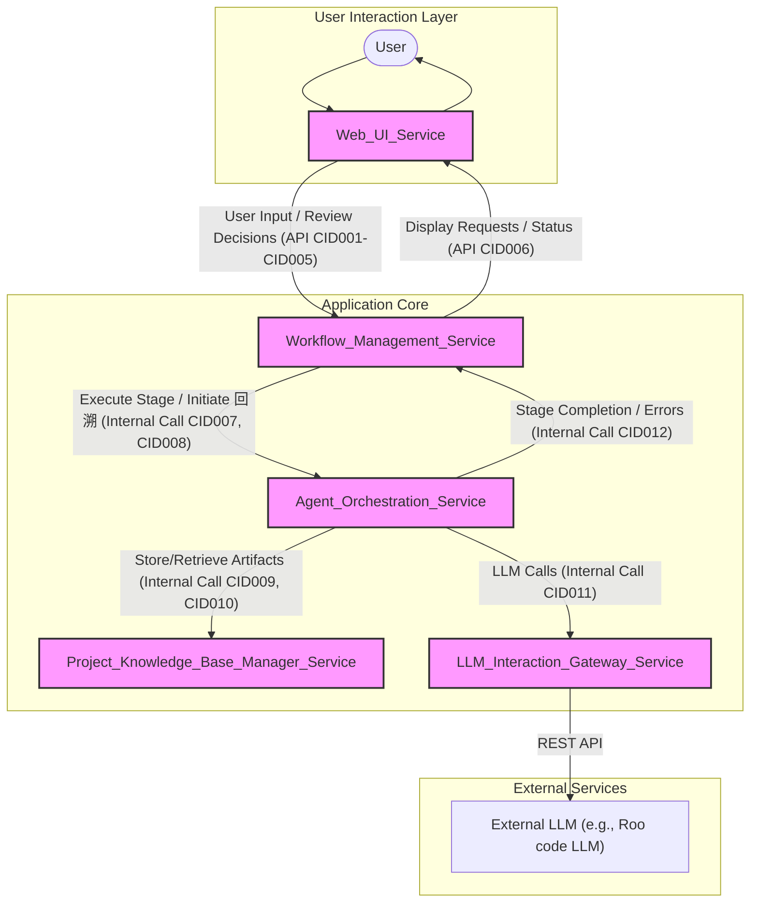

# 已完成阶段输出

3.  **0.3 初步需求意图识别Agent (Initial Intent Recognition Agent):**

{
  "intent": "define_software_development_automation_system",
  "entities": [
    "Multi-Agent System",
    "Software Development Lifecycle Automation",
    "Project Knowledge Base Manager (PKBM)",
    "Dynamic Knowledge Base",
    "Requirements Engineering (Gathering, Specification, User Stories, Acceptance Criteria)",
    "System Architecture Design (High-Level, Components, Interfaces)",
    "Detailed Design (API, Data Model, Logic)",
    "LLM-Assisted Code Generation & Modification",
    "Code Validation (Syntax, Static Analysis)",
    "AI-Powered Code Review",
    "Automated Test Case Generation",
    "Test Execution & Analysis",
    "Human-in-the-Loop Review & Approval Workflows",
    "Task Decomposition & Planning",
    "Version Control of Artifacts",
    "Automated Documentation (Code Comments, API Docs, README)",
    "Security Considerations Integration",
    "Iterative Development Cycle Management",
    "Knowledge Distillation & Process Improvement"
  ]
}

4.  **0.4 项目类型与技术栈引导Agent (Project Type & Tech Stack Elicitation Agent):**

{
  "document_id": "项目元数据 v1.0",
  "version": "1.0",
  "timestamp": "2023-10-27T11:00:00Z", // 实际应为当前时间
  "associated_intent_analysis": "初步意图分析 v1.0",
  "project_name": "多Agent软件开发自动化系统 (简化版)",
  "elicitation_method": "Agent-guided Q&A via User Interaction Proxy (Iterative Refinement)",
  "project_type_and_interaction": {
    "summary": "主要为后台运行的多Agent自动化系统，配备极简Web用户界面。",
    "details": "该系统核心是一系列后台Python Agent (基于AutoGen) 执行自动化软件开发任务，通过一个极简的Web界面（基于Flask）供用户进行人工审核、任务配置、查看流程状态和知识库内容。流程设计为线性流水线，简化回退和并发复杂性。",
    "question_ref": ["Q1", "Q6.1"],
    "user_answer_code": ["Q1:b", "Q6.1:c"]
  },
  "technology_stack_preferences": {
    "primary_programming_language": {
      "language": "Python",
      "reasoning": "AI/ML库丰富，社区支持广泛，适合快速原型和Agent开发。",
      "question_ref": "Q2",
      "user_answer_code": "a"
    },
    "agent_framework": {
      "framework": "AutoGen",
      "question_ref": "Q3 (original)",
      "user_answer_text": "Agent框架使用 AutoGen。"
    },
    "web_service_framework": {
      "framework": "Flask",
      "reasoning": "用户倾向于其极简和灵活性，适合快速搭建基础Web界面和API。",
      "question_ref": "Q3.1.A",
      "user_answer_code": "i"
    },
    "project_knowledge_base_manager_pkbm": {
      "type": "File-based Knowledge Base",
      "organization": "Specific directory structure with individual files for each artifact.",
      "information_linking": "Through filename and directory structure conventions.",
      "write_management": "Strictly serialized writes to the knowledge base.",
      "reasoning": "User preference for simplicity, minimal deployment/maintenance, and insensitivity to performance/efficiency for this aspect. Database systems (relational, graph, vector) are explicitly excluded.",
      "question_ref": ["Q4.1.A", "Q4.1.B", "Q4.1.C"],
      "user_answer_code": ["Q4.1.A:b", "Q4.1.B:a", "Q4.1.C:a"]
    },
    "llm_interaction": {
      "method": "Standard REST API calls via Web Service",
      "details": "LLM interaction integrated into the Flask web service, potentially for chat-like interfaces or CI workflows.",
      "question_ref": "Q5",
      "user_answer_code": "a"
    },
    "frontend_technology": {
      "approach": "AI-assisted design and generation, user review.",
      "style_complexity": "Minimalistic, focusing on basic operations, allowing for future modular expansion.",
      "performance_sensitivity": "Low",
      "question_ref": ["Q6 (original)", "Q6.1"],
      "user_answer_text": "Web前端不熟悉，AI设计编写，用户检查界面。我对性能和效率不敏感. 极简，仅满足基本操作即可。"
    }
  },
  "key_simplifications_and_constraints": [
    "PKBM is file-based, no traditional databases.",
    "Overall process is a linear pipeline.",
    "Reduced emphasis on efficiency and complex rollback mechanisms.",
    "Vector database functionality removed.",
    "Web UI is minimalistic."
  ],
  "open_questions_for_later_stages": [
    "Specific directory structure conventions for the file-based PKBM.",
    "Detailed definition of how AI will assist in frontend design and generation.",
    "Specific interaction patterns between Flask, AutoGen, and LLM APIs for workflows."
  ]
}

5.  **1.1 需求细节与边界条件挖掘Agent (Requirement Detail & Boundary Miner Agent):**

The following is the structured "需求澄清细节QA v1.0" document, based on your responses:

```json
{
  "document_id": "需求澄清细节QA v1.0",
  "version": "1.0",
  "timestamp": "2023-10-28T15:00:00Z", // Placeholder, actual timestamp would be generated
  "source_agent": "1.1 需求细节与边界条件挖掘Agent",
  "based_on_metadata": "项目元数据 v1.0",
  "based_on_intent_analysis": "初步意图分析 v1.0",
  "clarifications": [
    {
      "question_id": "QG1",
      "question_text": "当系统中的某个Agent在执行任务时遇到内部错误（例如，无法访问PKBM、LLM API调用失败、代码解析错误等），系统应如何响应？",
      "user_answer": "尝试自动重试3次，若仍然失败则记录错误并停止当前子任务，等待人工干预。"
    },
    {
      "question_id": "QG2",
      "question_text": "对于需要人工干预的错误，系统应如何通知用户？（例如，在Web界面显示错误信息？邮件通知？请考虑当前极简Web界面的设定）",
      "user_answer": "Web界面中应该有用户输入和Agent输出或者正在执行任务的记录，应该有类似输出错误的信息在Web界面上。"
    },
    {
      "question_id": "QG3",
      "question_text": "在多个Agent描述中都提到了“通过‘用户交互代理’（人工）向用户呈现这些问题/审核材料”。在当前的极简Web界面设想中，这具体是如何实现的？",
      "user_answer": "类似有个会话的界面，到需要用户输入的时候会先由代码而不是Agent输出信息让用户等待，此时代码那边也在等待，用户输入完了确认后发送给代码，代码会反馈给Agent。"
    },
    {
      "question_id": "QG4",
      "question_text": "当用户通过此代理提供回答或审核结果时，输入格式是否有特定要求？（例如，自由文本、选择题选项、特定格式的文本文件上传？）",
      "user_answer": "输入格式就是正常的文本字符串，和网页上聊天界面类似。"
    },
    {
      "question_id": "QG5",
      "question_text": "当PKBM中的信息（如需求规格说明书 v1.0）被后续流程修改（例如，人工审核驳回并要求修改），新版本应如何命名和存储以区分？",
      "user_answer": "当PKBM中的信息被后续流程修改，新版本应使用时间戳。"
    },
    {
      "question_id": "QG6",
      "question_text": "\"建立信息之间的关联\" 在文件系统中如何实现？",
      "user_answer": "同时使用特点目录结构和文件名关联。"
    },
    {
      "question_id": "QG7",
      "question_text": "除了明确提到Markdown或JSON的，其他存入PKBM的“结构化信息和文档”默认应是什么格式？",
      "user_answer": "纯文本TXT。"
    },
    {
      "question_id": "QG8",
      "question_text": "项目元数据提到“严格序列化写入知识库”。这是否意味着在任何时间点，只有一个Agent能够向PKBM写入，以避免文件冲突？",
      "user_answer": "在任何时间点，只有一个Agent能够向PKBM写入，以避免文件冲突。"
    },
    {
      "question_id": "QG9",
      "question_text": "PKBM的根目录结构是预定义的，还是在项目启动时由用户指定？",
      "user_answer": "PKBM的根目录结构是预定义的。"
    },
    {
      "question_id": "QG10",
      "question_text": "PKBM的“基于标签、关键词、关联性的精确信息检索服务”在文件系统中如何实现？",
      "user_answer": "Agent需要自行扫描文件名和部分文件内容（如元数据）来查找。"
    },
    {
      "question_id": "QG11",
      "question_text": "对于所有与LLM（如 \"Roo code LLM\"）的交互：a) 超时机制？ b) API密钥管理？ c) LLM返回非预期内容处理？",
      "user_answer": "重试3次，超时时长600秒。API密钥等敏感信息不需要考虑安全，直接在python文件中定义配置即可，都可以读取。对于LLM返回非预期内容（例如，格式错误、无关回答），Agent应重试三次，都错误就放弃 (Note: User later clarified that for Roo code LLM, human sees LLM errors, retries, then informs Agent system)."
    },
    {
      "question_id": "Q0.1.1",
      "question_text": "用户通过什么方式输入“原始自然语言需求文本”？",
      "user_answer": "用户通过 Web界面的一个文本区域 输入文本。"
    },
    {
      "question_id": "Q0.1.2",
      "question_text": "如果用户输入的文本为空或过短（例如，少于10个字符），系统应如何响应？",
      "user_answer": "提示错误信息并要求重新输入。"
    },
    {
      "question_id": "Q0.2.1",
      "question_text": "\"为每条信息打上标签...并记录版本和时间戳。\" 这些元数据是存储在文件名中，还是文件内容的特定部分？",
      "user_answer": "数据是存储在文件名。"
    },
    {
      "question_id": "Q0.3.1",
      "question_text": "如果Agent无法明确识别出核心意图或关键实体，它应该如何处理？",
      "user_answer": "输出空的或标记为“不确定”的分析报告，请人工反复交互修正到正确为止。"
    },
    {
      "question_id": "Q0.3.2",
      "question_text": "输出的初步分析报告中，\"核心意图\"的词汇表是预定义的，还是Agent动态生成的？",
      "user_answer": "是Agent动态生成的。"
    },
    {
      "question_id": "Q0.4.1",
      "question_text": "\"从PKBM调取项目历史信息（如果是已有项目）。\" 如何判断一个项目是“已有项目”？",
      "user_answer": "每个项目开始应该创建一个文件夹，开始时应该可以代码里手动设定使用文件夹，这个应该是配置而不是Agent做的。"
    },
    {
      "question_id": "Q0.4.2",
      "question_text": "生成的“针对性的问题”的来源是什么？",
      "user_answer": "Agent会动态生成问题，这一步我只能依赖Agent本身能力了，后续本项目改进时我预期会加入多Agent协作，Agent之间都生成问题后由Agent互相审阅。"
    },
    {
      "question_id": "Q0.4.3",
      "question_text": "如果用户对某些技术栈问题回答“不确定”或“由系统推荐”，Agent应如何处理？",
      "user_answer": "如果用户对某些技术栈问题回答“不确定”或“由系统推荐”，Agent 标记为待后续“技术选型建议Agent”在阶段二处理。"
    },
    {
      "question_id": "Q1.2.1",
      "question_text": "用户故事的INVEST原则中，“小的 (Small)” 和 “可估计的 (Estimable)” 如何界定？",
      "user_answer": "一个用户故事理想的工作量是否应控制在3个开发日内。"
    },
    {
      "question_id": "Q1.2.2",
      "question_text": "如果澄清后的需求细节非常庞大或复杂，导致难以生成符合INVEST原则的单个用户故事，Agent应如何处理？",
      "user_answer": "如果澄清后的需求细节非常庞大或复杂，导致难以生成符合INVEST原则的单个用户故事，Agent应和用户汇报，如果用户可以接受则默认这个可以。"
    },
    {
      "question_id": "Q1.2.3",
      "question_text": "用户故事中的 \"[type of user]\" 是从哪里获取的？",
      "user_answer": "用户故事中的 \"[type of user]\" 是从LLM从用户需求中理解生成的。"
    },
    {
      "question_id": "Q1.3.1",
      "question_text": "Gherkin格式 (Given-When-Then) 是强制的，还是仅为推荐？其他格式要求？",
      "user_answer": "不是强制的，是推荐的，不过部分Agent可能会强制要求结构化输出，不然代码获取输出时会有问题。"
    },
    {
      "question_id": "Q1.3.2",
      "question_text": "SMART原则中的“有时间限制的 (Time-bound)” 在此阶段如何体现？",
      "user_answer": "暂时忽略。"
    },
    {
      "question_id": "Q1.3.3",
      "question_text": "如果一个用户故事的某些方面难以量化或制定非常具体的验收标准，Agent应如何处理？",
      "user_answer": "如果一个用户故事的某些方面难以量化或制定非常具体的验收标准，Agent应给出推荐并询问用户是否满意。"
    },
    {
      "question_id": "Q1.4.1",
      "question_text": "需求规格说明书的引言部分（项目目标简述）是Agent自动从已有信息生成，还是需要用户提供？",
      "user_answer": "需求规格说明书的引言部分（项目目标简述）是Agent自动从已有信息生成。"
    },
    {
      "question_id": "Q1.4.2",
      "question_text": "输出文档格式，Markdown或PDF？",
      "user_answer": "输出文档格式用Markdown。"
    },
    {
      "question_id": "Q1.5.1",
      "question_text": "\"准备审核材料包\"。除了需求规格说明书，还应包含哪些辅助材料？",
      "user_answer": "需求规格说明书，还应包含原始需求文本的文件路径、初步意图分析报告原始需求文本的文件路径。"
    },
    {
      "question_id": "Q1.5.2",
      "question_text": "如果审核被“驳回”，修改意见的格式是否有要求？",
      "user_answer": "如果审核被“驳回”，修改意见的格式没有要求。"
    },
    {
      "question_id": "Q1.5.3",
      "question_text": "\"根据反馈内容，决定是将任务重新路由回...\" 这个决定逻辑是内置在协调Agent中，还是需要人工指定？",
      "user_answer": "这个决定逻辑是内置在协调Agent中。"
    },
    {
      "question_id": "Q2.1.1",
      "question_text": "如果项目元数据中技术栈已明确，但Agent分析需求后认为现有技术栈可能不完全适合新需求，它应该如何处理？",
      "user_answer": "提出警告或建议，并解释原因。"
    },
    {
      "question_id": "Q2.1.2",
      "question_text": "生成的“2-3个候选技术栈”从何而来？",
      "user_answer": "调用LLM并提供上下文，我理解中Agent应该基本都要用LLM。"
    },
    {
      "question_id": "Q2.1.3",
      "question_text": "\"优缺点分析、适用场景以及与项目需求的匹配度说明\" 的详细程度如何？",
      "user_answer": "详细程度是详细段落。"
    },
    {
      "question_id": "Q2.2.1",
      "question_text": "\"识别出系统需要的主要高层模块/服务/组件\"。识别的依据和粒度是什么？组件职责描述的详细程度如何？",
      "user_answer": "这一步我更倾向依赖LLM，至于代码设计规范我会存储在一个文件里，包括设计要求和代码要求，这个会通过读取文件作为很多步骤中Prompt的一部分。组件职责描述的详细程度包含主要功能点列表。"
    },
    {
      "question_id": "Q2.3.1",
      "question_text": "\"仅关注接口名称、主要参数和预期返回类型，无需详细数据结构。\" “主要参数”如何界定？对于REST API，是否包括HTTP方法？",
      "user_answer": "对于REST API，包括HTTP方法。"
    },
    {
      "question_id": "Q2.3.2",
      "question_text": "如果组件间的交互模式除了请求/响应外，还可能涉及事件驱动或消息队列，此Agent是否会考虑？",
      "user_answer": "此Agent应该考虑。"
    },
    {
      "question_id": "Q2.4.1",
      "question_text": "生成的“自然语言描述”的目标受众是谁？",
      "user_answer": "生成的“自然语言描述”的目标受众是技术人员，需要用mermaid图说明。"
    },
    {
      "question_id": "Q2.4.2",
      "question_text": "对于PlantUML/Mermaid等图表描述，如果生成，其详细程度如何？",
      "user_answer": "Mermaid图包括组件连接接口名。"
    },
    {
      "question_id": "Q2.5.1",
      "question_text": "“技术选型及其理由”部分，如果技术选型是在早期（0.4）已完全确定，这里的理由是复述还是可以省略/简化？",
      "user_answer": "如果技术选型是在早期（0.4）已完全确定，这里的理由是复述。"
    },
    {
      "question_id": "Q2.6",
      "question_text": "人工审核点2协调Agent: 审核材料、反馈格式、回溯决策逻辑是否与人工审核点1类似？",
      "user_answer": "是的 (implied by user not correcting the assumption)."
    },
    {
      "question_id": "Q2.7.1",
      "question_text": "\"将大的功能点或组件实现进一步分解为更小的、可独立开发和测试的编码子任务。\" 分解的粒度标准是什么？",
      "user_answer": "分解的粒度标准是 一个子任务对应一个类。"
    },
    {
      "question_id": "Q2.7.2",
      "question_text": "产出描述的格式和详细程度如何？",
      "user_answer": "产出描述的格式暂时认为应该是JSON格式的，我预期可以尽可能细致。"
    },
    {
      "question_id": "Q2.8.1",
      "question_text": "如果在分析子任务时发现潜在的循环依赖，Agent如何处理？",
      "user_answer": "Agent报错并请求人工介入。"
    },
    {
      "question_id": "Q2.8.2",
      "question_text": "\"输出带有依赖关系和建议执行顺序的编码任务计划\"。计划的格式是什么？",
      "user_answer": "建议按照JSON格式输出，例如，JSON列表，每个任务包含ID、描述、依赖项ID列表、优先级，具体因为我还没规划好。"
    },
    {
      "question_id": "Q3.1.1",
      "question_text": "\"（如果是修改任务）现有代码库中相关的代码片段或文件结构...\" 人工如何提供这些信息？",
      "user_answer": "人工会web上粘贴代码片段。"
    },
    {
      "question_id": "Q3.2.1",
      "question_text": "JSON/XML Schema的详细程度如何？",
      "user_answer": "JSON/XML Schema的详细程度需要包含所有字段的类型、是否必需、示例值等。"
    },
    {
      "question_id": "Q3.2.2",
      "question_text": "\"认证和授权机制说明\"。是引用项目级的通用机制，还是需要为特定API端点详细说明？",
      "user_answer": "我倾向不认证，我会只在绝对安全的环境执行。"
    },
    {
      "question_id": "Q3.3.1",
      "question_text": "数据模型详细设计 (文件型PKBM): a) 数据文件格式? b) Schema定义? c) 文件命名/组织?",
      "user_answer": "PKBM是文件型的，每个项目应该会创建一个文件夹，子文件夹下对应每个阶段输出的内容、当前代码的镜像，应该预期会有一个或者多个Agent在需要调用PKBM时遍历所有文件后，给出准确的路径以及文件内容概述说明，然后会有Agent LLM根据现在需求分析需要哪些文件，格式化输出后，代码会获取对应路径文件全文提供给所需要的Agent。"
    },
    {
      "question_id": "Q3.4.1",
      "question_text": "\"用伪代码或详细的步骤描述其核心实现逻辑\"。偏好？详细程度？",
      "user_answer": "偏向伪代码，伪代码不需要特别详细，逻辑全部清晰即可，不要有逻辑可能存在歧义的点。"
    },
    {
      "question_id": "Q3.5.1",
      "question_text": "\"编码规范中关于结构的部分\"具体指什么？",
      "user_answer": "“编码规范中关于结构的部分”应该只是很粗略的代码架构规范，不会具体指定结构。"
    },
    {
      "question_id": "Q3.6.1",
      "question_text": "\"从PKBM调取项目安全规范、已知的安全漏洞模式...\" 这些规范和模式是项目启动时提供的，还是Agent有能力从通用知识库中获取？",
      "user_answer": "不需要考虑安全性，优先保证代码稳定运行且达到用户预期。"
    },
    {
      "question_id": "Q3.6.2",
      "question_text": "安全检查点的详细程度如何？",
      "user_answer": "不需要考虑安全性，优先保证代码稳定运行且达到用户预期。"
    },
    {
      "question_id": "Q3.7.1",
      "question_text": "\"如果修改，必须提供原始代码的精确片段...\" 这个获取过程是怎样的？",
      "user_answer": "这个获取过程预期是结构化输出代码原文路径，然后对应代码命令会查看代码文件并把它作为结构化输入prompt中的一部分。执行错误将会人工查询LLM输出对应所有代码原文路径并人工web粘贴代码。"
    },
    {
      "question_id": "Q3.7.2",
      "question_text": "\"包含所有必要的类名、函数签名、变量名约定。\" 这些命名约定是来自编码规范，还是在此阶段可以由Agent建议，然后人工审核？",
      "user_answer": "命名的规范需要遵守编码规范，但是此阶段Agent可以提出具体的建议，然后人工审核。"
    },
    {
      "question_id": "Q3.7.3",
      "question_text": "\"提供必要的上下文代码片段...\" 这个上下文的范围如何确定？",
      "user_answer": "这个上下文的范围就是所有涉及到会用到的函数和类，直接提供所在代码文件的全文。这样可以最大程度保证LLM能理解这个文件的全部含义。"
    },
    {
      "question_id": "Q3.8",
      "question_text": "人工审核点3协调Agent: 审核材料、反馈格式、回溯决策逻辑是否与人工审核点1类似？",
      "user_answer": "是的 (implied by user not correcting the assumption)."
    },
    {
      "question_id": "Q4.1.1",
      "question_text": "对于手动交互点（复制指令给LLM，粘贴代码回来）：a) UI支持？ b) 代码提交方式？",
      "user_answer": "a) Web界面预期应该有一个文本框显示指令，旁边有一个“复制”按钮。 b) 获取代码后，用户是粘贴回Web界面的另一个文本框。"
    },
    {
      "question_id": "Q4.1.2",
      "question_text": "如果Roo code LLM返回的是错误信息或指示生成失败，协调Agent如何记录，并引导下一步？",
      "user_answer": "这个信息Agent看不到，只有人能看到，人会尝试Retry后不行就会告诉LLM Agent有错误信息。"
    },
    {
      "question_id": "Q4.2.1",
      "question_text": "使用的Linter及其规则集是如何配置的？",
      "user_answer": "应该是项目元数据的一部分，Agent根据语言自动选择默认配置。"
    },
    {
      "question_id": "Q4.2.2",
      "question_text": "\"尝试自动修复简单的格式问题。\" 这个修复是强制执行的，还是会先展示给用户确认？",
      "user_answer": "这个应该是要给用户确认，并且输出成Prompt让Roo code插件的LLM去做修改。"
    },
    {
      "question_id": "Q4.2.3",
      "question_text": "\"如果存在严重语法错误导致无法进行后续步骤...\" 此时是否会自动回溯到指令生成，还是需要人工决定？",
      "user_answer": "需要人工决定是否自动回溯到指令生成。"
    },
    {
      "question_id": "Q4.3.1",
      "question_text": "\"项目配置的静态分析规则集\" 如何定义和提供？",
      "user_answer": "应该是项目元数据的一部分，Agent根据语言自动选择默认配置。"
    },
    {
      "question_id": "Q4.3.2",
      "question_text": "分析报告的格式是什么？",
      "user_answer": "分析报告的格式是纯文本，为了输出成Prompt让Roo code插件的LLM去做修改。"
    },
    {
      "question_id": "Q5.1.1",
      "question_text": "\"性能初步评估：是否存在明显的性能瓶颈\"。AI审查员进行此评估的依据和严格程度如何？",
      "user_answer": "AI审查员进行此评估的依据是简单的复杂度分析，鉴于项目元数据中提到对性能不敏感，此项的严格程度很低。"
    },
    {
      "question_id": "Q5.1.2",
      "question_text": "AI代码审查报告的格式和详细程度如何？",
      "user_answer": "AI代码审查报告的格式和详细程度是问题列表，每个问题包含位置、描述、建议、严重性。"
    },
    {
      "question_id": "Q5.2.1",
      "question_text": "如果人工选择“直接手动修改代码并提交修改后版本”，修改后的代码如何提交回系统？",
      "user_answer": "我感觉不应该人工手动修改，如果真的有那应该说明改动涉及到的文件 ，然后请Agent更新PKBM。"
    },
    {
      "question_id": "Q5.2.2",
      "question_text": "\"决定是重新生成指令...或由AI代码审查员Agent尝试根据反馈生成修复建议。\" 这个决策逻辑是人工指定，还是协调Agent内置的？",
      "user_answer": "是Agent对应的LLM给出建议意见，询问人工是否要执行什么步骤。"
    },
    {
      "question_id": "Q5.3.1",
      "question_text": "\"项目使用的测试框架信息和测试编码规范\" 从何处获取？",
      "user_answer": "是需要本阶段Agent根据元数据和需求信息、源码生成的。"
    },
    {
      "question_id": "Q5.3.2",
      "question_text": "生成的测试用例覆盖率目标是什么？",
      "user_answer": "生成的测试用例覆盖率目标尽力而为即可，完全依赖LLM本身能力。"
    },
    {
      "question_id": "Q5.3.3",
      "question_text": "对于需要mock或stub外部依赖的测试，Agent如何处理？",
      "user_answer": "Agent忽视这些测试。"
    },
    {
      "question_id": "Q5.4.1",
      "question_text": "对于手动交互点（集成和运行单元测试）：a) \"协助\"和\"指导\"具体指什么？ b) 用户如何提供“测试执行结果”？",
      "user_answer": "a) 应该是给出可以保证Roocode插件中的LLM基本不会误修改的Prompt，自动写入用户本地代码。 b) 用户在web对话页面的输入框提供“测试执行结果”。"
    },
    {
      "question_id": "Q5.5.1",
      "question_text": "\"尝试将错误定位到被测代码或测试用例代码的具体行号。\" 这个定位的准确性有多大预期？",
      "user_answer": "这个定位不需要特别准确，因为错误也会反馈给其他LLM，其他LLM会根据源码文件和Prompt重新分析。"
    },
    {
      "question_id": "Q5.5.2",
      "question_text": "\"生成一份调试分析报告\"。报告的格式和内容具体包括哪些？",
      "user_answer": "报告的就是markdown，包含错误具体信息代码片段和分析内容和初步分析即可。"
    },
    {
      "question_id": "Q5.6",
      "question_text": "人工审核点5协调Agent: 审核材料、反馈格式、回溯决策逻辑是否与人工审核点1类似？",
      "user_answer": "是的 (implied by user not correcting the assumption)."
    },
    {
      "question_id": "Q5.6.1",
      "question_text": "\"如果需要回溯设计：在PKBM中记录问题，并通知中央协调器进行流程回溯。\" 这个“中央协调器”是哪个Agent，或者说，这个回溯是如何触发和管理的？",
      "user_answer": "这个“中央协调器”是应该是一个专用的协调流程的Agent。或者说，这个回溯是结构化输出里有说明当前的问题，错误点，并且结构化输出里应该有类似说明需要回溯，调用中央控制器Agent名，然后代码会传输输出信息和项目文档给中央控制器由中央控制器判断。这意味着当前子任务序列被暂停，流程跳回至指定的早期Agent。"
    },
    {
      "question_id": "Q5.7.1",
      "question_text": "生成的修复指令的详细程度是否与3.7中的初始代码生成指令的要求相同？",
      "user_answer": "生成的修复指令的详细程度与3.7中的初始代码生成指令的要求（极其具体、包含完整上下文等）相同。"
    },
    {
      "question_id": "Q6.1.1",
      "question_text": "\"如果所有前置依赖任务也都“测试通过”...\" 这个检查逻辑是否也考虑了任务计划中的并行分组？",
      "user_answer": "任务不可以并行执行， 同时只能有一个任务。这个检查逻辑是否也考虑了任务计划中的逻辑，也就是全部都完成通过才可以最后开始集成。"
    },
    {
      "question_id": "Q6.2.1",
      "question_text": "对于手动交互点（代码合并和冲突解决）：a) \"协助\"具体指什么？ b) 集成操作日志应记录哪些具体信息？",
      "user_answer": "a) \"协助\"具体指 给用户操作说明，并提供标准的git命令序列建议。 b) 集成操作日志应记录合并的分支、提交哈希、合并的文件列表、冲突解决的摘要。"
    },
    {
      "question_id": "Q6.3.1",
      "question_text": "\"项目构建脚本...和构建说明\" 从何处获取？",
      "user_answer": "这个是存储在PKBM的，应该预期会有专门的Agent会基于最新代码做调试并输出正式内容存在PKBM里面。"
    },
    {
      "question_id": "Q6.3.2",
      "question_text": "\"冒烟测试计划\" 是如何定义的？",
      "user_answer": "预期会有专门的Agent会基于最新代码做调试并输出给出冒烟测试计划。"
    },
    {
      "question_id": "Q6.3.3",
      "question_text": "构建和冒烟测试结果如何收集？",
      "user_answer": "用户会在web界面上文本框内输入冒烟测试输出的所有信息。"
    },
    {
      "question_id": "Q6.4.1",
      "question_text": "注释的风格和详细程度是否有特定要求，需要遵循项目编码规范中关于注释的部分？",
      "user_answer": "注释的风格和详细程度有特定要求，在用户自定的编码规范中会有对应的说明。"
    },
    {
      "question_id": "Q6.4.2",
      "question_text": "\"[手动交互点] 协助用户将这些注释应用到实际代码中。\" 如何协助？",
      "user_answer": "会提供一个非常专业的Prompt指导Roocode这个插件中的LLM只添加注释。"
    },
    {
      "question_id": "Q6.5.1",
      "question_text": "API文档的格式是什么？",
      "user_answer": "API文档的格式是Markdown格式的API描述。"
    },
    {
      "question_id": "Q6.5.2",
      "question_text": "Changelog条目的格式和内容标准是什么？",
      "user_answer": "Changelog条目的格式和内容标准是遵循Keep a Changelog的格式，包含关联的用户故事ID或任务ID。"
    },
    {
      "question_id": "Q6.6",
      "question_text": "人工审核点6协调Agent: 审核材料、反馈格式、回溯决策逻辑是否与人工审核点1类似？",
      "user_answer": "是的 (implied by user not correcting the assumption)."
    },
    {
      "question_id": "Q6.6.1",
      "question_text": "如果“附条件批准”，这些条件如何记录和跟踪？",
      "user_answer": "应该去除附条件批准，若不通过直接走小型迭代或问题修复流程。"
    },
    {
      "question_id": "Q6.7.1",
      "question_text": "\"每个阶段LLM Agent的表现\"。衡量表现的指标是什么？",
      "user_answer": "暂定是：初稿通过率、人工修改的幅度、生成内容与需求的符合度的主观评分。"
    },
    {
      "question_id": "Q6.7.2",
      "question_text": "\"从本次项目中可以提炼出的可复用知识/模式\"。这些知识以什么格式存储，以便未来使用？",
      "user_answer": "这些知识更新或新增到PKBM中的一个专门的“最佳实践/Prompt库”部分，以纯文本笔记记录。"
    },
    {
      "question_id": "Q6.7.3",
      "question_text": "此Agent是项目成功结束后一次性运行，还是可以在项目的特定主要里程碑后运行？",
      "user_answer": "此Agent是项目成功结束后或者在项目的特定主要里程碑如 完成一个主要功能模块的交付后运行，以进行阶段性总结和学习。"
    }
  ]
}
```

6.  **1.2 用户故事生成Agent (User Story Generation Agent):**

**输出用户故事列表 (User Story Set v1.0):**

```json
{
  "document_id": "UserStorySet_v1.0",
  "version": "1.0",
  "timestamp": "CURRENT_TIMESTAMP",
  "generated_by": "1.2 User Story Generation Agent",
  "stories": [
    {
      "id": "US001",
      "user_type": "Developer",
      "action": "input my raw natural language software requirements via a web interface text area",
      "benefit": "the system can capture and store them accurately for initial processing.",
      "notes": "Corresponds to Agent 0.1. Input validation for empty/short text needed (Q0.1.2)."
    },
    {
      "id": "US002",
      "user_type": "System",
      "action": "store any received document or structured information in a file-based Project Knowledge Base (PKBM) using predefined directory structures and naming conventions that include version (timestamp) and descriptive tags in the filename",
      "benefit": "all agents have a consistent, versioned, and retrievable source of project artifacts.",
      "notes": "Core PKBM functionality (Agent 0.2). Covers QG5, QG6, QG7, Q0.2.1. Write access is serialized (QG8)."
    },
    {
      "id": "US003",
      "user_type": "Developer",
      "action": "have the system automatically analyze my raw requirements to identify core intent (e.g., 'create_feature') and key entities (e.g., 'user_login')",
      "benefit": "I get a preliminary structured understanding of my request, which is stored in PKBM.",
      "notes": "Corresponds to Agent 0.3. Handles uncertainty by asking for clarification (Q0.3.1)."
    },
    {
      "id": "US004",
      "user_type": "Developer",
      "action": "be prompted by the system with targeted questions to define or confirm the project type, primary programming language, and core frameworks/libraries",
      "benefit": "the system establishes essential project metadata for subsequent planning and design, storing it in PKBM.",
      "notes": "Corresponds to Agent 0.4. Handles 'not sure' answers by deferring to later agents (Q0.4.3). Project history for existing projects determined by pre-configured folder (Q0.4.1)."
    },
    {
      "id": "US005",
      "user_type": "Developer",
      "action": "be asked by the system, through the web interface, specific questions to clarify details, non-functional requirements (NFRs), boundary conditions, user scenarios, expected behaviors, and error handling for each part of my initial request",
      "benefit": "all ambiguities are resolved, and the detailed Q&A is stored in PKBM for future reference.",
      "notes": "Corresponds to Agent 1.1. Covers general error handling (QG1, QG2) and user interaction (QG3, QG4)."
    },
    {
      "id": "US006",
      "user_type": "Developer",
      "action": "have the system automatically transform the clarified requirements into a list of user stories following the 'As a [user type], I want [action] so that [benefit]' template",
      "benefit": "I receive a structured set of requirements that adhere to INVEST principles, stored in PKBM.",
      "notes": "Corresponds to Agent 1.2 (this agent). User type in story from LLM (Q1.2.3). Handles large stories by reporting (Q1.2.2)."
    },
    {
      "id": "US007",
      "user_type": "Developer",
      "action": "have the system define detailed acceptance criteria (preferably in Gherkin Given-When-Then format, but other clear, verifiable conditions are acceptable) for each generated user story",
      "benefit": "each user story has clear, measurable, and testable completion conditions, stored in PKBM and linked to stories.",
      "notes": "Corresponds to Agent 1.3. Gherkin is recommended (Q1.3.1). SMART's Time-bound ignored for now (Q1.3.2). Handles unquantifiable ACs by recommending and asking (Q1.3.3)."
    },
    {
      "id": "US008",
      "user_type": "Developer",
      "action": "have the system compile the user stories and their corresponding acceptance criteria into a unified Requirements Specification Document (Markdown format)",
      "benefit": "I have a comprehensive and reviewable specification document, including an auto-generated introduction, stored in PKBM.",
      "notes": "Corresponds to Agent 1.4. Intro is auto-generated (Q1.4.1). Markdown format (Q1.4.2)."
    },
    {
      "id": "US009",
      "user_type": "Developer",
      "action": "be presented with the Requirements Specification Document along with relevant source documents (paths to original request, intent analysis) via the web interface for my review and approval or rejection (with feedback)",
      "benefit": "I can ensure the specification's accuracy and completeness before architectural design begins.",
      "notes": "Corresponds to Agent 1.5. Feedback format is free text (Q1.5.2). Rerouting logic is in agent (Q1.5.3)."
    },
    {
      "id": "US010",
      "user_type": "Developer",
      "action": "receive 2-3 candidate technology stack suggestions (language, framework, DB, key libraries) with pros/cons and suitability analysis if my project's tech stack is initially undefined or if new requirements suggest a review",
      "benefit": "I can make an informed decision on the technology stack, which is then updated in PKBM's project metadata.",
      "notes": "Corresponds to Agent 2.1. Warns if existing stack is unsuitable (Q2.1.1). Suggestions from LLM (Q2.1.2). Detailed analysis (Q2.1.3)."
    },
    {
      "id": "US011",
      "user_type": "Developer",
      "action": "have the system identify and define the major high-level modules/services/components required for the project, along with their core responsibilities (as a list of main features)",
      "benefit": "a foundational architectural structure is proposed, based on requirements and chosen tech stack, and stored in PKBM.",
      "notes": "Corresponds to Agent 2.2. Granularity and detail based on LLM and design guidelines (Q2.2.1)."
    },
    {
      "id": "US012",
      "user_type": "Developer",
      "action": "have the system draft preliminary interface definitions (e.g., REST API endpoints with HTTP methods, function signatures, message queue topics/formats) between interacting high-level components",
      "benefit": "the initial communication pathways and contracts between components are outlined, stored in PKBM.",
      "notes": "Corresponds to Agent 2.3. Includes HTTP methods for REST (Q2.3.1). Considers event-driven patterns (Q2.3.2)."
    },
    {
      "id": "US013",
      "user_type": "Developer",
      "action": "have the system generate a natural language description and a Mermaid diagram (showing components, connections, interface names) representing the high-level system architecture",
      "benefit": "I can visualize and understand the proposed system architecture, and this description is stored in PKBM.",
      "notes": "Corresponds to Agent 2.4. Mermaid diagram for technical audience (Q2.4.1, Q2.4.2)."
    },
    {
      "id": "US014",
      "user_type": "Developer",
      "action": "have the system compile the confirmed technology stack, high-level component definitions, interface drafts, and architecture diagram description into a High-Level Architecture Design Document",
      "benefit": "I receive a consolidated document detailing the proposed architecture, stored in PKBM.",
      "notes": "Corresponds to Agent 2.5. Tech stack rationale is复述 (Q2.5.1)."
    },
    {
      "id": "US015",
      "user_type": "Developer",
      "action": "be presented with the High-Level Architecture Design Document for my review and approval or rejection (with feedback) via the web interface",
      "benefit": "I can validate the architectural design's soundness and suitability before detailed design and task breakdown.",
      "notes": "Corresponds to Agent 2.6. Similar review process to US009 (Q2.6)."
    },
    {
      "id": "US016",
      "user_type": "Developer",
      "action": "have the system break down each approved user story/feature into smaller, independently developable and testable coding sub-tasks (granularity: one sub-task per class to be implemented/modified)",
      "benefit": "large features are decomposed into manageable units of work, with each sub-task's goal and expected output (JSON format) defined and stored in PKBM.",
      "notes": "Corresponds to Agent 2.7. Granularity is one class per sub-task (Q2.7.1). Output is detailed JSON (Q2.7.2)."
    },
    {
      "id": "US017",
      "user_type": "Developer",
      "action": "have the system analyze logical dependencies between coding sub-tasks and generate an ordered development plan (e.g., JSON list with IDs, descriptions, dependencies, priorities)",
      "benefit": "a clear and sequenced plan for development is established, stored in PKBM, ensuring tasks are tackled in a logical order.",
      "notes": "Corresponds to Agent 2.8. Handles circular dependencies by erroring and requesting manual intervention (Q2.8.1). Output is JSON (Q2.8.2). Tasks are sequential (Q6.1.1)."
    },
    {
      "id": "US018",
      "user_type": "System",
      "action": "prepare a complete context package for each coding sub-task by retrieving related user stories, acceptance criteria, relevant architecture (component/interface definitions), project metadata (tech stack, coding/design guidelines from PKBM), and any existing relevant code snippets (pasted by user for modification tasks)",
      "benefit": "subsequent detailed design agents receive all necessary information to perform their specific design tasks for the current sub-task.",
      "notes": "Corresponds to Agent 3.1. Existing code provided via web paste (Q3.1.1)."
    },
    {
      "id": "US019",
      "user_type": "Developer",
      "action": "have the system perform detailed API design for sub-tasks involving APIs, specifying precise URLs, HTTP methods, headers, path/query parameters, and detailed request/response body JSON schemas (including field types, necessity, examples) for various status codes",
      "benefit": "a comprehensive API specification is created for the sub-task, stored in PKBM, guiding implementation.",
      "notes": "Corresponds to Agent 3.2. JSON Schema detail (Q3.2.1). Authentication/Authorization not considered for now (Q3.2.2)."
    },
    {
      "id": "US020",
      "user_type": "Developer",
      "action": "have the system perform detailed data model design for sub-tasks involving data persistence or complex structures, defining data file formats, schemas, and file/organization within the PKBM's file-based system if applicable, or class/object properties and types for in-memory structures",
      "benefit": "a clear data structure or persistence plan is established for the sub-task, stored in PKBM.",
      "notes": "Corresponds to Agent 3.3. For PKBM, this means defining how information is structured in files (Q3.3.1)."
    },
    {
      "id": "US021",
      "user_type": "Developer",
      "action": "have the system design class and function logic for sub-tasks, defining responsibilities, public interfaces (method signatures), and core implementation logic using unambiguous pseudocode or detailed steps covering algorithms, conditions, loops, and error handling",
      "benefit": "the internal logic of classes and functions is clearly outlined before coding, stored in PKBM.",
      "notes": "Corresponds to Agent 3.4. Prefers pseudocode, logically complete (Q3.4.1)."
    },
    {
      "id": "US022",
      "user_type": "Developer",
      "action": "have the system plan the file and directory structure for new or modified code related to a sub-task, ensuring compliance with project best practices and coarse-grained coding/architecture guidelines from PKBM",
      "benefit": "code organization is determined upfront, promoting consistency, and the plan is stored in PKBM.",
      "notes": "Corresponds to Agent 3.5. Guidelines are coarse (Q3.5.1)."
    },
    {
      "id": "US023",
      "user_type": "Developer",
      "action": "have the system perform a basic review of the sub-task's design for any obvious security missteps, focusing on ensuring code stability and meeting user expectations rather than comprehensive security hardening",
      "benefit": "a minimal check is done as a reminder, even if security is not a primary project focus, with findings stored in PKBM.",
      "notes": "Corresponds to Agent 3.6. Security is low priority (Q3.6.1, Q3.6.2)."
    },
    {
      "id": "US024",
      "user_type": "Developer",
      "action": "have the system aggregate all detailed designs (API, data, logic, file structure, security considerations) for a sub-task into a comprehensive 'Code Implementation Guide' and generate an extremely specific, context-rich prompt text for an external code generation LLM (Roo code LLM)",
      "benefit": "a complete guide for coding is created, and a high-quality prompt is ready for the LLM, maximizing the chance of correct code generation. Both are stored in PKBM.",
      "notes": "Corresponds to Agent 3.7. Prompt includes original code for modifications (from web paste or file path Q3.7.1), naming conventions (from spec + agent suggestions Q3.7.2), full file context for relevant files (Q3.7.3)."
    },
    {
      "id": "US025",
      "user_type": "Developer",
      "action": "be presented with the 'Code Implementation Guide' and the generated LLM prompt text for my review and approval or rejection (with feedback) via the web interface",
      "benefit": "I can ensure the LLM prompt is clear, complete, and accurately reflects all design requirements before code generation.",
      "notes": "Corresponds to Agent 3.8. Similar review process to US009 (Q3.8)."
    },
    {
      "id": "US026",
      "user_type": "Developer",
      "action": "use the web interface to copy the approved LLM prompt, paste it into the external 'Roo code LLM', and then paste the LLM's generated code (or error message if LLM fails) back into the web interface",
      "benefit": "I can leverage the external LLM for code generation/modification, and its raw output is captured by the system in PKBM.",
      "notes": "Corresponds to Agent 4.1. UI support for copy/paste (Q4.1.1). Human handles LLM errors and retries before informing system (Q4.1.2)."
    },
    {
      "id": "US027",
      "user_type": "Developer",
      "action": "have the system perform basic syntax and formatting checks on the LLM-generated code using a linter (selected based on project language in metadata) and allow me to confirm any auto-suggested simple formatting fixes (which would then be formulated as a new prompt for the LLM to apply)",
      "benefit": "the generated code is validated for basic correctness and adherence to formatting standards, with results and potentially formatted code stored in PKBM.",
      "notes": "Corresponds to Agent 4.2. Linter config from metadata (Q4.2.1). Auto-fixes confirmed by user and applied via LLM (Q4.2.2). Human decides on回溯 for severe errors (Q4.2.3)."
    },
    {
      "id": "US028",
      "user_type": "Developer",
      "action": "have the system run static analysis tools on the (syntax-checked and formatted) code using a default ruleset (based on project language in metadata) to identify potential bugs, code smells, and simple security vulnerabilities",
      "benefit": "deeper code quality issues are identified, and a plain text report is generated (for LLM consumption) and stored in PKBM.",
      "notes": "Corresponds to Agent 4.3. Ruleset from metadata (Q4.3.1). Report is plain text for LLM (Q4.3.2)."
    },
    {
      "id": "US029",
      "user_type": "Developer",
      "action": "have an AI Code Reviewer agent analyze the code against the 'Implementation Guide', coding规范, and static analysis report, checking for functional conformity, design adherence, readability, error handling, and basic performance/security points",
      "benefit": "I receive an automated code review report (list of issues with location, description, suggestion, severity) highlighting potential issues beyond static analysis, stored in PKBM.",
      "notes": "Corresponds to Agent 5.1. Performance check is low-strictness (Q5.1.1). Report is a list of issues (Q5.1.2)."
    },
    {
      "id": "US030",
      "user_type": "Developer",
      "action": "be presented with the code, static analysis report, and AI code review report via the web interface for my review and decision (approve for testing, or reject with feedback on what to fix)",
      "benefit": "I can make an informed decision on code quality, leveraging AI insights, before proceeding to testing.",
      "notes": "Corresponds to Agent 5.2. No direct manual code modification by user in system; if changes needed, agent is asked to update PKBM (Q5.2.1). LLM suggests next steps on rejection (Q5.2.2)."
    },
    {
      "id": "US031",
      "user_type": "Developer",
      "action": "have the system generate unit test case code (for the project's testing framework, based on metadata/source) covering normal paths, boundary conditions, and expected error handling for the approved code of a sub-task, based on its 'Implementation Guide' (especially ACs) and detailed designs",
      "benefit": "test coverage is automatically generated, aiming for good practice but best-effort based on LLM, and test code is stored in PKBM.",
      "notes": "Corresponds to Agent 5.3. Test framework info generated by agent (Q5.3.1). Coverage is best-effort (Q5.3.2). Mocks/stubs ignored (Q5.3.3)."
    },
    {
      "id": "US032",
      "user_type": "Developer",
      "action": "be provided with prompts (via the web interface) to guide an LLM (Roo code plugin) to automatically integrate the generated unit test code into my local project's test suite and then run these tests, after which I will paste the raw test execution results back into the web interface",
      "benefit": "unit tests are executed in the local environment, and their results are captured by the system in PKBM.",
      "notes": "Corresponds to Agent 5.4. 'Assistance' is LLM prompt for test integration (Q5.4.1). Results pasted as text (Q5.4.1b)."
    },
    {
      "id": "US033",
      "user_type": "Developer",
      "action": "have the system analyze the unit test execution results, and if all tests pass, mark the sub-task as 'Test Passed'; if tests fail, generate a Markdown debugging analysis report detailing failures, potential causes (in code or tests), and suggested debugging steps or modifications",
      "benefit": "I get automated feedback on test outcomes, with guidance for debugging if necessary, and the report is stored in PKBM.",
      "notes": "Corresponds to Agent 5.5. Error localization is best-effort (Q5.5.1). Report is Markdown (Q5.5.2)."
    },
    {
      "id": "US034",
      "user_type": "Developer",
      "action": "be presented with the debugging analysis report (if tests failed) via the web interface to confirm the issue and instruct the system on next steps (e.g., ask AI to generate fix for code/test, or flag design issue for回溯 via a Central Coordinator Agent)",
      "benefit": "I can guide the iterative debugging and fixing process based on test failures.",
      "notes": "Corresponds to Agent 5.6. Similar review to US009. Central Coordinator handles design回溯 (Q5.6.1)."
    },
    {
      "id": "US035",
      "user_type": "Developer",
      "action": "have the system generate a specific LLM prompt for fixing identified bugs in product code or test cases, based on my confirmed debugging analysis and instructions",
      "benefit": "a targeted prompt is created for the LLM to attempt a fix, restarting the code generation/validation/test cycle for the fix.",
      "notes": "Corresponds to Agent 5.7. Prompt detail similar to US024 (Q5.7.1)."
    },
    {
      "id": "US036",
      "user_type": "System",
      "action": "mark a sub-task's final code as '待集成' (Pending Integration) in PKBM once it passes all tests and all its pre-requisite tasks (as per the '编码任务计划') are also 'Test Passed'",
      "benefit": "completed and validated code modules are clearly identified for integration into the main project.",
      "notes": "Corresponds to Agent 6.1. Considers sequential task dependencies (Q6.1.1)."
    },
    {
      "id": "US037",
      "user_type": "Developer",
      "action": "be provided with instructions and suggested Git commands (via web interface) to help me merge '待集成' code modules into the project's main development branch, including guidance for resolving any merge conflicts",
      "benefit": "I can integrate completed features into the codebase, and a log of this integration (branches, hashes, files, conflict summary) is stored in PKBM.",
      "notes": "Corresponds to Agent 6.2. 'Assistance' is instructions/commands (Q6.2.1)."
    },
    {
      "id": "US038",
      "user_type": "Developer",
      "action": "be assisted (via web interface providing commands/instructions) to perform a full project build and run a predefined set of smoke tests after code integration, and then provide the build/smoke test results back to the system",
      "benefit": "the stability of the integrated codebase is quickly verified, and results are stored in PKBM.",
      "notes": "Corresponds to Agent 6.3. Build scripts/smoke test plan from PKBM, generated by other agents (Q6.3.1, Q6.3.2). Results provided via web text input (Q6.3.3)."
    },
    {
      "id": "US039",
      "user_type": "Developer",
      "action": "have the system generate compliant, explanatory code comments for main classes, functions/methods, and complex logic blocks in the integrated code, and then be provided with a prompt (via web interface) to guide an LLM (Roo code plugin) to apply these comments to the actual code files",
      "benefit": "the final codebase is well-documented with inline comments, improving maintainability, and the commented code is marked as final in PKBM.",
      "notes": "Corresponds to Agent 6.4. Comments follow project spec (Q6.4.1). Applied via LLM prompt (Q6.4.2)."
    },
    {
      "id": "US040",
      "user_type": "Developer",
      "action": "have the system update or generate API documentation (Markdown format) and project README files based on the latest code, designs, and requirements, and also generate Changelog entries (Keep a Changelog format, with task IDs) for the iteration",
      "benefit": "key technical documentation is kept current with the development, and these updated documents are stored in PKBM.",
      "notes": "Corresponds to Agent 6.5. API docs are Markdown (Q6.5.1). Changelog format (Q6.5.2)."
    },
    {
      "id": "US041",
      "user_type": "Developer",
      "action": "be presented with a final acceptance package (original SRS, access to final code, updated docs, smoke test report, changelog) via the web interface for my ultimate approval or rejection (with reasons)",
      "benefit": "I can perform a final validation that the delivered functionality meets all requirements and is stable before considering the iteration complete.",
      "notes": "Corresponds to Agent 6.6. Similar review to US009. No 'conditional approval'; rejection triggers further work (Q6.6.1)."
    },
    {
      "id": "US042",
      "user_type": "Developer",
      "action": "have the system generate a project summary report after project completion or major milestones, detailing completed features, LLM agent performance (e.g., first-pass quality, modification extent), common issues from reviews, process bottlenecks, and distillable knowledge/patterns (as text notes for a 'Best Practices/Prompt Library' in PKBM)",
      "benefit": "I gain insights into the project's execution and the system's performance, and valuable knowledge is captured for future process improvements or LLM fine-tuning.",
      "notes": "Corresponds to Agent 6.7. Performance metrics (Q6.7.1). Knowledge as text notes (Q6.7.2). Runs at project end or major milestones (Q6.7.3)."
    },
    {
      "id": "US043",
      "user_type": "System",
      "action": "employ a Central Coordinator Agent to manage overall process flow, including handling requests for回溯 to earlier stages if a significant design issue is identified late in the process",
      "benefit": "the system can gracefully handle situations requiring major re-planning or re-design by pausing current work and redirecting to an appropriate earlier agent.",
      "notes": "Derived from Q5.6.1. This agent orchestrates high-level flow adjustments."
    },
    {
      "id": "US044",
      "user_type": "Developer",
      "action": "be notified via the web interface when an agent encounters an unrecoverable internal error (after 3 retries) or requires manual intervention",
      "benefit": "I am promptly informed of issues requiring my attention so I can take corrective action.",
      "notes": "Derived from QG1, QG2. Errors displayed in the web UI's session/log area."
    },
    {
      "id": "US045",
      "user_type": "Developer",
      "action": "interact with the system through a web interface that provides a session-like chat/log area for agent outputs and my inputs, with clear indications when my input is awaited",
      "benefit": "I have a consistent and understandable way to interact with all agents and monitor the process.",
      "notes": "Derived from QG3, QG4, and general UI descriptions."
    }
  ]
}
```

7.  **1.3 验收标准定义Agent (Acceptance Criteria Definition Agent):**

```json
{
  "document_id": "AcceptanceCriteriaSet_v1.0",
  "version": "1.0",
  "timestamp": "CURRENT_TIMESTAMP",
  "generated_by": "1.3 Acceptance Criteria Definition Agent",
  "associated_user_story_set": "UserStorySet_v1.0",
  "acceptance_criteria": [
    {
      "user_story_id": "US001",
      "criteria": [
        {
          "ac_id": "US001_AC1",
          "description": "Verify successful capture of valid raw requirements.",
          "gherkin": "Given the user is on the requirement input page via the web interface (Q0.1.1)\nWhen the user enters a natural language requirement text (>=10 characters) into the text area\nAnd submits the form\nThen the '0.1 User Initial Request Receiver Agent' records the exact text\nAnd passes the text to PKBM for storage as '原始用户需求 v1.0'\nAnd passes the text to the '0.3 初步需求意图识别Agent'."
        },
        {
          "ac_id": "US001_AC2",
          "description": "Verify error handling for empty requirement input.",
          "gherkin": "Given the user is on the requirement input page via the web interface (Q0.1.1)\nWhen the user submits an empty requirement text\nThen the system displays an error message '提示错误信息并要求重新输入' (Q0.1.2)\nAnd the '0.1 User Initial Request Receiver Agent' does not proceed with storing or passing the text."
        },
        {
          "ac_id": "US001_AC3",
          "description": "Verify error handling for too short requirement input.",
          "gherkin": "Given the user is on the requirement input page via the web interface (Q0.1.1)\nWhen the user submits a requirement text shorter than 10 characters\nThen the system displays an error message '提示错误信息并要求重新输入' (Q0.1.2)\nAnd the '0.1 User Initial Request Receiver Agent' does not proceed with storing or passing the text."
        }
      ]
    },
    {
      "user_story_id": "US002",
      "criteria": [
        {
          "ac_id": "US002_AC1",
          "description": "Verify correct storage of documents in PKBM with proper naming and versioning.",
          "gherkin": "Given an Agent has a document or structured information to store\nAnd the PKBM uses a predefined directory structure (QG9)\nWhen the '0.2 Project Knowledge Base Manager Agent' receives the information\nThen a file is created in the appropriate predefined directory\nAnd the filename includes a descriptive tag, a version (timestamp as per QG5), and the source agent ID (Q0.2.1)\nAnd the content of the file exactly matches the information provided for storage\nAnd this write operation is serialized (QG8)."
        },
        {
          "ac_id": "US002_AC2",
          "description": "Verify PKBM provides information retrieval based on filenames and partial content scanning.",
          "gherkin": "Given information is stored in PKBM with descriptive filenames (Q0.2.1)\nWhen an Agent requests information from PKBM using tags, keywords, or associations\nThen the PKBM (simulated by Agent scanning filenames/content - QG10) can locate and provide the relevant file(s) or their paths."
        },
        {
          "ac_id": "US002_AC3",
          "description": "Verify PKBM uses TXT as default format if not specified.",
          "gherkin": "Given an Agent provides information to PKBM without specifying a format\nAnd the information is not explicitly Markdown or JSON\nThen the PKBM stores the information as a plain TXT file (QG7)."
        }
      ]
    },
    {
      "user_story_id": "US003",
      "criteria": [
        {
          "ac_id": "US003_AC1",
          "description": "Verify successful identification of core intent and key entities from raw requirements.",
          "gherkin": "Given the '0.3 Initial Intent Recognition Agent' receives '原始用户需求文本 v1.0'\nWhen the agent processes the text\nThen the agent outputs a structured preliminary analysis report (JSON format)\nAnd the report contains a dynamically generated 'intent' (e.g., 'create_new_feature') (Q0.3.2)\nAnd the report contains a list of identified 'entities' (e.g., ['user_login', 'oauth2'])\nAnd this report is stored in PKBM as '初步意图分析 v1.0', associated with '原始用户需求 v1.0'."
        },
        {
          "ac_id": "US003_AC2",
          "description": "Verify handling of uncertain intent/entity identification.",
          "gherkin": "Given the '0.3 Initial Intent Recognition Agent' receives '原始用户需求文本 v1.0'\nAnd the agent cannot clearly identify core intent or key entities\nThen the agent outputs an analysis report marked as 'uncertain' or with empty fields\nAnd the system prompts the user for clarification via the web interface until the analysis is corrected and confirmed by the user (Q0.3.1)."
        }
      ]
    },
    {
      "user_story_id": "US004",
      "criteria": [
        {
          "ac_id": "US004_AC1",
          "description": "Verify system prompts for project metadata and stores it.",
          "gherkin": "Given the '0.4 Project Type & Tech Stack Elicitation Agent' receives '初步意图分析报告 v1.0'\nAnd the project is new (determined by pre-configured folder - Q0.4.1)\nWhen the agent generates targeted questions about project type, language, frameworks (Q0.4.2)\nAnd these questions are presented to the user via the '用户交互代理' (web interface - QG3)\nAnd the user provides answers as text strings (QG4)\nThen the agent compiles these Q&A and confirmed metadata into a structured document\nAnd this document is stored in PKBM as '项目元数据 v1.0', associated with '初步意图分析 v1.0'."
        },
        {
          "ac_id": "US004_AC2",
          "description": "Verify handling of 'not sure' answers for tech stack.",
          "gherkin": "Given the user is asked about technology stack details\nWhen the user answers '不确定' or '由系统推荐'\nThen the '0.4 Project Type & Tech Stack Elicitation Agent' marks these items in '项目元数据 v1.0' as 'to be determined by Technology Selection Advisor Agent' (Q0.4.3)."
        },
        {
          "ac_id": "US004_AC3",
          "description": "Verify retrieval of project history if it's an existing project.",
          "gherkin": "Given the project is identified as an existing project (based on pre-configured folder Q0.4.1)\nWhen the '0.4 Project Type & Tech Stack Elicitation Agent' starts\nThen the agent attempts to retrieve existing '项目元数据' from PKBM before asking questions."
        }
      ]
    },
    {
      "user_story_id": "US005",
      "criteria": [
        {
          "ac_id": "US005_AC1",
          "description": "Verify system asks clarifying questions and stores Q&A.",
          "gherkin": "Given the '1.1 Requirement Detail & Boundary Miner Agent' receives '原始用户需求文本' and '项目元数据 v1.0'\nAnd retrieves '初步意图分析报告 v1.0' from PKBM\nWhen the agent analyzes the requirements and generates clarifying questions (details, NFRs, boundaries, scenarios, behaviors, error handling)\nAnd presents these questions to the user via the web interface (QG3)\nAnd the user provides answers as text strings (QG4)\nThen the agent compiles the Q&A into a structured record\nAnd stores this record in PKBM as '需求澄清细节QA v1.0'."
        },
        {
          "ac_id": "US005_AC2",
          "description": "Verify general system error handling during agent task execution.",
          "gherkin": "Given an Agent is executing a task\nWhen the Agent encounters an internal error (e.g., PKBM access failure, LLM API call failure)\nThen the Agent attempts to automatically retry the operation 3 times (QG1)\nAnd if still failing, records the error in PKBM and stops the current sub-task\nAnd notifies the user of the error via the web interface session/log area, awaiting manual intervention (QG1, QG2)."
        }
      ]
    },
    {
      "user_story_id": "US006",
      "criteria": [
        {
          "ac_id": "US006_AC1",
          "description": "Verify successful transformation of clarified requirements into INVEST user stories.",
          "gherkin": "Given the '1.2 User Story Generation Agent' receives clarified requirement details from '需求澄清细节QA v1.0'\nAnd retrieves '原始用户需求文本' and '项目元数据 v1.0' from PKBM\nAnd the LLM can infer '[type of user]' from requirements (Q1.2.3)\nWhen the agent processes these details\nThen the agent outputs a list of user stories in the format 'As a [type of user], I want [an action] so that [a benefit/value]'\nAnd each story aims to be Independent, Negotiable, Valuable, Estimable (e.g. <=3 dev days - Q1.2.1), Small, and Testable\nAnd this list is stored in PKBM as '用户故事集 v1.0'."
        },
        {
          "ac_id": "US006_AC2",
          "description": "Verify handling of overly large/complex requirements for user story generation.",
          "gherkin": "Given clarified requirement details are very large or complex\nWhen the '1.2 User Story Generation Agent' attempts to generate user stories\nAnd finds it difficult to create a single story adhering to INVEST (especially 'Small')\nThen the agent reports this situation to the user via the web interface (Q1.2.2)\nAnd if the user accepts, proceeds with the larger story."
        }
      ]
    },
    {
      "user_story_id": "US007",
      "criteria": [
        {
          "ac_id": "US007_AC1",
          "description": "Verify definition of detailed acceptance criteria for each user story.",
          "gherkin": "Given the '1.3 Acceptance Criteria Definition Agent' receives clarified details from '需求澄清细节QA v1.0'\nAnd retrieves '用户故事集 v1.0' from PKBM\nWhen the agent processes each user story\nThen for each user story, the agent defines a set of detailed acceptance criteria\nAnd these criteria are preferably in Gherkin (Given-When-Then) format or as a clear, verifiable list (Q1.3.1)\nAnd each criterion is specific, measurable, achievable, and relevant (SMART, time-bound ignored for now Q1.3.2)\nAnd the collection of acceptance criteria is stored in PKBM as '验收标准集 v1.0', associated with '用户故事集 v1.0'."
        },
        {
          "ac_id": "US007_AC2",
          "description": "Verify handling of user stories where aspects are hard to quantify for ACs.",
          "gherkin": "Given a user story has aspects that are difficult to quantify for very specific ACs\nWhen the '1.3 Acceptance Criteria Definition Agent' defines ACs for it\nThen the agent provides recommended ACs for those aspects\nAnd presents these recommendations to the user via the web interface for confirmation (Q1.3.3)."
        }
      ]
    },
    {
      "user_story_id": "US008",
      "criteria": [
        {
          "ac_id": "US008_AC1",
          "description": "Verify compilation of user stories and ACs into a Requirements Specification Document.",
          "gherkin": "Given the '1.4 Requirements Specification Compiler Agent' has access to '用户故事集 v1.0' and '验收标准集 v1.0' from PKBM\nWhen the agent processes this information\nThen the agent generates a unified Requirements Specification Document in Markdown format (Q1.4.2)\nAnd the document includes an introduction (project goal summary, auto-generated from existing info - Q1.4.1), the list of user stories, and detailed ACs for each story\nAnd this document is stored in PKBM as '需求规格说明书 v1.0'."
        }
      ]
    },
    {
      "user_story_id": "US009",
      "criteria": [
        {
          "ac_id": "US009_AC1",
          "description": "Verify presentation of Requirements Specification Document for human review.",
          "gherkin": "Given '需求规格说明书 v1.0' is available in PKBM\nWhen the '1.5 Human Review Point 1 Coordinator' prepares the review package\nThen the package presented to the user (e.g., Product Manager) via the web interface includes '需求规格说明书 v1.0', and file paths to '原始用户需求 v1.0' and '初步意图分析 v1.0' (Q1.5.1)\nAnd includes a checklist of review points for guidance."
        },
        {
          "ac_id": "US009_AC2",
          "description": "Verify handling of 'Approved' review outcome.",
          "gherkin": "Given the user has reviewed the Requirements Specification Document\nWhen the user selects 'Approve'\nThen '需求规格说明书 v1.0' in PKBM is marked as '已审核通过'\nAnd the '2.1 技术选型建议Agent' or subsequent relevant agent is notified to begin work."
        },
        {
          "ac_id": "US009_AC3",
          "description": "Verify handling of 'Rejected' review outcome.",
          "gherkin": "Given the user has reviewed the Requirements Specification Document\nWhen the user selects 'Reject' and provides modification feedback (free text - Q1.5.2)\nThen the feedback is structurally recorded and stored in PKBM as '需求审核反馈 v1.x'\nAnd the '1.5 Human Review Point 1 Coordinator' internally determines (Q1.5.3) and re-routes the task to '1.1 Requirement Detail & Boundary Miner Agent', '1.2 User Story Generation Agent', or '1.3 Acceptance Criteria Definition Agent' with the feedback."
        }
      ]
    },
    {
      "user_story_id": "US010",
      "criteria": [
        {
          "ac_id": "US010_AC1",
          "description": "Verify generation of tech stack suggestions if undefined.",
          "gherkin": "Given '已审核通过的需求规格说明书 v1.0' and '项目元数据 v1.0' are available\nAnd '项目元数据 v1.0' indicates the tech stack is undefined or requires review (e.g., due to user input in Q0.4.3)\nWhen the '2.1 Technology Selection Advisor Agent' processes this\nThen the agent generates a report with 2-3 candidate tech stacks (language, framework, DB, libraries) using LLM (Q2.1.2)\nAnd for each candidate, provides a detailed paragraph on pros/cons, applicable scenarios, and project requirement match (Q2.1.3)\nAnd this report is stored in PKBM as '技术选型建议 v1.0' and presented to the user for selection."
        },
        {
          "ac_id": "US010_AC2",
          "description": "Verify handling if existing tech stack is unsuitable.",
          "gherkin": "Given '项目元数据 v1.0' contains a defined tech stack\nAnd the '2.1 Technology Selection Advisor Agent' analyzes new requirements from '需求规格说明书 v1.0'\nAnd determines the existing stack may be unsuitable\nThen the agent issues a warning or suggestion with reasons to the user (Q2.1.1) and may proceed to suggest alternatives as per US010_AC1."
        },
        {
          "ac_id": "US010_AC3",
          "description": "Verify skipping tech stack suggestion if already defined and suitable.",
          "gherkin": "Given '项目元数据 v1.0' contains a clearly defined and suitable tech stack\nWhen the '2.1 Technology Selection Advisor Agent' starts\nThen the agent confirms the existing stack and passes this information directly to the '2.2 高层组件划分Agent' without generating new suggestions."
        },
        {
          "ac_id": "US010_AC4",
          "description": "Verify updating PKBM with user's final tech stack decision.",
          "gherkin": "Given the user has been presented with '技术选型建议 v1.0' (if generated)\nWhen the user makes a final tech stack selection\nThen the '2.1 Technology Selection Advisor Agent' updates '项目元数据' in PKBM with this decision (creating a new version if necessary)."
        }
      ]
    },
    {
      "user_story_id": "US011",
      "criteria": [
        {
          "ac_id": "US011_AC1",
          "description": "Verify identification and definition of high-level components.",
          "gherkin": "Given '已审核通过的需求规格说明书 v1.0' and confirmed '项目元数据' (with tech stack) are available\nAnd design guidelines (including how to define component responsibilities) are available in PKBM (Q2.2.1)\nWhen the '2.2 高层组件划分Agent' processes this information (using LLM)\nThen the agent outputs a list of major high-level modules/services/components\nAnd for each component, defines its core responsibilities as a list of main features (Q2.2.1)\nAnd this list is stored in PKBM as '高层组件定义 v1.0'."
        }
      ]
    },
    {
      "user_story_id": "US012",
      "criteria": [
        {
          "ac_id": "US012_AC1",
          "description": "Verify drafting of preliminary component interface definitions.",
          "gherkin": "Given '高层组件定义 v1.0' is available from PKBM\nWhen the '2.3 组件间接口草拟Agent' analyzes component dependencies and data flow\nThen the agent outputs a draft of preliminary interface definitions for interacting components\nAnd for REST APIs, this includes API endpoints and HTTP methods (Q2.3.1)\nAnd for other interactions (e.g., function calls, message queues), it includes function signatures or message topics/formats (Q2.3.2)\nAnd the draft focuses on interface name, main parameters, and expected return types, without full data structures\nAnd this draft is stored in PKBM as '组件接口草案 v1.0'."
        }
      ]
    },
    {
      "user_story_id": "US013",
      "criteria": [
        {
          "ac_id": "US013_AC1",
          "description": "Verify generation of natural language architecture description and Mermaid diagram.",
          "gherkin": "Given '高层组件定义 v1.0' and '组件接口草案 v1.0' are available from PKBM\nWhen the '2.4 架构图描述生成Agent' processes this information\nThen the agent outputs a natural language description of the high-level architecture for a technical audience (Q2.4.1)\nAnd the agent outputs a Mermaid diagram description text that includes components, their connections, and interface names (Q2.4.1, Q2.4.2)\nAnd these outputs are stored in PKBM as '架构图文本描述 v1.0'."
        }
      ]
    },
    {
      "user_story_id": "US014",
      "criteria": [
        {
          "ac_id": "US014_AC1",
          "description": "Verify compilation of High-Level Architecture Design Document.",
          "gherkin": "Given the final technology selection (from '项目元数据'), '高层组件定义 v1.0', '组件接口草案 v1.0', and '架构图文本描述 v1.0' are available from PKBM\nWhen the '2.5 架构设计文档编纂Agent' processes these inputs\nThen the agent generates a consolidated High-Level Architecture Design Document\nAnd the document includes the technology selection and its rationale (复述 if previously defined - Q2.5.1), component list with responsibilities, main inter-component interfaces, and the architecture diagram (or its text description)\nAnd this document is stored in PKBM as '高层架构设计文档 v1.0'."
        }
      ]
    },
    {
      "user_story_id": "US015",
      "criteria": [
        {
          "ac_id": "US015_AC1",
          "description": "Verify presentation of Architecture Design Document for human review.",
          "gherkin": "Given '高层架构设计文档 v1.0' is available in PKBM\nWhen the '2.6 人工审核点2协调Agent' prepares the review package\nThen the package presented to the user (e.g., Tech Lead/Architect) via the web interface includes '高层架构设计文档 v1.0' and a checklist of review points (Q2.6)."
        },
        {
          "ac_id": "US015_AC2",
          "description": "Verify handling of 'Approved' architecture review outcome.",
          "gherkin": "Given the user has reviewed the Architecture Design Document\nWhen the user selects 'Approve'\nThen '高层架构设计文档 v1.0' in PKBM is marked as '已审核通过'\nAnd the '2.7 编码任务分解Agent' is notified to begin work."
        },
        {
          "ac_id": "US015_AC3",
          "description": "Verify handling of 'Rejected' architecture review outcome.",
          "gherkin": "Given the user has reviewed the Architecture Design Document\nWhen the user selects 'Reject' and provides modification feedback (free text)\nThen the feedback is structurally recorded and stored in PKBM as '架构审核反馈 v1.x'\nAnd the '2.6 人工审核点2协调Agent' internally determines and re-routes the task to the appropriate earlier architecture agent (e.g., '2.1 Technology Selection Advisor Agent', '2.2 高层组件划分Agent') with the feedback (Q2.6)."
        }
      ]
    },
    {
      "user_story_id": "US016",
      "criteria": [
        {
          "ac_id": "US016_AC1",
          "description": "Verify breakdown of user stories into coding sub-tasks.",
          "gherkin": "Given '已审核通过的需求规格说明书 v1.0' and '已审核通过的高层架构设计文档 v1.0' are available\nWhen the '2.7 编码任务分解Agent' processes these\nThen each user story/feature is mapped to one or more architectural components\nAnd large features/components are decomposed into smaller coding sub-tasks, where one sub-task typically corresponds to one class to be implemented/modified (Q2.7.1)\nAnd for each sub-task, its goal and expected output are defined in a detailed JSON format (Q2.7.2)\nAnd the list of these sub-tasks is stored in PKBM as '编码子任务列表 v1.0'."
        }
      ]
    },
    {
      "user_story_id": "US017",
      "criteria": [
        {
          "ac_id": "US017_AC1",
          "description": "Verify generation of an ordered development plan with dependencies.",
          "gherkin": "Given '编码子任务列表 v1.0' is available from PKBM\nWhen the '2.8 任务依赖与顺序规划Agent' analyzes sub-task dependencies\nThen the agent outputs a development plan (e.g., JSON list with task ID, description, dependency IDs, priority - Q2.8.2)\nAnd this plan defines a logical execution order (tasks are sequential, no parallelism - Q6.1.1)\nAnd this plan is stored in PKBM as '编码任务计划 v1.0'."
        },
        {
          "ac_id": "US017_AC2",
          "description": "Verify handling of circular dependencies.",
          "gherkin": "Given '编码子任务列表 v1.0' is being processed\nWhen the '2.8 任务依赖与顺序规划Agent' detects a circular dependency among sub-tasks\nThen the agent reports an error via the web interface\nAnd requests manual intervention from the user to resolve the conflict (Q2.8.1)."
        }
      ]
    },
    {
      "user_story_id": "US018",
      "criteria": [
        {
          "ac_id": "US018_AC1",
          "description": "Verify preparation of complete context package for a sub-task.",
          "gherkin": "Given a sub-task ID is selected from '编码任务计划 v1.0'\nWhen the '3.1 当前子任务上下文准备Agent' executes for this sub-task\nThen the agent retrieves from PKBM: the corresponding user story and ACs, relevant architecture design (component/interface defs), project metadata (tech stack, coding/design guidelines)\nAnd if it's a modification task, it includes existing code snippets/file structures pasted by the user via the web interface (Q3.1.1)\nAnd all this context is packaged and passed to subsequent detailed design agents."
        }
      ]
    },
    {
      "user_story_id": "US019",
      "criteria": [
        {
          "ac_id": "US019_AC1",
          "description": "Verify detailed API design for sub-tasks involving APIs.",
          "gherkin": "Given a '当前子任务上下文包' for an API-related sub-task is received by '3.2 API详细设计Agent'\nWhen the agent performs detailed API design\nThen the output includes: precise URL paths and HTTP methods, detailed request headers, path/query parameters, request body JSON schema (all fields, types, necessity, examples - Q3.2.1), response body JSON schema for various status codes (200, 201, 400, etc. - Q3.2.1)\nAnd authentication/authorization mechanisms are noted as 'not considered for now' (Q3.2.2)\nAnd the API design document (OpenAPI fragment or Markdown) is stored in PKBM as 'API详细设计_[子任务ID]_v1.0'."
        }
      ]
    },
    {
      "user_story_id": "US020",
      "criteria": [
        {
          "ac_id": "US020_AC1",
          "description": "Verify detailed data model design for sub-tasks.",
          "gherkin": "Given a '当前子任务上下文包' for a data-related sub-task is received by '3.3 数据模型详细设计Agent'\nWhen the agent performs detailed data model design\nThen the output defines data file formats, schemas, and file organization if for PKBM-like file storage (Q3.3.1), or class/object properties and types for in-memory structures\nAnd this design (e.g., SQL DDL, class diagram text, JSON Schema) is stored in PKBM as '数据模型详细设计_[子任务ID]_v1.0'."
        }
      ]
    },
    {
      "user_story_id": "US021",
      "criteria": [
        {
          "ac_id": "US021_AC1",
          "description": "Verify design of class and function logic using unambiguous pseudocode.",
          "gherkin": "Given a '当前子任务上下文包' is received by '3.4 类与函数逻辑设计Agent'\nWhen the agent designs class/function logic\nThen the output identifies classes/functions to be created/modified\nAnd for each, defines its responsibility, public interface (method signatures: name, params, return type)\nAnd describes its core implementation logic using unambiguous pseudocode covering algorithms, conditions, loops, and error handling (Q3.4.1)\nAnd this design is stored in PKBM as '类函数逻辑设计_[子任务ID]_v1.0'."
        }
      ]
    },
    {
      "user_story_id": "US022",
      "criteria": [
        {
          "ac_id": "US022_AC1",
          "description": "Verify planning of file and directory structure.",
          "gherkin": "Given a '当前子任务上下文包' and related detailed designs are received by '3.5 文件与目录结构规划Agent'\nAnd the agent retrieves existing file structure and coarse-grained coding/architecture guidelines from PKBM (Q3.5.1)\nWhen the agent plans file/directory structure\nThen the output details new file names and paths, existing files to be modified, and new directories needed\nAnd the planned structure aligns with project best practices and guidelines\nAnd this plan is stored in PKBM as '文件结构计划_[子任务ID]_v1.0'."
        }
      ]
    },
    {
      "user_story_id": "US023",
      "criteria": [
        {
          "ac_id": "US023_AC1",
          "description": "Verify basic security review focusing on stability and user expectations.",
          "gherkin": "Given a '当前子任务上下文包' and all related detailed design documents are received by '3.6 安全考量与检查点定义Agent'\nAnd the project priority is code stability and user expectation over comprehensive security (Q3.6.1, Q3.6.2)\nWhen the agent performs a security review\nThen the agent identifies any obvious security missteps relevant to stability/expectations\nAnd proposes minimal checks or considerations if any\nAnd this report is stored in PKBM as '安全考量_[子任务ID]_v1.0'."
        }
      ]
    },
    {
      "user_story_id": "US024",
      "criteria": [
        {
          "ac_id": "US024_AC1",
          "description": "Verify aggregation of designs into 'Code Implementation Guide' and generation of LLM prompt.",
          "gherkin": "Given all detailed design documents for a sub-task (API, data, logic, file structure, security) are available\nAnd relevant coding规范 and original code snippets (for modifications, from web paste or file path - Q3.7.1) are accessible from PKBM\nWhen the '3.7 详细设计汇总与指令生成Agent' executes\nThen a '代码实现指导书_[子任务ID]_v1.0' is created and stored in PKBM\nAnd an extremely specific, context-rich prompt text for 'Roo code LLM' is generated\nAnd this prompt includes: file path for creation/modification, exact original code for modifications, clear functional logic/algorithms, class/function signatures (from spec + agent suggestions Q3.7.2), variable naming conventions, coding规范 to follow, security checkpoints (if any from US023), and full file context for relevant files (Q3.7.3), and expected output format."
        }
      ]
    },
    {
      "user_story_id": "US025",
      "criteria": [
        {
          "ac_id": "US025_AC1",
          "description": "Verify presentation of 'Code Implementation Guide' and LLM prompt for human review.",
          "gherkin": "Given '代码实现指导书_[子任务ID]_v1.0' and the LLM prompt text are generated\nWhen the '3.8 人工审核点3协调Agent' prepares the review package\nThen the package presented to the user (Developer) via the web interface includes both documents and a checklist of review points (Q3.8)."
        },
        {
          "ac_id": "US025_AC2",
          "description": "Verify handling of 'Approved' prompt review outcome.",
          "gherkin": "Given the user has reviewed the LLM prompt and guide\nWhen the user selects 'Approve'\nThen the '精确指令文本_[子任务ID]_v1.0' in PKBM is marked as '已审核待执行'\nAnd the prompt text is passed to '4.1 代码生成/修改执行协调Agent'."
        },
        {
          "ac_id": "US025_AC3",
          "description": "Verify handling of 'Rejected' prompt review outcome.",
          "gherkin": "Given the user has reviewed the LLM prompt and guide\nWhen the user selects 'Reject' and provides modification feedback\nThen the feedback is stored in PKBM\nAnd the task is re-routed to '3.7 详细设计汇总与指令生成Agent' for prompt modification (Q3.8)."
        }
      ]
    },
    {
      "user_story_id": "US026",
      "criteria": [
        {
          "ac_id": "US026_AC1",
          "description": "Verify coordination of code generation via external LLM.",
          "gherkin": "Given an '已审核待执行的精确指令文本_[子任务ID]_v1.0' is received by '4.1 代码生成/修改执行协调Agent'\nAnd the web interface provides a text box for the prompt and a 'Copy' button (Q4.1.1a)\nWhen the user copies the prompt, pastes it into 'Roo code LLM', triggers execution, and obtains the output\nAnd pastes the LLM's raw output (code or error info) back into another text box in the web interface (Q4.1.1b)\nThen the '4.1 代码生成/修改执行协调Agent' records this raw output in PKBM as 'CGMA原始输出_[子任务ID]_v1.0'\nAnd if it's code, passes it to '4.2 代码基本语法与格式校验Agent'."
        },
        {
          "ac_id": "US026_AC2",
          "description": "Verify human handling of LLM errors before system notification.",
          "gherkin": "Given the user is interacting with 'Roo code LLM'\nWhen 'Roo code LLM' returns an error or fails to generate code\nThen the user first attempts retries with the LLM (Q4.1.2)\nAnd if still unsuccessful, the user provides this error information (as if it were LLM output) back to the '4.1 代码生成/修改执行协调Agent' (Q4.1.2)."
        }
      ]
    },
    {
      "user_story_id": "US027",
      "criteria": [
        {
          "ac_id": "US027_AC1",
          "description": "Verify basic syntax and formatting checks on LLM-generated code.",
          "gherkin": "Given 'CGMA原始输出_[子任务ID]_v1.0' (code) is received by '4.2 代码基本语法与格式校验Agent'\nAnd project metadata specifies the language, allowing selection of a default linter (Q4.2.1)\nWhen the agent performs syntax and formatting checks\nThen a validation report (syntax errors, format issues) is generated\nAnd stored in PKBM as '代码初步校验报告_[子任务ID]_v1.0'."
        },
        {
          "ac_id": "US027_AC2",
          "description": "Verify user confirmation for auto-suggested formatting fixes applied via LLM.",
          "gherkin": "Given the linter suggests simple formatting fixes\nWhen '4.2 代码基本语法与格式校验Agent' identifies these\nThen the agent presents these suggested fixes to the user for confirmation (Q4.2.2)\nAnd if confirmed, a new prompt is generated for 'Roo code LLM' to apply these format changes\nAnd the (potentially) formatted code is stored as '初步格式化代码_[子任务ID]_v1.0'."
        },
        {
          "ac_id": "US027_AC3",
          "description": "Verify handling of severe syntax errors requiring human decision for回溯.",
          "gherkin": "Given '代码初步校验报告_[子任务ID]_v1.0' indicates severe syntax errors preventing further steps\nWhen '4.2 代码基本语法与格式校验Agent' identifies this\nThen the system flags the issue and awaits a human decision (via web interface) on whether to回溯 to prompt generation (Q4.2.3)."
        },
        {
          "ac_id": "US027_AC4",
          "description": "Verify passing of valid, formatted code to static analysis.",
          "gherkin": "Given code has passed syntax checks and is (potentially) formatted ('初步格式化代码_[子任务ID]_v1.0')\nAnd no severe syntax errors exist\nThen this code is passed to '4.3 静态代码分析Agent'."
        }
      ]
    },
    {
      "user_story_id": "US028",
      "criteria": [
        {
          "ac_id": "US028_AC1",
          "description": "Verify static analysis on code.",
          "gherkin": "Given '初步格式化代码_[子任务ID]_v1.0' is received by '4.3 静态代码分析Agent'\nAnd project metadata allows selection of a default static analysis ruleset for the language (Q4.3.1)\nWhen the agent runs static analysis tools\nThen a detailed static analysis report (plain text for LLM - Q4.3.2) is generated, listing issues, locations, severity, and suggestions\nAnd this report is stored in PKBM as '静态分析报告_[子任务ID]_v1.0'\nAnd the report and code are passed to '5.1 AI代码审查员Agent'."
        }
      ]
    },
    {
      "user_story_id": "US029",
      "criteria": [
        {
          "ac_id": "US029_AC1",
          "description": "Verify AI code review against implementation guide and standards.",
          "gherkin": "Given '初步格式化代码_[子任务ID]_v1.0', '静态分析报告_[子任务ID]_v1.0', '实现指导书_[子任务ID]_v1.0', and '编码规范' are received by '5.1 AI代码审查员Agent'\nWhen the agent performs the code review\nThen an 'AI代码审查报告_[子任务ID]_v1.0' (list of issues with location, description, suggestion, severity - Q5.1.2) is generated\nAnd the review checks for: functional conformity to guide, design adherence,规范 compliance, readability, error handling, basic performance (low-strictness complexity analysis - Q5.1.1), and security checkpoints from guide\nAnd this report is stored in PKBM and passed with code and static analysis report to '5.2 人工审核点4协调Agent'."
        }
      ]
    },
    {
      "user_story_id": "US030",
      "criteria": [
        {
          "ac_id": "US030_AC1",
          "description": "Verify presentation of code and AI review reports for human decision.",
          "gherkin": "Given '初步格式化代码_[子任务ID]_v1.0', '静态分析报告_[子任务ID]_v1.0', and 'AI代码审查报告_[子任务ID]_v1.0' are available\nWhen '5.2 人工审核点4协调Agent' prepares the review package\nThen the package is presented to the user (Developer/Tech Lead) via web interface with a checklist."
        },
        {
          "ac_id": "US030_AC2",
          "description": "Verify handling of 'Approve for testing' outcome.",
          "gherkin": "Given the user has reviewed the code and reports\nWhen the user selects 'Approve for testing'\nThen '初步格式化代码_[子任务ID]_v1.0' is marked '代码审核通过' in PKBM\nAnd '5.3 单元测试用例生成Agent' is notified."
        },
        {
          "ac_id": "US030_AC3",
          "description": "Verify handling of 'Reject with feedback' outcome, with LLM suggesting next steps.",
          "gherkin": "Given the user has reviewed the code and reports\nWhen the user selects 'Reject' and provides feedback\nThen the feedback is stored in PKBM\nAnd the agent's LLM suggests next steps (e.g., re-generate prompt, re-run CGMA, AI reviewer generates fix suggestions) and asks for user confirmation on how to proceed (Q5.2.2)."
        },
        {
          "ac_id": "US030_AC4",
          "description": "Verify handling if user identifies issue requiring PKBM update (simulating manual modification).",
          "gherkin": "Given the user reviews and identifies a code change is needed\nInstead of direct manual modification in the system (Q5.2.1)\nWhen the user specifies the file and the change required\nThen the user instructs an agent (e.g., via '5.2 人工审核点4协调Agent') to update the relevant code file in PKBM, effectively creating a new version for the system to process."
        }
      ]
    },
    {
      "user_story_id": "US031",
      "criteria": [
        {
          "ac_id": "US031_AC1",
          "description": "Verify generation of unit test cases.",
          "gherkin": "Given code for a sub-task is '代码审核通过'\nAnd '实现指导书_[子任务ID]_v1.0' (with ACs), '类函数逻辑设计', 'API详细设计' are available\nAnd '5.3 单元测试用例生成Agent' can generate project testing framework info and test coding规范 based on metadata/source (Q5.3.1)\nWhen the agent generates unit tests\nThen test case code is generated for main functions/methods/classes/API endpoints\nAnd tests cover normal paths, boundary conditions, and expected error handling, aligning with '实现指导书' ACs\nAnd tests that would require mocks/stubs for external dependencies are ignored (Q5.3.3)\nAnd test coverage is best-effort based on LLM capability (Q5.3.2)\nAnd the unit test code is stored in PKBM as '单元测试代码_[子任务ID]_v1.0' and passed with source code to '5.4 测试执行协调Agent'."
        }
      ]
    },
    {
      "user_story_id": "US032",
      "criteria": [
        {
          "ac_id": "US032_AC1",
          "description": "Verify coordination of unit test execution in local environment.",
          "gherkin": "Given被测代码 and '单元测试代码_[子任务ID]_v1.0' are received by '5.4 测试执行协调Agent'\nWhen the agent provides prompts (via web interface) to an LLM (Roo code plugin) to integrate test code into the user's local project and run tests (Q5.4.1a)\nAnd the user pastes the raw test execution result text back into the web interface (Q5.4.1b)\nThen this raw report is stored in PKBM as '单元测试结果原始报告_[子任务ID]_v1.0'\nAnd passed to '5.5 测试结果分析与调试指引Agent'."
        }
      ]
    },
    {
      "user_story_id": "US033",
      "criteria": [
        {
          "ac_id": "US033_AC1",
          "description": "Verify analysis of successful unit test results.",
          "gherkin": "Given '单元测试结果原始报告_[子任务ID]_v1.0' indicates all tests passed\nWhen '5.5 测试结果分析与调试指引Agent' analyzes it\nThen the sub-task status in PKBM is marked as '测试通过'\nAnd '6.1 子任务完成与集成准备Agent' is notified."
        },
        {
          "ac_id": "US033_AC2",
          "description": "Verify analysis of failed unit test results and generation of debugging report.",
          "gherkin": "Given '单元测试结果原始报告_[子任务ID]_v1.0' indicates test failures\nAnd relevant code and '实现指导书' are available\nWhen '5.5 测试结果分析与调试指引Agent' analyzes it\nThen a Markdown debugging analysis report is generated (Q5.5.2)\nAnd the report includes: list of failed tests, error details, best-effort error localization (Q5.5.1), potential cause analysis (code/test error), and suggested debug/modification steps\nAnd this report is stored in PKBM as '调试分析报告_[子任务ID]_v1.0' and passed to '5.6 人工审核点5协调Agent'."
        }
      ]
    },
    {
      "user_story_id": "US034",
      "criteria": [
        {
          "ac_id": "US034_AC1",
          "description": "Verify presentation of debugging report for human review and instruction.",
          "gherkin": "Given '调试分析报告_[子任务ID]_v1.0' (for failed tests) is available\nWhen '5.6 人工审核点5协调Agent' presents it to the user (Developer) via web interface with a checklist\nThen the user can review the analysis."
        },
        {
          "ac_id": "US034_AC2",
          "description": "Verify handling of user instruction for AI to fix code/test.",
          "gherkin": "Given the user has reviewed the debugging report\nWhen the user confirms the issue and instructs the AI to attempt a fix for product code or test code\nThen this instruction and confirmed analysis are passed to '5.7 代码/测试修复指令生成Agent'."
        },
        {
          "ac_id": "US034_AC3",
          "description": "Verify handling of user instruction for design 回溯 via Central Coordinator.",
          "gherkin": "Given the user has reviewed the debugging report\nWhen the user identifies a design issue requiring回溯\nThen the user instructs the system to initiate回溯\nAnd '5.6 人工审核点5协调Agent' records the issue in PKBM and sends a structured message (problem, error point, need for回溯, target agent name) to the 'Central Coordinator Agent' (US043 / Q5.6.1) to manage the回溯, pausing the current sub-task sequence."
        },
        {
          "ac_id": "US034_AC4",
          "description": "Verify handling if user provides manually fixed code/test.",
          "gherkin": "Given the user has reviewed the debugging report\nWhen the user manually fixes the code or test outside the system and provides the updated file(s) via the web interface\nThen '5.6 人工审核点5协调Agent' stores the new version in PKBM\nAnd re-triggers '5.4 测试执行协调Agent' with the updated code/test."
        }
      ]
    },
    {
      "user_story_id": "US035",
      "criteria": [
        {
          "ac_id": "US035_AC1",
          "description": "Verify generation of specific LLM prompt for fixing code/tests.",
          "gherkin": "Given confirmed '调试分析报告' and user's repair instructions are received by '5.7 代码/测试修复指令生成Agent'\nAnd relevant original code (product or test) is available from PKBM\nWhen the agent generates a fix prompt for 'Roo code LLM'\nThen the prompt is extremely specific, including filename, exact code snippet to modify, clear description of logic/behavior to correct, and expected correct behavior (similar detail to US024/Q5.7.1)\nAnd this '修复指令_[子任务ID]_v1.x' is stored in PKBM and passed to '4.1 代码生成/修改执行协调Agent' to restart the generate-validate-test cycle for the fix."
        }
      ]
    },
    {
      "user_story_id": "US036",
      "criteria": [
        {
          "ac_id": "US036_AC1",
          "description": "Verify marking sub-task as '待集成' (Pending Integration).",
          "gherkin": "Given a sub-task is marked '测试通过' in PKBM\nAnd '编码任务计划 v1.0' is available\nWhen '6.1 子任务完成与集成准备Agent' is activated\nThen the agent checks if all pre-requisite tasks for this sub-task (as per '编码任务计划 v1.0') are also '测试通过' (Q6.1.1 - tasks are sequential)\nAnd if all dependencies are met, the sub-task's final code version in PKBM is marked as '待集成'\nAnd '6.2 代码集成协调Agent' is notified of new '待集成' code."
        }
      ]
    },
    {
      "user_story_id": "US037",
      "criteria": [
        {
          "ac_id": "US037_AC1",
          "description": "Verify assistance for code integration and logging.",
          "gherkin": "Given '6.2 代码集成协调Agent' receives a list of '待集成' code modules/files\nWhen the agent provides instructions and suggested Git commands via web interface to the user for merging code into the main development branch (Q6.2.1a)\nAnd the user performs the merge, resolving conflicts if any, with agent's guidance\nThen an integration log ('集成日志_[批次ID]_v1.0') is created in PKBM, recording merged branches, commit hashes, file list, and conflict resolution summary (Q6.2.1b)\nAnd '6.3 构建与冒烟测试Agent' is notified upon completion."
        }
      ]
    },
    {
      "user_story_id": "US038",
      "criteria": [
        {
          "ac_id": "US038_AC1",
          "description": "Verify coordination of project build and smoke testing.",
          "gherkin": "Given code has been integrated and '6.3 构建与冒烟测试Agent' is activated\nAnd project build scripts/instructions and a smoke test plan are available from PKBM (generated by other agents - Q6.3.1, Q6.3.2)\nWhen the agent assists the user (providing commands/instructions via web interface) to perform a full project build and run smoke tests\nAnd the user provides build results (success/fail, logs) and smoke test results (pass/fail, issues) back via web text input (Q6.3.3)\nThen these results are stored in PKBM as '构建日志_[批次ID]_v1.0' and '冒烟测试报告_[批次ID]_v1.0'."
        },
        {
          "ac_id": "US038_AC2",
          "description": "Verify next steps based on build/smoke test outcome.",
          "gherkin": "Given build and smoke test results are recorded\nWhen '6.3 构建与冒烟测试Agent' analyzes them\nThen if build or smoke tests fail, the issue is flagged (potentially requiring回溯 to code fix or integration)\nAnd if both pass, '6.4 技术文档更新Agent - 代码注释' and '6.6 人工审核点6协调Agent' are notified."
        }
      ]
    },
    {
      "user_story_id": "US039",
      "criteria": [
        {
          "ac_id": "US039_AC1",
          "description": "Verify generation and application of code comments.",
          "gherkin": "Given '构建与冒烟测试通过' signal is received by '6.4 技术文档更新Agent - 代码注释'\nAnd a list of involved integrated code modules is available\nAnd '实现指导书' and '编码规范' (commenting section) for these modules are in PKBM\nWhen the agent generates comments for main classes, functions/methods, complex logic blocks according to the规范 (Q6.4.1)\nAnd provides a prompt via web interface to guide an LLM (Roo code plugin) to apply these comments to the actual code files (Q6.4.2)\nAnd the user confirms application\nThen the updated code (with comments) is marked as the final version in PKBM."
        }
      ]
    },
    {
      "user_story_id": "US040",
      "criteria": [
        {
          "ac_id": "US040_AC1",
          "description": "Verify update/generation of API documentation, README, and Changelog.",
          "gherkin": "Given '构建与冒烟测试通过' signal is received by '6.5 技术文档更新Agent - API Docs & README'\nAnd relevant 'API详细设计文档', '高层架构设计文档', '需求规格说明书', existing API docs (e.g. Swagger), and README are available from PKBM\nWhen the agent processes these based on latest code and design\nThen API documentation is updated/generated in Markdown format (Q6.5.1)\nAnd the project README is updated (new features, install/usage changes)\nAnd Changelog entries are generated (Keep a Changelog format, with task/US IDs - Q6.5.2)\nAnd these updated documents are stored in PKBM."
        }
      ]
    },
    {
      "user_story_id": "US041",
      "criteria": [
        {
          "ac_id": "US041_AC1",
          "description": "Verify presentation of final acceptance package.",
          "gherkin": "Given build/smoke tests passed and docs are initially updated\nWhen '6.6 人工审核点6协调Agent' prepares the final acceptance package\nThen the package presented to the user (User/Product Owner) via web interface includes: original SRS, access to final code, updated API docs and README, smoke test report, and Changelog, along with a checklist."
        },
        {
          "ac_id": "US041_AC2",
          "description": "Verify handling of 'Approve Release' outcome.",
          "gherkin": "Given the user has reviewed the final acceptance package\nWhen the user selects 'Approve Release'\nThen the acceptance result and any feedback are recorded in PKBM as '最终验收报告_v1.0'\nAnd the process for this iteration/project is considered complete."
        },
        {
          "ac_id": "US041_AC3",
          "description": "Verify handling of 'Reject' outcome (no conditional approval).",
          "gherkin": "Given the user has reviewed the final acceptance package\nWhen the user selects 'Reject' and provides reasons (Q6.6.1)\nThen the rejection and feedback are recorded in PKBM as '最终验收报告_v1.0'\nAnd this triggers a new small iteration or problem-fixing flow based on the feedback."
        }
      ]
    },
    {
      "user_story_id": "US042",
      "criteria": [
        {
          "ac_id": "US042_AC1",
          "description": "Verify generation of project summary report and knowledge distillation.",
          "gherkin": "Given a project is completed or a major milestone is reached (Q6.7.3)\nAnd '6.7 项目总结与知识沉淀Agent' has access to all project data in PKBM\nWhen the agent runs\nThen a project summary report is generated, including: completed features, LLM agent performance (first-pass quality, modification extent, subjective conformance rating - Q6.7.1), common review issues, process bottlenecks/timing, and distilled knowledge/patterns\nAnd this report and distilled knowledge (as text notes for 'Best Practices/Prompt Library' - Q6.7.2) are stored in PKBM."
        }
      ]
    },
    {
      "user_story_id": "US043",
      "criteria": [
        {
          "ac_id": "US043_AC1",
          "description": "Verify Central Coordinator Agent manages process回溯.",
          "gherkin": "Given an agent (e.g., '5.6 人工审核点5协调Agent') identifies a need for design回溯\nAnd sends a structured message to the 'Central Coordinator Agent' detailing the issue and target回溯 point (Q5.6.1)\nWhen the 'Central Coordinator Agent' receives this message\nThen the current sub-task sequence is paused\nAnd the process flow is redirected to the specified earlier agent with the relevant context/issue."
        }
      ]
    },
    {
      "user_story_id": "US044",
      "criteria": [
        {
          "ac_id": "US044_AC1",
          "description": "Verify user notification for unrecoverable agent errors or manual intervention needs.",
          "gherkin": "Given an agent encounters an unrecoverable internal error after 3 retries (QG1)\nOr an agent explicitly requires manual intervention\nWhen this situation occurs\nThen a notification detailing the error or required action is displayed to the user in the web interface's session/log area (QG2)."
        }
      ]
    },
    {
      "user_story_id": "US045",
      "criteria": [
        {
          "ac_id": "US045_AC1",
          "description": "Verify user interaction via web interface session/log area.",
          "gherkin": "Given the user is interacting with the system\nWhen an agent outputs information or requires user input\nThen this is displayed in a session-like chat/log area on the web interface (QG3)\nAnd when user input is awaited, this is clearly indicated (QG3)\nAnd the user can provide input via a text area in this interface (QG4)."
        }
      ]
    }
  ]
}
```

8.  **1.4 需求规格文档编纂Agent (Requirements Specification Compiler Agent):**

**输出:** 完整的需求规格说明书文档 (Markdown格式):

```markdown
# Requirements Specification Document v1.0

**Document ID:** RequirementsSpecificationDocument_v1.0
**Version:** 1.0
**Timestamp:** 2023-10-28T17:00:00Z 
**Generated By:** 1.4 Requirements Specification Compiler Agent

## 1. Introduction

This document outlines the requirements for an AI-driven software development automation system. The primary goal of this system is to assist developers by automating various stages of the software development lifecycle, from initial requirement gathering through to code generation, testing, and documentation. The system is envisioned as a collection of specialized agents working in concert, managed through a web-based interface, and relying on a central file-based Project Knowledge Base (PKBM) for storing and retrieving all project artifacts. Key interactions will involve user input via a web interface, LLM-driven processing by various agents, and manual review checkpoints to ensure quality and alignment with user intent.

## 2. User Stories and Acceptance Criteria

Below is a list of user stories identified for the system, along with their detailed acceptance criteria.

---

**User Story ID:** US001
**As a:** Developer
**I want to:** input my raw natural language software requirements via a web interface text area
**So that:** the system can capture and store them accurately for initial processing.
**Notes:** Corresponds to Agent 0.1. Input validation for empty/short text needed (Q0.1.2).

**Acceptance Criteria:**
  - **AC_ID:** US001_AC1
    **Description:** Verify successful capture of valid raw requirements.
    **Gherkin:**
    ```gherkin
    Given the user is on the requirement input page via the web interface (Q0.1.1)
    When the user enters a natural language requirement text (>=10 characters) into the text area
    And submits the form
    Then the '0.1 User Initial Request Receiver Agent' records the exact text
    And passes the text to PKBM for storage as '原始用户需求 v1.0'
    And passes the text to the '0.3 初步需求意图识别Agent'.
    ```
  - **AC_ID:** US001_AC2
    **Description:** Verify error handling for empty requirement input.
    **Gherkin:**
    ```gherkin
    Given the user is on the requirement input page via the web interface (Q0.1.1)
    When the user submits an empty requirement text
    Then the system displays an error message '提示错误信息并要求重新输入' (Q0.1.2)
    And the '0.1 User Initial Request Receiver Agent' does not proceed with storing or passing the text.
    ```
  - **AC_ID:** US001_AC3
    **Description:** Verify error handling for too short requirement input.
    **Gherkin:**
    ```gherkin
    Given the user is on the requirement input page via the web interface (Q0.1.1)
    When the user submits a requirement text shorter than 10 characters
    Then the system displays an error message '提示错误信息并要求重新输入' (Q0.1.2)
    And the '0.1 User Initial Request Receiver Agent' does not proceed with storing or passing the text.
    ```

---

**User Story ID:** US002
**As a:** System
**I want to:** store any received document or structured information in a file-based Project Knowledge Base (PKBM) using predefined directory structures and naming conventions that include version (timestamp) and descriptive tags in the filename
**So that:** all agents have a consistent, versioned, and retrievable source of project artifacts.
**Notes:** Core PKBM functionality (Agent 0.2). Covers QG5, QG6, QG7, Q0.2.1. Write access is serialized (QG8).

**Acceptance Criteria:**
  - **AC_ID:** US002_AC1
    **Description:** Verify correct storage of documents in PKBM with proper naming and versioning.
    **Gherkin:**
    ```gherkin
    Given an Agent has a document or structured information to store
    And the PKBM uses a predefined directory structure (QG9)
    When the '0.2 Project Knowledge Base Manager Agent' receives the information
    Then a file is created in the appropriate predefined directory
    And the filename includes a descriptive tag, a version (timestamp as per QG5), and the source agent ID (Q0.2.1)
    And the content of the file exactly matches the information provided for storage
    And this write operation is serialized (QG8).
    ```
  - **AC_ID:** US002_AC2
    **Description:** Verify PKBM provides information retrieval based on filenames and partial content scanning.
    **Gherkin:**
    ```gherkin
    Given information is stored in PKBM with descriptive filenames (Q0.2.1)
    When an Agent requests information from PKBM using tags, keywords, or associations
    Then the PKBM (simulated by Agent scanning filenames/content - QG10) can locate and provide the relevant file(s) or their paths.
    ```
  - **AC_ID:** US002_AC3
    **Description:** Verify PKBM uses TXT as default format if not specified.
    **Gherkin:**
    ```gherkin
    Given an Agent provides information to PKBM without specifying a format
    And the information is not explicitly Markdown or JSON
    Then the PKBM stores the information as a plain TXT file (QG7).
    ```

---

**User Story ID:** US003
**As a:** Developer
**I want to:** have the system automatically analyze my raw requirements to identify core intent (e.g., 'create_feature') and key entities (e.g., 'user_login')
**So that:** I get a preliminary structured understanding of my request, which is stored in PKBM.
**Notes:** Corresponds to Agent 0.3. Handles uncertainty by asking for clarification (Q0.3.1).

**Acceptance Criteria:**
  - **AC_ID:** US003_AC1
    **Description:** Verify successful identification of core intent and key entities from raw requirements.
    **Gherkin:**
    ```gherkin
    Given the '0.3 Initial Intent Recognition Agent' receives '原始用户需求文本 v1.0'
    When the agent processes the text
    Then the agent outputs a structured preliminary analysis report (JSON format)
    And the report contains a dynamically generated 'intent' (e.g., 'create_new_feature') (Q0.3.2)
    And the report contains a list of identified 'entities' (e.g., ['user_login', 'oauth2'])
    And this report is stored in PKBM as '初步意图分析 v1.0', associated with '原始用户需求 v1.0'.
    ```
  - **AC_ID:** US003_AC2
    **Description:** Verify handling of uncertain intent/entity identification.
    **Gherkin:**
    ```gherkin
    Given the '0.3 Initial Intent Recognition Agent' receives '原始用户需求文本 v1.0'
    And the agent cannot clearly identify core intent or key entities
    Then the agent outputs an analysis report marked as 'uncertain' or with empty fields
    And the system prompts the user for clarification via the web interface until the analysis is corrected and confirmed by the user (Q0.3.1).
    ```

---

**User Story ID:** US004
**As a:** Developer
**I want to:** be prompted by the system with targeted questions to define or confirm the project type, primary programming language, and core frameworks/libraries
**So that:** the system establishes essential project metadata for subsequent planning and design, storing it in PKBM.
**Notes:** Corresponds to Agent 0.4. Handles 'not sure' answers by deferring to later agents (Q0.4.3). Project history for existing projects determined by pre-configured folder (Q0.4.1).

**Acceptance Criteria:**
  - **AC_ID:** US004_AC1
    **Description:** Verify system prompts for project metadata and stores it.
    **Gherkin:**
    ```gherkin
    Given the '0.4 Project Type & Tech Stack Elicitation Agent' receives '初步意图分析报告 v1.0'
    And the project is new (determined by pre-configured folder - Q0.4.1)
    When the agent generates targeted questions about project type, language, frameworks (Q0.4.2)
    And these questions are presented to the user via the '用户交互代理' (web interface - QG3)
    And the user provides answers as text strings (QG4)
    Then the agent compiles these Q&A and confirmed metadata into a structured document
    And this document is stored in PKBM as '项目元数据 v1.0', associated with '初步意图分析 v1.0'.
    ```
  - **AC_ID:** US004_AC2
    **Description:** Verify handling of 'not sure' answers for tech stack.
    **Gherkin:**
    ```gherkin
    Given the user is asked about technology stack details
    When the user answers '不确定' or '由系统推荐'
    Then the '0.4 Project Type & Tech Stack Elicitation Agent' marks these items in '项目元数据 v1.0' as 'to be determined by Technology Selection Advisor Agent' (Q0.4.3).
    ```
  - **AC_ID:** US004_AC3
    **Description:** Verify retrieval of project history if it's an existing project.
    **Gherkin:**
    ```gherkin
    Given the project is identified as an existing project (based on pre-configured folder Q0.4.1)
    When the '0.4 Project Type & Tech Stack Elicitation Agent' starts
    Then the agent attempts to retrieve existing '项目元数据' from PKBM before asking questions.
    ```

---

**User Story ID:** US005
**As a:** Developer
**I want to:** be asked by the system, through the web interface, specific questions to clarify details, non-functional requirements (NFRs), boundary conditions, user scenarios, expected behaviors, and error handling for each part of my initial request
**So that:** all ambiguities are resolved, and the detailed Q&A is stored in PKBM for future reference.
**Notes:** Corresponds to Agent 1.1. Covers general error handling (QG1, QG2) and user interaction (QG3, QG4).

**Acceptance Criteria:**
  - **AC_ID:** US005_AC1
    **Description:** Verify system asks clarifying questions and stores Q&A.
    **Gherkin:**
    ```gherkin
    Given the '1.1 Requirement Detail & Boundary Miner Agent' receives '原始用户需求文本' and '项目元数据 v1.0'
    And retrieves '初步意图分析报告 v1.0' from PKBM
    When the agent analyzes the requirements and generates clarifying questions (details, NFRs, boundaries, scenarios, behaviors, error handling)
    And presents these questions to the user via the web interface (QG3)
    And the user provides answers as text strings (QG4)
    Then the agent compiles the Q&A into a structured record
    And stores this record in PKBM as '需求澄清细节QA v1.0'.
    ```
  - **AC_ID:** US005_AC2
    **Description:** Verify general system error handling during agent task execution.
    **Gherkin:**
    ```gherkin
    Given an Agent is executing a task
    When the Agent encounters an internal error (e.g., PKBM access failure, LLM API call failure)
    Then the Agent attempts to automatically retry the operation 3 times (QG1)
    And if still failing, records the error in PKBM and stops the current sub-task
    And notifies the user of the error via the web interface session/log area, awaiting manual intervention (QG1, QG2).
    ```

---

**User Story ID:** US006
**As a:** Developer
**I want to:** have the system automatically transform the clarified requirements into a list of user stories following the 'As a [user type], I want [action] so that [benefit]' template
**So that:** I receive a structured set of requirements that adhere to INVEST principles, stored in PKBM.
**Notes:** Corresponds to Agent 1.2 (this agent). User type in story from LLM (Q1.2.3). Handles large stories by reporting (Q1.2.2).

**Acceptance Criteria:**
  - **AC_ID:** US006_AC1
    **Description:** Verify successful transformation of clarified requirements into INVEST user stories.
    **Gherkin:**
    ```gherkin
    Given the '1.2 User Story Generation Agent' receives clarified requirement details from '需求澄清细节QA v1.0'
    And retrieves '原始用户需求文本' and '项目元数据 v1.0' from PKBM
    And the LLM can infer '[type of user]' from requirements (Q1.2.3)
    When the agent processes these details
    Then the agent outputs a list of user stories in the format 'As a [type of user], I want [an action] so that [a benefit/value]'
    And each story aims to be Independent, Negotiable, Valuable, Estimable (e.g. <=3 dev days - Q1.2.1), Small, and Testable
    And this list is stored in PKBM as '用户故事集 v1.0'.
    ```
  - **AC_ID:** US006_AC2
    **Description:** Verify handling of overly large/complex requirements for user story generation.
    **Gherkin:**
    ```gherkin
    Given clarified requirement details are very large or complex
    When the '1.2 User Story Generation Agent' attempts to generate user stories
    And finds it difficult to create a single story adhering to INVEST (especially 'Small')
    Then the agent reports this situation to the user via the web interface (Q1.2.2)
    And if the user accepts, proceeds with the larger story.
    ```

---

**User Story ID:** US007
**As a:** Developer
**I want to:** have the system define detailed acceptance criteria (preferably in Gherkin Given-When-Then format, but other clear, verifiable conditions are acceptable) for each generated user story
**So that:** each user story has clear, measurable, and testable completion conditions, stored in PKBM and linked to stories.
**Notes:** Corresponds to Agent 1.3. Gherkin is recommended (Q1.3.1). SMART's Time-bound ignored for now (Q1.3.2). Handles unquantifiable ACs by recommending and asking (Q1.3.3).

**Acceptance Criteria:**
  - **AC_ID:** US007_AC1
    **Description:** Verify definition of detailed acceptance criteria for each user story.
    **Gherkin:**
    ```gherkin
    Given the '1.3 Acceptance Criteria Definition Agent' receives clarified details from '需求澄清细节QA v1.0'
    And retrieves '用户故事集 v1.0' from PKBM
    When the agent processes each user story
    Then for each user story, the agent defines a set of detailed acceptance criteria
    And these criteria are preferably in Gherkin (Given-When-Then) format or as a clear, verifiable list (Q1.3.1)
    And each criterion is specific, measurable, achievable, and relevant (SMART, time-bound ignored for now Q1.3.2)
    And the collection of acceptance criteria is stored in PKBM as '验收标准集 v1.0', associated with '用户故事集 v1.0'.
    ```
  - **AC_ID:** US007_AC2
    **Description:** Verify handling of user stories where aspects are hard to quantify for ACs.
    **Gherkin:**
    ```gherkin
    Given a user story has aspects that are difficult to quantify for very specific ACs
    When the '1.3 Acceptance Criteria Definition Agent' defines ACs for it
    Then the agent provides recommended ACs for those aspects
    And presents these recommendations to the user via the web interface for confirmation (Q1.3.3).
    ```

---

**User Story ID:** US008
**As a:** Developer
**I want to:** have the system compile the user stories and their corresponding acceptance criteria into a unified Requirements Specification Document (Markdown format)
**So that:** I have a comprehensive and reviewable specification document, including an auto-generated introduction, stored in PKBM.
**Notes:** Corresponds to Agent 1.4. Intro is auto-generated (Q1.4.1). Markdown format (Q1.4.2).

**Acceptance Criteria:**
  - **AC_ID:** US008_AC1
    **Description:** Verify compilation of user stories and ACs into a Requirements Specification Document.
    **Gherkin:**
    ```gherkin
    Given the '1.4 Requirements Specification Compiler Agent' has access to '用户故事集 v1.0' and '验收标准集 v1.0' from PKBM
    When the agent processes this information
    Then the agent generates a unified Requirements Specification Document in Markdown format (Q1.4.2)
    And the document includes an introduction (project goal summary, auto-generated from existing info - Q1.4.1), the list of user stories, and detailed ACs for each story
    And this document is stored in PKBM as '需求规格说明书 v1.0'.
    ```

---

**User Story ID:** US009
**As a:** Developer
**I want to:** be presented with the Requirements Specification Document along with relevant source documents (paths to original request, intent analysis) via the web interface for my review and approval or rejection (with feedback)
**So that:** I can ensure the specification's accuracy and completeness before architectural design begins.
**Notes:** Corresponds to Agent 1.5. Feedback format is free text (Q1.5.2). Rerouting logic is in agent (Q1.5.3).

**Acceptance Criteria:**
  - **AC_ID:** US009_AC1
    **Description:** Verify presentation of Requirements Specification Document for human review.
    **Gherkin:**
    ```gherkin
    Given '需求规格说明书 v1.0' is available in PKBM
    When the '1.5 Human Review Point 1 Coordinator' prepares the review package
    Then the package presented to the user (e.g., Product Manager) via the web interface includes '需求规格说明书 v1.0', and file paths to '原始用户需求 v1.0' and '初步意图分析 v1.0' (Q1.5.1)
    And includes a checklist of review points for guidance.
    ```
  - **AC_ID:** US009_AC2
    **Description:** Verify handling of 'Approved' review outcome.
    **Gherkin:**
    ```gherkin
    Given the user has reviewed the Requirements Specification Document
    When the user selects 'Approve'
    Then '需求规格说明书 v1.0' in PKBM is marked as '已审核通过'
    And the '2.1 技术选型建议Agent' or subsequent relevant agent is notified to begin work.
    ```
  - **AC_ID:** US009_AC3
    **Description:** Verify handling of 'Rejected' review outcome.
    **Gherkin:**
    ```gherkin
    Given the user has reviewed the Requirements Specification Document
    When the user selects 'Reject' and provides modification feedback (free text - Q1.5.2)
    Then the feedback is structurally recorded and stored in PKBM as '需求审核反馈 v1.x'
    And the '1.5 Human Review Point 1 Coordinator' internally determines (Q1.5.3) and re-routes the task to '1.1 Requirement Detail & Boundary Miner Agent', '1.2 User Story Generation Agent', or '1.3 Acceptance Criteria Definition Agent' with the feedback.
    ```

---

**User Story ID:** US010
**As a:** Developer
**I want to:** receive 2-3 candidate technology stack suggestions (language, framework, DB, key libraries) with pros/cons and suitability analysis if my project's tech stack is initially undefined or if new requirements suggest a review
**So that:** I can make an informed decision on the technology stack, which is then updated in PKBM's project metadata.
**Notes:** Corresponds to Agent 2.1. Warns if existing stack is unsuitable (Q2.1.1). Suggestions from LLM (Q2.1.2). Detailed analysis (Q2.1.3).

**Acceptance Criteria:**
  - **AC_ID:** US010_AC1
    **Description:** Verify generation of tech stack suggestions if undefined.
    **Gherkin:**
    ```gherkin
    Given '已审核通过的需求规格说明书 v1.0' and '项目元数据 v1.0' are available
    And '项目元数据 v1.0' indicates the tech stack is undefined or requires review (e.g., due to user input in Q0.4.3)
    When the '2.1 Technology Selection Advisor Agent' processes this
    Then the agent generates a report with 2-3 candidate tech stacks (language, framework, DB, libraries) using LLM (Q2.1.2)
    And for each candidate, provides a detailed paragraph on pros/cons, applicable scenarios, and project requirement match (Q2.1.3)
    And this report is stored in PKBM as '技术选型建议 v1.0' and presented to the user for selection.
    ```
  - **AC_ID:** US010_AC2
    **Description:** Verify handling if existing tech stack is unsuitable.
    **Gherkin:**
    ```gherkin
    Given '项目元数据 v1.0' contains a defined tech stack
    And the '2.1 Technology Selection Advisor Agent' analyzes new requirements from '需求规格说明书 v1.0'
    And determines the existing stack may be unsuitable
    Then the agent issues a warning or suggestion with reasons to the user (Q2.1.1) and may proceed to suggest alternatives as per US010_AC1.
    ```
  - **AC_ID:** US010_AC3
    **Description:** Verify skipping tech stack suggestion if already defined and suitable.
    **Gherkin:**
    ```gherkin
    Given '项目元数据 v1.0' contains a clearly defined and suitable tech stack
    When the '2.1 Technology Selection Advisor Agent' starts
    Then the agent confirms the existing stack and passes this information directly to the '2.2 高层组件划分Agent' without generating new suggestions.
    ```
  - **AC_ID:** US010_AC4
    **Description:** Verify updating PKBM with user's final tech stack decision.
    **Gherkin:**
    ```gherkin
    Given the user has been presented with '技术选型建议 v1.0' (if generated)
    When the user makes a final tech stack selection
    Then the '2.1 Technology Selection Advisor Agent' updates '项目元数据' in PKBM with this decision (creating a new version if necessary).
    ```

---

**User Story ID:** US011
**As a:** Developer
**I want to:** have the system identify and define the major high-level modules/services/components required for the project, along with their core responsibilities (as a list of main features)
**So that:** a foundational architectural structure is proposed, based on requirements and chosen tech stack, and stored in PKBM.
**Notes:** Corresponds to Agent 2.2. Granularity and detail based on LLM and design guidelines (Q2.2.1).

**Acceptance Criteria:**
  - **AC_ID:** US011_AC1
    **Description:** Verify identification and definition of high-level components.
    **Gherkin:**
    ```gherkin
    Given '已审核通过的需求规格说明书 v1.0' and confirmed '项目元数据' (with tech stack) are available
    And design guidelines (including how to define component responsibilities) are available in PKBM (Q2.2.1)
    When the '2.2 高层组件划分Agent' processes this information (using LLM)
    Then the agent outputs a list of major high-level modules/services/components
    And for each component, defines its core responsibilities as a list of main features (Q2.2.1)
    And this list is stored in PKBM as '高层组件定义 v1.0'.
    ```

---

**User Story ID:** US012
**As a:** Developer
**I want to:** have the system draft preliminary interface definitions (e.g., REST API endpoints with HTTP methods, function signatures, message queue topics/formats) between interacting high-level components
**So that:** the initial communication pathways and contracts between components are outlined, stored in PKBM.
**Notes:** Corresponds to Agent 2.3. Includes HTTP methods for REST (Q2.3.1). Considers event-driven patterns (Q2.3.2).

**Acceptance Criteria:**
  - **AC_ID:** US012_AC1
    **Description:** Verify drafting of preliminary component interface definitions.
    **Gherkin:**
    ```gherkin
    Given '高层组件定义 v1.0' is available from PKBM
    When the '2.3 组件间接口草拟Agent' analyzes component dependencies and data flow
    Then the agent outputs a draft of preliminary interface definitions for interacting components
    And for REST APIs, this includes API endpoints and HTTP methods (Q2.3.1)
    And for other interactions (e.g., function calls, message queues), it includes function signatures or message topics/formats (Q2.3.2)
    And the draft focuses on interface name, main parameters, and expected return types, without full data structures
    And this draft is stored in PKBM as '组件接口草案 v1.0'.
    ```

---

**User Story ID:** US013
**As a:** Developer
**I want to:** have the system generate a natural language description and a Mermaid diagram (showing components, connections, interface names) representing the high-level system architecture
**So that:** I can visualize and understand the proposed system architecture, and this description is stored in PKBM.
**Notes:** Corresponds to Agent 2.4. Mermaid diagram for technical audience (Q2.4.1, Q2.4.2).

**Acceptance Criteria:**
  - **AC_ID:** US013_AC1
    **Description:** Verify generation of natural language architecture description and Mermaid diagram.
    **Gherkin:**
    ```gherkin
    Given '高层组件定义 v1.0' and '组件接口草案 v1.0' are available from PKBM
    When the '2.4 架构图描述生成Agent' processes this information
    Then the agent outputs a natural language description of the high-level architecture for a technical audience (Q2.4.1)
    And the agent outputs a Mermaid diagram description text that includes components, their connections, and interface names (Q2.4.1, Q2.4.2)
    And these outputs are stored in PKBM as '架构图文本描述 v1.0'.
    ```

---

**User Story ID:** US014
**As a:** Developer
**I want to:** have the system compile the confirmed technology stack, high-level component definitions, interface drafts, and architecture diagram description into a High-Level Architecture Design Document
**So that:** I receive a consolidated document detailing the proposed architecture, stored in PKBM.
**Notes:** Corresponds to Agent 2.5. Tech stack rationale is复述 (Q2.5.1).

**Acceptance Criteria:**
  - **AC_ID:** US014_AC1
    **Description:** Verify compilation of High-Level Architecture Design Document.
    **Gherkin:**
    ```gherkin
    Given the final technology selection (from '项目元数据'), '高层组件定义 v1.0', '组件接口草案 v1.0', and '架构图文本描述 v1.0' are available from PKBM
    When the '2.5 架构设计文档编纂Agent' processes these inputs
    Then the agent generates a consolidated High-Level Architecture Design Document
    And the document includes the technology selection and its rationale (复述 if previously defined - Q2.5.1), component list with responsibilities, main inter-component interfaces, and the architecture diagram (or its text description)
    And this document is stored in PKBM as '高层架构设计文档 v1.0'.
    ```

---

**User Story ID:** US015
**As a:** Developer
**I want to:** be presented with the High-Level Architecture Design Document for my review and approval or rejection (with feedback) via the web interface
**So that:** I can validate the architectural design's soundness and suitability before detailed design and task breakdown.
**Notes:** Corresponds to Agent 2.6. Similar review process to US009 (Q2.6).

**Acceptance Criteria:**
  - **AC_ID:** US015_AC1
    **Description:** Verify presentation of Architecture Design Document for human review.
    **Gherkin:**
    ```gherkin
    Given '高层架构设计文档 v1.0' is available in PKBM
    When the '2.6 人工审核点2协调Agent' prepares the review package
    Then the package presented to the user (e.g., Tech Lead/Architect) via the web interface includes '高层架构设计文档 v1.0' and a checklist of review points (Q2.6).
    ```
  - **AC_ID:** US015_AC2
    **Description:** Verify handling of 'Approved' architecture review outcome.
    **Gherkin:**
    ```gherkin
    Given the user has reviewed the Architecture Design Document
    When the user selects 'Approve'
    Then '高层架构设计文档 v1.0' in PKBM is marked as '已审核通过'
    And the '2.7 编码任务分解Agent' is notified to begin work.
    ```
  - **AC_ID:** US015_AC3
    **Description:** Verify handling of 'Rejected' architecture review outcome.
    **Gherkin:**
    ```gherkin
    Given the user has reviewed the Architecture Design Document
    When the user selects 'Reject' and provides modification feedback (free text)
    Then the feedback is structurally recorded and stored in PKBM as '架构审核反馈 v1.x'
    And the '2.6 人工审核点2协调Agent' internally determines and re-routes the task to the appropriate earlier architecture agent (e.g., '2.1 Technology Selection Advisor Agent', '2.2 高层组件划分Agent') with the feedback (Q2.6).
    ```

---

**User Story ID:** US016
**As a:** Developer
**I want to:** have the system break down each approved user story/feature into smaller, independently developable and testable coding sub-tasks (granularity: one sub-task per class to be implemented/modified)
**So that:** large features are decomposed into manageable units of work, with each sub-task's goal and expected output (JSON format) defined and stored in PKBM.
**Notes:** Corresponds to Agent 2.7. Granularity is one class per sub-task (Q2.7.1). Output is detailed JSON (Q2.7.2).

**Acceptance Criteria:**
  - **AC_ID:** US016_AC1
    **Description:** Verify breakdown of user stories into coding sub-tasks.
    **Gherkin:**
    ```gherkin
    Given '已审核通过的需求规格说明书 v1.0' and '已审核通过的高层架构设计文档 v1.0' are available
    When the '2.7 编码任务分解Agent' processes these
    Then each user story/feature is mapped to one or more architectural components
    And large features/components are decomposed into smaller coding sub-tasks, where one sub-task typically corresponds to one class to be implemented/modified (Q2.7.1)
    And for each sub-task, its goal and expected output are defined in a detailed JSON format (Q2.7.2)
    And the list of these sub-tasks is stored in PKBM as '编码子任务列表 v1.0'.
    ```

---

**User Story ID:** US017
**As a:** Developer
**I want to:** have the system analyze logical dependencies between coding sub-tasks and generate an ordered development plan (e.g., JSON list with IDs, descriptions, dependencies, priorities)
**So that:** a clear and sequenced plan for development is established, stored in PKBM, ensuring tasks are tackled in a logical order.
**Notes:** Corresponds to Agent 2.8. Handles circular dependencies by erroring and requesting manual intervention (Q2.8.1). Output is JSON (Q2.8.2). Tasks are sequential (Q6.1.1).

**Acceptance Criteria:**
  - **AC_ID:** US017_AC1
    **Description:** Verify generation of an ordered development plan with dependencies.
    **Gherkin:**
    ```gherkin
    Given '编码子任务列表 v1.0' is available from PKBM
    When the '2.8 任务依赖与顺序规划Agent' analyzes sub-task dependencies
    Then the agent outputs a development plan (e.g., JSON list with task ID, description, dependency IDs, priority - Q2.8.2)
    And this plan defines a logical execution order (tasks are sequential, no parallelism - Q6.1.1)
    And this plan is stored in PKBM as '编码任务计划 v1.0'.
    ```
  - **AC_ID:** US017_AC2
    **Description:** Verify handling of circular dependencies.
    **Gherkin:**
    ```gherkin
    Given '编码子任务列表 v1.0' is being processed
    When the '2.8 任务依赖与顺序规划Agent' detects a circular dependency among sub-tasks
    Then the agent reports an error via the web interface
    And requests manual intervention from the user to resolve the conflict (Q2.8.1).
    ```

---

**User Story ID:** US018
**As a:** System
**I want to:** prepare a complete context package for each coding sub-task by retrieving related user stories, acceptance criteria, relevant architecture (component/interface definitions), project metadata (tech stack, coding/design guidelines from PKBM), and any existing relevant code snippets (pasted by user for modification tasks)
**So that:** subsequent detailed design agents receive all necessary information to perform their specific design tasks for the current sub-task.
**Notes:** Corresponds to Agent 3.1. Existing code provided via web paste (Q3.1.1).

**Acceptance Criteria:**
  - **AC_ID:** US018_AC1
    **Description:** Verify preparation of complete context package for a sub-task.
    **Gherkin:**
    ```gherkin
    Given a sub-task ID is selected from '编码任务计划 v1.0'
    When the '3.1 当前子任务上下文准备Agent' executes for this sub-task
    Then the agent retrieves from PKBM: the corresponding user story and ACs, relevant architecture design (component/interface defs), project metadata (tech stack, coding/design guidelines)
    And if it's a modification task, it includes existing code snippets/file structures pasted by the user via the web interface (Q3.1.1)
    And all this context is packaged and passed to subsequent detailed design agents.
    ```

---

**User Story ID:** US019
**As a:** Developer
**I want to:** have the system perform detailed API design for sub-tasks involving APIs, specifying precise URLs, HTTP methods, headers, path/query parameters, and detailed request/response body JSON schemas (including field types, necessity, examples) for various status codes
**So that:** a comprehensive API specification is created for the sub-task, stored in PKBM, guiding implementation.
**Notes:** Corresponds to Agent 3.2. JSON Schema detail (Q3.2.1). Authentication/Authorization not considered for now (Q3.2.2).

**Acceptance Criteria:**
  - **AC_ID:** US019_AC1
    **Description:** Verify detailed API design for sub-tasks involving APIs.
    **Gherkin:**
    ```gherkin
    Given a '当前子任务上下文包' for an API-related sub-task is received by '3.2 API详细设计Agent'
    When the agent performs detailed API design
    Then the output includes: precise URL paths and HTTP methods, detailed request headers, path/query parameters, request body JSON schema (all fields, types, necessity, examples - Q3.2.1), response body JSON schema for various status codes (200, 201, 400, etc. - Q3.2.1)
    And authentication/authorization mechanisms are noted as 'not considered for now' (Q3.2.2)
    And the API design document (OpenAPI fragment or Markdown) is stored in PKBM as 'API详细设计_[子任务ID]_v1.0'.
    ```

---

**User Story ID:** US020
**As a:** Developer
**I want to:** have the system perform detailed data model design for sub-tasks involving data persistence or complex structures, defining data file formats, schemas, and file/organization within the PKBM's file-based system if applicable, or class/object properties and types for in-memory structures
**So that:** a clear data structure or persistence plan is established for the sub-task, stored in PKBM.
**Notes:** Corresponds to Agent 3.3. For PKBM, this means defining how information is structured in files (Q3.3.1).

**Acceptance Criteria:**
  - **AC_ID:** US020_AC1
    **Description:** Verify detailed data model design for sub-tasks.
    **Gherkin:**
    ```gherkin
    Given a '当前子任务上下文包' for a data-related sub-task is received by '3.3 数据模型详细设计Agent'
    When the agent performs detailed data model design
    Then the output defines data file formats, schemas, and file organization if for PKBM-like file storage (Q3.3.1), or class/object properties and types for in-memory structures
    And this design (e.g., SQL DDL, class diagram text, JSON Schema) is stored in PKBM as '数据模型详细设计_[子任务ID]_v1.0'.
    ```

---

**User Story ID:** US021
**As a:** Developer
**I want to:** have the system design class and function logic for sub-tasks, defining responsibilities, public interfaces (method signatures), and core implementation logic using unambiguous pseudocode or detailed steps covering algorithms, conditions, loops, and error handling
**So that:** the internal logic of classes and functions is clearly outlined before coding, stored in PKBM.
**Notes:** Corresponds to Agent 3.4. Prefers pseudocode, logically complete (Q3.4.1).

**Acceptance Criteria:**
  - **AC_ID:** US021_AC1
    **Description:** Verify design of class and function logic using unambiguous pseudocode.
    **Gherkin:**
    ```gherkin
    Given a '当前子任务上下文包' is received by '3.4 类与函数逻辑设计Agent'
    When the agent designs class/function logic
    Then the output identifies classes/functions to be created/modified
    And for each, defines its responsibility, public interface (method signatures: name, params, return type)
    And describes its core implementation logic using unambiguous pseudocode covering algorithms, conditions, loops, and error handling (Q3.4.1)
    And this design is stored in PKBM as '类函数逻辑设计_[子任务ID]_v1.0'.
    ```

---

**User Story ID:** US022
**As a:** Developer
**I want to:** have the system plan the file and directory structure for new or modified code related to a sub-task, ensuring compliance with project best practices and coarse-grained coding/architecture guidelines from PKBM
**So that:** code organization is determined upfront, promoting consistency, and the plan is stored in PKBM.
**Notes:** Corresponds to Agent 3.5. Guidelines are coarse (Q3.5.1).

**Acceptance Criteria:**
  - **AC_ID:** US022_AC1
    **Description:** Verify planning of file and directory structure.
    **Gherkin:**
    ```gherkin
    Given a '当前子任务上下文包' and related detailed designs are received by '3.5 文件与目录结构规划Agent'
    And the agent retrieves existing file structure and coarse-grained coding/architecture guidelines from PKBM (Q3.5.1)
    When the agent plans file/directory structure
    Then the output details new file names and paths, existing files to be modified, and new directories needed
    And the planned structure aligns with project best practices and guidelines
    And this plan is stored in PKBM as '文件结构计划_[子任务ID]_v1.0'.
    ```

---

**User Story ID:** US023
**As a:** Developer
**I want to:** have the system perform a basic review of the sub-task's design for any obvious security missteps, focusing on ensuring code stability and meeting user expectations rather than comprehensive security hardening
**So that:** a minimal check is done as a reminder, even if security is not a primary project focus, with findings stored in PKBM.
**Notes:** Corresponds to Agent 3.6. Security is low priority (Q3.6.1, Q3.6.2).

**Acceptance Criteria:**
  - **AC_ID:** US023_AC1
    **Description:** Verify basic security review focusing on stability and user expectations.
    **Gherkin:**
    ```gherkin
    Given a '当前子任务上下文包' and all related detailed design documents are received by '3.6 安全考量与检查点定义Agent'
    And the project priority is code stability and user expectation over comprehensive security (Q3.6.1, Q3.6.2)
    When the agent performs a security review
    Then the agent identifies any obvious security missteps relevant to stability/expectations
    And proposes minimal checks or considerations if any
    And this report is stored in PKBM as '安全考量_[子任务ID]_v1.0'.
    ```

---

**User Story ID:** US024
**As a:** Developer
**I want to:** have the system aggregate all detailed designs (API, data, logic, file structure, security considerations) for a sub-task into a comprehensive 'Code Implementation Guide' and generate an extremely specific, context-rich prompt text for an external code generation LLM (Roo code LLM)
**So that:** a complete guide for coding is created, and a high-quality prompt is ready for the LLM, maximizing the chance of correct code generation. Both are stored in PKBM.
**Notes:** Corresponds to Agent 3.7. Prompt includes original code for modifications (from web paste or file path Q3.7.1), naming conventions (from spec + agent suggestions Q3.7.2), full file context for relevant files (Q3.7.3).

**Acceptance Criteria:**
  - **AC_ID:** US024_AC1
    **Description:** Verify aggregation of designs into 'Code Implementation Guide' and generation of LLM prompt.
    **Gherkin:**
    ```gherkin
    Given all detailed design documents for a sub-task (API, data, logic, file structure, security) are available
    And relevant coding规范 and original code snippets (for modifications, from web paste or file path - Q3.7.1) are accessible from PKBM
    When the '3.7 详细设计汇总与指令生成Agent' executes
    Then a '代码实现指导书_[子任务ID]_v1.0' is created and stored in PKBM
    And an extremely specific, context-rich prompt text for 'Roo code LLM' is generated
    And this prompt includes: file path for creation/modification, exact original code for modifications, clear functional logic/algorithms, class/function signatures (from spec + agent suggestions Q3.7.2), variable naming conventions, coding规范 to follow, security checkpoints (if any from US023), and full file context for relevant files (Q3.7.3), and expected output format.
    ```

---

**User Story ID:** US025
**As a:** Developer
**I want to:** be presented with the 'Code Implementation Guide' and the generated LLM prompt text for my review and approval or rejection (with feedback) via the web interface
**So that:** I can ensure the LLM prompt is clear, complete, and accurately reflects all design requirements before code generation.
**Notes:** Corresponds to Agent 3.8. Similar review process to US009 (Q3.8).

**Acceptance Criteria:**
  - **AC_ID:** US025_AC1
    **Description:** Verify presentation of 'Code Implementation Guide' and LLM prompt for human review.
    **Gherkin:**
    ```gherkin
    Given '代码实现指导书_[子任务ID]_v1.0' and the LLM prompt text are generated
    When the '3.8 人工审核点3协调Agent' prepares the review package
    Then the package presented to the user (Developer) via the web interface includes both documents and a checklist of review points (Q3.8).
    ```
  - **AC_ID:** US025_AC2
    **Description:** Verify handling of 'Approved' prompt review outcome.
    **Gherkin:**
    ```gherkin
    Given the user has reviewed the LLM prompt and guide
    When the user selects 'Approve'
    Then the '精确指令文本_[子任务ID]_v1.0' in PKBM is marked as '已审核待执行'
    And the prompt text is passed to '4.1 代码生成/修改执行协调Agent'.
    ```
  - **AC_ID:** US025_AC3
    **Description:** Verify handling of 'Rejected' prompt review outcome.
    **Gherkin:**
    ```gherkin
    Given the user has reviewed the LLM prompt and guide
    When the user selects 'Reject' and provides modification feedback
    Then the feedback is stored in PKBM
    And the task is re-routed to '3.7 详细设计汇总与指令生成Agent' for prompt modification (Q3.8).
    ```

---

**User Story ID:** US026
**As a:** Developer
**I want to:** use the web interface to copy the approved LLM prompt, paste it into the external 'Roo code LLM', and then paste the LLM's generated code (or error message if LLM fails) back into the web interface
**So that:** I can leverage the external LLM for code generation/modification, and its raw output is captured by the system in PKBM.
**Notes:** Corresponds to Agent 4.1. UI support for copy/paste (Q4.1.1). Human handles LLM errors and retries before informing system (Q4.1.2).

**Acceptance Criteria:**
  - **AC_ID:** US026_AC1
    **Description:** Verify coordination of code generation via external LLM.
    **Gherkin:**
    ```gherkin
    Given an '已审核待执行的精确指令文本_[子任务ID]_v1.0' is received by '4.1 代码生成/修改执行协调Agent'
    And the web interface provides a text box for the prompt and a 'Copy' button (Q4.1.1a)
    When the user copies the prompt, pastes it into 'Roo code LLM', triggers execution, and obtains the output
    And pastes the LLM's raw output (code or error info) back into another text box in the web interface (Q4.1.1b)
    Then the '4.1 代码生成/修改执行协调Agent' records this raw output in PKBM as 'CGMA原始输出_[子任务ID]_v1.0'
    And if it's code, passes it to '4.2 代码基本语法与格式校验Agent'.
    ```
  - **AC_ID:** US026_AC2
    **Description:** Verify human handling of LLM errors before system notification.
    **Gherkin:**
    ```gherkin
    Given the user is interacting with 'Roo code LLM'
    When 'Roo code LLM' returns an error or fails to generate code
    Then the user first attempts retries with the LLM (Q4.1.2)
    And if still unsuccessful, the user provides this error information (as if it were LLM output) back to the '4.1 代码生成/修改执行协调Agent' (Q4.1.2).
    ```

---

**User Story ID:** US027
**As a:** Developer
**I want to:** have the system perform basic syntax and formatting checks on the LLM-generated code using a linter (selected based on project language in metadata) and allow me to confirm any auto-suggested simple formatting fixes (which would then be formulated as a new prompt for the LLM to apply)
**So that:** the generated code is validated for basic correctness and adherence to formatting standards, with results and potentially formatted code stored in PKBM.
**Notes:** Corresponds to Agent 4.2. Linter config from metadata (Q4.2.1). Auto-fixes confirmed by user and applied via LLM (Q4.2.2). Human decides on回溯 for severe errors (Q4.2.3).

**Acceptance Criteria:**
  - **AC_ID:** US027_AC1
    **Description:** Verify basic syntax and formatting checks on LLM-generated code.
    **Gherkin:**
    ```gherkin
    Given 'CGMA原始输出_[子任务ID]_v1.0' (code) is received by '4.2 代码基本语法与格式校验Agent'
    And project metadata specifies the language, allowing selection of a default linter (Q4.2.1)
    When the agent performs syntax and formatting checks
    Then a validation report (syntax errors, format issues) is generated
    And stored in PKBM as '代码初步校验报告_[子任务ID]_v1.0'.
    ```
  - **AC_ID:** US027_AC2
    **Description:** Verify user confirmation for auto-suggested formatting fixes applied via LLM.
    **Gherkin:**
    ```gherkin
    Given the linter suggests simple formatting fixes
    When '4.2 代码基本语法与格式校验Agent' identifies these
    Then the agent presents these suggested fixes to the user for confirmation (Q4.2.2)
    And if confirmed, a new prompt is generated for 'Roo code LLM' to apply these format changes
    And the (potentially) formatted code is stored as '初步格式化代码_[子任务ID]_v1.0'.
    ```
  - **AC_ID:** US027_AC3
    **Description:** Verify handling of severe syntax errors requiring human decision for回溯.
    **Gherkin:**
    ```gherkin
    Given '代码初步校验报告_[子任务ID]_v1.0' indicates severe syntax errors preventing further steps
    When '4.2 代码基本语法与格式校验Agent' identifies this
    Then the system flags the issue and awaits a human decision (via web interface) on whether to回溯 to prompt generation (Q4.2.3).
    ```
  - **AC_ID:** US027_AC4
    **Description:** Verify passing of valid, formatted code to static analysis.
    **Gherkin:**
    ```gherkin
    Given code has passed syntax checks and is (potentially) formatted ('初步格式化代码_[子任务ID]_v1.0')
    And no severe syntax errors exist
    Then this code is passed to '4.3 静态代码分析Agent'.
    ```

---

**User Story ID:** US028
**As a:** Developer
**I want to:** have the system run static analysis tools on the (syntax-checked and formatted) code using a default ruleset (based on project language in metadata) to identify potential bugs, code smells, and simple security vulnerabilities
**So that:** deeper code quality issues are identified, and a plain text report is generated (for LLM consumption) and stored in PKBM.
**Notes:** Corresponds to Agent 4.3. Ruleset from metadata (Q4.3.1). Report is plain text for LLM (Q4.3.2).

**Acceptance Criteria:**
  - **AC_ID:** US028_AC1
    **Description:** Verify static analysis on code.
    **Gherkin:**
    ```gherkin
    Given '初步格式化代码_[子任务ID]_v1.0' is received by '4.3 静态代码分析Agent'
    And project metadata allows selection of a default static analysis ruleset for the language (Q4.3.1)
    When the agent runs static analysis tools
    Then a detailed static analysis report (plain text for LLM - Q4.3.2) is generated, listing issues, locations, severity, and suggestions
    And this report is stored in PKBM as '静态分析报告_[子任务ID]_v1.0'
    And the report and code are passed to '5.1 AI代码审查员Agent'.
    ```

---

**User Story ID:** US029
**As a:** Developer
**I want to:** have an AI Code Reviewer agent analyze the code against the 'Implementation Guide', coding规范, and static analysis report, checking for functional conformity, design adherence, readability, error handling, and basic performance/security points
**So that:** I receive an automated code review report (list of issues with location, description, suggestion, severity) highlighting potential issues beyond static analysis, stored in PKBM.
**Notes:** Corresponds to Agent 5.1. Performance check is low-strictness (Q5.1.1). Report is a list of issues (Q5.1.2).

**Acceptance Criteria:**
  - **AC_ID:** US029_AC1
    **Description:** Verify AI code review against implementation guide and standards.
    **Gherkin:**
    ```gherkin
    Given '初步格式化代码_[子任务ID]_v1.0', '静态分析报告_[子任务ID]_v1.0', '实现指导书_[子任务ID]_v1.0', and '编码规范' are received by '5.1 AI代码审查员Agent'
    When the agent performs the code review
    Then an 'AI代码审查报告_[子任务ID]_v1.0' (list of issues with location, description, suggestion, severity - Q5.1.2) is generated
    And the review checks for: functional conformity to guide, design adherence,规范 compliance, readability, error handling, basic performance (low-strictness complexity analysis - Q5.1.1), and security checkpoints from guide
    And this report is stored in PKBM and passed with code and static analysis report to '5.2 人工审核点4协调Agent'.
    ```

---

**User Story ID:** US030
**As a:** Developer
**I want to:** be presented with the code, static analysis report, and AI code review report via the web interface for my review and decision (approve for testing, or reject with feedback on what to fix)
**So that:** I can make an informed decision on code quality, leveraging AI insights, before proceeding to testing.
**Notes:** Corresponds to Agent 5.2. No direct manual code modification by user in system; if changes needed, agent is asked to update PKBM (Q5.2.1). LLM suggests next steps on rejection (Q5.2.2).

**Acceptance Criteria:**
  - **AC_ID:** US030_AC1
    **Description:** Verify presentation of code and AI review reports for human decision.
    **Gherkin:**
    ```gherkin
    Given '初步格式化代码_[子任务ID]_v1.0', '静态分析报告_[子任务ID]_v1.0', and 'AI代码审查报告_[子任务ID]_v1.0' are available
    When '5.2 人工审核点4协调Agent' prepares the review package
    Then the package is presented to the user (Developer/Tech Lead) via web interface with a checklist.
    ```
  - **AC_ID:** US030_AC2
    **Description:** Verify handling of 'Approve for testing' outcome.
    **Gherkin:**
    ```gherkin
    Given the user has reviewed the code and reports
    When the user selects 'Approve for testing'
    Then '初步格式化代码_[子任务ID]_v1.0' is marked '代码审核通过' in PKBM
    And '5.3 单元测试用例生成Agent' is notified.
    ```
  - **AC_ID:** US030_AC3
    **Description:** Verify handling of 'Reject with feedback' outcome, with LLM suggesting next steps.
    **Gherkin:**
    ```gherkin
    Given the user has reviewed the code and reports
    When the user selects 'Reject' and provides feedback
    Then the feedback is stored in PKBM
    And the agent's LLM suggests next steps (e.g., re-generate prompt, re-run CGMA, AI reviewer generates fix suggestions) and asks for user confirmation on how to proceed (Q5.2.2).
    ```
  - **AC_ID:** US030_AC4
    **Description:** Verify handling if user identifies issue requiring PKBM update (simulating manual modification).
    **Gherkin:**
    ```gherkin
    Given the user reviews and identifies a code change is needed
    Instead of direct manual modification in the system (Q5.2.1)
    When the user specifies the file and the change required
    Then the user instructs an agent (e.g., via '5.2 人工审核点4协调Agent') to update the relevant code file in PKBM, effectively creating a new version for the system to process.
    ```

---

**User Story ID:** US031
**As a:** Developer
**I want to:** have the system generate unit test case code (for the project's testing framework, based on metadata/source) covering normal paths, boundary conditions, and expected error handling for the approved code of a sub-task, based on its 'Implementation Guide' (especially ACs) and detailed designs
**So that:** test coverage is automatically generated, aiming for good practice but best-effort based on LLM, and test code is stored in PKBM.
**Notes:** Corresponds to Agent 5.3. Test framework info generated by agent (Q5.3.1). Coverage is best-effort (Q5.3.2). Mocks/stubs ignored (Q5.3.3).

**Acceptance Criteria:**
  - **AC_ID:** US031_AC1
    **Description:** Verify generation of unit test cases.
    **Gherkin:**
    ```gherkin
    Given code for a sub-task is '代码审核通过'
    And '实现指导书_[子任务ID]_v1.0' (with ACs), '类函数逻辑设计', 'API详细设计' are available
    And '5.3 单元测试用例生成Agent' can generate project testing framework info and test coding规范 based on metadata/source (Q5.3.1)
    When the agent generates unit tests
    Then test case code is generated for main functions/methods/classes/API endpoints
    And tests cover normal paths, boundary conditions, and expected error handling, aligning with '实现指导书' ACs
    And tests that would require mocks/stubs for external dependencies are ignored (Q5.3.3)
    And test coverage is best-effort based on LLM capability (Q5.3.2)
    And the unit test code is stored in PKBM as '单元测试代码_[子任务ID]_v1.0' and passed with source code to '5.4 测试执行协调Agent'.
    ```

---

**User Story ID:** US032
**As a:** Developer
**I want to:** be provided with prompts (via the web interface) to guide an LLM (Roo code plugin) to automatically integrate the generated unit test code into my local project's test suite and then run these tests, after which I will paste the raw test execution results back into the web interface
**So that:** unit tests are executed in the local environment, and their results are captured by the system in PKBM.
**Notes:** Corresponds to Agent 5.4. 'Assistance' is LLM prompt for test integration (Q5.4.1). Results pasted as text (Q5.4.1b).

**Acceptance Criteria:**
  - **AC_ID:** US032_AC1
    **Description:** Verify coordination of unit test execution in local environment.
    **Gherkin:**
    ```gherkin
    Given被测代码 and '单元测试代码_[子任务ID]_v1.0' are received by '5.4 测试执行协调Agent'
    When the agent provides prompts (via web interface) to an LLM (Roo code plugin) to integrate test code into the user's local project and run tests (Q5.4.1a)
    And the user pastes the raw test execution result text back into the web interface (Q5.4.1b)
    Then this raw report is stored in PKBM as '单元测试结果原始报告_[子任务ID]_v1.0'
    And passed to '5.5 测试结果分析与调试指引Agent'.
    ```

---

**User Story ID:** US033
**As a:** Developer
**I want to:** have the system analyze the unit test execution results, and if all tests pass, mark the sub-task as 'Test Passed'; if tests fail, generate a Markdown debugging analysis report detailing failures, potential causes (in code or tests), and suggested debugging steps or modifications
**So that:** I get automated feedback on test outcomes, with guidance for debugging if necessary, and the report is stored in PKBM.
**Notes:** Corresponds to Agent 5.5. Error localization is best-effort (Q5.5.1). Report is Markdown (Q5.5.2).

**Acceptance Criteria:**
  - **AC_ID:** US033_AC1
    **Description:** Verify analysis of successful unit test results.
    **Gherkin:**
    ```gherkin
    Given '单元测试结果原始报告_[子任务ID]_v1.0' indicates all tests passed
    When '5.5 测试结果分析与调试指引Agent' analyzes it
    Then the sub-task status in PKBM is marked as '测试通过'
    And '6.1 子任务完成与集成准备Agent' is notified.
    ```
  - **AC_ID:** US033_AC2
    **Description:** Verify analysis of failed unit test results and generation of debugging report.
    **Gherkin:**
    ```gherkin
    Given '单元测试结果原始报告_[子任务ID]_v1.0' indicates test failures
    And relevant code and '实现指导书' are available
    When '5.5 测试结果分析与调试指引Agent' analyzes it
    Then a Markdown debugging analysis report is generated (Q5.5.2)
    And the report includes: list of failed tests, error details, best-effort error localization (Q5.5.1), potential cause analysis (code/test error), and suggested debug/modification steps
    And this report is stored in PKBM as '调试分析报告_[子任务ID]_v1.0' and passed to '5.6 人工审核点5协调Agent'.
    ```

---

**User Story ID:** US034
**As a:** Developer
**I want to:** be presented with the debugging analysis report (if tests failed) via the web interface to confirm the issue and instruct the system on next steps (e.g., ask AI to generate fix for code/test, or flag design issue for回溯 via a Central Coordinator Agent)
**So that:** I can guide the iterative debugging and fixing process based on test failures.
**Notes:** Corresponds to Agent 5.6. Similar review to US009. Central Coordinator handles design回溯 (Q5.6.1).

**Acceptance Criteria:**
  - **AC_ID:** US034_AC1
    **Description:** Verify presentation of debugging report for human review and instruction.
    **Gherkin:**
    ```gherkin
    Given '调试分析报告_[子任务ID]_v1.0' (for failed tests) is available
    When '5.6 人工审核点5协调Agent' presents it to the user (Developer) via web interface with a checklist
    Then the user can review the analysis.
    ```
  - **AC_ID:** US034_AC2
    **Description:** Verify handling of user instruction for AI to fix code/test.
    **Gherkin:**
    ```gherkin
    Given the user has reviewed the debugging report
    When the user confirms the issue and instructs the AI to attempt a fix for product code or test code
    Then this instruction and confirmed analysis are passed to '5.7 代码/测试修复指令生成Agent'.
    ```
  - **AC_ID:** US034_AC3
    **Description:** Verify handling of user instruction for design 回溯 via Central Coordinator.
    **Gherkin:**
    ```gherkin
    Given the user has reviewed the debugging report
    When the user identifies a design issue requiring回溯
    Then the user instructs the system to initiate回溯
    And '5.6 人工审核点5协调Agent' records the issue in PKBM and sends a structured message (problem, error point, need for回溯, target agent name) to the 'Central Coordinator Agent' (US043 / Q5.6.1) to manage the回溯, pausing the current sub-task sequence.
    ```
  - **AC_ID:** US034_AC4
    **Description:** Verify handling if user provides manually fixed code/test.
    **Gherkin:**
    ```gherkin
    Given the user has reviewed the debugging report
    When the user manually fixes the code or test outside the system and provides the updated file(s) via the web interface
    Then '5.6 人工审核点5协调Agent' stores the new version in PKBM
    And re-triggers '5.4 测试执行协调Agent' with the updated code/test.
    ```

---

**User Story ID:** US035
**As a:** Developer
**I want to:** have the system generate a specific LLM prompt for fixing identified bugs in product code or test cases, based on my confirmed debugging analysis and instructions
**So that:** a targeted prompt is created for the LLM to attempt a fix, restarting the code generation/validation/test cycle for the fix.
**Notes:** Corresponds to Agent 5.7. Prompt detail similar to US024 (Q5.7.1).

**Acceptance Criteria:**
  - **AC_ID:** US035_AC1
    **Description:** Verify generation of specific LLM prompt for fixing code/tests.
    **Gherkin:**
    ```gherkin
    Given confirmed '调试分析报告' and user's repair instructions are received by '5.7 代码/测试修复指令生成Agent'
    And relevant original code (product or test) is available from PKBM
    When the agent generates a fix prompt for 'Roo code LLM'
    Then the prompt is extremely specific, including filename, exact code snippet to modify, clear description of logic/behavior to correct, and expected correct behavior (similar detail to US024/Q5.7.1)
    And this '修复指令_[子任务ID]_v1.x' is stored in PKBM and passed to '4.1 代码生成/修改执行协调Agent' to restart the generate-validate-test cycle for the fix.
    ```

---

**User Story ID:** US036
**As a:** System
**I want to:** mark a sub-task's final code as '待集成' (Pending Integration) in PKBM once it passes all tests and all its pre-requisite tasks (as per the '编码任务计划') are also 'Test Passed'
**So that:** completed and validated code modules are clearly identified for integration into the main project.
**Notes:** Corresponds to Agent 6.1. Considers sequential task dependencies (Q6.1.1).

**Acceptance Criteria:**
  - **AC_ID:** US036_AC1
    **Description:** Verify marking sub-task as '待集成' (Pending Integration).
    **Gherkin:**
    ```gherkin
    Given a sub-task is marked '测试通过' in PKBM
    And '编码任务计划 v1.0' is available
    When '6.1 子任务完成与集成准备Agent' is activated
    Then the agent checks if all pre-requisite tasks for this sub-task (as per '编码任务计划 v1.0') are also '测试通过' (Q6.1.1 - tasks are sequential)
    And if all dependencies are met, the sub-task's final code version in PKBM is marked as '待集成'
    And '6.2 代码集成协调Agent' is notified of new '待集成' code.
    ```

---

**User Story ID:** US037
**As a:** Developer
**I want to:** be provided with instructions and suggested Git commands (via web interface) to help me merge '待集成' code modules into the project's main development branch, including guidance for resolving any merge conflicts
**So that:** I can integrate completed features into the codebase, and a log of this integration (branches, hashes, files, conflict summary) is stored in PKBM.
**Notes:** Corresponds to Agent 6.2. 'Assistance' is instructions/commands (Q6.2.1).

**Acceptance Criteria:**
  - **AC_ID:** US037_AC1
    **Description:** Verify assistance for code integration and logging.
    **Gherkin:**
    ```gherkin
    Given '6.2 代码集成协调Agent' receives a list of '待集成' code modules/files
    When the agent provides instructions and suggested Git commands via web interface to the user for merging code into the main development branch (Q6.2.1a)
    And the user performs the merge, resolving conflicts if any, with agent's guidance
    Then an integration log ('集成日志_[批次ID]_v1.0') is created in PKBM, recording merged branches, commit hashes, file list, and conflict resolution summary (Q6.2.1b)
    And '6.3 构建与冒烟测试Agent' is notified upon completion.
    ```

---

**User Story ID:** US038
**As a:** Developer
**I want to:** be assisted (via web interface providing commands/instructions) to perform a full project build and run a predefined set of smoke tests after code integration, and then provide the build/smoke test results back to the system
**So that:** the stability of the integrated codebase is quickly verified, and results are stored in PKBM.
**Notes:** Corresponds to Agent 6.3. Build scripts/smoke test plan from PKBM, generated by other agents (Q6.3.1, Q6.3.2). Results provided via web text input (Q6.3.3).

**Acceptance Criteria:**
  - **AC_ID:** US038_AC1
    **Description:** Verify coordination of project build and smoke testing.
    **Gherkin:**
    ```gherkin
    Given code has been integrated and '6.3 构建与冒烟测试Agent' is activated
    And project build scripts/instructions and a smoke test plan are available from PKBM (generated by other agents - Q6.3.1, Q6.3.2)
    When the agent assists the user (providing commands/instructions via web interface) to perform a full project build and run smoke tests
    And the user provides build results (success/fail, logs) and smoke test results (pass/fail, issues) back via web text input (Q6.3.3)
    Then these results are stored in PKBM as '构建日志_[批次ID]_v1.0' and '冒烟测试报告_[批次ID]_v1.0'.
    ```
  - **AC_ID:** US038_AC2
    **Description:** Verify next steps based on build/smoke test outcome.
    **Gherkin:**
    ```gherkin
    Given build and smoke test results are recorded
    When '6.3 构建与冒烟测试Agent' analyzes them
    Then if build or smoke tests fail, the issue is flagged (potentially requiring回溯 to code fix or integration)
    And if both pass, '6.4 技术文档更新Agent - 代码注释' and '6.6 人工审核点6协调Agent' are notified.
    ```

---

**User Story ID:** US039
**As a:** Developer
**I want to:** have the system generate compliant, explanatory code comments for main classes, functions/methods, and complex logic blocks in the integrated code, and then be provided with a prompt (via web interface) to guide an LLM (Roo code plugin) to apply these comments to the actual code files
**So that:** the final codebase is well-documented with inline comments, improving maintainability, and the commented code is marked as final in PKBM.
**Notes:** Corresponds to Agent 6.4. Comments follow project spec (Q6.4.1). Applied via LLM prompt (Q6.4.2).

**Acceptance Criteria:**
  - **AC_ID:** US039_AC1
    **Description:** Verify generation and application of code comments.
    **Gherkin:**
    ```gherkin
    Given '构建与冒烟测试通过' signal is received by '6.4 技术文档更新Agent - 代码注释'
    And a list of involved integrated code modules is available
    And '实现指导书' and '编码规范' (commenting section) for these modules are in PKBM
    When the agent generates comments for main classes, functions/methods, complex logic blocks according to the规范 (Q6.4.1)
    And provides a prompt via web interface to guide an LLM (Roo code plugin) to apply these comments to the actual code files (Q6.4.2)
    And the user confirms application
    Then the updated code (with comments) is marked as the final version in PKBM.
    ```

---

**User Story ID:** US040
**As a:** Developer
**I want to:** have the system update or generate API documentation (Markdown format) and project README files based on the latest code, designs, and requirements, and also generate Changelog entries (Keep a Changelog format, with task IDs) for the iteration
**So that:** key technical documentation is kept current with the development, and these updated documents are stored in PKBM.
**Notes:** Corresponds to Agent 6.5. API docs are Markdown (Q6.5.1). Changelog format (Q6.5.2).

**Acceptance Criteria:**
  - **AC_ID:** US040_AC1
    **Description:** Verify update/generation of API documentation, README, and Changelog.
    **Gherkin:**
    ```gherkin
    Given '构建与冒烟测试通过' signal is received by '6.5 技术文档更新Agent - API Docs & README'
    And relevant 'API详细设计文档', '高层架构设计文档', '需求规格说明书', existing API docs (e.g. Swagger), and README are available from PKBM
    When the agent processes these based on latest code and design
    Then API documentation is updated/generated in Markdown format (Q6.5.1)
    And the project README is updated (new features, install/usage changes)
    And Changelog entries are generated (Keep a Changelog format, with task/US IDs - Q6.5.2)
    And these updated documents are stored in PKBM.
    ```

---

**User Story ID:** US041
**As a:** Developer
**I want to:** be presented with a final acceptance package (original SRS, access to final code, updated docs, smoke test report, changelog) via the web interface for my ultimate approval or rejection (with reasons)
**So that:** I can perform a final validation that the delivered functionality meets all requirements and is stable before considering the iteration complete.
**Notes:** Corresponds to Agent 6.6. Similar review to US009. No 'conditional approval'; rejection triggers further work (Q6.6.1).

**Acceptance Criteria:**
  - **AC_ID:** US041_AC1
    **Description:** Verify presentation of final acceptance package.
    **Gherkin:**
    ```gherkin
    Given build/smoke tests passed and docs are initially updated
    When '6.6 人工审核点6协调Agent' prepares the final acceptance package
    Then the package presented to the user (User/Product Owner) via web interface includes: original SRS, access to final code, updated API docs and README, smoke test report, and Changelog, along with a checklist.
    ```
  - **AC_ID:** US041_AC2
    **Description:** Verify handling of 'Approve Release' outcome.
    **Gherkin:**
    ```gherkin
    Given the user has reviewed the final acceptance package
    When the user selects 'Approve Release'
    Then the acceptance result and any feedback are recorded in PKBM as '最终验收报告_v1.0'
    And the process for this iteration/project is considered complete.
    ```
  - **AC_ID:** US041_AC3
    **Description:** Verify handling of 'Reject' outcome (no conditional approval).
    **Gherkin:**
    ```gherkin
    Given the user has reviewed the final acceptance package
    When the user selects 'Reject' and provides reasons (Q6.6.1)
    Then the rejection and feedback are recorded in PKBM as '最终验收报告_v1.0'
    And this triggers a new small iteration or problem-fixing flow based on the feedback.
    ```

---

**User Story ID:** US042
**As a:** Developer
**I want to:** have the system generate a project summary report after project completion or major milestones, detailing completed features, LLM agent performance (e.g., first-pass quality, modification extent), common issues from reviews, process bottlenecks, and distillable knowledge/patterns (as text notes for a 'Best Practices/Prompt Library' in PKBM)
**So that:** I gain insights into the project's execution and the system's performance, and valuable knowledge is captured for future process improvements or LLM fine-tuning.
**Notes:** Corresponds to Agent 6.7. Performance metrics (Q6.7.1). Knowledge as text notes (Q6.7.2). Runs at project end or major milestones (Q6.7.3).

**Acceptance Criteria:**
  - **AC_ID:** US042_AC1
    **Description:** Verify generation of project summary report and knowledge distillation.
    **Gherkin:**
    ```gherkin
    Given a project is completed or a major milestone is reached (Q6.7.3)
    And '6.7 项目总结与知识沉淀Agent' has access to all project data in PKBM
    When the agent runs
    Then a project summary report is generated, including: completed features, LLM agent performance (first-pass quality, modification extent, subjective conformance rating - Q6.7.1), common review issues, process bottlenecks/timing, and distilled knowledge/patterns
    And this report and distilled knowledge (as text notes for 'Best Practices/Prompt Library' - Q6.7.2) are stored in PKBM.
    ```

---

**User Story ID:** US043
**As a:** System
**I want to:** employ a Central Coordinator Agent to manage overall process flow, including handling requests for回溯 to earlier stages if a significant design issue is identified late in the process
**So that:** the system can gracefully handle situations requiring major re-planning or re-design by pausing current work and redirecting to an appropriate earlier agent.
**Notes:** Derived from Q5.6.1. This agent orchestrates high-level flow adjustments.

**Acceptance Criteria:**
  - **AC_ID:** US043_AC1
    **Description:** Verify Central Coordinator Agent manages process回溯.
    **Gherkin:**
    ```gherkin
    Given an agent (e.g., '5.6 人工审核点5协调Agent') identifies a need for design回溯
    And sends a structured message to the 'Central Coordinator Agent' detailing the issue and target回溯 point (Q5.6.1)
    When the 'Central Coordinator Agent' receives this message
    Then the current sub-task sequence is paused
    And the process flow is redirected to the specified earlier agent with the relevant context/issue.
    ```

---

**User Story ID:** US044
**As a:** Developer
**I want to:** be notified via the web interface when an agent encounters an unrecoverable internal error (after 3 retries) or requires manual intervention
**So that:** I am promptly informed of issues requiring my attention so I can take corrective action.
**Notes:** Derived from QG1, QG2. Errors displayed in the web UI's session/log area.

**Acceptance Criteria:**
  - **AC_ID:** US044_AC1
    **Description:** Verify user notification for unrecoverable agent errors or manual intervention needs.
    **Gherkin:**
    ```gherkin
    Given an agent encounters an unrecoverable internal error after 3 retries (QG1)
    Or an agent explicitly requires manual intervention
    When this situation occurs
    Then a notification detailing the error or required action is displayed to the user in the web interface's session/log area (QG2).
    ```

---

**User Story ID:** US045
**As a:** Developer
**I want to:** interact with the system through a web interface that provides a session-like chat/log area for agent outputs and my inputs, with clear indications when my input is awaited
**So that:** I have a consistent and understandable way to interact with all agents and monitor the process.
**Notes:** Derived from QG3, QG4, and general UI descriptions.

**Acceptance Criteria:**
  - **AC_ID:** US045_AC1
    **Description:** Verify user interaction via web interface session/log area.
    **Gherkin:**
    ```gherkin
    Given the user is interacting with the system
    When an agent outputs information or requires user input
    Then this is displayed in a session-like chat/log area on the web interface (QG3)
    And when user input is awaited, this is clearly indicated (QG3)
    And the user can provide input via a text area in this interface (QG4).
    ```

---
```

9.  **1.5 人工审核点1协调Agent (Human Review Point 1 Coordinator):**

**输出:**

*   **审核状态:** `批准通过`

10. **2.1 技术选型建议Agent (Technology Selection Advisor Agent):**

**输出1: 技术选型建议报告 v1.0 (Technology Selection Advice v1.0)**
此报告将确认现有技术栈的适用性。项目元数据不需要调整


```json
{
  "document_id": "TechnologySelectionAdvice_v1.0",
  "version": "1.0",
  "timestamp": "CURRENT_TIMESTAMP", // Will be replaced by actual timestamp
  "generated_by": "2.1 Technology Selection Advisor Agent",
  "based_on_srs": "RequirementsSpecificationDocument_v1.0",
  "based_on_metadata": "ProjectMetadata_v1.0",
  "assessment": "The existing technology stack defined in 'ProjectMetadata_v1.0' has been reviewed against the approved 'RequirementsSpecificationDocument_v1.0'. The stack is found to be suitable and consistent with all specified requirements and user-defined constraints.",
  "confirmed_technology_stack": {
    "primary_programming_language": {
      "language": "Python",
      "source": "ProjectMetadata_v1.0"
    },
    "agent_framework": {
      "framework": "AutoGen",
      "source": "ProjectMetadata_v1.0"
    },
    "web_service_framework": {
      "framework": "Flask",
      "source": "ProjectMetadata_v1.0"
    },
    "project_knowledge_base_manager_pkbm": {
      "type": "File-based Knowledge Base",
      "organization": "Specific directory structure with individual files for each artifact.",
      "source": "ProjectMetadata_v1.0"
    },
    "llm_interaction": {
      "method": "Standard REST API calls via Web Service",
      "source": "ProjectMetadata_v1.0"
    },
    "frontend_technology": {
      "approach": "AI-assisted design and generation, user review.",
      "style_complexity": "Minimalistic",
      "source": "ProjectMetadata_v1.0"
    }
  },
  "user_confirmation": {
    "method": "User Interaction via Web Interface",
    "decision": "Confirmed to proceed with the existing technology stack from ProjectMetadata_v1.0. No adjustments requested.",
    "timestamp": "USER_CONFIRMATION_TIMESTAMP" // Will be replaced by actual timestamp
  },
  "next_step": "Proceed to High-Level Component Definition Agent (2.2) with the confirmed technology stack."
}
```

11. **2.2 高层组件划分Agent (High-Level Component Definition Agent):**

**Output: 高层组件列表及其职责描述 (High-Level Component List and Responsibilities)**

```json
{
  "document_id": "HighLevelComponentDefinition_v1.0",
  "version": "1.0",
  "timestamp": "CURRENT_TIMESTAMP",
  "generated_by": "2.2 High-Level Component Definition Agent",
  "based_on_srs": "RequirementsSpecificationDocument_v1.0",
  "based_on_metadata": "ProjectMetadata_v1.0",
  "components": [
    {
      "name": "Web_UI_Service (Flask-based)",
      "description": "Handles all direct user interactions via a minimalistic web interface. Acts as the primary entry and exit point for user-driven data and system feedback.",
      "core_responsibilities": [
        "Render web pages for user input (e.g., initial requirements, Q&A, review feedback, LLM prompt/code copy-paste). (US001, US004, US005, US026, US032, US045)",
        "Display system-generated information, questions, documents for review, and agent outputs/logs to the user. (US009, US015, US025, US030, US034, US041, US044, US045)",
        "Receive and validate basic user submissions (e.g., text inputs, approval/rejection choices). (Q0.1.2)",
        "Forward user requests and data to the 'Workflow_Management_Service' for processing.",
        "Present notifications and error messages originating from backend services to the user. (QG2, US044)"
      ],
      "technology_notes": "Flask (Python) for backend, minimal HTML/CSS/JS for frontend (AI-assisted generation as per ProjectMetadata_v1.0)."
    },
    {
      "name": "Workflow_Management_Service",
      "description": "Orchestrates the overall end-to-end software development automation pipeline, managing the sequence of stages and agent activations.",
      "core_responsibilities": [
        "Manage the state and progression of the entire multi-agent workflow based on the predefined lifecycle (Phases 0-6).",
        "Receive triggers from the 'Web_UI_Service' (e.g., initial requirement submission, review completion).",
        "Initiate tasks for the 'Agent_Orchestration_Service' by specifying which agent or group of agents to run for the current stage.",
        "Coordinate human review points: signal 'Web_UI_Service' to present materials, await user decision, and route subsequent actions based on approval/rejection. (US009, US015, US025, US030, US034, US041)",
        "Interpret outputs from the 'Agent_Orchestration_Service' to determine the next step in the workflow.",
        "Invoke the 'Central_Coordinator_Agent_Logic' (within Agent_Orchestration_Service) for process回溯 if a major issue requires it. (US043)"
      ],
      "technology_notes": "Python-based logic, potentially a state machine or rule-based engine."
    },
    {
      "name": "Agent_Orchestration_Service (AutoGen-based)",
      "description": "Manages the execution and interaction of individual AutoGen agents responsible for specific tasks within the software development lifecycle.",
      "core_responsibilities": [
        "Host, instantiate, and manage the lifecycle of the defined AutoGen agents (0.1 through 6.7).",
        "Receive task execution requests from the 'Workflow_Management_Service' (e.g., 'run Initial_Intent_Recognition_Agent').",
        "Configure agents with necessary context (retrieved via 'PKBM_Service') and access to shared services (e.g., 'LLM_Interaction_Gateway_Service').",
        "Oversee the execution of agent tasks (e.g., requirement analysis, document generation, prompt creation, code review, test generation).",
        "Handle inter-agent communication if AutoGen framework supports/requires it for chained tasks within a stage.",
        "Collect and relay agent outputs (documents, data, status) to the 'Workflow_Management_Service' and/or 'PKBM_Service' for storage.",
        "Implement the logic for the 'Central_Coordinator_Agent' (US043) to handle回溯 directives from the 'Workflow_Management_Service'."
      ],
      "technology_notes": "AutoGen framework (Python)."
    },
    {
      "name": "Project_Knowledge_Base_Manager_Service (PKBM_Service)",
      "description": "Manages all persistent storage and retrieval of project artifacts within the file-based system.",
      "core_responsibilities": [
        "Provide an API for creating, reading, updating, and deleting artifacts (files) in the PKBM. (US002)",
        "Enforce predefined directory structures for organizing artifacts. (QG9, QG6)",
        "Implement file naming conventions including descriptive tags, versioning (timestamps), and source agent identifiers. (QG5, Q0.2.1)",
        "Manage serialized write access to prevent file conflicts. (QG8)",
        "Support retrieval of artifacts based on filenames, paths, and potentially by scanning filename metadata or partial file content to simulate tag/keyword search. (QG10)",
        "Ensure artifacts are stored in their designated formats (TXT, JSON, Markdown). (QG7)"
      ],
      "technology_notes": "Python modules for file system operations, adhering to conventions in ProjectMetadata_v1.0."
    },
    {
      "name": "LLM_Interaction_Gateway_Service",
      "description": "Provides a centralized and standardized interface for all internal services/agents to communicate with external Large Language Models (LLMs).",
      "core_responsibilities": [
        "Abstract the specifics of interacting with different external LLMs (initially 'Roo code LLM', but potentially others).",
        "Manage API calls to LLMs (REST-based as per ProjectMetadata_v1.0).",
        "Handle request construction and response parsing for LLM interactions.",
        "Implement retry mechanisms (3 retries, 600s timeout) for LLM API calls. (QG11)",
        "Manage LLM API keys/credentials (simplified: direct configuration in Python files as per QG11).",
        "Log LLM interactions (requests, responses, errors) for debugging and analysis (relevant to US042)."
      ],
      "technology_notes": "Python modules using libraries like 'requests' for HTTP calls."
    }
  ]
}
```

12. **2.3 组件间接口草拟Agent (Component Interface Draft Agent):**

Here is the draft of the `ComponentInterfaceDraft_v1.0`:

```json
{
  "document_id": "ComponentInterfaceDraft_v1.0",
  "version": "1.0",
  "timestamp": "CURRENT_TIMESTAMP",
  "generated_by": "2.3 Component Interface Draft Agent",
  "based_on_component_definition": "HighLevelComponentDefinition_v1.0",
  "interfaces": [
    {
      "interface_id": "CID001",
      "from_component": "Web_UI_Service",
      "to_component": "Workflow_Management_Service",
      "description": "User submits initial raw software requirements to start a new project/workflow.",
      "interaction_type": "API Call (HTTP-based, e.g., REST POST)",
      "endpoint_or_function_name_suggestion": "/workflow/initiate",
      "main_parameters_payload": {
        "raw_requirement_text": "string (User's initial input, US001)",
        "user_identifier": "string (Optional, for session tracking)"
      },
      "expected_return_response": {
        "status": "string (e.g., 'pending_analysis', 'error')",
        "workflow_instance_id": "string (ID for this workflow run)",
        "message": "string (e.g., 'Requirements submitted, processing started.')"
      }
    },
    {
      "interface_id": "CID002",
      "from_component": "Web_UI_Service",
      "to_component": "Workflow_Management_Service",
      "description": "User provides answers to clarification questions (e.g., for project metadata, requirement details).",
      "interaction_type": "API Call (HTTP-based, e.g., REST POST)",
      "endpoint_or_function_name_suggestion": "/workflow/{workflow_instance_id}/provide_input",
      "main_parameters_payload": {
        "current_stage_id": "string (Identifier for the stage requiring input, e.g., 'project_metadata_elicitation')",
        "user_responses": "object/array (Structured answers to questions, US004, US005)"
      },
      "expected_return_response": {
        "status": "string (e.g., 'input_received', 'error')",
        "next_prompt_or_status": "string (e.g., 'Proceeding to next step...', 'Waiting for agent processing')"
      }
    },
    {
      "interface_id": "CID003",
      "from_component": "Web_UI_Service",
      "to_component": "Workflow_Management_Service",
      "description": "User submits review decision (approve/reject) and feedback for a presented document/artifact.",
      "interaction_type": "API Call (HTTP-based, e.g., REST POST)",
      "endpoint_or_function_name_suggestion": "/workflow/{workflow_instance_id}/submit_review",
      "main_parameters_payload": {
        "review_point_id": "string (e.g., 'review_srs', 'review_architecture')",
        "decision": "string ('approved'/'rejected')",
        "feedback_text": "string (Optional, if rejected, US009, US015)"
      },
      "expected_return_response": {
        "status": "string (e.g., 'review_processed', 'error')",
        "message": "string (e.g., 'SRS approved, proceeding to architecture.')"
      }
    },
    {
      "interface_id": "CID004",
      "from_component": "Web_UI_Service",
      "to_component": "Workflow_Management_Service",
      "description": "User provides LLM-generated code or LLM error information after manual interaction.",
      "interaction_type": "API Call (HTTP-based, e.g., REST POST)",
      "endpoint_or_function_name_suggestion": "/workflow/{workflow_instance_id}/submit_llm_output",
      "main_parameters_payload": {
        "sub_task_id": "string (Identifier for the coding sub-task)",
        "llm_output_type": "string ('code'/'error')",
        "llm_output_content": "string (The actual code or error message, US026)"
      },
      "expected_return_response": {
        "status": "string (e.g., 'llm_output_received', 'error')",
        "message": "string (e.g., 'Code received, proceeding to validation.')"
      }
    },
    {
      "interface_id": "CID005",
      "from_component": "Web_UI_Service",
      "to_component": "Workflow_Management_Service",
      "description": "User provides test execution results after running tests locally.",
      "interaction_type": "API Call (HTTP-based, e.g., REST POST)",
      "endpoint_or_function_name_suggestion": "/workflow/{workflow_instance_id}/submit_test_results",
      "main_parameters_payload": {
        "sub_task_id": "string",
        "test_result_raw_text": "string (US032)"
      },
      "expected_return_response": {
        "status": "string",
        "message": "string"
      }
    },
    {
      "interface_id": "CID006",
      "from_component": "Workflow_Management_Service",
      "to_component": "Web_UI_Service",
      "description": "Request to display questions, documents, or status updates to the user.",
      "interaction_type": "Push to UI (e.g., WebSocket, long polling, or UI polls this endpoint)",
      "endpoint_or_function_name_suggestion": "/ui/display_request (if polled) or WebSocket message",
      "main_parameters_payload": {
        "display_type": "string ('questions', 'document_for_review', 'status_update', 'error_message', 'llm_prompt_for_user')",
        "content": "object (Questions list, document path/content, status text, error details, prompt text)",
        "context_id": "string (e.g., workflow_instance_id, review_point_id)"
      },
      "expected_return_response": {
        "status": "string (e.g., 'displayed', 'acknowledged')"
      }
    },
    {
      "interface_id": "CID007",
      "from_component": "Workflow_Management_Service",
      "to_component": "Agent_Orchestration_Service",
      "description": "Instruct the Agent Orchestration Service to execute a specific agent or a sequence of agents for a given stage.",
      "interaction_type": "Function Call (Internal Python)",
      "endpoint_or_function_name_suggestion": "agent_orchestrator.execute_stage()",
      "main_parameters_payload": {
        "workflow_instance_id": "string",
        "stage_id": "string (e.g., 'initial_intent_recognition', 'srs_generation', 'code_generation_subtask_X')",
        "input_artifact_paths": "list_of_strings (Paths to required documents in PKBM)"
      },
      "expected_return_response": {
        "status": "string (e.g., 'stage_execution_started', 'stage_completed_successfully', 'stage_failed')",
        "output_artifact_paths": "list_of_strings (Paths to newly generated documents in PKBM)",
        "error_details": "string (If failed)"
      }
    },
    {
      "interface_id": "CID008",
      "from_component": "Workflow_Management_Service",
      "to_component": "Agent_Orchestration_Service",
      "description": "Instruct the Agent Orchestration Service (specifically its Central_Coordinator_Agent_Logic) to initiate a process回溯.",
      "interaction_type": "Function Call (Internal Python)",
      "endpoint_or_function_name_suggestion": "agent_orchestrator.initiate_回溯()",
      "main_parameters_payload": {
        "workflow_instance_id": "string",
        "回溯_to_stage_id": "string",
        "reason_and_context": "object (Details about why回溯 is needed, US043)"
      },
      "expected_return_response": {
        "status": "string (e.g., '回溯_initiated', 'error_initiating_回溯')"
      }
    },
    {
      "interface_id": "CID009",
      "from_component": "Agent_Orchestration_Service",
      "to_component": "Project_Knowledge_Base_Manager_Service",
      "description": "Agent requests to store a generated artifact (document, data) in the PKBM.",
      "interaction_type": "Function Call (Internal Python)",
      "endpoint_or_function_name_suggestion": "pkbm_service.store_artifact()",
      "main_parameters_payload": {
        "workflow_instance_id": "string",
        "source_agent_id": "string",
        "artifact_content": "string/bytes",
        "suggested_filename_tag": "string (e.g., 'UserStorySet', 'APIDesign_Task123')",
        "artifact_format": "string ('json', 'md', 'txt')",
        "associated_artifacts": "list_of_strings (Paths or IDs of related artifacts for linking)"
      },
      "expected_return_response": {
        "status": "string ('success'/'failure')",
        "artifact_path_in_pkbm": "string",
        "version_timestamp": "string",
        "error_message": "string (If failure)"
      }
    },
    {
      "interface_id": "CID010",
      "from_component": "Agent_Orchestration_Service",
      "to_component": "Project_Knowledge_Base_Manager_Service",
      "description": "Agent requests to retrieve an artifact from the PKBM.",
      "interaction_type": "Function Call (Internal Python)",
      "endpoint_or_function_name_suggestion": "pkbm_service.retrieve_artifact()",
      "main_parameters_payload": {
        "workflow_instance_id": "string",
        "artifact_identifier": "string (e.g., specific path, or query parameters like tag, latest_version_of_type)",
        "version_timestamp_or_latest": "string (Optional)"
      },
      "expected_return_response": {
        "status": "string ('success'/'failure'/'not_found')",
        "artifact_content": "string/bytes",
        "artifact_metadata": "object (path, version, tags, format)",
        "error_message": "string (If failure)"
      }
    },
    {
      "interface_id": "CID011",
      "from_component": "Agent_Orchestration_Service",
      "to_component": "LLM_Interaction_Gateway_Service",
      "description": "Agent requests the LLM Gateway to make a call to an external LLM.",
      "interaction_type": "Function Call (Internal Python)",
      "endpoint_or_function_name_suggestion": "llm_gateway.execute_llm_call()",
      "main_parameters_payload": {
        "llm_target": "string (e.g., 'Roo_code_LLM', 'General_Purpose_LLM')",
        "prompt_text": "string",
        "llm_parameters": "object (e.g., temperature, max_tokens, specific model version)"
      },
      "expected_return_response": {
        "status": "string ('success'/'failure')",
        "llm_response_text": "string",
        "error_details": "string (If LLM call failed after retries)"
      }
    },
    {
      "interface_id": "CID012",
      "from_component": "Agent_Orchestration_Service",
      "to_component": "Workflow_Management_Service",
      "description": "Agent Orchestration Service reports completion of a stage or an unrecoverable error.",
      "interaction_type": "Callback / Function Call (Internal Python)",
      "endpoint_or_function_name_suggestion": "workflow_manager.handle_stage_completion()",
      "main_parameters_payload": {
        "workflow_instance_id": "string",
        "stage_id": "string",
        "completion_status": "string ('success', 'failure_requires_human_intervention', 'failure_requires_回溯')",
        "output_artifact_paths": "list_of_strings (If success)",
        "error_summary": "string (If failure)"
      },
      "expected_return_response": {
        "acknowledgement_status": "string (e.g., 'received')"
      }
    }
  ]
}
```

13. **2.4 架构图描述生成Agent (Architecture Diagram Description Agent):**

以下是生成的架构图文本描述：

```json
{
  "document_id": "ArchitectureDiagramTextDescription_v1.0",
  "version": "1.0",
  "timestamp": "2023-10-28T19:00:00Z", // Placeholder for actual generation time
  "generated_by": "2.4 Architecture Diagram Description Agent",
  "based_on_component_definition": "HighLevelComponentDefinition_v1.0",
  "based_on_interface_draft": "ComponentInterfaceDraft_v1.0",
  "natural_language_description": "The system is a multi-agent software development automation platform designed to assist developers through various lifecycle stages. It features a web-based user interface for interaction and a file-based Project Knowledge Base Manager (PKBM) for artifact storage.\n\n1.  **Web_UI_Service (Flask-based):** This component serves as the primary interaction point for the user. It renders web pages for input (requirements, Q&A, review feedback, LLM interactions) and displays system-generated information (questions, documents, status, errors). It communicates user inputs and requests primarily to the 'Workflow_Management_Service' (via interfaces like CID001-CID005 for submitting requirements, providing input, submitting reviews, and LLM outputs).\n\n2.  **Workflow_Management_Service:** This is the central orchestrator of the end-to-end development pipeline. It manages the sequence of operations and agent activations. It receives triggers from the 'Web_UI_Service' (e.g., initial requirements via CID001), instructs the 'Agent_Orchestration_Service' on which agents to run for a given stage (via CID007: Execute Stage), and handles human review point coordination by signaling the 'Web_UI_Service' to present materials (via CID006: Display Requests) and processing user review decisions (received via CID003). It can also initiate process回溯 by instructing the 'Agent_Orchestration_Service' (via CID008: Initiate 回溯).\n\n3.  **Agent_Orchestration_Service (AutoGen-based):** This component is responsible for managing the execution of individual AutoGen agents. It receives task execution requests from the 'Workflow_Management_Service' (CID007). Agents orchestrated by this service interact with the 'Project_Knowledge_Base_Manager_Service' to store and retrieve artifacts (via CID009: Store Artifact, CID010: Retrieve Artifact) and with the 'LLM_Interaction_Gateway_Service' to make calls to external LLMs (via CID011: LLM API Call). Upon stage completion or if an error occurs, it reports back to the 'Workflow_Management_Service' (via CID012: Stage Completion/Errors).\n\n4.  **Project_Knowledge_Base_Manager_Service (PKBM_Service):** This service manages all persistent storage and retrieval of project artifacts in the file-based system. It provides functionalities for creating, reading, and managing artifacts with versioning and naming conventions, primarily serving requests from the 'Agent_Orchestration_Service' (CID009, CID010).\n\n5.  **LLM_Interaction_Gateway_Service:** This component acts as a centralized interface for all communications with external Large Language Models (like 'Roo code LLM'). It handles API calls, request/response processing, retry mechanisms, and (simplified) API key management. It is primarily invoked by agents running under the 'Agent_Orchestration_Service' (CID011).",
  "diagram_description": {
    "type": "Mermaid",
    "code": "```mermaid\ngraph TD\n    UserInterface[\"User (via Browser)\"]\n    WebUI[\"Web_UI_Service (Flask)\"]\n    WorkflowMgr[\"Workflow_Management_Service\"]\n    AgentOrch[\"Agent_Orchestration_Service (AutoGen)\"]\n    PKBM[\"Project_Knowledge_Base_Manager_Service\"]\n    LLMGateway[\"LLM_Interaction_Gateway_Service\"]\n    ExternalLLM[\"External LLM (e.g., Roo code LLM)\"]\n\n    UserInterface -->|HTTP Requests/Views| WebUI\n    WebUI -->|CID001-005: User Inputs/Data| WorkflowMgr\n    WorkflowMgr -->|CID006: Display Requests/Status| WebUI\n    WorkflowMgr -->|CID007: Execute Stage| AgentOrch\n    WorkflowMgr -->|CID008: Initiate 回溯| AgentOrch\n    AgentOrch -->|CID012: Stage Completion/Errors| WorkflowMgr\n    AgentOrch -->|CID009: Store Artifact| PKBM\n    AgentOrch -->|CID010: Retrieve Artifact| PKBM\n    AgentOrch -->|CID011: LLM API Call| LLMGateway\n    LLMGateway -->|API Calls| ExternalLLM\n\n    subgraph \"User Interaction Layer\"\n        UserInterface\n        WebUI\n    end\n\n    subgraph \"Core Orchestration & Execution\"\n        WorkflowMgr\n        AgentOrch\n    end\n\n    subgraph \"Supporting Services\"\n        PKBM\n        LLMGateway\n        ExternalLLM\n    end\n```"
  }
}
```

14. **2.5 架构设计文档编纂Agent (Architecture Design Compiler Agent):**

以下是我将生成的 **高层架构设计文档 v1.0 (High-Level Architecture Design Document v1.0)**：

```markdown
# High-Level Architecture Design Document v1.0

**Document ID:** HighLevelArchitectureDesignDocument_v1.0
**Version:** 1.0
**Timestamp:** 2023-10-29T08:00:00Z 
**Generated By:** 2.5 Architecture Design Compiler Agent
**Based On:**
*   ProjectMetadata_v1.0
*   HighLevelComponentDefinition_v1.0
*   ComponentInterfaceDraft_v1.0
*   ArchitectureDiagramDescription_v1.0 (Synthesized by this agent)

## 1. Introduction

This document outlines the high-level architecture for the "多Agent软件开发自动化系统 (Simplified Version)". The system aims to automate various stages of the software development lifecycle, guided by user input and reviews through a minimalistic web interface. It leverages a collection of specialized AI agents (built with AutoGen) and a file-based Project Knowledge Base Manager (PKBM) for storing and managing all project artifacts. This architecture is designed to support a linear, sequential workflow with defined human review checkpoints.

## 2. Technology Selection and Rationale

The technology stack for this project has been selected based on the requirements outlined in `ProjectMetadata_v1.0` and subsequent clarifications. The key choices and their rationale are as follows:

*   **Primary Programming Language:**
    *   **Choice:** Python
    *   **Rationale:** Rich availability of AI/ML libraries, extensive community support, and suitability for rapid prototyping and agent development. This aligns with the core nature of the system. (As per `ProjectMetadata_v1.0`)
*   **Agent Framework:**
    *   **Choice:** AutoGen
    *   **Rationale:** Selected as the framework for developing and managing the specialized AI agents that form the backbone of the automation pipeline. (As per `ProjectMetadata_v1.0`)
*   **Web Service Framework:**
    *   **Choice:** Flask
    *   **Rationale:** Chosen for its minimalism and flexibility, making it suitable for quickly developing the basic web interface and API endpoints required for user interaction and workflow coordination. (As per `ProjectMetadata_v1.0`)
*   **Project Knowledge Base Manager (PKBM):**
    *   **Type:** File-based Knowledge Base
    *   **Organization:** Specific directory structure with individual files for each artifact. Information linking via filename and directory conventions.
    *   **Rationale:** User preference for simplicity, minimal deployment/maintenance overhead, and current insensitivity to performance/efficiency for this aspect. Traditional database systems are explicitly excluded. Write access will be strictly serialized. (As per `ProjectMetadata_v1.0` and QG8)
*   **LLM Interaction:**
    *   **Method:** Standard REST API calls via a Web Service (LLM Interaction Gateway Service).
    *   **Rationale:** Provides a standard way to integrate with external LLMs (e.g., Roo code LLM) for tasks like code generation, analysis, etc. (As per `ProjectMetadata_v1.0`)
*   **Frontend Technology:**
    *   **Approach:** AI-assisted design and generation for a minimalistic UI, focusing on basic operations, with user review.
    *   **Rationale:** The user is not familiar with frontend development and prefers a simple interface sufficient for core interactions, with low sensitivity to performance. (As per `ProjectMetadata_v1.0`)

## 3. Component List and Responsibilities

The system is decomposed into the following high-level components, each with specific responsibilities as defined in `HighLevelComponentDefinition_v1.0`:

1.  **Web_UI_Service (Flask-based):**
    *   **Description:** Handles all direct user interactions via a minimalistic web interface. Acts as the primary entry and exit point for user-driven data and system feedback.
    *   **Core Responsibilities:** Rendering web pages for user input (initial requirements, Q&A, review feedback, LLM prompt/code copy-paste); displaying system-generated information, questions, documents for review, and agent outputs/logs; receiving and validating basic user submissions; forwarding user requests to the 'Workflow_Management_Service'; presenting notifications and error messages.

2.  **Workflow_Management_Service:**
    *   **Description:** Orchestrates the overall end-to-end software development automation pipeline, managing the sequence of stages and agent activations.
    *   **Core Responsibilities:** Managing the state and progression of the workflow; receiving triggers from the 'Web_UI_Service'; initiating tasks for the 'Agent_Orchestration_Service'; coordinating human review points; interpreting outputs to determine the next step; invoking 'Central_Coordinator_Agent_Logic' for process回溯.

3.  **Agent_Orchestration_Service (AutoGen-based):**
    *   **Description:** Manages the execution and interaction of individual AutoGen agents responsible for specific tasks within the software development lifecycle.
    *   **Core Responsibilities:** Hosting, instantiating, and managing AutoGen agents; receiving task execution requests; configuring agents with context and access to shared services; overseeing agent task execution; handling inter-agent communication (if applicable); collecting and relaying agent outputs; implementing 'Central_Coordinator_Agent_Logic'.

4.  **Project_Knowledge_Base_Manager_Service (PKBM_Service):**
    *   **Description:** Manages all persistent storage and retrieval of project artifacts within the file-based system.
    *   **Core Responsibilities:** Providing an API for CRUD operations on artifacts (files); enforcing directory structures and file naming conventions (including versioning and tags); managing serialized write access; supporting artifact retrieval based on filenames/paths and simulated tag/keyword search.

5.  **LLM_Interaction_Gateway_Service:**
    *   **Description:** Provides a centralized and standardized interface for all internal services/agents to communicate with external Large Language Models (LLMs).
    *   **Core Responsibilities:** Abstracting LLM interaction specifics; managing API calls (REST-based); handling request construction and response parsing; implementing retry mechanisms; managing LLM API keys (simplified direct configuration); logging LLM interactions.

## 4. Component Interaction and Major Interfaces

The components interact through a set of defined interfaces, primarily internal function calls for co-located Python services and HTTP-based API calls between the `Web_UI_Service` and the `Workflow_Management_Service`. The `ComponentInterfaceDraft_v1.0` document provides a detailed list of these interfaces. Key interaction patterns include:

*   **User to System:** The `Web_UI_Service` receives all user inputs (e.g., initial requirements, review decisions, LLM outputs) and forwards them to the `Workflow_Management_Service` via HTTP API calls (e.g., `POST /workflow/initiate`, `POST /workflow/{id}/submit_review`).
*   **System to User:** The `Workflow_Management_Service` instructs the `Web_UI_Service` to display information (e.g., questions, documents for review, LLM prompts for user action, status updates, errors). This can be achieved via the UI polling an endpoint or a push mechanism (e.g., `GET /ui/display_request` or WebSocket message).
*   **Workflow Orchestration:** The `Workflow_Management_Service` directs the `Agent_Orchestration_Service` to execute specific agents or stages via internal Python function calls (e.g., `agent_orchestrator.execute_stage()`). It also handles回溯 requests through `agent_orchestrator.initiate_回溯()`.
*   **Agent Operations:** Agents within the `Agent_Orchestration_Service` interact with:
    *   `Project_Knowledge_Base_Manager_Service`: For storing and retrieving artifacts (e.g., `pkbm_service.store_artifact()`, `pkbm_service.retrieve_artifact()`) via internal Python function calls.
    *   `LLM_Interaction_Gateway_Service`: To make calls to external LLMs (e.g., `llm_gateway.execute_llm_call()`) via internal Python function calls.
*   **Feedback Loop:** The `Agent_Orchestration_Service` reports stage completion status or errors back to the `Workflow_Management_Service` (e.g., `workflow_manager.handle_stage_completion()`).

For detailed interface definitions including specific endpoints, parameters, and expected payloads/responses, refer to `ComponentInterfaceDraft_v1.0`.

## 5. Architecture Diagram

The following textual description and Mermaid diagram represent the high-level system architecture, illustrating the main components and their primary interactions.

### 5.1. Textual Description of Architecture

The system architecture is designed around a central `Workflow_Management_Service` that orchestrates the entire process. User interaction is exclusively through the `Web_UI_Service`, which communicates user inputs and review decisions to the `Workflow_Management_Service`.

The `Workflow_Management_Service` then delegates specific tasks to the `Agent_Orchestration_Service`. This service, built on AutoGen, manages the execution of various specialized AI agents. These agents perform the core tasks of requirement analysis, design, code generation (via the `LLM_Interaction_Gateway_Service`), review, and testing.

All persistent data, including requirements, design documents, generated code, and review feedback, is managed by the `Project_Knowledge_Base_Manager_Service (PKBM_Service)`, which provides a file-based storage solution. Agents access and store information in the PKBM via this service.

The `LLM_Interaction_Gateway_Service` acts as a dedicated interface for all communications with external Large Language Models, ensuring consistent handling of API calls, retries, and credential management.

Error handling and notifications are propagated from the executing services up to the `Workflow_Management_Service`, which then informs the user via the `Web_UI_Service`. A `Central_Coordinator_Agent_Logic` (within the `Agent_Orchestration_Service`, invoked by `Workflow_Management_Service`) handles requests for major process回溯.

### 5.2. Mermaid Diagram Description



15. **2.6 人工审核点2协调Agent (Human Review Point 2 Coordinator):**

结果：批准通过

16. **2.7 编码任务分解Agent (Coding Task Breakdown Agent):**

I will now process the inputs and generate the `编码子任务列表 v1.0`.

```json
{
  "document_id": "CodingSubtaskList_v1.0",
  "version": "1.0",
  "timestamp": "CURRENT_TIMESTAMP",
  "generated_by": "2.7 Coding Task Breakdown Agent",
  "based_on_srs": "RequirementsSpecificationDocument_v1.0",
  "based_on_architecture": "HighLevelArchitectureDesignDocument_v1.0",
  "sub_tasks": [
    {
      "sub_task_id": "ST001",
      "description": "Implement the base Flask application setup for the Web_UI_Service.",
      "mapped_user_stories": ["US045", "overall UI related stories"],
      "responsible_component": "Web_UI_Service",
      "target_class_or_module": "app_setup.py (or main.py)",
      "goal": "Establish the foundational Flask application instance, basic configuration, and blueprint registration if any.",
      "expected_output_artifacts": ["Python file for Flask app initialization.", "Basic directory structure for Flask app (static, templates)."],
      "key_functionalities_to_implement": [
        "Flask app instantiation.",
        "Loading basic configuration (e.g., from environment variables or a config file).",
        "Setup for serving static files and templates."
      ]
    },
    {
      "sub_task_id": "ST002",
      "description": "Implement the Web_UI_Service view for initial requirement input.",
      "mapped_user_stories": ["US001", "US045"],
      "responsible_component": "Web_UI_Service",
      "target_class_or_module": "views/requirement_input_view.py (class RequirementInputView)",
      "goal": "Create the Flask route and logic to render the requirement input form and handle its submission.",
      "expected_output_artifacts": ["Python file defining the Flask view/route.", "HTML template for the requirement input form."],
      "key_functionalities_to_implement": [
        "GET request handler to render the form.",
        "POST request handler to receive text input.",
        "Basic input validation (non-empty, min length as per Q0.1.2).",
        "Call to Workflow_Management_Service interface (CID001) upon successful submission."
      ]
    },
    {
      "sub_task_id": "ST003",
      "description": "Implement the Web_UI_Service view for displaying questions and receiving answers.",
      "mapped_user_stories": ["US004", "US005", "US045"],
      "responsible_component": "Web_UI_Service",
      "target_class_or_module": "views/qa_interaction_view.py (class QAInteractionView)",
      "goal": "Create Flask routes and logic for a generic question/answer interaction pattern.",
      "expected_output_artifacts": ["Python file for the Q&A view.", "HTML template for displaying questions and capturing answers."],
      "key_functionalities_to_implement": [
        "Logic to render questions received from Workflow_Management_Service (via CID006).",
        "POST request handler to submit user's answers.",
        "Call to Workflow_Management_Service interface (CID002) with answers."
      ]
    },
    {
      "sub_task_id": "ST004",
      "description": "Implement the Web_UI_Service view for presenting review materials and capturing review decisions.",
      "mapped_user_stories": ["US009", "US015", "US025", "US030", "US034", "US041", "US045"],
      "responsible_component": "Web_UI_Service",
      "target_class_or_module": "views/review_view.py (class ReviewView)",
      "goal": "Create Flask routes and logic for presenting documents/artifacts for review and capturing user's approval/rejection and feedback.",
      "expected_output_artifacts": ["Python file for the review view.", "HTML template for displaying review materials and decision options."],
      "key_functionalities_to_implement": [
        "Logic to render review materials (e.g., document content or links) received from Workflow_Management_Service (via CID006).",
        "Form for approval/rejection and feedback text area.",
        "POST request handler to submit review decision.",
        "Call to Workflow_Management_Service interface (CID003) with review outcome."
      ]
    },
    {
      "sub_task_id": "ST005",
      "description": "Implement the Web_UI_Service view for LLM prompt/code copy-paste interaction.",
      "mapped_user_stories": ["US026", "US045"],
      "responsible_component": "Web_UI_Service",
      "target_class_or_module": "views/llm_io_view.py (class LLMIOView)",
      "goal": "Create Flask routes and logic for displaying LLM prompts to the user and receiving LLM-generated code/output from the user.",
      "expected_output_artifacts": ["Python file for the LLM I/O view.", "HTML template for displaying prompts and capturing code/output."],
      "key_functionalities_to_implement": [
        "Display prompt text received from Workflow_Management_Service (via CID006).",
        "Text area for user to paste LLM output.",
        "POST request handler to submit LLM output.",
        "Call to Workflow_Management_Service interface (CID004)."
      ]
    },
    {
      "sub_task_id": "ST006",
      "description": "Implement the Web_UI_Service view for submitting test execution results.",
      "mapped_user_stories": ["US032", "US045"],
      "responsible_component": "Web_UI_Service",
      "target_class_or_module": "views/test_results_view.py (class TestResultsView)",
      "goal": "Create Flask route and logic for the user to submit raw test execution results.",
      "expected_output_artifacts": ["Python file for the test results view.", "HTML template for submitting test results."],
      "key_functionalities_to_implement": [
        "Text area for user to paste test results.",
        "POST request handler to submit test results.",
        "Call to Workflow_Management_Service interface (CID005)."
      ]
    },
    {
      "sub_task_id": "ST007",
      "description": "Implement the Web_UI_Service general display logic for status updates, logs, and error messages.",
      "mapped_user_stories": ["US044", "US045", "QG2"],
      "responsible_component": "Web_UI_Service",
      "target_class_or_module": "views/main_layout.py (or integrated into existing views/templates)",
      "goal": "Ensure a consistent way to display ongoing status, agent logs, and system errors to the user within the web interface.",
      "expected_output_artifacts": ["Updates to base HTML templates.", "JavaScript for dynamically updating a log/status area (if needed)."],
      "key_functionalities_to_implement": [
        "Mechanism for receiving display requests from Workflow_Management_Service (CID006 - polling or WebSocket client).",
        "Rendering different types of content (text, links, error messages) in a designated area."
      ]
    },
    {
      "sub_task_id": "ST008",
      "description": "Implement the core Workflow_Management_Service logic for state management and progression.",
      "mapped_user_stories": ["Overall workflow orchestration (implicit in many US)"],
      "responsible_component": "Workflow_Management_Service",
      "target_class_or_module": "workflow_state_manager.py (class WorkflowStateManager)",
      "goal": "Create the engine that drives the workflow through its defined stages based on inputs and agent outputs.",
      "expected_output_artifacts": ["Python class for managing workflow state."],
      "key_functionalities_to_implement": [
        "Define workflow stages and transitions.",
        "Store and update the current state of a workflow instance.",
        "Determine the next stage based on current state and event (e.g., user input, agent completion)."
      ]
    },
    {
      "sub_task_id": "ST009",
      "description": "Implement Workflow_Management_Service handlers for API calls from Web_UI_Service.",
      "mapped_user_stories": ["US001", "US004", "US005", "US009", "US015", "US025", "US026", "US030", "US032", "US034", "US041"],
      "responsible_component": "Workflow_Management_Service",
      "target_class_or_module": "api_handlers.py (or multiple handler classes like WorkflowInitiationHandler, ReviewHandler etc.)",
      "goal": "Implement the server-side logic for interfaces CID001, CID002, CID003, CID004, CID005.",
      "expected_output_artifacts": ["Python file(s) with handler functions/classes."],
      "key_functionalities_to_implement": [
        "Handler for `/workflow/initiate` (CID001): parse input, trigger Agent 0.1 via Agent_Orchestration_Service.",
        "Handler for `/workflow/{id}/provide_input` (CID002): parse input, update state, trigger next agent.",
        "Handler for `/workflow/{id}/submit_review` (CID003): parse decision, update state, trigger next step (e.g., next agent or回溯).",
        "Handler for `/workflow/{id}/submit_llm_output` (CID004): parse LLM output, trigger validation agents.",
        "Handler for `/workflow/{id}/submit_test_results` (CID005): parse test results, trigger analysis agent."
      ]
    },
    {
      "sub_task_id": "ST010",
      "description": "Implement Workflow_Management_Service logic to request display updates on Web_UI_Service.",
      "mapped_user_stories": ["US004", "US005", "US009", "US015", "US025", "US026", "US030", "US032", "US034", "US041", "US044"],
      "responsible_component": "Workflow_Management_Service",
      "target_class_or_module": "ui_notifier.py (class UINotifier)",
      "goal": "Implement the client-side logic for interface CID006 (if UI polls) or server-side push logic.",
      "expected_output_artifacts": ["Python class/functions for preparing and sending display requests to Web_UI_Service."],
      "key_functionalities_to_implement": [
        "Constructing payload for CID006 (questions, document paths, status, errors).",
        "Mechanism to send this payload to Web_UI_Service (e.g., placing in a queue if polled, or calling a WebSocket send function)."
      ]
    },
    {
      "sub_task_id": "ST011",
      "description": "Implement Workflow_Management_Service interface to Agent_Orchestration_Service for stage execution.",
      "mapped_user_stories": ["Most US involving agent execution"],
      "responsible_component": "Workflow_Management_Service",
      "target_class_or_module": "agent_invoker.py (class AgentInvoker)",
      "goal": "Implement the logic to call CID007 and handle its response.",
      "expected_output_artifacts": ["Python class/functions for invoking agent stages."],
      "key_functionalities_to_implement": [
        "Prepare parameters for `agent_orchestrator.execute_stage()` (CID007).",
        "Call the Agent_Orchestration_Service.",
        "Process the response (status, output paths, errors) and update workflow state."
      ]
    },
    {
      "sub_task_id": "ST012",
      "description": "Implement Workflow_Management_Service interface to Agent_Orchestration_Service for process回溯.",
      "mapped_user_stories": ["US043", "Q5.6.1"],
      "responsible_component": "Workflow_Management_Service",
      "target_class_or_module": "rework_coordinator.py (class ReworkCoordinator)",
      "goal": "Implement the logic to call CID008 for initiating a process回溯.",
      "expected_output_artifacts": ["Python class/functions for initiating回溯."],
      "key_functionalities_to_implement": [
        "Prepare parameters for `agent_orchestrator.initiate_回溯()` (CID008).",
        "Call the Agent_Orchestration_Service for回溯.",
        "Update workflow state to reflect回溯."
      ]
    },
    {
      "sub_task_id": "ST013",
      "description": "Implement the core Agent_Orchestration_Service (AutoGen) setup and agent management.",
      "mapped_user_stories": ["Overall agent execution"],
      "responsible_component": "Agent_Orchestration_Service",
      "target_class_or_module": "autogen_manager.py (class AutoGenManager)",
      "goal": "Set up the AutoGen environment, and provide mechanisms to load, configure, and run specified AutoGen agents.",
      "expected_output_artifacts": ["Python class for managing AutoGen agents and their execution."],
      "key_functionalities_to_implement": [
        "AutoGen environment initialization.",
        "Dynamic loading and instantiation of agent classes based on stage_id.",
        "Passing context (PKBM paths, LLM gateway access) to agents.",
        "Mechanism to trigger agent's primary execution method.",
        "Collecting results/outputs from agents."
      ]
    },
    {
      "sub_task_id": "ST014",
      "description": "Implement the `execute_stage` and `initiate_回溯` entry points in Agent_Orchestration_Service.",
      "mapped_user_stories": ["Overall agent execution", "US043"],
      "responsible_component": "Agent_Orchestration_Service",
      "target_class_or_module": "agent_orchestrator_service.py (main service class)",
      "goal": "Implement the server-side logic for interfaces CID007 and CID008.",
      "expected_output_artifacts": ["Python file defining the service class and its methods."],
      "key_functionalities_to_implement": [
        "Method `execute_stage()`: receives stage_id, input paths; uses AutoGenManager to run agent(s); calls PKBM/LLM services as needed by agents; returns status and output paths.",
        "Method `initiate_回溯()`: receives回溯_to_stage_id, context; prepares for re-running an earlier stage."
      ]
    },
    {
      "sub_task_id": "ST015",
      "description": "Implement the callback interface (CID012) from Agent_Orchestration_Service to Workflow_Management_Service.",
      "mapped_user_stories": ["Overall agent execution"],
      "responsible_component": "Agent_Orchestration_Service",
      "target_class_or_module": "workflow_callback_client.py (class WorkflowCallbackClient)",
      "goal": "Enable Agent_Orchestration_Service to report stage completion/failure back to Workflow_Management_Service.",
      "expected_output_artifacts": ["Python class for making the callback."],
      "key_functionalities_to_implement": [
        "Construct payload for `workflow_manager.handle_stage_completion()` (CID012).",
        "Make the internal call to Workflow_Management_Service."
      ]
    },
    {
      "sub_task_id": "ST016",
      "description": "Implement the Project_Knowledge_Base_Manager_Service (PKBM_Service) core logic for file operations.",
      "mapped_user_stories": ["US002"],
      "responsible_component": "Project_Knowledge_Base_Manager_Service",
      "target_class_or_module": "pkbm_file_manager.py (class PKBMFileManager)",
      "goal": "Create robust, serialized file storage and retrieval mechanisms adhering to defined conventions.",
      "expected_output_artifacts": ["Python class for PKBM file operations."],
      "key_functionalities_to_implement": [
        "Define and enforce directory structure (QG9).",
        "Generate filenames with tags, timestamps, agent IDs (QG5, Q0.2.1).",
        "Serialized file write operations (QG8) using file locks or a queue.",
        "File read operations.",
        "File deletion/archiving (if needed).",
        "Basic path manipulation and validation."
      ]
    },
    {
      "sub_task_id": "ST017",
      "description": "Implement the `store_artifact` and `retrieve_artifact` interfaces in PKBM_Service.",
      "mapped_user_stories": ["US002"],
      "responsible_component": "Project_Knowledge_Base_Manager_Service",
      "target_class_or_module": "pkbm_service.py (main service class)",
      "goal": "Implement the server-side logic for interfaces CID009 and CID010.",
      "expected_output_artifacts": ["Python file defining the service class and its methods."],
      "key_functionalities_to_implement": [
        "Method `store_artifact()`: receives content, metadata; uses PKBMFileManager to save file; returns path and version.",
        "Method `retrieve_artifact()`: receives identifier; uses PKBMFileManager to find and read file; implements basic scanning for simulated tag search (QG10); returns content and metadata."
      ]
    },
    {
      "sub_task_id": "ST018",
      "description": "Implement the LLM_Interaction_Gateway_Service core logic for making HTTP calls.",
      "mapped_user_stories": ["Any US involving LLM calls, QG11"],
      "responsible_component": "LLM_Interaction_Gateway_Service",
      "target_class_or_module": "llm_http_client.py (class LLMHttpClient)",
      "goal": "Create a reusable client for making REST API calls to LLMs, including retry and timeout logic.",
      "expected_output_artifacts": ["Python class for LLM HTTP communication."],
      "key_functionalities_to_implement": [
        "Make POST/GET requests using `requests` library.",
        "Handle API key injection (from config as per QG11).",
        "Implement retry logic (3 retries, 600s timeout - QG11).",
        "Parse JSON responses.",
        "Basic error handling for HTTP errors."
      ]
    },
    {
      "sub_task_id": "ST019",
      "description": "Implement the `execute_llm_call` interface in LLM_Interaction_Gateway_Service.",
      "mapped_user_stories": ["Any US involving LLM calls"],
      "responsible_component": "LLM_Interaction_Gateway_Service",
      "target_class_or_module": "llm_gateway_service.py (main service class)",
      "goal": "Implement the server-side logic for interface CID011.",
      "expected_output_artifacts": ["Python file defining the service class and its method."],
      "key_functionalities_to_implement": [
        "Method `execute_llm_call()`: receives target LLM, prompt, params; uses LLMHttpClient to make the call; returns response or error."
      ]
    },
    {
      "sub_task_id": "ST020",
      "description": "Implement Agent: 0.1 User Initial Request Receiver Agent.",
      "mapped_user_stories": ["US001"],
      "responsible_component": "Agent_Orchestration_Service",
      "target_class_or_module": "agents/user_initial_request_receiver.py (class UserInitialRequestReceiverAgent)",
      "goal": "Implement the logic for Agent 0.1 as an AutoGen agent.",
      "expected_output_artifacts": ["Python class for Agent 0.1."],
      "key_functionalities_to_implement": [
        "Receive raw text input.",
        "Pass text to PKBM_Service for storage ('原始用户需求 v1.0').",
        "Output the text for the next agent (Initial Intent Recognition)."
      ]
    },
    {
      "sub_task_id": "ST021",
      "description": "Implement Agent: 0.3 Initial Intent Recognition Agent.",
      "mapped_user_stories": ["US003"],
      "responsible_component": "Agent_Orchestration_Service",
      "target_class_or_module": "agents/initial_intent_recognition.py (class InitialIntentRecognitionAgent)",
      "goal": "Implement the logic for Agent 0.3 as an AutoGen agent.",
      "expected_output_artifacts": ["Python class for Agent 0.3."],
      "key_functionalities_to_implement": [
        "Receive raw requirement text.",
        "Call LLM_Interaction_Gateway_Service to analyze text for intent and entities.",
        "Format LLM output into structured report (JSON).",
        "Handle uncertainty by preparing for user clarification loop (Q0.3.1) - this might involve signaling Workflow_Management_Service.",
        "Store report in PKBM ('初步意图分析 v1.0').",
        "Output the report."
      ]
    }
    // ... Sub-tasks for all other agents (0.4, 1.1 - 1.5, 2.1 - 2.6 (excluding 2.7 which is this one), 2.8, 3.1 - 3.8, 4.1 - 4.3, 5.1 - 5.7, 6.1 - 6.7) ...
    // Each agent sub-task will follow a similar pattern:
    // - target_class_or_module: agents/agent_name.py (class AgentNameAgent)
    // - goal: Implement the logic for Agent X.Y as an AutoGen agent.
    // - key_functionalities_to_implement: Based on the agent's description in "原始用户需求描述"
    //   - Receive input artifacts from PKBM.
    //   - Perform its core task (often involving LLM calls via LLM_Interaction_Gateway_Service).
    //   - Format its output.
    //   - Store output artifacts in PKBM.
    //   - Pass necessary data to the next agent/stage.
    ,
    {
      "sub_task_id": "ST022_TEMPLATE_AGENT_IMPLEMENTATION",
      "description": "Implement Agent: [Agent Number] [Agent Name].",
      "mapped_user_stories": ["[Relevant US IDs]"],
      "responsible_component": "Agent_Orchestration_Service",
      "target_class_or_module": "agents/[agent_filename].py (class [AgentClassName])",
      "goal": "Implement the logic for Agent [Agent Number] as an AutoGen agent.",
      "expected_output_artifacts": ["Python class for Agent [Agent Number]."],
      "key_functionalities_to_implement": [
        "Receive input data/artifacts (e.g., from PKBM_Service or previous agent).",
        "Perform core processing logic as defined in requirements (potentially using LLM_Interaction_Gateway_Service).",
        "Generate output data/artifacts.",
        "Store output in PKBM_Service (if applicable).",
        "Return results for workflow progression."
      ]
    },
    {
      "sub_task_id": "ST_LAST",
      "description": "Implement the Central Coordinator Agent Logic (within Agent_Orchestration_Service).",
      "mapped_user_stories": ["US043", "Q5.6.1"],
      "responsible_component": "Agent_Orchestration_Service",
      "target_class_or_module": "central_coordinator_logic.py (or integrated into autogen_manager.py)",
      "goal": "Implement the logic to handle回溯 directives, pausing current work and preparing for re-execution of an earlier stage.",
      "expected_output_artifacts": ["Python code for回溯 management."],
      "key_functionalities_to_implement": [
        "Receive回溯 request (from Workflow_Management_Service via CID008).",
        "Identify the target stage for回溯.",
        "Potentially clear/archive intermediate artifacts from the point of回溯.",
        "Set up the context for re-running the target stage.",
        "Signal Workflow_Management_Service that回溯 setup is complete or ready for re-initiation of the target stage."
      ]
    }
  ]
}
```

17. **2.8 任务依赖与顺序规划Agent (Task Dependency & Sequencing Agent):**

以下是我分析后生成的 **编码任务计划 v1.0**:

```json
{
  "document_id": "CodingTaskPlan_v1.0",
  "version": "1.0",
  "timestamp": "CURRENT_TIMESTAMP",
  "generated_by": "2.8 Task Dependency & Sequencing Agent",
  "based_on_subtask_list": "CodingSubtaskList_v1.0",
  "task_plan_description": "A strictly sequential development plan. Tasks are ordered by priority. Each task lists its direct prerequisite sub_task_ids.",
  "tasks": [
    {
      "sub_task_id": "ST016",
      "description": "Implement the Project_Knowledge_Base_Manager_Service (PKBM_Service) core logic for file operations.",
      "priority": 1,
      "dependencies": []
    },
    {
      "sub_task_id": "ST017",
      "description": "Implement the `store_artifact` and `retrieve_artifact` interfaces in PKBM_Service.",
      "priority": 2,
      "dependencies": ["ST016"]
    },
    {
      "sub_task_id": "ST018",
      "description": "Implement the LLM_Interaction_Gateway_Service core logic for making HTTP calls.",
      "priority": 3,
      "dependencies": []
    },
    {
      "sub_task_id": "ST019",
      "description": "Implement the `execute_llm_call` interface in LLM_Interaction_Gateway_Service.",
      "priority": 4,
      "dependencies": ["ST018"]
    },
    {
      "sub_task_id": "ST013",
      "description": "Implement the core Agent_Orchestration_Service (AutoGen) setup and agent management.",
      "priority": 5,
      "dependencies": []
    },
    {
      "sub_task_id": "ST014",
      "description": "Implement the `execute_stage` and `initiate_回溯` entry points in Agent_Orchestration_Service.",
      "priority": 6,
      "dependencies": ["ST013", "ST017", "ST019"]
    },
    {
      "sub_task_id": "ST008",
      "description": "Implement the core Workflow_Management_Service logic for state management and progression.",
      "priority": 7,
      "dependencies": []
    },
    {
      "sub_task_id": "ST011",
      "description": "Implement Workflow_Management_Service interface to Agent_Orchestration_Service for stage execution.",
      "priority": 8,
      "dependencies": ["ST008", "ST014"]
    },
    {
      "sub_task_id": "ST015",
      "description": "Implement the callback interface (CID012) from Agent_Orchestration_Service to Workflow_Management_Service.",
      "priority": 9,
      "dependencies": ["ST013", "ST008"]
    },
    {
      "sub_task_id": "ST009",
      "description": "Implement Workflow_Management_Service handlers for API calls from Web_UI_Service.",
      "priority": 10,
      "dependencies": ["ST008", "ST011"]
    },
    {
      "sub_task_id": "ST010",
      "description": "Implement Workflow_Management_Service logic to request display updates on Web_UI_Service.",
      "priority": 11,
      "dependencies": ["ST008"]
    },
    {
      "sub_task_id": "ST001",
      "description": "Implement the base Flask application setup for the Web_UI_Service.",
      "priority": 12,
      "dependencies": []
    },
    {
      "sub_task_id": "ST007",
      "description": "Implement the Web_UI_Service general display logic for status updates, logs, and error messages.",
      "priority": 13,
      "dependencies": ["ST001", "ST010"]
    },
    {
      "sub_task_id": "ST002",
      "description": "Implement the Web_UI_Service view for initial requirement input.",
      "priority": 14,
      "dependencies": ["ST001", "ST009", "ST007"]
    },
    {
      "sub_task_id": "ST003",
      "description": "Implement the Web_UI_Service view for displaying questions and receiving answers.",
      "priority": 15,
      "dependencies": ["ST001", "ST009", "ST007"]
    },
    {
      "sub_task_id": "ST004",
      "description": "Implement the Web_UI_Service view for presenting review materials and capturing review decisions.",
      "priority": 16,
      "dependencies": ["ST001", "ST009", "ST007"]
    },
    {
      "sub_task_id": "ST005",
      "description": "Implement the Web_UI_Service view for LLM prompt/code copy-paste interaction.",
      "priority": 17,
      "dependencies": ["ST001", "ST009", "ST007"]
    },
    {
      "sub_task_id": "ST006",
      "description": "Implement the Web_UI_Service view for submitting test execution results.",
      "priority": 18,
      "dependencies": ["ST001", "ST009", "ST007"]
    },
    {
      "sub_task_id": "ST020",
      "description": "Implement Agent: 0.1 User Initial Request Receiver Agent.",
      "priority": 19,
      "dependencies": ["ST013", "ST017"]
    },
    {
      "sub_task_id": "ST021",
      "description": "Implement Agent: 0.3 Initial Intent Recognition Agent.",
      "priority": 20,
      "dependencies": ["ST013", "ST017", "ST019"]
    },
    {
      "sub_task_id": "ST_A0_4",
      "description": "Implement Agent: 0.4 Project Type & Tech Stack Elicitation Agent.",
      "priority": 21,
      "dependencies": ["ST013", "ST017", "ST019"]
    },
    {
      "sub_task_id": "ST_A1_1",
      "description": "Implement Agent: 1.1 Requirement Detail & Boundary Miner Agent.",
      "priority": 22,
      "dependencies": ["ST013", "ST017", "ST019"]
    },
    {
      "sub_task_id": "ST_A1_2",
      "description": "Implement Agent: 1.2 User Story Generation Agent.",
      "priority": 23,
      "dependencies": ["ST013", "ST017", "ST019"]
    },
    {
      "sub_task_id": "ST_A1_3",
      "description": "Implement Agent: 1.3 Acceptance Criteria Definition Agent.",
      "priority": 24,
      "dependencies": ["ST013", "ST017", "ST019"]
    },
    {
      "sub_task_id": "ST_A1_4",
      "description": "Implement Agent: 1.4 Requirements Specification Compiler Agent.",
      "priority": 25,
      "dependencies": ["ST013", "ST017"]
    },
    {
      "sub_task_id": "ST_A1_5",
      "description": "Implement Agent: 1.5 Human Review Point 1 Coordinator.",
      "priority": 26,
      "dependencies": ["ST013", "ST017"]
    },
    {
      "sub_task_id": "ST_A2_1",
      "description": "Implement Agent: 2.1 Technology Selection Advisor Agent.",
      "priority": 27,
      "dependencies": ["ST013", "ST017", "ST019"]
    },
    {
      "sub_task_id": "ST_A2_2",
      "description": "Implement Agent: 2.2 High-Level Component Definition Agent.",
      "priority": 28,
      "dependencies": ["ST013", "ST017", "ST019"]
    },
    {
      "sub_task_id": "ST_A2_3",
      "description": "Implement Agent: 2.3 Component Interface Draft Agent.",
      "priority": 29,
      "dependencies": ["ST013", "ST017"]
    },
    {
      "sub_task_id": "ST_A2_4",
      "description": "Implement Agent: 2.4 Architecture Diagram Description Agent.",
      "priority": 30,
      "dependencies": ["ST013", "ST017", "ST019"]
    },
    {
      "sub_task_id": "ST_A2_5",
      "description": "Implement Agent: 2.5 Architecture Design Compiler Agent.",
      "priority": 31,
      "dependencies": ["ST013", "ST017"]
    },
    {
      "sub_task_id": "ST_A2_6",
      "description": "Implement Agent: 2.6 Human Review Point 2 Coordinator.",
      "priority": 32,
      "dependencies": ["ST013", "ST017"]
    },
    {
      "sub_task_id": "ST_A2_7",
      "description": "Implement Agent: 2.7 Coding Task Breakdown Agent.",
      "priority": 33,
      "dependencies": ["ST013", "ST017", "ST019"]
    },
    {
      "sub_task_id": "ST_A2_8",
      "description": "Implement Agent: 2.8 Task Dependency & Sequencing Agent (Self-implementation, meta-task).",
      "priority": 34,
      "dependencies": ["ST013", "ST017", "ST019"]
    },
    {
      "sub_task_id": "ST_A3_1",
      "description": "Implement Agent: 3.1 Current Subtask Context Preparer.",
      "priority": 35,
      "dependencies": ["ST013", "ST017"]
    },
    {
      "sub_task_id": "ST_A3_2",
      "description": "Implement Agent: 3.2 API Detailed Design Agent.",
      "priority": 36,
      "dependencies": ["ST013", "ST017", "ST019"]
    },
    {
      "sub_task_id": "ST_A3_3",
      "description": "Implement Agent: 3.3 Data Model Detailed Design Agent.",
      "priority": 37,
      "dependencies": ["ST013", "ST017", "ST019"]
    },
    {
      "sub_task_id": "ST_A3_4",
      "description": "Implement Agent: 3.4 Class & Function Logic Design Agent.",
      "priority": 38,
      "dependencies": ["ST013", "ST017", "ST019"]
    },
    {
      "sub_task_id": "ST_A3_5",
      "description": "Implement Agent: 3.5 File & Directory Structure Planner Agent.",
      "priority": 39,
      "dependencies": ["ST013", "ST017"]
    },
    {
      "sub_task_id": "ST_A3_6",
      "description": "Implement Agent: 3.6 Security Considerations & Checkpoint Definer Agent.",
      "priority": 40,
      "dependencies": ["ST013", "ST017", "ST019"]
    },
    {
      "sub_task_id": "ST_A3_7",
      "description": "Implement Agent: 3.7 Detailed Design Aggregation & Instruction Generator Agent.",
      "priority": 41,
      "dependencies": ["ST013", "ST017", "ST019"]
    },
    {
      "sub_task_id": "ST_A3_8",
      "description": "Implement Agent: 3.8 Human Review Point 3 Coordinator.",
      "priority": 42,
      "dependencies": ["ST013", "ST017"]
    },
    {
      "sub_task_id": "ST_A4_1",
      "description": "Implement Agent: 4.1 Code Generation/Modification Execution Coordinator.",
      "priority": 43,
      "dependencies": ["ST013", "ST017"]
    },
    {
      "sub_task_id": "ST_A4_2",
      "description": "Implement Agent: 4.2 Code Syntax & Basic Formatting Validator Agent.",
      "priority": 44,
      "dependencies": ["ST013", "ST017", "ST019"]
    },
    {
      "sub_task_id": "ST_A4_3",
      "description": "Implement Agent: 4.3 Static Code Analyzer Agent.",
      "priority": 45,
      "dependencies": ["ST013", "ST017", "ST019"]
    },
    {
      "sub_task_id": "ST_A5_1",
      "description": "Implement Agent: 5.1 AI Code Reviewer Agent.",
      "priority": 46,
      "dependencies": ["ST013", "ST017", "ST019"]
    },
    {
      "sub_task_id": "ST_A5_2",
      "description": "Implement Agent: 5.2 Human Review Point 4 Coordinator - Code & AI Review.",
      "priority": 47,
      "dependencies": ["ST013", "ST017"]
    },
    {
      "sub_task_id": "ST_A5_3",
      "description": "Implement Agent: 5.3 Unit Test Case Generator Agent.",
      "priority": 48,
      "dependencies": ["ST013", "ST017", "ST019"]
    },
    {
      "sub_task_id": "ST_A5_4",
      "description": "Implement Agent: 5.4 Test Execution Coordinator.",
      "priority": 49,
      "dependencies": ["ST013", "ST017"]
    },
    {
      "sub_task_id": "ST_A5_5",
      "description": "Implement Agent: 5.5 Test Result Analyzer & Debugging Guide Agent.",
      "priority": 50,
      "dependencies": ["ST013", "ST017", "ST019"]
    },
    {
      "sub_task_id": "ST_A5_6",
      "description": "Implement Agent: 5.6 Human Review Point 5 Coordinator - Debugging & Iteration.",
      "priority": 51,
      "dependencies": ["ST013", "ST017"]
    },
    {
      "sub_task_id": "ST_A5_7",
      "description": "Implement Agent: 5.7 Code/Test Remediation Instruction Agent.",
      "priority": 52,
      "dependencies": ["ST013", "ST017", "ST019"]
    },
    {
      "sub_task_id": "ST_A6_1",
      "description": "Implement Agent: 6.1 Subtask Completion & Integration Prep Agent.",
      "priority": 53,
      "dependencies": ["ST013", "ST017"]
    },
    {
      "sub_task_id": "ST_A6_2",
      "description": "Implement Agent: 6.2 Code Integration Coordinator.",
      "priority": 54,
      "dependencies": ["ST013", "ST017"]
    },
    {
      "sub_task_id": "ST_A6_3",
      "description": "Implement Agent: 6.3 Build & Smoke Test Agent.",
      "priority": 55,
      "dependencies": ["ST013", "ST017", "ST019"]
    },
    {
      "sub_task_id": "ST_A6_4",
      "description": "Implement Agent: 6.4 Technical Documentation Updater - Code Comments.",
      "priority": 56,
      "dependencies": ["ST013", "ST017", "ST019"]
    },
    {
      "sub_task_id": "ST_A6_5",
      "description": "Implement Agent: 6.5 Technical Documentation Updater - API Docs & README.",
      "priority": 57,
      "dependencies": ["ST013", "ST017", "ST019"]
    },
    {
      "sub_task_id": "ST_A6_6",
      "description": "Implement Agent: 6.6 Human Review Point 6 Coordinator - Final Acceptance.",
      "priority": 58,
      "dependencies": ["ST013", "ST017"]
    },
    {
      "sub_task_id": "ST_A6_7",
      "description": "Implement Agent: 6.7 Project Summary & Knowledge Distillation Agent.",
      "priority": 59,
      "dependencies": ["ST013", "ST017", "ST019"]
    },
    {
      "sub_task_id": "ST012",
      "description": "Implement Workflow_Management_Service interface to Agent_Orchestration_Service for process回溯.",
      "priority": 60,
      "dependencies": ["ST008", "ST014"]
    },
    {
      "sub_task_id": "ST_LAST",
      "description": "Implement the Central Coordinator Agent Logic (within Agent_Orchestration_Service).",
      "priority": 61,
      "dependencies": ["ST013", "ST012"]
    }
  ]
}
```

**计划说明:**
1.  **优先级 (Priority):** 数字越小，代表越早执行。我已将基础服务（PKBM, LLM网关）、核心组件框架（Agent编排服务、工作流管理服务、Web UI基础）的优先级设置得较高。
2.  **依赖 (Dependencies):** 列出了每个子任务直接依赖的前置子任务ID。一个任务只有在其所有依赖任务完成后才能开始。
3.  **Agent 实现:** 各个具体Agent (0.1 到 6.7) 的实现任务 (ST020, ST021, ST\_A0\_4 至 ST\_A6\_7) 被安排在它们所依赖的核心服务组件（如ST013 - Agent编排服务核心, ST017 - PKBM服务接口, ST019 - LLM网关接口）建立之后。它们之间的顺序大致遵循了原始需求中定义的流程顺序。
4.  **回溯逻辑 (ST012, ST_LAST):** 与回溯相关的任务被安排在较后，因为它们依赖于基本工作流和Agent编排服务的稳定。
5.  **严格顺序:** 此计划严格遵循了“任务不可以并行执行”的约束。后续的流程协调器将按此`priority`顺序逐个启动任务，并确保其`dependencies`已满足。
